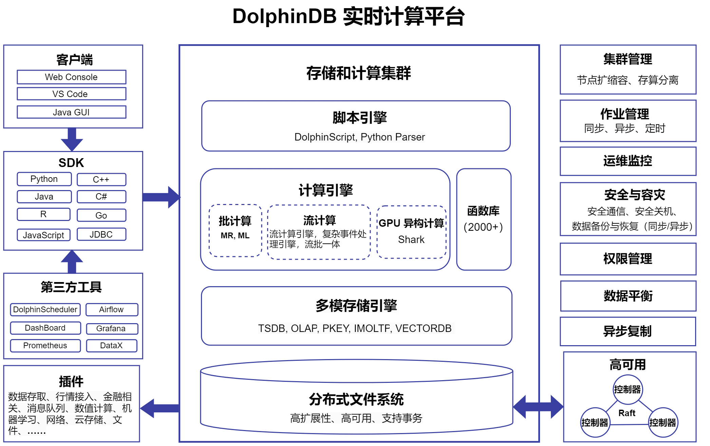

# 关于 DolphinDB

欢迎阅读 DolphinDB 技术文档！

DolphinDB 是一款基于高性能时序数据库，支持复杂分析与流计算的实时计算平台。DolphinDB
针对数据存储、统计分析、实时计算和机器学习等多种需求，提供高效读写、快速查询、复杂分析、分布式并行计算、低延迟流处理等功能，支持高可用与水平扩展。

如下为 DolphinDB 的系统架构图：

图 1. DolphinDB 系统架构图

结合架构图，以下对 DolphinDB 的核心组件进行详细介绍。

## 分布式架构

* 自研的[分布式存储机制](../db_distr_comp/db/db_architecture.html)，数据有序分散存储在不同的数据节点上，由控制节点统一精准地管理所有分区的元数据信息，包括分区和副本信息、分区版本号等要素，从而确保各节点上分区数据和副本的一致性，以提升集群的容错性和可扩展性。
* 提供在线和离线扩展方式、支持横向（添加更多节点）和纵向（增加单个节点的资源）的扩展系统、并且提供无缝高效的[数据迁移](../db_distr_comp/db_oper/import_data.html)和[再平衡](../db_distr_comp/db_oper/import_data.html)技术。
* 提供控制节点、数据节点和客户端的[高可用](../db_distr_comp/db/ha.html)方案，以确保系统在任何单节点故障下都能提供稳定的服务，从而有力保障业务的连续性。
* 具备全面灵活的[备份与恢复](../tutorials/backup-restore-new.html)机制，以保障数据安全，为业务保驾护航。
* 提供高容错性的[异步复制](../sys_man/cluster_async_replc.html)方案，其具有低延迟、高吞吐量的特点，方便实现数据跨节点、跨地域的异步复制，从而增强数据资产的安全性。

## 多模存储引擎

* 支持 TSDB、OLAP、PKEY、IMOLTP、VECTORDB 存储引擎。分别满足不同场景需求：
  + [TSDB 引擎](../db_distr_comp/db/tsdb.html)采用 PAX
    行列混存，提供性能卓越的大数据分析与点查分析。
  + [OLAP 引擎](../db_distr_comp/db/olap.html)采用列式存储，与 TSDB
    引擎相比，更适合用于对时间跨度较长的某些列数据进行聚合计算。
  + [PKEY 引擎](../db_distr_comp/db/pkey_engine.html)是提供主键唯一性保证的，支持实时更新和高效查询的存储引擎，能够有效满足从 OLTP 数据库的主键表 CDC
    到 DolphinDB 中进行数据分析的需求。
  + [IMOLTP 引擎](../tutorials/oltp_in-memory_storage_engine_non-embedded_version_tutorials.html)是内存数据库，以行存的形式来组织数据，不仅支持事务，同时通过创建 B+ 树索引
    (主键索引和二级索引) 的方式来应对高频度、高并发的更新和查询操作，该引擎将所有数据都存储在内存中。
  + [VECTORDB
    引擎](../db_distr_comp/db/vectordb.html)支持对向量数据创建索引，并实现了快速的近似最近邻搜索，满足对大规模向量数据高效检索和响应的需求。
* 保证事务[ACID](../db_distr_comp/db/transaction.html) 特性，提供快照级别的隔离机制。
* 支持多种无损数据[压缩](../funcs/c/compress.html)算法，包括 LZ4,
  delta-of-delta, zstd, chimp，字典压缩等，压缩率可达 4:1~10:1。
* 支持[分级存储](../db_distr_comp/db/tiered_storage.html)，区分热数据和冷数据存储，减少存储成本。

## 批计算处理

* 使用内嵌的[分布式文件系统](../db_distr_comp/db/db_partitioning.html)，不仅简化数据管理流程，还显著增强了分布式计算环境的负载均衡能力，同时提供了强大的容错机制，确保数据的高可用性和计算任务的连续执行。
* 内置 2000+ 多领域、多种类、多功能的[函数](../funcs/a/abs.html)，覆盖广泛的数据处理需求，并开放接口支持用户自定义函数，帮助用户轻松应对各类复杂应用场景的挑战。
* 分布式计算框架集成了 [pipeline](../funcs/p/pipeline.html)、[Map-Reduce](../funcs/m/mr.html) 和迭代计算等多种计算模型，为用户提供性能最优的一站式多样化数据解决方案。
* 通过 SQL 语言与函数、表达式的无缝结合，以及[向量化计算](../tutorials/hybrid_programming_paradigms.html)，开拓性地助力用户直接在数据库层面进行复杂的数据分析及运算，从而显著提升数据处理的速度和效率。
* 充分利用多机多核 CPU 资源，凭借精细的[并行处理](../funcs/ho_funcs/peach.html)策略与高效的任务调度算法，实现了对海量数据的快速处理。

## 流数据处理

* 支持通过流数据表进行[流数据](../stream/str_intro.html)订阅与发布。
* 内置[时间序列聚合](../stream/time_series_engine.html)、[横截面处理](../stream/cross_sectional_engine.html)、[响应式状态处理](../stream/reactive_state_engine.html)、[异常检测](../stream/anomaly_detection_engine.html)、[会话窗口](../stream/session_window_engine.html)、[多表关联](../stream/str_join_engine.html)等流式计算引擎，提供[滑动窗口](../funcs/themes/mFunctions.html)、[累计窗口](../funcs/themes/cumFunctions.html)、[统计函数](../funcs/funcs_by_topics.html#funcs_by_topics_math_statis)等算子。用户可通过串联调用计算引擎构建高效强大的计算流水线，或借助流数据引擎解析器（streamEngineParser）自动构建计算流水线，从而满足复杂多变的业务需求。
* 支持[回放历史数据](../stream/str_replay.html)，支持 1 对 1，N 对 N，N 对 1
  三种回放形式。
* 支持[流批一体](../stream/str_batch.html)，即将研发环境中基于历史数据建模分析得到的因子或表达式直接应用于生产环境的实时数据中，并保证流计算的结果和批量计算完全一致。该功能可为用户的测试、验证和回溯分析提供极大便利。
* 支持从多种数据源[接入实时流数据](../stream/str_api_python.html)实时写入 DolphinDB
  中，并自动处理数据格式转换和同步问题。
* 内置 [CEP 引擎](../stream/cep.html)（Complex Event
  Processing，复杂事件处理），能够接收实时数据流，定义事件并从事件流中检测特定事件，进而对满足指定规则的事件执行预设的操作。
* 实现亚毫秒级的延迟，确保实时数据处理的极致性能。

## 多范式编程语言

* DolphinDB 内置图灵完备的编程语言。其支持命令式编程、函数式编程、向量化编程、SQL 编程等[多范式编程语言](../tutorials/hybrid_programming_paradigms.html)，凭借语言简洁灵活、表达能力强的优势，帮助用户实现开发效率的飞跃式提升。
* 支持 [SQL-92 标准](../progr/sql/sql_intro.html "DolphinDB 中 SQL 语句的基本语法和用法")
  ，更在此基础上扩展了如组内计算、透视表等多种功能。同时兼容 Oracle 和 MySQL 等主流 SQL 方言。
* [Python Parser](../progr/py_parser/py_par_intro.html) 支持 Python
  的部分原生对象（dict, list ,tuple, set）、语法以及 pandas 库的部分功能。用户能够在 DolphinDB 客户端中直接使用
  Python 语法来访问和操作 DolphinDB 的数据。（[点击阅读 Python Parser
  在金融量化分析场景的应用](../tutorials/py_parser__quant_fin.html)）

## 良好生态

* 提供丰富全面的 [SDK](../api/connapi_intro.html) 生态，包括 [Python](https://docs.dolphindb.cn/zh/pydoc/py.html)， [C++](https://docs.dolphindb.cn/zh/cppdoc/cpp_api.html)，[C#](https://docs.dolphindb.cn/zh/csharpdoc/csharp.html)，[Go](https://docs.dolphindb.cn/zh/godoc/go.html)，[R](https://docs.dolphindb.cn/zh/rdoc/r.html) 和 [JavaScript](https://docs.dolphindb.cn/zh/jsdoc/js.html) 等多种主流编程语言。
* 多种客户端，包括 [Web 集群管理器](../db_distr_comp/db_man/web/intro.html)、[DolphinDB VS Code](../db_distr_comp/vscode.html)、[JAVA GUI](../db_distr_comp/gui.html)、[Jupyter Notebook](../db_distr_comp/jupyter.html)、[DolphinDB 终端](../db_distr_comp/terminal.html)。
* 多领域、多种类、多方式的[插件](../plugins/plg_intro.html)，涵盖数据存取、行情接入、金融相关、消息队列、数值计算、机器学习、网络、云存储、文件等。
* 提供[模块](../tutorials/tu_modules.html)化设计，为用户提供便捷的[技术分析指标库](../modules/ta/ta.html)、[指标库](../modules/mytt/mytt.html)、[因子库](../modules/gtja191Alpha/191alpha.html)、[因子指标库](../modules/wq101alpha/wq101alpha.html)、[运维函数库](../modules/ops/ops.html)、[历史数据导入](../modules/easyTLDataImport/easytl_data_import.html)、[行情数据接入模块](../modules/easyNSQ/easynsq.html)、[多因子风险模型](../tutorials/multi_factor_risk_model.html)、[交易日历](../modules/MarketHoliday/mkt_calendar.html)等，旨在简化功能代码的调用流程和优化系统维护效率。
* 集成专属的 [DataX](../plugins/dataxwriter/README_CN.html)、[Grafana](../tools/grafana_overview.html)
  等第三方工具，可衔接数据传输与可视化等多种解决方案。

