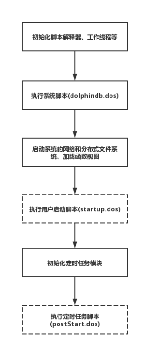

# 单节点模式

执行安装包 server 目录的可执行文件，可以快速启动单节点模式。单节点模式可以帮助用户试用并快速上手 DolphinDB。

## 启动指令

单节点部署，直接启动执行文件即可。以下是不同系统的启动指令示例：

* Linux 系统

  ```
  // 启动本地节点
  ./dolphindb -localSite localhost:8900:local8900
  ```
* Windows 系统

  在 Windows 环境中，直接双击运行 dolphindb.exe
  进行启动。或者在命令行终端输入以下指令启动：

  ```
  // 启动本地节点
  dolphindb.exe -localSite localhost:8900:local8900
  ```

## 启动 DolphinDB 终端

DolphinDB 终端是一个命令行交互式工具，用于连接到远程的 DolphinDB 服务器执行命令。

Linux 系统使用以下命令启动 DolphinDB 终端：

```
rlwrap -r ./dolphindb -remoteHost 192.168.1.135 -remotePort 8848
```

Windows 系统使用以下命令启动 DolphinDB 终端：

```
dolphindb.exe -remoteHost 192.168.1.135 -remotePort 8848
```

退出终端：

```
quit
```

命令行中支持以 "-" + “配置项” 的格式指定配置参数。不频繁修改的配置项建议在配置文件中指定。命令行通常用于指定一些灵活可变的参数，如 server 的 ip
和端口号、最大内存上限等。需要注意的是，存在部分参数只支持在命令行指定，见下表：

| 配置参数 | 解释 |
| --- | --- |
| remoteHost | DolphinDB 远端服务器的 IP 地址。 |
| remotePort | DolphinDB 远端服务器的端口号。 |
| stdoutLog | 设置输出系统日志到日志文件（dolphindb.log）或者标准输出（控制台）。取值为0（默认），表示输出到日志文件；取值为1，表示输出到 stdout；取值为2，表示同时输出到日志文件和标准输出。 |
| uid | DolphinDB 远端服务器的用户名。 |
| pwd | DolphinDB 远端服务器的密码。 |
| run | 启动时发送到远端的 DolphinDB 服务器执行的位于本地的 DolphinDB 脚本文件。该文件在系统执行 startup 参数指定的文件后执行。默认情况下，该文件应该位于 <HomeDir>。它以命令行方式运行一个任务。注意：该文件执行完后，系统将会自动退出。若文件执行成功，则返回0；否则返回非0值。 |
| maxLogSize=1024 | 当日志文件达到指定大小（单位为 MB）时，系统会将其存档。默认值是1024，最小值是100。原日志文件名添加前缀作为存档的文件名。前缀的格式为 <date><seq>。例如，20181109000有三位数字，从000开始。 |
| console=true | 表示是否启动 DolphinDB 命令行窗口的布尔值，默认值是 true。该参数只能在命令行中指定。 |

还有部分仅命令行支持的配置项由于在文中已进行了说明，这里仅列出名字：home, logFile, config, clusterConfig,
nodesFile。

## 启动流程

DolphinDB 系统的启动流程如下图所示：



该流程中涉及到三个启动脚本的执行，脚本路径的配置参数如下：

| 配置参数 | 解释 |
| --- | --- |
| init=dolphindb.dos | 该文件在系统启动时执行。默认文件是 <HomeDir>/dolphindb.dos。它通常包含了对所有用户可见并且不能被改写的系统级函数的定义。 |
| startup=startup.dos | 该文件在系统启动后执行。默认文件是 <HomeDir>/startup.dos。它可以包含加载插件、加载分布式表、定义并加载流数据表等脚本。 |
| postStart=postStart.dos | 该文件在初始化定时任务模块之后执行。默认文件是 <HomeDir>/postStart.dos。它可以在启动 DolphinDB 时加载定时作业相关的任务。 |

此外，DolphinDB 还支持启动时预加载模块和插件，通过配置项 preloadModules 指定。若

* 预加载插件：必须写上 "plugins::"，比如预加载 mysql 插件，必须指定为
  plugins::mysql，系统会到 pluginDir 目录加载插件。
* 预加载模块：只能指定相对于 moduleDir 的文件路径。比如存放于 moduleDir（默认为
  modules）的 system/log/fileLog.dos 模块，必须指定为 system::log::fileLog。

| 配置参数 | 解释 |
| --- | --- |
| preloadModules=plugins::mysql,system::log::fileLog | 系统启动后自动加载的模块或插件。如果需要加载多个模块或插件，使用逗号分隔。 |

**相关信息**

* [单节点部署教程](../../tutorials/standalone_server.html "单节点部署教程")
* [单节点部署教程(嵌入式ARM版本)](../../tutorials/ARM_standalone_deploy.html "单节点部署教程(嵌入式ARM版本)")
* [DolphinDB教程：启动脚本](../../tutorials/Startup.html "DolphinDB教程：启动脚本")

