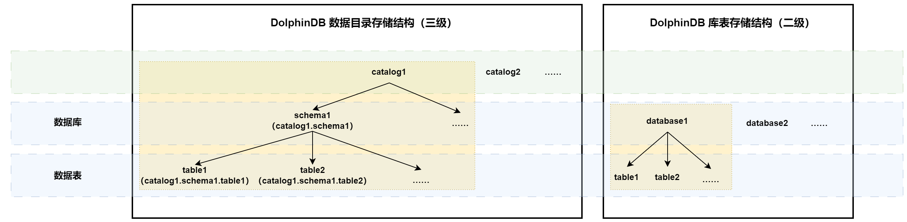

# 数据目录

数据库目录（database
catalog）作为数据库管理系统中的重要组成部分，用于组织和管理各种数据库对象。为了向用户提供更便捷、更标准的数据库访问体验，同时能够更方便地与第三方软件进行集成，DolphinDB
在 3.00.0 版本中引入了数据库目录功能（仅支持分布式数据库）。用户可通过 catalog 统一管理 database 和 table 等数据库对象，并使用标准 SQL
的语法对其进行访问。本文将详细介绍数据库目录的基本概念、具体用法与相关权限等。

## 基本概念

**catalog 语法**

`<catalog>.<schema>.<table>[@<cluster_identifier>]`

**参数说明：**

* catalog：字符串标量，表示数据目录的名称。
* schema：字符串标量，表示表模式的名称。
* table：字符串标量，表示表名称。
* cluster\_identifier：可选参数，字符串标量，表示集群的名称。

注意：以上参数的命名遵循[变量命名规则](../../progr/objs/var.html)，即必须以字母开头，且只包含字母（不区分大小写）、数字和下划线（\_）。

在 DolphinDB 中，catalog 包括：catalog, schema, table。以下为这三层概念的详细介绍：

* catalog（目录）是数据库中的最高层次，用于组织和管理数据库对象。其通常用于对不同的应用程序或不同的业务领域进行逻辑上的划分，可以包含多个
  schema，相当于 super database。
* schema（模式）是数据库中的逻辑容器，用于对数据库对象进行逻辑上的分组和隔离，以便于权限管理和组织对象，对应二级库表存储结构（database -
  table）中的 database。不同的是，在 catalog 的相关操作中，用户须使用 schema 名称而非 dbUrl。（注意：此处功能异于同名函数
  [schema](../../funcs/s/schema.dita)，请区别使用）
* table（表）是数据库中最基本的数据存储结构。表由一组有序的列（Column）和行（Row）组成。每个表都有一个唯一的名称，并且定义了每列的数据类型。

如下图，同一系统中可以构建多个 catalog；一个 catalog 中可以包含多个 schema；每个 schema 可以包含多个表。



注意：

* 使用 SQL 语句直接操作一张表时，数据目录结构中的表可以通过`catalog.schema.table`
  格式直接引用操作；在库表存储结构中，须先通过 `loadTable` 函数加载指定表、然后进行后续操作。
* 在数据目录结构中，用户可以在一个 catalog 中通过创建不同分区机制的 schema 进而管理不同分区机制的数据表；在库表存储结构中，在一个
  database 下用户只能管理相同分区机制的数据表，若需要管理多种分区机制的表，则需要维护多个 database。

## 基本操作

本章将详细介绍 catalog 的创建、查询、更新、删除等基本操作，并在最后给出一个 catalog 相关的基本操作语句或函数的汇总表。

注意：使用时请确保使用 3.00.0 及以上版本的 DolphinDB。相关说明请参阅文档 [DolphinDB-部署](../../deploy/deploy_intro.html)。

### 创建 catalog

#### （1）创建 catalog

使用 `createCatalog` 函数创建一个名为 *trading* 的 catalog。

```
createCatalog("trading")
```

使用 USE CATALOG 语句，切换到该 catalog。执行该操作后，若用户不指定具体的 catalog 则默认优先使用当前的 catalog 即
*trading*。

```
use catalog trading
```

#### （2）创建 schema

使用 create database 语句在 *trading* 中创建一个名为 stock、按照 VALUE 分区、存储引擎为 OLAP 的
schema。

```
create database stock partitioned by VALUE(1..6), engine='OLAP'
```

由于上一步中使用 `use` 指定了当前 catalog，所以上述语句中的 `stock`
等价为 `trading.stock`。如未使用 use 语句指定 catalog 却直接输入 schema
的名称，则会报错：“The catalog doesn't exist.” 在后续使用其他 SQL 语句时，如 `create
table`，`select` 等，都遵循该规则。

另外，如果想要将一个已存在的数据库插入到 catalog 中，可以使用 `createSchema`
函数。下例中，通过 `database` 函数创建 *dfs://db1* 之后，再向
*trading* 中插入路径为 *dfs://db1* 名为 *stock2* 的
schema。

```
database(directory="dfs://db1", partitionType=RANGE, partitionScheme=0 5 10)
//通过 database 函数创建的 db1
createSchema("trading", "dfs://db1", "stock2")
// 通过 createSchema 函数创建对应的 schema
```

#### （3）在 schema 创建表

在该 schema 中创建一张表：

```
create table stock.quote (
  id INT,
  date DATE[comment="time_col", compress="delta"],
  value DOUBLE,
 )
 partitioned by id
```

由于已设置当前 catalog，此处 `stock.quote` 等价为
`trading.stock.quote`。

### 在 SQL 中使用 catalog

向表中插入一些样本数据：指定 1 到 6 整数类型的 id 列，date 列范围为 2023.01.01 到 2023.01.12，value
列为1到12的整数。生成的总数据量为 12 行。

```
dbUrl = exec dbUrl from getSchemaByCatalog("trading") where schema = "stock"
id = 1 2 3 4 5 6 1 2 3 4 5 6
date = 2023.01.01..2023.01.12
value = 1..12
data = table( id, date, value)
loadTable(dbUrl[0], "quote").append!(data)
select * from stock.quote
```

返回表 trading.stock.quote（自动按照 id 列排序）：

| id | date | value |
| --- | --- | --- |
| 1 | 2023.01.01 | 1 |
| 1 | 2023.01.07 | 7 |
| 2 | 2023.01.02 | 2 |
| 2 | 2023.01.08 | 8 |
| 3 | 2023.01.03 | 3 |
| 3 | 2023.01.09 | 9 |
| 4 | 2023.01.04 | 4 |
| 4 | 2023.01.10 | 10 |
| 5 | 2023.01.05 | 5 |
| 5 | 2023.01.11 | 11 |
| 6 | 2023.01.06 | 6 |
| 6 | 2023.01.12 | 12 |

下表为目前已支持的 SQL 操作。

| 操作类型 | 操作语句 | 功能说明 |
| --- | --- | --- |
| DDL | create | 创建 schema 或 table |
| DDL | alter | 向已有的 table 中添加一列 |
| DDL | drop | 删除 schema 或 table |
| DML | update | 更新 table 中的记录 |
| DML | delete | 删除 table 中的记录 |
| DQL | select | 访问 table 中数据 |

以下给出部分使用示例：

**（1）返回满足指定条件的数据**

从 stock.quote 中查询 id 为 1 的数据。

```
select * from stock.quote where id = 1
```

返回结果：

| **id** | **date** | **value**1 |
| --- | --- | --- |
| 1 | 2023.01.01 | 1 |
| 1 | 2023.01.07 | 7 |

**（2）更新满足指定条件的数据**

将 stock.quote 中查询 id 为 2 的行的 value 值更新为 -1.0。

```
update stock.quote set value = -1.0 where id = 2
select * from stock.quote where id = 2
```

部分返回结果：

| **id** | **date** | **value** |
| --- | --- | --- |
| 2 | 2023.01.04 | -1 |
| 2 | 2023.01.10 | -1 |

**（3）删除满足指定条件的数据**

删除并返回 stock.quote 中 id 为 3 的数据。

```
delete from stock.quote where id = 3
select * from stock.quote where id = 3
```

返回结果为空表，符合预期。

注意：如果脚本中存在一个相同命名的变量名时，使用该 schema 进行查询等操作可能失败。

例如，定义一个命名为 *stock* 的变量，与 catalog *stock* 歧义。在 DolphinDBScript
中将优先将其解析为变量名，所以执行如下 select 语句时会报错。

```
stock=1
select * from stock.quote where id = 1; //getMember method not supported
```

可使用 `undef` 函数取消该变量：

```
undef(`stock)
```

### 基本操作汇总

如下汇总了 catalog 相关的基本操作语句或函数，可点击对应链接以阅读详情页面。

| 操作语句/函数 | 功能说明 |
| --- | --- |
| [use](../../progr/statements/use.html) | 切换当前 catalog |
| [create](../../progr/sql/create.html) | 创建数据库或数据表 |
| [alter](../../progr/sql/alter.html) | 向已有的表中添加一列 |
| [drop](../../progr/sql/drop.html) | 删除数据库或数据表 |
| [select](../../progr/sql/Select.html) | 访问表中数据 |
| [update](../../progr/sql/update.html) | 更新数据表中的记录 |
| [delete](../../progr/sql/delete.html) | 删除表中的记录 |
| [setDefaultCatalog](../../funcs/s/setDefaultCatalog.html) | 为当前 session 设置默认的 catalog |
| [existsCatalog](../../funcs/e/existsCatalog.html) | 检查指定 catalog 是否存在 |
| [createCatalog](../../funcs/c/createCatalog.html) | 创建一个 catalog |
| [createSchema](../../funcs/c/createSchema.html) | 把指定数据库添加到指定的 catalog 中 |
| [dropDatabase](../../funcs/d/dropDatabase.html) | 删除数据库；如果该数据库位于某个 catalog 中，其引用关系也会被删掉 |
| [dropCatalog](../../funcs/d/dropCatalog.html) | 删除指定的 catalog |
| [dropSchema](../../funcs/d/dropSchema.html) | 删掉指定 catalog 中的指定 schema |

## 运维相关

本章介绍部分如查看信息、重命名等运维操作，并在最后给出一个运维函数汇总表。

### （1）查看默认 catalog

如果想要查看当前 session 默认的 catalog，可以使用 `getCurrentCatalog`
函数。

```
use catalog trading;
getCurrentCatalog() // => "trading"

use catalog trading2;
getCurrentCatalog() // => "trading2"
```

### （2）重命名 catalog 和 schema

可以使用 `renameCatalog`、`renameSchema` 函数对 catalog
或 schema 重命名。

例 1 将 *trading* 重命名为
*trading2*

```
renameCatalog("trading", "trading2")
getAllCatalogs() // => ["trading2"]
```

例 2 将 *trading* 中的 *stock* 重命名为
*stock1*

```
renameSchema("trading", "stock", "stock1")
exec schema from getSchemaByCatalog("trading") // => ["stock1"]
```

### （3）查看 catalog 中的数据库信息

在上面的例子中，我们使用 create database 语句在 catalog *trading* 创建了一个 stock 的
schema：

```
use catalog trading;
create database stock partitioned by VALUE(1..10), engine='OLAP'
```

使用 create database 语句创建的 schema，其 *dbUrl*
的默认格式为`dfs://_{trading}_{stock}_{timestamp}`。可通过
`getSchemaByCatalog` 进行查看。

```
getSchemaByCatalog("trading")
```

返回结果：

| schema | dbUrl |
| --- | --- |
| stock | dfs://trading\_stock\_1712077295373 |

注意，*dbUrl* 是全局唯一且不变的，即使 schema 或者 catalog 进行重命名操作，*dbUrl* 也不会变。

### （4）查看 catalog、schema 的相关操作变动

从控制节点日志中寻找对应的 Audit Log。Audit Log 包含具体操作的
catalog，schema，操作者等信息。格式如下：

```
ACL Audit: function createSchema [catalog=trading,dbUrl=dfs://db1,schema=stock2],
    called by user [xxx]
```

### 运维类函数汇总

如下汇总了运维相关的函数，可点击阅读详情。

| 运维函数 | 功能说明 |
| --- | --- |
| [getCurrentCatalog](../../funcs/g/getCurrentCatalog.html) | 查看当前 session 位于哪个 catalog 中 |
| [getAllCatalogs](../../funcs/g/getAllCatalogs.html) | 检索当前所有可用的 catalog |
| [getSchemaByCatalog](../../funcs/g/getSchemaByCatalog.html) | 检索指定 catalog 中的所有 schema |
| [renameCatalog](../../funcs/r/renameCatalog.html) | 重命名 catalog |
| [renameSchema](../../funcs/r/renameSchema.html) | 重命名 schema |
| [getUserAccess](../../funcs/g/getUserAccess.html) | 查询指定用户所单独被赋予的权限；或者查询指定用户及其所属组的权限组合后的最终生效权限 |
| [getGroupAccess](../../funcs/g/getGroupAccess.html) | 查询组的权限 |

## 权限说明

本章罗列 catalog, schema 级别的相关权限。

### catalog 级别的相关权限

提供如下权限设置项用于控制当前 catalog 中的所有操作。

| **权限** | **说明** |
| --- | --- |
| CATALOG\_MANAGE | 管理 catalog 的相关操作，如添加 schema、删除、重命名 catalog 等操作 |
| CATALOG\_READ | 管理 catalog 下所有表的数据读取操作 |
| CATALOG\_WRITE | 管理 catalog 下所有表的数据写入操作，包括插入、更新、删除 |
| CATALOG\_INSERT | 管理 catalog 下所有表的数据插入操作 |
| CATALOG\_UPDATE | 管理 catalog 下所有表的数据更新操作 |
| CATALOG\_DELETE | 管理 catalog 下所有表的数据修改操作 |

在处理 catalog 级别的权限操作时，与原有处理逻辑保持相同，遵循着“范围覆盖”原则。如：

```
createSchema("cat1", "dfs://db1", "db")
deny(`user, DB_READ, "dfs://db1")
grant(`user, CATALOG_READ, "catalog") //前面的deny被消除
```

### schema 级别的相关权限

提供以“SCHEMA\_”为前缀的多种权限设置项，与原有处理逻辑相同。其中 *obj* 的语法需要为
“catalogName.schemaName”。如：

```
grant(`user, SCHEMA_MANAGE, "catalog1.schema1")
```

| SCHEMA 权限 | 等价的原有权限 | 说明 |
| --- | --- | --- |
| SCHEMA\_MANAGE | DB\_MANAGE | 管理 schema 的相关操作，如添加 table、删除、重命名 schema 等操作 |
| SCHEMAOBJ\_CREATE | DBOBJ\_CREATE | 管理在 schema 中建表的操作 |
| SCHEMAOBJ\_DELETE | DBOBJ\_DELETE | 管理在 schema 中删除表的操作 |
| SCHEMA\_READ | DB\_READ | 管理在 schema 中写入表的操作，包含表的增删改 |
| SCHEMA\_WRITE | DB\_WRITE | 管理 schema 下所有表的数据写入操作，包括插入、更新、删除 |
| SCHEMA\_INSERT | DB\_INSERT | 管理 schema 下所有表的数据插入操作 |
| SCHEMA\_UPDATE | DB\_UPDATE | 管理 schema 下所有表的数据更新操作 |
| SCHEMA\_DELETE | DB\_DELETE | 管理 schema 下所有表的数据修改操作 |

schema 相关操作的 *obj* 字符串格式为 `catalog.schema`。

下例中，为用户 Adam 赋予 *trading*（catalog） 下的 *stock*（schema）中的所有表的只读权限。

```
grant("Adam", SCHEMA_READ, "trading.stock")
```

如果在在多集群管理中指定 catalog 和 schema 的权限，需要

* 在用户（user）后面需要加上 @<cluster\_identifier>，以指示该用户属于哪个集群。
* 在应用对象/约束规则（objs）后面加上 @<cluster\_identifier>，以指示进行权限管理的对象属于哪个集群。

例如：如果集群 cluster2 上的用户 user1 想要读取集群 cluster1 上的表 trading.stock.quote，则需要在 MoM
上执行以下脚本以授予相应权限：

```
grant("user1@cluster2", TABLE_READ, "trading.stock.quote@cluster1")
```

