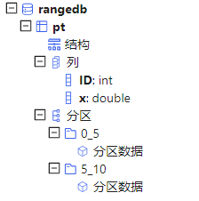

# 数据分区

## 为什么对数据库进行分区

对数据库进行分区可以显著降低系统响应延迟，提高数据吞吐量。具体来说，分区有以下主要好处。

* 分区使得大型表更易于管理。对数据子集的维护操作也更加高效，因为这些操作只针对需要的数据而不是整个表。一个好的分区策略通过只读取查询所需的相关数据来减少要扫描的数据量。如果分区机制设计不合理，对数据库的查询、计算以及其它操作都可能受到磁盘访问I/O这个瓶颈的限制。
* 分区使得系统可以充分利用所有资源。选择一个良好的分区方案搭配并行计算，分布式计算可以充分利用所有节点来完成通常要在一个节点上完成的任务。若一个任务可以拆分成几个子任务，每个子任务访问不同的分区，可以显著提升效率。

## 分区类型

DolphinDB 在数据库层面支持多种分区类型： 范围分区、哈希分区、值分区、列表分区与复合分区。选择合适的分区类型，有助于用户根据业务特点对数据进行均匀分割。

* 范围分区对每个分区区间创建一个分区。
* 哈希分区利用哈希函数对分区列操作，方便建立指定数量的分区。
* 值分区每个值创建一个分区，例如股票交易日期、股票交易月等。
* 列表分区是根据用户枚举的列表来进行分区，比值分区更加灵活。
* 复合分区适用于数据量特别大而且SQL where或group
  by语句经常涉及多列。可使用2个或3个分区列，每个分区选择都可以采用区间、值、哈希或列表分区。例如按股票交易日期进行值分区，
  同时按股票代码进行范围分区。

创建一个新的分布式数据库时，需要在`database`函数中指定数据库路径directory，分区类型partitionType以及分区模式partitionScheme。重新打开已有的分布式数据库时，只需指定数据库路径。不允许用不同的分区类型或分区方案覆盖已有的分布式数据库。

聚合函数在分区表上利用分区列操作时，例如当group by列与分区列一致时，运行速度特别快。

为便于学习， 以下分区例子使用 Windows 本地目录，用户可以将数据库创建使用的路径改成 Linux 或 DFS 目录。

调用 [database](../../funcs/d/database.html) 函数前，用户必须先登录，只有具有 DB\_OWNER
或 admin 管理员权限才能创建数据库。默认的 admin 管理员登录脚本为：

```
login(userId=`admin, password=`123456)
```

下文提供的所有创建数据库脚本，默认已经登录。

### 范围分区

在范围分区（RANGE）中，分区由区间决定，而区间由分区向量的任意两个相邻元素定义。区间包含起始值，但不包含结尾值。

在下面的例子中，数据库 db 有两个分区：[0,5) 和 [5,10)。使用 ID 作为分区列，并使用函数 `append!`
在数据库 db 中保存表 t 为分区表 pt。

```
n=1000000
ID=rand(10, n)
x=rand(1.0, n)
t=table(ID, x)
db=database("dfs://rangedb", RANGE,  0 5 10)

pt = db.createPartitionedTable(t, `pt, `ID)
pt.append!(t)

pt=loadTable(db,`pt)
select count(x) from pt;
```

目录结构如下：



范围分区创建后，可使用 `addRangePartitions` 函数来追加分区。细节参见用户手册。

### 哈希分区

哈希分区（HASH）对分区列使用哈希函数以产生分区。哈希分区是产生指定数量的分区的一个简便方法。但是要注意，哈希分区不能保证分区的大小一致，尤其当分区列的值的分布存在偏态的时候。此外，若要查找分区列中一个连续范围的数据时，哈希分区的效率比范围分区或值分区要低。

在下面的例子中，数据库 db 有两个分区。使用ID作为分区列，并使用函数 `append!` 在数据库 db 中保存表 t 为分区表
pt。

```
n=1000000
ID=rand(10, n)
x=rand(1.0, n)
t=table(ID, x)
db=database("dfs://hashdb", HASH,  [INT, 2])

pt = db.createPartitionedTable(t, `pt, `ID)
pt.append!(t)

pt=loadTable(db,`pt)
select count(x) from pt;
```

目录结构如下：


### 值分区

在值域（VALUE）分区中，一个值代表一个分区。

```
n=1000000
month=take(2000.01M..2016.12M, n)
x=rand(1.0, n)
t=table(month, x)

db=database("dfs://valuedb", VALUE, 2000.01M..2016.12M)

pt = db.createPartitionedTable(t, `pt, `month)
pt.append!(t)

pt=loadTable(db,`pt)
select count(x) from pt;
```

上面的例子定义了一个具有 204 个分区的数据库 db。每个分区是 2000 年 1 月到 2016 年 12 月之间的一个月(如下图）。在数据库 db 中，表
t 被保存为分区表 pt，分区列为 month。


值分区创建后，可使用 `addValuePartitions` 函数来追加分区。

### 列表分区

在列表（LIST）分区中，我们用一个包含多个元素的列表代表一个分区。

```
n=1000000
ticker = rand(`MSFT`GOOG`FB`ORCL`IBM,n)
x=rand(1.0, n)
t=table(ticker, x)

db=database("dfs://listdb", LIST, [`IBM`ORCL`MSFT, `GOOG`FB])
pt = db.createPartitionedTable(t, `pt, `ticker)
pt.append!(t)

pt=loadTable(db,`pt)
select count(x) from pt;
```

上面的数据库有 2 个分区。第一个分区包含 3 个股票代号，第二个分区包含 2 个股票代号。


### 组合分区

组合（COMPO）分区可以定义 2 或 3
个分区列。每列可以独立采用范围（RANGE）、值（VALUE）、哈希（HASH）或列表（LIST）分区。组合分区的多个列在逻辑上是并列的，不存在从属关系或优先级关系。

```
n=1000000
ID=rand(100, n)
dates=2017.08.07..2017.08.11
date=rand(dates, n)
x=rand(10.0, n)
t=table(ID, date, x)

dbDate = database(, VALUE, 2017.08.07..2017.08.11)
dbID=database(, RANGE, 0 50 100)
db = database("dfs://compoDB", COMPO, [dbDate, dbID])

pt = db.createPartitionedTable(t, `pt, `date`ID)
pt.append!(t)

pt=loadTable(db,`pt)
select count(x) from pt;
```

值域有 5 个分区，其中 20170807 分区有 2 个区间域（RANGE）分区：


若组合分区有一列为值分区，创建后可使用 `addValuePartitions` 函数来追加分区。

## 分区设计策略

合理的数据库分区能够提高数据管理效率、查询和计算的性能，实现低延时和高吞吐量。以下列出了设计和优化分区表的设计策略细则，以供参考。

### 选择恰当分区字段

在 DolphinDB 中，可以用于分区的数据类型包括整型（CHAR, SHORT, INT），日期类型（DATE, MONTH, TIME, MINUTE,
SECOND, DATETIME, DATEHOUR），以及 STRING 与 SYMBOL。此外，哈希分区还支持 LONG, UUID, IPADDR,
INT128 等类型。虽然 STRING 可作为分区列，为确保性能，建议将 STRING 转化为 SYMBOL 再用于分区列。

FLOAT 和 DOUBLE 数据类型不可作为分区字段。

```
db=database("dfs://rangedb1", RANGE,  0.0 5.0 10.0)
```

会产生出错信息：DOUBLE 数据类型的字段不能作为分区字段

```
The data type DOUBLE can't be used for a partition column
```

虽然 DolphinDB 支持对 TIME, SECOND, DATETIME
类型字段的分区，但是在实际使用中要尽量避免对这些数据类型采用值分区，以免分区粒度过细，将耗费大量时间创建或查询百万级以上的很小的分区。例如下面这个例子就会产生过多的分区。

序列：2012.06.01T09:30:00..2012.06.30T16:00:00 包含 2,529,001个元素。如果用这个序列进行值分区，将会在磁盘上产生
2,529,001 个分区，即 2,529,001 个文件目录和相关文件，使得分区表创建、写入、查询都非常缓慢。

分区字段应在业务中，特别是数据更新的任务中有重要相关性。譬如在证券交易领域，许多任务都与股票交易日期或股票代码相关，因此以这两个字段来分区比较合理。更新数据库时，DolphinDB
的事务机制不允许多个writer的事务在分区上有重叠。鉴于经常需要对某个交易日或某只股票的数据进行更新，若采用其它分区字段（例如交易时刻），有可能造成多个
writer 同时对同一分区进行写入而导致问题。

一个分区字段相当于数据表的一个物理索引。如果查询时用到了该字段做数据过滤，SQL
引擎就能快速定位需要的数据块，而无需对整表进行扫描，从而大幅度提高处理速度。因此，分区字段应当选用查询和计算时经常用到的过滤字段。

### 控制分区粒度

一个分区内的多个列以文件形式独立存储在磁盘上，通常数据是经过压缩的。使用的时候，系统从磁盘读取所需要的列，解压后加载到内存。若分区粒度过大，可能会造成多个工作线程并行时内存不足，或者导致系统频繁地在磁盘和工作内存之间切换，影响性能。一个经验公式是，若数据节点的可用内存是
S，工作线程（worker）的的数量是 W，建议每个分区解压后在内存中的大小不超过 S/8W。假设工作内存上限为 32GB，并有 8
个工作线程，建议单个分区解压后的大小不超过 512MB。

DolphinDB 的子任务以分区为单位。因此分区粒度过大会造成无法有效利用多节点多分区的优势，将本来可以并行计算的任务转化成了顺序计算任务。

综上各种因素，建议一个分区未压缩前的原始数据大小不超过
1GB。当然这个限制可结合实际情况调整。譬如在大数据应用中，经常有宽表设计，一个表有几百个字段，但是单个应用只会使用一部分字段。这种情况下，可以适当放大上限的范围。

降低分区粒度可采用以下几种方法：

* 采用组合分区
* 增加分区个数
* 将范围分区改为值分区

### 分区粒度不要过小

若分区粒度过小，一个查询和计算作业往往会生成大量的子任务，这会增加数据节点和控制节点，以及控制节点之间的通讯和调度成本。分区粒度过小，也会造成很多低效的磁盘访问（小文件读写)，造成系统负荷过重。另外，所有的分区的元数据都会驻留在控制节点的内存中。分区粒度过小，分区数过多，可能会导致控制节点内存不足。

提示： 建议每个分区未压缩前的数据量不要小于 100M。

综合前述，推荐分区大小控制在 100MB 到 1GB 之间。

股票的高频交易数据若按交易日期和股票代码的值做组合分区，会导致许多极小的分区，因为许多交易不活跃的股票的交易数据量太少。如果将股票代码的维度按照范围分区的方法来切分数据，将多个交易不活跃的股票组合在一个分区内，则可以有效解决分区粒度过小的问题，提高系统的性能。

### 均匀分区

当各个分区的数据量差异很大时，会造成系统负荷不均衡，部分节点任务过重，而其它节点处于闲置等待状态。当一个任务有多个子任务时，只有最后一个子任务完成了，才会将结果返回给用户。由于一个子任务对应一个分区，如果数据分布不均匀，可能会增大作业延时，影响用户体验。

为了方便根据数据的分布进行分区，DolphinDB 提供了函数 `cutPoints(X, N, [freq])`。其中，X
是一个数组，N 代表需要产生多少组, 而 freq 是 X 的等长数组，其中每个元素对应着 X 中元素出现的频率。函数返回具有（N + 1）个元素的数组，代表
N 个组，使得X中的数据均匀地分布在这 N 个组中。

下面的例子对股票报价数据按日期和股票代码分区数据。如果仅按股票名称首字母进行范围分区，极易造成数据分布不均，因为极少量的股票代码以 U, V, X，Y，Z
等字母开头。我们这里使用 `cutPoints` 函数将 2020 年 10 月 01 日到 2020 年 10 月 29
日的数据根据股票代码划为 5 个分区：

```
dates=2020.10.01..2020.10.29;
syms="A"+string(1..13);
syms.append!(string('B'..'Z'));
buckets=cutPoints(syms,5);//cutpoints
t1=table(take(syms,10000) as stock, rand(dates,10000) as date, rand(10.0,10000) as x);
dateDomain = database("", VALUE, dates);
symDomain = database("", RANGE, buckets);
stockDB = database("dfs://stockDBTest", COMPO, [dateDomain, symDomain]);
pt = stockDB.createPartitionedTable(t1, `pt, `date`stock).append!(t1);
```

除了使用范围分区的方法，列表分区也是解决数据分布不均匀的有效方法。

### 时序类型分区

时间是实际数据中最常见的一个维度。以时间类型字段作为分区字段时，在时间取值上可以预留分区以容纳未来数据。以下例子中，我们创建一个数据库，以天为单位，将
2000.01.01 到 2030.01.01 的日期分区。

注： 仅当实际数据写入数据库时，数据库才会真正创建需要的分区。

```
dateDB = database("dfs://testDate", VALUE, 2000.01.01 .. 2030.01.01)
```

DolphinDB
使用时间类型作为分区字段时，数据库定义的分区字段类型和数据表实际采用的时间类型可以不一致，只要保证定义的分区字段数据类型精度小于等于实际数据类型即可。例如，如果数据库是按月（month）分区，数据表的字段可以是
month, date, datetime, timestamp和 nanotimestamp。系统自动会作数据类型的转换。

### 共存储

在分布式数据库中，如果多个分区的数据表要连接（join）通常十分耗时，因为涉及到的分区可能在不同的节点上，需要在不同节点之间复制数据。

为解决这个问题，共存储位置（co-location）的分区机制能够确保同一个分布式数据库里所有表在相同分区的数据存储在相同的节点上。这保证了这些表在连接时非常高效。DolphinDB
对采用不同分区机制的多个分区表不提供连接功能。

```
dateDomain = database("", VALUE, 2018.05.01..2018.07.01)
symDomain = database("", RANGE, string('A'..'Z') join `ZZZZZ)
stockDB = database("dfs://stockDB", COMPO, [dateDomain, symDomain])

quoteSchema = table(10:0, `sym`date`time`bid`bidSize`ask`askSize, [SYMBOL,DATE,TIME,DOUBLE,INT,DOUBLE,INT])
stockDB.createPartitionedTable(quoteSchema, "quotes", `date`sym)

tradeSchema = table(10:0, `sym`date`time`price`vol, [SYMBOL,DATE,TIME,DOUBLE,INT])
stockDB.createPartitionedTable(tradeSchema, "trades", `date`sym)
```

上面的例子中，quotes 和 trades 两个分区表采用同一个分区机制。

