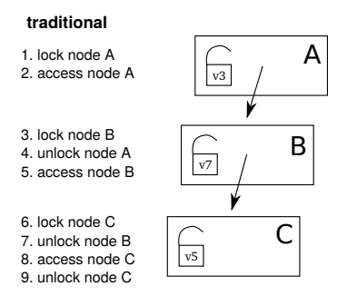
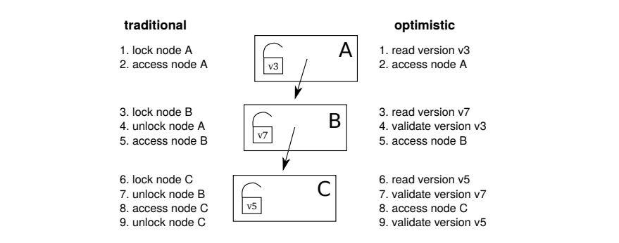

# 内存在线事务处理引擎

在金融行业的交易系统等一些数据库应用场景中，主要工作负载来源于对关系表的高频率、高并发的更新和查询操作。这类应用场景对数据处理提出了严格的要求，包括低延迟、高并发的读写性能，严格的数据一致性，以及对符合
ACID 特性的事务支持，属于典型的在线事务处理（OLTP）场景。

传统存储引擎的架构设计通常以磁盘为主要存储介质，在应对高频读写和高并发操作时，软硬件层面容易出现性能瓶颈，难以满足这些场景对延迟和吞吐量的极高要求。然而，在这些系统中，尽管数据流量大，但需要维护的数据量往往有限。因此，是否可以将所有数据存储在内存中，从而消除磁盘读写带来的延迟瓶颈，成为关键的优化方向。

于 3.00.0 版本推出的内存在线事务处理（IMOLTP, In-Memory Online Transaction
Processing）引擎，利用内存存储的特性显著降低操作延迟，提升并发性能，为 OLTP 场景提供了更优的解决方案。IMOLTP 引擎具有以下特点：

* **按行存储**：采用行存形式组织数据，适用于 OLTP 场景，满足高频次事务需求。
* **事务支持**：提供 ACID 事务保障，采用快照隔离级别确保一致性。
* **高效索引**：支持创建 B+ 树索引，包括主键索引和二级索引，以优化高频、高并发的更新与查询性能。
* **持久化与恢复**：通过 WAL（Write-Ahead Logging）和 Checkpoint 机制，确保数据的持久化与快速恢复。

## 总体架构

IMOLTP 引擎主要由四个核心模块组成：索引、事务、持久化和恢复。接下来，将逐一对这些模块进行详细介绍。

### 索引

作为内存引擎，IMOLTP 的磁盘 I/O 大大减少，查询操作更是无需读写磁盘。同时，由于无需实现 Buffer Manager
组件，性能瓶颈更多转移到索引部分。

**数据结构**

尽管 Lock-free 数据结构（如 BwTree）理论上具备较高的扩展性，但其实现复杂，正确性难以验证。此外，BwTree
由于结构复杂，容易引起缓存不命中，在实践中的性能往往低于经过优化的 B+ 树。

因此，IMOLTP 引擎的索引采用 B+ 树数据结构，其实现复杂度相对 Lock-free 更低，且兼具点查和范围查询的高效性能。

**算法**

为支持并发操作，B+ 树通常采用基于细粒度读/写锁的 Lock Coupling
算法。每个节点内设有锁，访问时先获取父节点的锁，再获取子节点的锁，然后释放父节点的锁，如图 1-1 所示。

图 1. 图 1-1 Lock Coupling 算法



然而，由于 B+ 树仅有一个根节点，所有操作都需首先对根节点加锁。即使是读锁，其获取或释放仍会触发对内存同一地址的写入，导致冲突并引发 CPU
缓存失效，从而增加缓存不命中的开销。在多核架构下，根节点锁会严重地限制 B+ 树的扩展性。

因此，权衡收益与工程复杂度后，IMOLTP 引擎采用了 [Optimistic-Lock-Coupling](http://sites.computer.org/debull/A19mar/p73.pdf)（以下简称 OLC）算法。OLC 在实现上保持了
Lock Coupling 的简单性，同时显著提升了扩展性。OLC 算法如图 1-2 所示：

图 2. 图1-2 OLC 算法



在 OLC 实现中，传统加锁操作替换为读取节点版本号，解锁操作替换为验证先前读取的版本号。在 B+
树查询的整个代码路径中，不涉及任何内存写入操作，避免了缓存不命中问题。

B+ 树和 OLC 算法，它们实现复杂度低意味着更易测试与验证，从而确保系统的稳定性，这对于 OLTP 系统尤为重要。

### 事务

IMOLTP 引擎采用 MV2PL协议，是多版本并发控制（MVCC）与两阶段锁（2PL）的结合，为事务提供快照隔离级别的支持。

一个事务可以包含多条对 IMOLTP 表的 DML 操作，并支持跨表事务。在事务范围内，所有 DML
操作要么全部成功，要么全部回滚，当一个事务执行异常时，会自动撤销本事务对所有表的所有更改。当前版本中 DDL 操作暂不支持事务，若在事务中存在 DDL
操作，会抛出异常。

**MVCC 实现**

IMOLTP 引擎按行组织数据，每行数据（以下称 tuple）的版本的存储结构如下图 1-3 所示：

图 3. 图 1-3 tuple 版本存储结构


其中 *txnId* 充当写锁的作用，*readCount* 充当读锁的作用，*beginTs* 和 *endTs*决定了这个版本的可见性。

* 每个事务开始时，系统会分配一个唯一的全局递增的 *tid*，当该事务读一个版本时，如果满足 *beginTs* ≤
  *tid* ＜ *endTs*，说明这个版本对该事务可见。
* 每个写事务结束时，系统会分配一个唯一的全局递增的 *cid*。对于该事务创建的所有的新版本，都会将 *beginTs* 设置为
  *cid*，将 *endTs* 设置为无穷大；对于版本链的下一个版本，会将 *endTs* 设置为
  *cid*。

IMOLTP 引擎中的 MVCC 实现采用 append-only 模式，即数据只能被追加，而不能被修改或删除。每个 tuple 的所有版本按链表形式存储，顺序为
Newest-to-Oldest。每次更新 tuple 时，在链表头部插入新版本，同时更新索引指针确保其始终指向版本链的头部。这种设计确保了对最新版本
tuple 的查询性能。

由于在事务处理中，对 tuple 的写操作并非原地修改，而是通过在版本链的头部创建新版本来实现，随着新的事务不断对同一 tuple
进行写操作，其版本链会逐渐变长，占用大量内存。版本链中某些旧版本对于当前系统中的所有活跃事务均不可见，因此需要清理这些无用版本以释放内存资源。IMOLTP
引擎通过专门的垃圾回收（GC, Garbage Collection）线程来完成这一任务。

**2PL**

2PL 在事务执行期间包括加锁和解锁两个阶段。事务内部会维护两个集合：

* 读集合，包含所有已读过即加了读锁的 tuple；
* 写集合，包含所有已写过即加了写锁的 tuple。

事务回滚时，首先释放读集合里的每个 tuple 的读锁，然后对于写集合里的每个 tuple，删除该事务创建的版本，然后释放写锁。

事务提交时，同样先释放读集合里的每个 tuple 的读锁，然后按照上述更新版本 *beginTs* 和 *endTs*
的规则更新写集合里的每个 tuple，然后释放写锁。

### 持久化

在基于磁盘的数据库系统中，数据一般按照页面为单位进行组织。为了保证对数据修改的持久性，通常采用
WAL（Write-Ahead-Logging）日志技术。在修改数据页面之前，先将修改操作记录到日志文件中，确保日志落盘后再执行数据页面的修改操作。

尽管 IMOLTP 引擎将所有数据存储在内存中，但为了实现持久化（即在系统重启后能够恢复到与重启前一致的状态），仍然实现了
WAL。然而，与传统磁盘数据库相比，IMOLTP 的 WAL
实现更加简化：因为所有数据都在内存中，不像磁盘数据库那样可能会把内存中未提交的数据（即脏页）落盘，所以只需要在日志文件里记录 redo log，不需要 undo
log。并且 IMOLTP 引擎不需要记录关于索引的修改，因为索引不需要持久化到磁盘上，重启时只需要在内存里重建索引。

为了避免日志文件无限增长导致磁盘空间消耗过多，以及缩短重启时的日志回放时间，IMOLTP 引擎在日志文件达到设定阈值时会自动触发 Checkpoint
操作，将系统的当前状态（快照）保存到独立的磁盘文件中，并回收旧的日志文件。

如上文所述，IMOLTP 引擎实现了 MVCC，天然地支持快照隔离级别。在执行 Checkpoint 时，首先申请一个
*tid*，相当于开启一个只读事务，通过该 tid，系统可以获取 Checkpoint 开始时的系统状态，并且确保在 Checkpoint
过程中不阻塞其他事务的读写操作。

### 恢复

IMOLTP 引擎数据的恢复借助 Checkpoint 文件和日志文件完成。Checkpoint 文件保存了系统在某一时刻 T 的快照状态；日志文件记录了时刻 T
之后所有事务执行的操作，它具有以下两个特点：

* **事务内部操作顺序一致性**，即一个事务中的所有操作在日志文件中记录的顺序与实际执行的顺序一致。比如一个事务先插入 A，然后删除
  A，则日志文件中，也是先记录插入 A，再记录删除 A。
* **事务间依赖顺序一致性**，如果事务 Txn1 修改了 A 后，事务 Txn2 再修改 A，则日志文件中事务 Txn1 的所有操作一定出现在事务
  Txn2 的操作之前。

重启时，首先读取 Checkpoint 文件，将系统重置为 Checkpoint
文件里保存的状态。然后读取日志文件，逐条（串行）回放事务进行过的操作，就可以恢复到与系统重启之前一致的状态。

主键索引会在恢复过程中重建。但二级索引无需在恢复时重建，可在日志回放完成后统一重建所有二级索引。

## 数据读写流程

### 写入数据

IMOLTP 引擎写入数据的流程如下：

1. **开启事务**（如果写入语句已经在事务内，即在 *transaction*
   语句块内部且不是语句块的第一条语句，则跳过这一步），生成事务开始的 WAL 日志，提交给异步的日志写入线程；
2. **构造主键索引**，根据待写入的数据，构造主键索引的键，尝试插入到主键索引；如果此时发现违背了唯一性约束或发生读写冲突/写写冲突，则结束事务；
3. **构造二级索引**，对于每一个二级索引，构造二级索引的键，尝试插入到二级索引；如果此时发现违背了索引的唯一性（若有），或者存在读写冲突/写写冲突，则结束事务；
4. **数据写入**，将数据写入表的内存区域，生成新的 tuple 版本并插入到该版本链的头部。随后，生成数据写入的 **WAL**
   日志，提交给异步日志写入线程；
5. **结束事务**（如果写入语句已经在事务内，即在 *transaction*
   语句块内部且不是语句块的最后一条语句，则跳过这一步）：
   * **提交事务**：如果没有错误发生，则提交事务，并生成事务提交的 WAL 日志，提交给异步日志写入线程，并等待该事务所有 WAL
     日志写盘完成。
   * **回滚事务**：如果有错误发生，则回滚该事务的任何修改，并生成事务回滚的 WAL
     日志，提交给异步日志写入线程，并等待该事务所有的 WAL 日志写盘完成。

### 查询数据

IMOLTP 引擎查询数据的流程如下：

1. **开启事务**（如果写入语句已经在事务内，即在 *transaction*
   语句块内部且不是语句块的第一条语句，则跳过这一步）。对于单独的 SQL 查询语句，它是只读的，不会进行任何写入操作，所以不用生成任何的 WAL
   日志；
2. **选择索引，**根据查询的过滤条件，判断应该使用哪个索引进行查询；
3. **查询索引，**构造索引键并查询索引。对于二级索引，其 value 为主键，因此需要再次查询主键索引以获取指向实际 tuple
   的指针。
4. **遍历版本链**，遍历 tuple 的版本链，找到对于该事务可见的版本，检查是否存在读写冲突；若存在冲突，则结束当前事务；
5. **过滤**，对于上述步骤未使用到的过滤条件，检查之前查到的 tuple 是否满足这些条件，将符合条件的 tuple 加入到结果集；
6. **结束事务**。

### 删除数据

IMOLTP 引擎删除数据的流程如下：

1. **开启事务**（如果删除语句已经在事务内，即在 *transaction*
   语句块内部且不是语句块的第一条语句，则跳过这一步），生成事务开始的 WAL 日志，提交给异步的日志写入线程；
2. **定位数据**，按照查询数据的流程，确定需要被删除的 tuple。如果发生错误，则结束事务；
3. **标记删除**，在 tuple 版本链的头部尝试插入一个表示“已删除”的版本（该 tuple 后续由 GC
   线程回收），如果检测到读写冲突，则终止当前事务。随后，生成数据删除的 WAL 日志，提交给异步的日志写入线程；
4. **结束事务**（如果删除语句已经在事务内，即在 *transaction*
   语句块内部且不是语句块的最后一条语句，则跳过这一步）：
   * **提交事务**，如果没有错误发生，则提交事务，并生成事务提交的 WAL 日志，提交给异步日志写入线程，并等待该事务所有 WAL
     日志写盘完成。
   * **回滚事务**：如果有错误发生，则回滚该事务的任何修改，并生成事务回滚的 WAL
     日志，提交给异步日志写入线程，并等待该事务所有的 WAL 日志写盘完成。

### 更新数据

IMOLTP 引擎更新数据的流程可视为先删除数据，再写入数据，可分别参考上文。

## IMOLTP 引擎使用示例

IMOLTP 引擎支持在 3.00.0 及更高版本的单节点模式下使用。

### 设置配置项

使用前应在配置文件中设置配置项 `enableIMOLTPEngine=true` 以开启 IMOLTP。更多关于 IMOLTP
引擎的配置项请参考[功能配置](../cfg/function_configuration.html#topic_lhv_hlk_gcc)。

### 创建数据库

IMOLTP 内存数据库支持通过 [database](../../funcs/d/database.md) 函数和
[CREATE DATABASE](../../progr/sql/create.md)
语句两种方式创建。

创建数据库时，部分参数须满足以下要求：

* *directory* 必须以 `oltp://` 开头，表征该数据库为 IMOLTP 内存数据库。
* *engine* 必须设置为 `IMOLTP`，指定 IMOLTP 引擎。
* *partitionType* 和 *partitionScheme* 在 IMOLTP
  内存数据库中不起作用，但为了保持接口的一致性仍需指定。例如，下例中指定了 VALUE 分区。然而，这仅是为了接口一致性而做的形式化设置，IMOLTP
  内存数据库在当前版本上暂不支持分区。

```
// 使用 database 函数创建数据库
database(directory="oltp://my_imoltp",
    partitionType=VALUE, partitionScheme=1..3, engine="IMOLTP")

// 使用 CREATE DATABASE 创建数据库
CREATE DATABASE "oltp://my_imoltp"
PARTITIONED BY VALUE(1..3)
engine="IMOLTP"
```

### 创建数据表

IMOLTP 内存数据表支持通过 [createIMOLTPTable](../../funcs/c/createIMOLTPTable.md) 函数创建。语法如下：

```
createIMOLTPTable(dbHandle, table, tableName, primaryKey, [secondaryKey], [uniqueFlag])
```

其中，*primaryKey* 必须设置，每个表有且仅有一个主键索引，该索引支持包含多个字段。*secondaryKey*为可选项，用于指定二级索引，每个表可设置多个二级索引，二级索引是否满足唯一性约束由参数 *uniqueFlag* 指定。

通常，查询条件中包含主键索引的性能优于仅包含二级索引，二级索引的性能又优于无索引的查询。当无法利用任何索引时，系统将执行全表扫描。合理创建二级索引有助于提升查询效率，但由于写入、删除和更新操作需要更新索引，二级索引的引入会在一定程度上降低这些操作的性能。

下例中展示了不含二级索引的表 t1，具有唯一二级索引的表 t2，以及同时包含唯一和非唯一二级索引的表 t3 的创建方法。

```
dummyTable = table(1:0, `id`sym`val1`val2, [INT,STRING,LONG,DOUBLE])

// t1 以 id 为主键，没有二级索引
t1 = createIMOLTPTable(dbHandle=database("oltp://my_imoltp"),
    table=dummyTable, tableName="t1", primaryKey="id")

// t2 以 id 为主键，有一个 unique 二级索引：以 sym,val1 为键
t2 = createIMOLTPTable(dbHandle=database("oltp://my_imoltp"),
    table=dummyTable, tableName="t2", primaryKey="id",
    secondaryKey=`sym`val1, uniqueFlag=true)

// t3 以 id 为主键，有一个 unique 二级索引：以 sym 为键；一个非 unique 二级索引：以 val1 为键
t3 = createIMOLTPTable(dbHandle=database("oltp://my_imoltp"),
    table=dummyTable, tableName="t3", primaryKey="id",
    secondaryKey=`sym`val1, uniqueFlag=[true,false])
```

### 写入数据

IMOLTP 内存数据表支持通过 `INSERT INTO` 语句、`append!` 函数和
`tableInsert` 函数写入数据。

```
insert into t3 VALUES (1,"Aa",6,5)

t3.append!(table([2,3,4] as id, ["Bb","Cc","Dd"] as sym,
 [3,6,9] as val1, [2,4,6] as val2))

t3.tableInsert(table([5,6,7] as id, ["Ee","Ff","Gg"] as sym,
 [5,6,7] as val1, [7,8,9] as val2))
```

**注意：**写入数据时，若主键或唯一二级索引包含重复值，则会导致写入失败。如下例所示：

```
// 主键 id 重复，写入失败
 insert into t3 VALUES (1,"Hh",6,5)

// 唯一二级索引 sym 重复，写入失败
insert into t3 VALUES (8,"Aa",6,5)

// 主键和唯一二级索引不重复，val1 虽然重复，但它是非唯一的，故写入成功
insert into t3 VALUES (8,"Hh",6,5)
```

### 查询数据

查询条件中包含主键索引的性能优于仅包含二级索引，二级索引的性能又优于无索引的查询，如下例所示：

```
// 模拟 100 万条数据写入
n = 1000000
t2.tableInsert(table(1..n as id, take("Aa"+string(1..1000),n) as sym,
 stretch(1..1000,n) as val1, 1..n as val2))

// 包含主键索引，10次查询耗时 0.304 ms
timer(10) select * from t2 where id = 1

// 不包含主键索引，仅包含二级索引，10次查询耗时 8.424 ms
timer(10) select * from t2 where sym = "Aa1" and val2 = 1

// 不包含主键索引和二级索引，10次查询耗时 3003.61 ms
timer(10) select * from t2 where val2 = 1
```

对于由多列组成的组合二级索引，若查询条件中包含其中某一列，根据建表时指定的索引顺序，只有当该列左侧的所有列均以等值条件指定时，才能使用该二级索引进行加速。

例如，表 t2 的组合二级索引设置为 sym 和 val1（`secondaryKey=`sym`val1`）。此时，对 sym
列的过滤可以加速查询；但仅对 val1 列进行过滤无法利用索引加速查询，只有同时指定其左侧所有列（本例为 sym
列）的等值过滤条件，才能利用索引对查询进行加速。

```
// 对 sym 进行过滤，10次查询耗时 8.241 ms
timer(10) select * from t2 where sym = "Aa1" and val2 = 1

// 仅对 val1 进行过滤，不包含 sym 过滤条件，10次查询耗时 3128.887 ms
timer(10) select * from t2 where val1 = 1 and val2 = 1

// 对 val1 过滤时同时指定 sym 的等值过滤条件，10次查询耗时 0.456 ms
timer(10) select * from t2 where sym = "Aa1" and val1 = 1 and val2 = 1
```

### 事务处理

IMOLTP 引擎支持两种事务管理方式：默认事务和手动封装事务。

**默认事务**

每条 SQL 语句都被视为一个独立的事务。

**手动封装事务**

使用 [transaction](../../progr/statements/transaction.md)
语句块封装的所有操作被视作一个事务，所有操作要么全部成功，要么全部失败。在语句块中：

* 当前版本仅支持 DML 语句，不支持 DDL 语句。
* `commit` 命令可用于提交事务，此命令可省略，语句块中所有语句执行成功后系统将自动提交事务。
* `rollback` 命令可用于回滚事务。

例如：

用 `transaction` 语句块封装事务并执行，全部成功。

```
transaction{
    insert into t1 VALUES (1,"Aa",1,1)
    insert into t1 VALUES (2,"Bb",2,2)
    insert into t1 VALUES (3,"Cc",3,3)
    // commit
}

//查询表中数据条数，共 3 条
select count(*) from t1
```

事务中最后一句执行失败，则所有操作全部回滚。

```
transaction{
    insert into t1 VALUES (4,"Dd",4,4)
    insert into t1 VALUES (1,"Aa",1,1)
}

//查询表中数据条数，共 3 条，表示本事务全部回滚
select count(*) from t1
```

// 事务中使用 `rollback` 命令，则所有操作全部回滚。

```
transaction{
    insert into t1 VALUES (4,"Dd",4,4)
    if((exec count(*) from t1) > 3){
        rollback
    }
}

//查询表中数据条数，共 3 条，表示本事务全部回滚
select count(*) from t1
```

