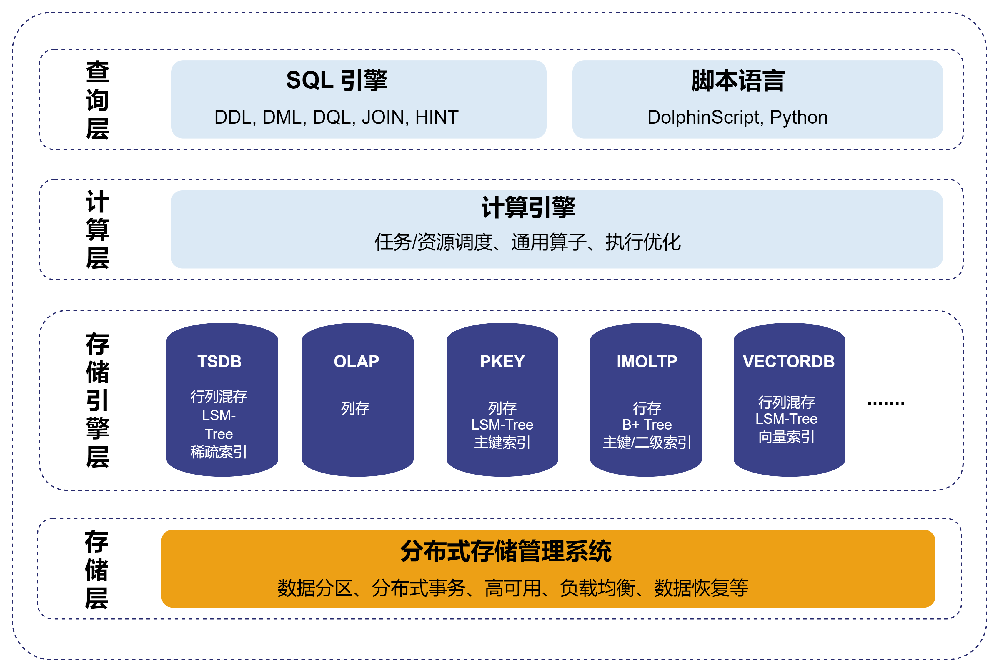

# 多模态存储

多模态存储是指一个系统可以同时支持多种不同的存储引擎，每种引擎共享同一个数据库架构，但技术实现存在差异。DolphinDB
在架构设计上充分考虑了多模态存储的需求，提供了多种存储引擎，实现了对不同类型数据的存储和管理。这种设计更好地满足了复杂业务场景对数据管理的需求，能够适应金融、物联网等不同需求的应用场景，为用户提供了一个统一、高效的数据管理解决方案。

## 多模态架构

DolphinDB
多模态架构如图所示。它由多个层次组成，其中存储引擎层作为系统的独立分层，负责提供数据库和表的创建与删除接口。针对不同业务场景，各种引擎在存储结构和索引设计上有所不同，但均遵循统一标准来实现写入和读取接口。而在其他层次，DolphinDB
实现了多模态数据库的“三个统一”：

**统一的数据库查询语言**：查询层提供编译器和解析器，支持多种编程语言，包括 DolphinScript（包括 SQL 92
标准语法）、Python。这种统一性使得用户可以根据自身需求灵活选择编程语言，而无需担心存储引擎的差异。

**统一的分布式计算框架**：计算层实现了分布式计算的抽象通用功能，包括通用算子和执行优化、向量化等优化计算功能。这一层的设计不区分存储引擎的类型，可以确保任何计算任务都能够高效地利用计算资源，提高整体性能。

**统一的存储管理系统**：存储层负责统一的分布式存储管理，涵盖数据写入、数据分区、副本、分布式事务、负载均衡、数据恢复、元数据、高可用、弹性扩缩容等功能。它通过统一的接口，可以对不同存储引擎中的数据进行读取调度，从而简化了数据管理的复杂性。

## 存储引擎

在 DolphinDB
中，新增一个引擎只需在存储引擎层实现必要功能，并复用其他层的基础功能，这使得扩展存储引擎变得更简单高效。在存储引擎层实现存储结构和接口。其中，对于存储结构，需要根据引擎所需实现的业务特征，设计合适的存储结构，包括索引实现和数据存储文件的具体结构。而对于接口，存储引擎提供统一的表和向量写入和读取接口，使
SQL 引擎能够无感知于存储引擎的细节，从而降低模块间的耦合度。SQL
引擎关注数据库中表和列的结构与数据，而计算引擎则将表的一列视为一个向量。两者并不关心具体的数据存储方式或底层实现，这些由存储引擎负责。不同存储引擎实现数据存储的方式不同。例如：TSDB
引擎在一个分区中的一列，实际上是由多个 Block 组成的逻辑上连续，物理上分散的向量。而 OLAP 引擎在一个分区中的一列，是一个物理上连续的向量。

此外，分布式存储管理系统负责将数据分散存储在多个物理或虚拟节点上，并提供数据访问和管理功能。存储引擎则负责单个分区的数据写入和读取、索引创建和解压缩等任务。写入数据时，存储引擎提供写入接口，将一个分区的数据写入一个内存表。分布式存储管理系统告知存储引擎分区的存储位置，最终将内存表数据持久化到指定位置的文件中。在查询数据时，存储引擎提供读取接口，从分布式存储管理系统指定的分区位置读取数据，每次返回一个分区的数据给计算引擎。

目前，DolphinDB 支持以下存储引擎：TSDB, OLAP, PKEY, IMOLTP, VectorDB, TextDB。除 IMOLTP
外，其它引擎均采用数据分区技术，按照给定规则将大规模数据集水平分区，基于同一个分布式存储管理系统，实现数据在各个数据节点上的均匀分布。不同的存储引擎分别针对不同的应用场景而设计，在存储结构、支持的数据形式和类型、索引机制等方面存在区别。

* TSDB：行列混存，采用 LSM-Tree 数据结构，支持通过 *sortColumns*
  参数设置稀疏索引，支持数据去重，除基础的数据类型外，还支持 array vector、columnar tuple、BLOB 类型。更多介绍见[TSDB 存储引擎](tsdb.md)。
* OLAP：列式存储，一个分区内的一列数据存储在一个文件上。它是架构最简单的存储引擎，仅支持基础的数据类型，不支持 array
  vector、columnar tuple、BLOB 类型，不支持索引和数据去重。更多介绍见[OLAP 存储引擎](olap.md)。
* PKEY：列式存储，采用 LSM-Tree 数据结构，支持设置主键，支持为非主键列设置索引，数据类型支持性同
  TSDB、支持数据去重。更多介绍见[主键存储引擎](pkey_engine.md)。
* IMOLTP：所有数据存储在内存中，行式存储，索引采用 B+ Tree
  数据结构，支持主键索引和二级索引，仅支持有限的数据类型（时间类型、整数类型、浮点数、字符串）。
* VECTORDB：基于 TSDB 设计，存储结构和数据类型支持性都和 TSDB
  一致。支持为指定列设置向量索引。更多介绍见[向量存储引擎](vectordb.md)。
* TextDB 基于 PKEY 设计，支持文本索引构建和存储，高效检索文本数据。更多介绍见[文本存储引擎](textdb.md)。

在实际使用中，需要根据实际业务需求来选择合适的存储引擎。在 DolphinDB 中选择引擎的方式简单灵活，只需要在创建数据库时，通过 [database](../../funcs/d/database.md) 函数的 *engine*
参数指定存储引擎即可。可以同时创建多个不同引擎下的数据库，但每个数据库只能使用一种引擎。用户参考下面存储引擎的适用场景，根据业务需求进行合理设置。

| 存储引擎 | 适用场景 |
| --- | --- |
| TSDB | 兼顾了 OLAP 的分析和 PKEY 的高效查询性能，适用于大多数时序数据处理场景。 |
| OLAP | 适合扫描分析大量数据等场景，如：查询所有股票在某个时间段内的交易量等。 |
| PKEY | 在支持主键的同时，需要实时更新和高效查询的场景，如从 OLTP 数据库的主键表 CDC 到 DolphinDB 中进行数据分析。 |
| IMOLTP | 高并发、低延迟的在线事务处理场景，如金融行业的交易系统等。由于它是内存数据库，要求数据集大小在内存容量范围内。 |
| VECTORDB | 海量数据的高效检索和快速响应的场景，如搜索引擎（如 Elasticsearch）和 AI 生成模型等。 |
| TextDB | 金融领域实现市场情绪分析、信息过滤与处理等；物联网领域管理海量日志数据、进行实时搜索与分析等。 |

