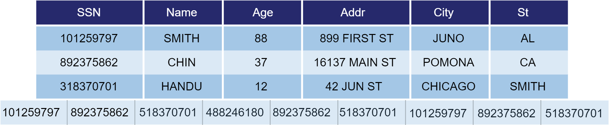

# OLAP 存储引擎

在 OLAP 场景中，通常需要执行大规模的聚合和分析操作。为了应对这种需求，DolphinDB OLAP
引擎采用了数据分区技术，按照指定规则将大规模数据集水平分割成多个分区，并在每个分区内采用列式存储的方式来存储数据。这种分区式存储策略允许我们只读取所需的列数据，从而减少不必要的
I/O 操作，显著提高了查询速度。

## 存储结构

OLAP 存储如下图所示，同一列的数据按表中的顺序连续地存放在一起，表的每列构成一个长数组。

OLAP
引擎将数据表中的每个分区中的每列都存储在一个单独的数据文件中。数据以追加的方式存储到相应的列文件中，因此，数据写入的顺序决定了它们的存储顺序。这种存储方式使得对于每个分区中的每一列数据的查询和分析都可以快速高效地进行。同时，由于每个分区都有其独立的存储空间，因此在进行数据操作时可以充分利用系统的并行处理能力，进一步提高数据处理速度。

## 数据压缩

OLAP 支持无损压缩，提供了如下可选的压缩算法（通过建表的选项 *compressMethods* 配置）：

* 若不指定，默认采用 LZ4 压缩算法，适用于一般情况。LZ4 主要针对重复字符进行压缩，压缩率与数据重复频率相关。如果同一列中有较多重复项，LZ4
  算法可以获得较高的压缩速度。但相对于 Delta（delta-of-delta encoding） 压缩算法，压缩率提升可能不太明显。
* zstd 压缩算法：zstd 适用于几乎所有数据类型，其压缩比高于 LZ4，但解压缩速度较 LZ4 慢约1倍。
* 对于时间类型或者变化较小的整型数据，建议采用 Delta（delta-of-delta encoding） 压缩算法。Delta
  是专门针对时间戳等连续且等间隔的数据提出的算法，能够极大降低时间戳的存储空间，因此特别适合时间列的压缩。
* chimp 压缩算法：在处理小数部分长度不超过三位的 DOUBLE 类型数据时，chimp 具有很高的压缩率及优越的压缩和解压效率。
* 对于重复较高的字符串，可采用 SYMBOL 类型存储。系统对 SYMBOL 类型数据会使用字典编码，将字符串转化为整型，减少字符串的存储空间。

在现实场景下，金融数据存盘的压缩率一般可达到 20% 到 30% 左右。OLAP
采用增量压缩策略，每次只对新增数据进行压缩，因此批量写入有助于提升压缩效果。若每次仅写入一行记录，且 Cache Engine
未开启，则存于磁盘的数据不会进行压缩。

## 数据写入

通用场景下，数据写入后会直接刷盘，若每次进行小批量写入会极大影响磁盘 I/O 性能以及压缩效果。为此，OLAP 维护了一个 Cache
Engine，以实现数据缓存后批量写入的功能。Cache Engine 是 DolphinDB
中的一种数据写入缓存机制，对一个文件进行写入时，写入1行数据和写入1000行数据的时间基本相等，大部分时间都花在打开和关闭文件上；因此，如果把多次少量的写入缓存起来，在一次文件
IO 中批量写入，那么就可以节省许多对文件进行打开和关闭带来的时间开销，从而在整体上提升系统的写入性能。

OLAP 引擎可以通过配置参数 OLAPCacheEngineSize 开启或关闭 Cache Engine。写入缓存功能必须与 Redo Log 配合使用，即开启
Cache Engine 时必须指定 dataSync=1。 当缓存中的数据量达到阈值（OLAPCacheEngineSize
的30%）时，系统才会将数据写入磁盘，这样避免了频繁的磁盘操作。

OLAP 引擎写入操作支持事务，具备事务 ACID 特性，且通过 MVCC 实现快照隔离级别。

**写入流程如下：**

1. **写 Redo：**先将数据写入 OLAP Redo Log。
2. **写 Cache Engine：**写 Redo Log 的同时，将数据写入 OLAP Cache Engine。
3. **写磁盘：**若某写事务到来时，Cache Engine 中的数据累计达到了 *OLAPCacheEngineSize* \* 30%
   时，系统将进行一次刷盘操作，把数据以追加的方式写入分区中的列文件。

## 数据查询

OLAP 引擎将每列数据存储为一个列文件，所以读取数据时，需要从磁盘读取该列所在的分区，解压后加载到内存。

具体流程如下：

1. 根据查询语句进行分区剪枝，缩窄查询范围。
2. 将 where 语句过滤条件中包含的列的数据文件读到内存，并进行过滤。
3. 根据过滤出的列数据，读出其对应的其他列的数据。

这种数据读取方式使得 OLAP 引擎在高吞吐量查询情况下拥有较好的性能。 但若需要更新或删除某条数据，OLAP
会将整个分区数据加载到内存中，再对这条数据进行更新或删除，因此性能开销大。

## 数据更新

OLAP 引擎更新操作支持事务，具备事务 ACID 特性，且通过 MVCC
实现快照隔离级别。每次更新，系统都会读出对应分区中相关的列文件，在内存中进行更新，同时创建一个新的版本以存储新的数据。整个过程通过事务来确保数据一致性，并通过 MVCC
保证读取的一致性，对于未变化的列，采用创建硬链接的方式，以提升性能并降低不必要的数据读写。在提交事务之前，其他 SQL
语句仍然访问旧版本的数据，直到更新事务完成。若更新操作涉及多个分区，只要其中某一个分区更新失败，系统会回滚所有分区的修改。

针对不同的数据更新需求，DolphinDB 提供3种更新表的方法：

* update：ANSI SQL 92 的update语法
* sqlUpdate：动态生成 SQL update 语句的元代码。
* upsert!：用于更新键值内存表、索引内存表或分布式表。进行更新时，若新数据的主键值已存在，则更新该主键值的数据；否则添加数据。

## 数据删除

对于 OLAP 引擎的数据删除操作，其流程与更新操作一致，即按分区读取所有数据，执行删除操作后写入一个新版本的目录。整个过程同样通过事务保证数据一致性，并通过 MVCC
保证读取一致性。若删除操作涉及多个分区，只要其中某一个分区删除失败，系统会回滚所有分区的修改。

针对不同的数据删除需求，DolphinDB 提供以下方法删除数据：

* dropPartition：删除整个分区的数据，默认保留分区结构，也可通过参数设置不保留分区结构。
* delete：删除数据，保留分区结构。
* sqlDelete：动态生成 SQL delete 语句。
* dropTable：删除整个表的数据，不保留表结构。
* truncate：删除整个表的数据，保留表结构。

## OLAP引擎特点

* 数据在表中的存储顺序与数据写入的顺序一致，数据写入非常高效。
* OLAP 的存储结构决定了它很适合读取整个分区数据或分区的某几列数据的场景。
* 适合扫描分析大量数据、全表扫描等场景，如：查询所有股票在某个时间段内的交易量等。
* 写入过程设计简单，不支持去重。
* 不适合几百几千列的宽表存储。

