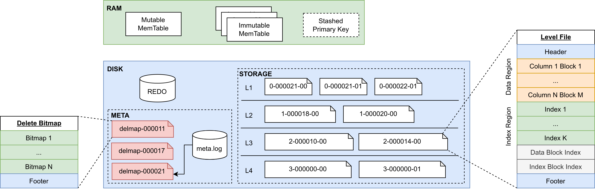
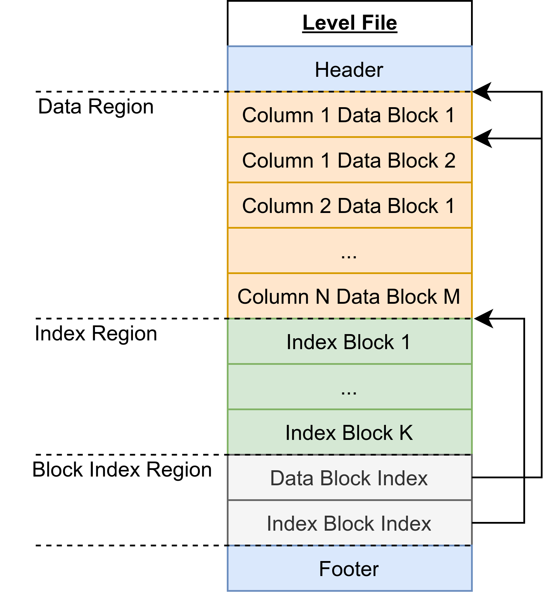
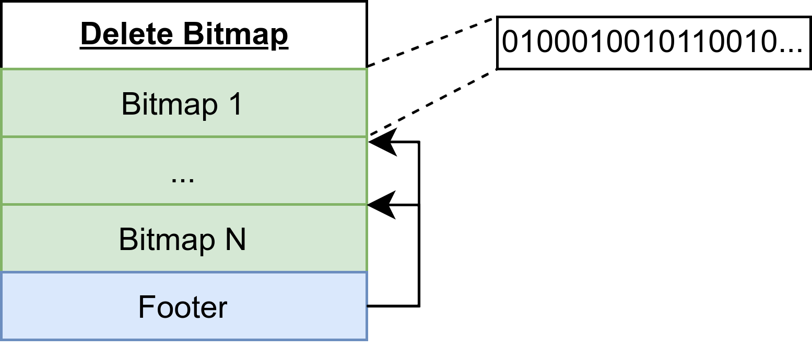
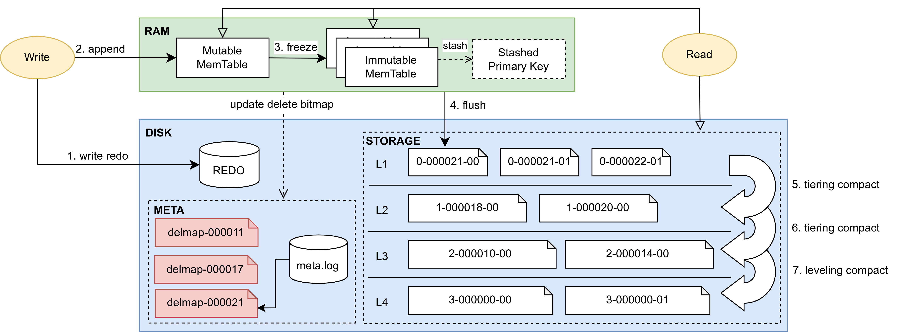

# 主键存储引擎

主键存储引擎（PKEY）是提供主键唯一性保证的，支持实时更新和高效查询的存储引擎。该引擎的设计目标是，满足从 OLTP 数据库的主键表 CDC 到 DolphinDB
中进行数据分析的需求。该需求需要存储引擎能够在保持主键唯一性的同时，做到近似实时的、类似 OLTP 的数据插入和更新负载，以及不固定的查询模式（Ad Hoc 查询）。

## 主键唯一性

目前 DolphinDB 的 TSDB 存储引擎在去重策略为 LAST
的情况下，能满足唯一性的要求。但由于查询时的去重代价较高，且无法使用非主键列的索引，所以不适合需要多种索引结合的 Ad Hoc 查询模式。而 OLAP
存储引擎虽然能最大化查询性能，但由于每次写入都要合并数据，难以做到实时更新。

### 主流方案介绍

**Copy-on-Write**

**原理**：当数据写入时，将原数据冲突的部分从磁盘读出并合并，然后将合并结果写入磁盘。

**优点**：最大化查询性能，查询过程中不需要考虑保证主键唯一性。

**缺点**：每次写入都要合并冲突数据，使得更新代价高，不适合频繁更新的场景。

**代表系统**：Hudi、Delta Lake、DolphinDB OLAP 存储引擎。

**Merge-on-Read**

**原理**：数据写入时不严格考虑唯一性，不检查新文件是否覆盖旧文件的数据行，采用盲写方式落盘。在数据查询时，再根据查询结果合并可能冲突的新文件，并保留最新主键数据，从而保证主键唯一性。

**优点**：写入性能极佳。

**缺点**：查询时需要读新文件做去重合并，查询性能优化存在上限，例如无法结合非主键列的索引过滤数据。

**代表系统**：ClickHouse、StarRocks 更新表、DolphinDB TSDB 存储引擎。

**Merge-on-Write**

**原理**：引入 delete bitmap 的概念，在数据写入时更新各文件的行删除标记，查询时根据 delete bitmap
直接过滤掉被删除或覆盖的行。

**优点**：查询时不需要读取文件做去重，能够有效利用非主键索引来过滤查询结果。支持实时更新的场景。

**缺点**：需要更新各个文件的 delete bitmap，牺牲了写入性能。

**代表系统**：Hologres、ByteHouse、Doris 主键模型、StarRocks 主键表。

### 主键引擎方案选择

为实现实时插入和更新，PKEY 存储引擎采用 LSM-Tree 的设计，通过顺序写来保证写入性能。

为实现 Ad Hoc 查询模式，采用 Merge-on-Write 方案，在不影响写入速度的同时，使查询不需要读文件进行去重合并。此外，PKEY
引擎能够利用各种索引来加速查询。

## 存储结构

PKEY 存储引擎中的数据分别存储在内存和磁盘中。新写入的数据会保存在内存的 Cache Engine 中。当内存数据量达到阈值时，会将数据落盘保存为只读的层文件（称为
Level File）。内存和磁盘上的数据均采用列式存储方式。为了支持高效的主键点查、数据压缩（compaction）以及 delete bitmap （关于
delete bitmap 的详细内容将在”文件结构”一节介绍）更新，内存中的 immutable memtable 和磁盘上的每个 Level File
内部都按照主键顺序排序。存储引擎在新数据写入后，会在后台持续更新 delete bitmap，从而在查询时避免读文件去重的开销。

### 存储布局



PKEY 存储引擎数据分为内存和磁盘两部分，并由以下几个主要组件构成：

* MemTable：新写入的数据会插入到内存表中，内存表分为一个可变内存表和多个不可变内存表。
* Stashed Primary Key：当内存中数据达到最大容量时，数据将会落盘。此时引擎会暂存部分数据，用于后续的 delete
  bitmap 更新和查询去重。
* REDO：预写日志，用于保证事务的原子性和持久性。用户的写入操作会首先将数据写入 redo log 中，然后进入内存表。
* META：存储引擎的元数据，包括元信息的 meta.log 和多版本的 delete bitmap 文件。
* STORAGE：存储引擎的数据，分为四层，每层存储多个层文件（Level File）。

**MemTable**

LSM-Tree
的顺序写特性简单来说是将写入和更新操作分为两部分进行：内存插入和文件顺序写。其中内存插入就是写入存储引擎的可变内存表。当可变内存表的数据量达到容量后，会根据主键排序从而形成一个不可变内存表。在
PKEY 引擎中，由 Cache Engine
来维护这两种内存表。由于不可变内存表是有序的，所以主键点查可以通过二分检索来降低复杂度。

**Stashed Primary
Key**

当内存数据落盘后，引擎会暂存该数据的主键和 CID（commit ID）列，用于 delete bitmap
的后台更新以及查询去重。Stashed Primary Key 采用双缓冲设计，其底层由两个 buffer 组成，每个 buffer 包括两个向量，即主键列和
CID 列。双缓冲设计用于处理后台的 delete bitmap 更新、数据落盘以及查询去重的并发控制，能够消除查询去重的拷贝开销。

**Meta
Log**

Meta Log 主要存储 PKEY 引擎的文件元信息和 delete bitmap
信息，它的作用是给查询提供某时刻的元信息快照：

* 文件元信息，包括文件路径、索引信息、各列类型等信息，用于保存分区恢复、事务、数据落盘等文件更改操作。
* delete bitmap 信息，包括路径和版本号。

**Delete Bitmap**

在 PKEY 引擎中，每一个层文件都存在对应的 delete
bitmap，用于指定该文件中某行数据是否被删除或覆盖。delete bitmap 的特点是大小很小，120KB 左右可以存储 100 万行数据的标记。所以
PKEY 存储引擎的一个 delete bitmap 文件可以存储该分区下所有层文件的 delete bitmap。delete bitmap
文件采用多版本方式存储，用于避免查询和写入过程的冲突。具体而言，每一次 delete bitmap 文件的落盘都会以本次数据最大的 flushID
作为快照版本，并由 Meta Log 指定当前最新的 delete bitmap 文件。

**Level File**

Level
File 在概念上等同于 LevelDB 中的 SSTable。在 Compaction 策略上，PKEY 存储引擎采用 lazy leveling
的设计，即前三层的多个 Level File 之间可能重叠，最后一层的多个 Level File
之间不会重叠。其目的是减少最后一层的读放大以及空间放大。

### 文件结构

**Level
File文件**

为了更好地管理 Level File 以及识别 Level File 之间数据的新旧顺序，引擎将每个 Level File
的文件名设计为由三部分组成，分别是 level ID、flush ID 和 sequence number。其中 level ID
指示该文件在逻辑上属于哪一层，flush ID 表示该文件包含的最新数据是来自哪一次落盘，sequence number 则表示该 level file 在所属
sorted run 中的序号。sorted run 是指一组 level file，这些文件之间没有数据重叠，是 flush 或 compaction
的输出。一个文件名的例子比如 1-000000014-001，表示该 level file 存在于第二层，包含 flushID 为 14 的数据，是该
sorted run 中的第二个文件。

Level file内部由六部分组成，如下图所示：



* Header：存储该文件的信息，例如最大和最小 CID、各列的类型信息、主键列信息等。
* Data Block：数据块，每个数据块最多存储 8192 行数据。文件的每个数据块之间以及数据块内部按主键顺序排序。
* Index Block：索引块，目前支持 Bloom Filter 和 Zone Map。
* Data Block Index：数据块的索引结构，存储所有数据块的所属列序号、文件偏移量、行数等信息。
* Index Block Index：索引块的索引结构，存储所有索引块的类型、列序号、文件偏移量等信息。
* Footer：存储 Data Block Index 和 Index Block Index 的文件偏移量。

上述六部分都按照 4KB 对齐，以提高操作系统访问文件块的效率。

**Delete Bitmap文件**

Delete
bitmap 文件包含了该分区下所有 Level File 的 delete bitmap，其结构如下：



* Bitmap：存储某文件的 delete bitmap，内部是一个 01 序列，表示某行是否被删除或覆盖。例如，上图中第一个 bitmap
  表示对应 Level File 的第二行、第六行等已被删除或覆盖。
* Footer：存储各 bitmap 对应的 Level File 信息以及文件偏移量，包括 Level File 的 level ID、flush
  ID 和 sequence number。

存储引擎按照多版本的方式存储 Delete bitmap 文件，从而为查询提供一致的数据快照，其中每个版本由文件名中的 flushID
做区分。Delete bitmap 文件是多版本存储的，每个文件由文件名中的 flush ID 区分。例如 delmap-000000014 是以 flush
ID 为 14 的刷盘数据作为最新数据的各 Level File 的 delete bitmap。meta.log 会记录当前分区最新 delete
bitmap 的 flush ID，每次查询会从元信息中获取最新 delete bitmap 进行去重。

## 读写流程



### 数据写入

结合上图从数据传递的视角介绍 PKEY 引擎的写入流程：

1. **写 redo**：写入预写日志，保证事务原子性。
2. **写 cache engine**：当 redo log 写入成功后，写入 cache engine 的 mutable
   memtable。
3. **形成 immutable memtable**：当 mutable memtable 中的数据量达到容量（8MB）时，该
   memtable 会按主键排序并形成一个 immutable memtable。
4. **后台刷盘**：当 cache engine 中的数据量达到 PKEYCacheEngineSize （默认 1GB）时，PKEY
   引擎会触发后台刷盘逻辑，将内存中的所有数据写入磁盘，作为第一层的 Level File。同时，本次刷盘的数据将会存储在 stashed
   primary key 中，作为下次 delete bitmap 更新和查询去重的依据。
5. **后台 compaction**：在每次刷盘和 compaction 结束后，后台线程会根据触发条件判断各层是否需要进行
   compaction，然后根据文件选取策略进行 compaction
   1. 触发条件：检查每层的数据量是否超过阈值，以及每层中被删除或覆盖的行数占总大小的比例。当存在多个层满足触发条件时，会对各层按照一定规则进行评分，进而选择一个分数最高的层进行下一步逻辑。
   2. 文件选取策略：从该层中最旧的文件开始，选取互相重叠的 sorted
      run，并计算分数做出最优选择。根据触发条件的不同，选取策略的目的倾向也不同：或是倾向于垃圾数据最多的选择，或是倾向于
      sorted run 个数最多的选择。

根据文件数量和大小，delete bitmap 更新过程通常比一次 flush 耗时更长。为了在一次 delete bitmap
更新中标记尽可能多的失效行，系统在第 4 步刷盘结束后，会检查 stashed primary key 数据量是否达到阈值
PKEYDeleteBitmapUpdateThreshold（默认值为 100MB），从而触发 delete bitmap 的后台更新。delete
bitmap 后台更新的流程如下：

1. 对每个文件，根据该文件的 zone map 确定需要合并的数据块。
2. 对每个数据块，通过二分法检查并更新 delete bitmap。如果相同主键在 stashed primary key 中 CID
   更大，说明该文件的这行需要被标记为删除。
3. 将所有文件的 delete bitmap 写入一个 delete bitmap 文件，并使用 stashed primary key
   中最大 flush ID 作为 delete bitmap 的版本号。

### 数据查询

PKEY 存储引擎的查询过程类似 TSDB KeepLast，区别在于 PKEY 引擎会将谓词条件下推到去重之前，并且能够利用 bloom filter
等索引加速查询。具体的查询流程如下：

1. **获取内存数据**：从 cache engine 中取出所需的列。如果是主键点查，会采用二分查找的方式搜索各个 memtable。
2. **获取元数据版本快照**：从 meta version 中获取 Level File 信息、delete bitmap 信息以及
   stashed primary key。
3. **获取磁盘数据**：通过各种索引进行粗过滤，构建各文件的 bitmap 来访问所需的 data block。
   1. 使用 bloom filter 过滤：当进行主键点查，或者对存在 bloom filter 索引的列进行等值查询时，会对各个
      Level File 进行文件级别的 bloom filter 过滤，找出所有可能存在结果的文件。
   2. 使用 zone map 过滤：当进行等值或范围查询时，会对每个 Level File 进行 block
      级别的过滤，找出所有满足条件的 block。
   3. 使用 delete bitmap 过滤：在上述过滤完成后，将该文件的 delete bitmap 和记录行号的 bitmap
      取交集，过滤掉已被删除和覆盖的行。
4. **计算谓词条件结果**：过滤掉不需要的行。
5. **去重**：将查询结果与内存中的 cache engine 和 stashed primary key 进行去重。如果 cache
   engine 和 stashed primary key 皆为空，则不需要去重。
6. **返回查询结果**。

### 数据更新

在 PKEY 引擎中，更新可被视为一次数据查询和写入，具体分为以下步骤：

1. **查询**：根据谓词条件进行一次查询。
2. **修改**：对上述查询结果进行修改。
3. **写入**：按照写入流程插入数据。

### 数据删除

在 PKEY 引擎中，删除也可被视为一次数据查询和写入，具体分为以下步骤：

1. **查询**：根据谓词条件进行一次查询。
2. **写入**：按照写入流程插入数据，但 CID 将会写入为负数作为删除标记。

## PKEY 引擎特点

PKEY 存储引擎在写入和查询性能之间寻求平衡，其特点为：

* 保证主键唯一性，能做到近实时的更新。
* 使用主键列进行谓词条件的点查非常高效。
* 使用非主键列索引的查询效率高。其中 zonemap 能够按块过滤数据，适合时间相关列的过滤查询；bloomfilter
  能够按文件过滤数据，适合大基数列的点查询。
* 当写入数据的吞吐量在一定范围内时，其写入性能接近 TSDB。随吞吐量的增长，主键引擎的写入耗时增长速度高于 TSDB 存储引擎。

## PKEY 引擎使用示例

### 数据库部署

在使用 PKEY 引擎前，可以按需调整系统的配置项，以充分发挥系统的性能。本节主要介绍其中几个重点参数：

* **PKEYRedoLogDir 和 PKEYMetaLogDir**：为了提高写入效率，建议将 redo log 以及元数据配置在 SSD
  盘上。
* **PKEYCacheEngineSize**：默认是
  1G。对于写入压力较大的场景，可以适当调大该值；对于查询性能要求严格的场景，可以调小该值。
  + 若设置过小，写入时可能导致 cache engine 频繁刷盘，影响系统性能。
  + 若设置过大，查询时需要读取 cache engine 数据，但其内部并没有索引信息，且会引入去重开销。
* **PKEYBlockCacheSize**：PKEY 存储引擎的块缓存容量，默认 1G。查询性能要求严格的场景可以调大该值。
* **PKEYDeleteBitmapUpdateThreshold**：触发后台 delete bitmap 更新的数据量阈值，默认
  100MB。
  + 若设置过小，将导致 delete bitmap 频繁更新，占用磁盘带宽，进而影响查询、cache engine 刷盘及后台
    compaction 任务。
  + 若设置过大，则查询的去重开销增加，查询时间延长。过大的设置还会导致重启后的恢复过程变慢。
* **PKEYStashedPrimaryKeyBufferSize**：设置 PKEY 存储引擎的暂存主键缓冲区的容量，默认
  1024MB。该参数在系统面对高写入压力时，能够限制刷盘，从而防止暂存缓冲区无限增长导致 OOM（Out of Memory）的问题。
* **PKEYBackgroundWorkerPerVolume**：配置每个 Volume 的 PKEY 后台工作线程数。后台工作包括
  compaction 和 delete bitmap 更新，默认值为 1。
* **PKEYCacheFlushWorkerNumPerVolume**：配置每个 Volume 的 PKEY Cache Engine
  刷盘工作线程数，默认值为 1。

### 创建数据库

下述脚本以创建一个组合分区的数据库为例，和其他存储引擎建库时的区别仅在于 engine 设置不同，将 engine 设置为 "PKEY" 表示创建主键引擎数据库
：

```
dbName="dfs://test_pkey"
db1 = database(, VALUE, 2020.01.01..2021.01.01)
db2 = database(, HASH, [SYMBOL, 100])
db = database(directory=dbName, partitionType=COMPO, partitionScheme=[db1, db2], engine="PKEY")
```

### 创建数据表

创建分布式表/维度表时， PKEY 需要设置 primaryKey 这个必选参数。

```
// 通过函数创建主键引擎表
createPartitionedTable(dbHandle, table, tableName, [partitionColumns],
 [compressMethods], [primaryKey], [indexes])

// 通过 SQL 语句创建主键引擎表
create table dbPath.tableName (
    schema[columnDescription]
)
[partitioned by partitionColumns],
[primaryKey]
```

这里以创建一个 PKEY 下的分布式表为例：

```
tbName = "pt1"
colName = `SecurityID`TradeDate`TradeTime`TradePrice`TradeQty`TradeAmount`BuyNo`SellNo
colType = `SYMBOL`DATE`TIME`DOUBLE`INT`DOUBLE`INT`INT
tbSchema = table(1:0, colName, colType)

// 通过函数创建主键引擎表
db.createPartitionedTable(table=tbSchema, tableName=tbName,
  partitionColumns=`TradeDate`SecurityID, primaryKey=`SecurityID`TradeDate`TradeTime,
  indexes={"BuyNo": "bloomfilter"})

// 通过 SQL 语句创建主键引擎表
create table "dfs://test_pkey"."pt1"(
  SecurityID SYMBOL,
  TradeDate DATE,
  TradeTime TIME,
  TradePrice DOUBLE,
  TradeQty INT,
  TradeAmount DOUBLE,
  BuyNo INT [indexes="bloomfilter"],
  SellNo INT
)
partitioned by TradeDate,SecurityID
primaryKey=`SecurityID`TradeDate`TradeTime
```

其中参数 partitionColumns 表示分区字段，primaryKey 表示该表的主键字段，indexes
表示表中列的索引类型。为提高写入性能和查询效率，应根据数据和业务场景合理设置这几个参数：

* 合理设置分区字段：
  + 为了确保主键引擎的高效写入，每次批量写入或更新的记录应尽可能集中在少量分区内。有些场景下，分区字段可能是一个递增 id
    ，或是包含日期等信息的唯一 id。直接以此作为分区列将极大影响写入性能。为了解决这个问题，DolphinDB
    特意引入了分区字段上的转换函数，将转换函数的输出作为数据分区的依据。
  + 以包含日期的 id 为例，id 列的格式为`id1_date_id2`，通过自定义函数
    myPartitionFunc，提取 id 中的 date ，以此作为分区依据将数据按日期进行分区：

  ```
  // 定义处理分区列 DateId （形如"475b4_20240101_6d9b2"）的函数
  def myPartitionFunc(str,a,b) {
  	return temporalParse(substr(str, a, b),"yyyyMMdd")
  }
  // partitionColumns 中指定 myPartitionFunc 函数对 DateId 列的数据进行处理
  pt = db.createPartitionedTable(table=tb, tableName=`pt,
    partitionColumns=["myPartitionFunc(DateId, 6, 8)","SecurityID"],
    primaryKey=`SecurityID`DateId`TradeTime,
    indexes={"BuyNo": "bloomfilter"})
  ```
* 合理设置主键字段：
  + 包含所有分区字段。
  + 建议有序的主键列优先放在前面，如时间、自增ID等。这些数据在存储上会存放在一起，如果数据相关那么查询效率会比较高。
* 合理设置索引：
  + 该参数是一个字典，其键和值都是 STRING 类型，分别代表列名和索引类型。例如
    `indexes={"BuyNo": "bloomfilter"}` 表示为 BuyNo
    列设置 bloomfilter 索引。
  + 目前支持自定义的 bloomfilter 索引（zonemap
    索引每列会自动创建），能在不同场景下加速查询。用户需要合理设置索引，当某种查询真正需要索引时再指定。下表列出了不同索引适用什么场景，以及对应的例子：

    | 索引类型 | 适用数据 | 适用负载 | 举例 |
    | --- | --- | --- | --- |
    | BloomFilter | 大基数列 | 点查 | `select * from pt where id = "28c9d88b6f67"` |
    | ZoneMap | 时间相关列 | 点查和范围查 | `select * from pt where time > 2024.05.13` |

下面进一步说明索引的适用场景和效果：

* BloomFilter 适合应用于大基数列。数据基数越大，索引效果越好。适合的数据比如身份证ID、订单号、从业务上游同步的外键等。
* ZoneMap 适合应用于时间相关列。一批写入的数据越集中，查询效果越好。适合的数据比如订单时间、埋点时间等。因为 ZoneMap
  的存储占用很小，所以引擎会自动创建所有列的 ZoneMap。

