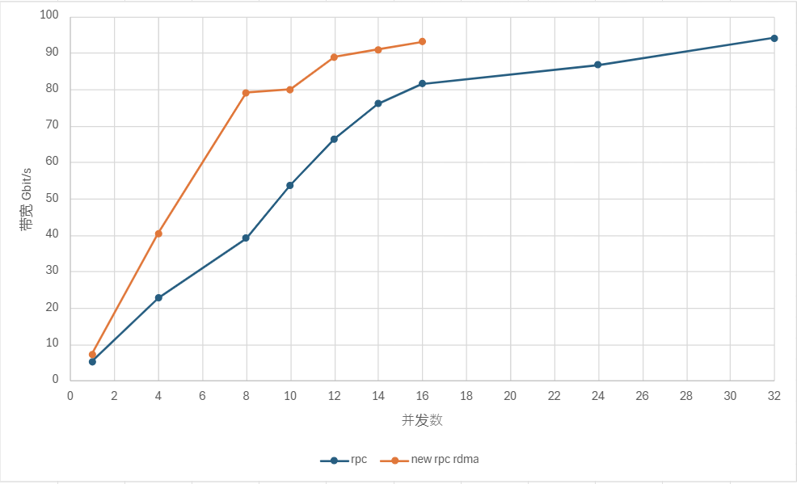

# 节点间传输协议

节点间通信是分布式系统中不同节点之间交换信息的过程，它对于实现系统的协同工作、数据共享和分布式计算等至关重要。DolphinDB 现支持两种节点间通信的传输协议：TCP/IP
协议（Transmission Control Protocol，传输控制协议；Internet Protocol，网络协议）和 RDMA（Remote Direct
Memory Access，远程直接内存访问）。其中，RDMA 自 3.00.1 版本起正式支持。

而节点和外部的传输则是依靠 API, GUI, Web 等开启会话，然后通过会话和对应节点建立连接，最后通过连接安全稳定地传输数据。其中使用的通信传输协议是 TCP/IP 协议
。

本节将详细介绍 DolphinDB 节点间通信的两种传输协议，在论述其概念、原理与特点后，通过多维度对比为用户给出具体的使用建议。

## TCP/IP 协议

TCP/IP
协议是互联网中最基本的网络通信模型。它规定了互联网中各部分进行通信的标准和方法，被广泛应用于局域网、城域网、广域网等计算机网络中，可以在各种硬件和操作系统上实现互操作，并且支持异构网络环境。

用户/集群内部连接通过 *ip* 和 *port* 参数指定传输端口，进而建立 TCP/IP 连接。根据 TCP/IP
协议，节点间开始交换数据。在该过程中，将使用 DolphinDB 自定义的 PROTOCOL\_DDB 协议对数据进行序列化与反序列化。该序列化协议支持最全面的
DolphinDB
的数据形式和数据类型。此外，在通信过程中，如果发生错误（如数据丢失、连接中断等），节点会采取相应的错误处理机制如重发数据、重新建立连接等。当通信结束或节点需要断开连接时，会执行相应的关闭操作并释放系统资源。

在传输过程中，内部 RPC 的客户端使用单 WSAEventSelect/epoll 线程处理事件、通过单独的worker完成数据收发和任务执行，并通过配置参数
*remoteExecutors* 控制线程数量；而服务端则使用单 WSAEventSelect/epoll 线程与 worker
进行收发，其中通过配置参数 *workerNum* 调整常规作业的工作线程的数量。

此外，DolphinDB 的 TCP/IP 协议在套接字（Socket）中封装读写流（`DataInputStream`
接口、`DataOutputStream` 接口），从而实现缓冲区管理，进而避免多次的系统调用。

## RDMA 技术

RDMA 是一种网络通信技术，它允许计算机系统的内存直接访问其他计算机系统的内存，而无需中央处理单元（CPU）的参与。这种技术可以显著降低通信延迟和 CPU
负载，凭借零拷贝、内核旁路、协议栈卸载等优势大大提高网络通信的效率和吞吐量。

以下为使用 RDMA 网卡进行编程操作的两种方式：

* 一种方式是通过 Verbs 原语，但是这种方式需要修改运行在 Socket 之上的程序。用户可能需要付出额外的学习与编译成本。
* 另一种常用方法是通过 OFED 提供的 [IPoIB](https://docs.nvidia.com/networking/display/mlnxofedv543750lts/ip%2Bover%2Binfiniband%2B%28ipoib%29) 高层协议（Upper Layer
  Protocol）。IPoIB 直接把 IP 报文封装到 Infiniband 可靠或不可靠的连接上。其中用户态程序依然可以使用 Socket
  进行编程，完全不需要进行改动（需要使用 IPoIB 所对应的 IP 地址）。该方法最为简单，但同时可能无法充分发挥 RDMA
  的优势最终导致性能不如预期。

DolphinDB 的 RDMA 技术是在原有的 RPC 框架之上做了部分修改，在 3.00.1 版本实现对 RDMA Verbs 的原生支持。区别于 TCP/IP
网络架构， RDMA 凭借其内核旁路、零拷贝等特性，特别适用于需要高速、低延迟通信的场景，如使用分布式内存表、处理 RPC 操作等（暂不支持处理流数据）。

### 原理详解

在传输过程中，客户端使用多个 epoll 线程，以避免额外的队列和线程切换的开销。由于其只做收发操作，故而不会出现锁、阻塞等操作。通过配置参数
*remoteExecutors* 控制线程数量。而在服务端中，使用的则是单 WSAEventSelect/epoll 线程与 worker
线程（同样通过 *workerNum* 配置）。其中 worker 同时进行收发和 `rpc`
执行操作，以此避免耗时长的任务或者阻塞操作卡住 epoll 线程。

在缓冲区管理方面，则是把 RDMA 封装成对外的非阻塞 Socket 语义，通过直接读写 RDMA
注册内存，即绕过读写流（`DataInputStream`
接口、`DataOutputStream` 接口），从而避免额外的拷贝。

在内存管理上，通信双方在连接建立阶段预注册私有内存区，运行过程中不再扩张。通信过程中序列化反序列化都通过预注册内存区间分配内存。这种内存管理方式相比于
Rendezvous 方式内存开销可控，运行过程中也不再有内存注册的开销。序列化反序列化和数据收发之间通过内存所有权的交换从而实现部分零拷贝。

在流控方面则是借鉴了[rsocket credit based flow control](https://github.com/linux-rdma/rdma-core/blob/master/librdmacm/docs/rsocket)
机制，通信双方在链接建立阶段交换预注册内存大小，按阈值通过 RDMA immediate data 交换控制信息从而更新
credit。这个流控可以直接通过序列化反序列化内存分配反馈给用户，从而避免过多的内存开销。

### 具体使用

在 DolphinDB 中配置 RDMA 功能：

* 在使用前，由于 RDMA 技术需要特定的网卡硬件支持，建议用户考虑 RDMA
  网卡与现有硬件的兼容性、确保当前的操作系统和驱动程序安装正确。
* 在使用时，请确保已在当前机器中下载依赖的 [libibverbs](https://access.redhat.com/documentation/en-us/red_hat_enterprise_linux/7/html/networking_guide/sec-infiniband_and_rdma_related_software_packages) 库，并且在当前的所有节点（包括
  controller、datanode、computenode 和 agent）的配置中都已通过配置参数 *enableRDMA*
  启用 RDMA 功能。否则集群无法正常工作。此外，可直接延用已传入的参数 *ip* 和
  *port*，且原有代码可以实现完全复用。其中，RDMA 协议同样使用 PROTOCOL\_DDB
  协议进行数据的序列化与反序列化。

在 DolphinDB 中使用 RDMA 功能时，请注意：

* 目前 RDMA 仅支持 Linux 系统中集群内部调用 RPC（远程过程调用）的情况。
* RDMA 暂不支持多网卡选择、网卡端口选择、设置轮询次数和设置 RDMA 预注册的 Buffer 大小。

## TCP/IP 与 RDMA 的对比

TCP/IP 与 RDMA 在通信机制、数据传输方式、内存访问方式和编程模型等方面存在显著差异。

|  | TCP/IP | RDMA |
| --- | --- | --- |
| 通信机制 | 面向连接 | RC/RD/UC/UD |
| 数据传输方式 | 数据拷贝、全双工通信 | 零拷贝、直接内存访问 |
| 内存访问方式 | 通过操作系统内核 | 绕过操作系统内核 |
| 编程模型 | Socket API | Verbs API |
| 优势 | 广泛兼容性、灵活性、稳定可靠 | 高性能与低延迟、高效数据传输、支持大规模并行处理 |

* TCP/IP 以其广泛兼容性、灵活性和稳定可靠性适用于大多数常规工作负载和通用应用场景。
* RDMA 则以其高性能、低延迟和高效数据传输能力，在需要处理大量数据和高性能网络通信的场景中更具优势。

### 协议混用的情况说明

在以太网/TCP 的部署中，用户/集群内部通过参数 *ip* 和 *port* 建立连接。其中在 DolphinDB 内部，无论使用的是
TCP/IP 协议还是 RDMA 功能都需要先建立 TCP 连接。

* 如果客户端启用 RDMA 功能，则当前传输框架将首先通过该 TCP 连接和服务端协商是否使用 RDMA
  协议，以及交换带外数据。若服务端未开启或者不支持 RDMA 功能，当前连接会由于不支持当前 Wire
  Protocol（线路协议）而报错。
* 如果客户端未启用或不支持 RDMA 功能，若服务端启用了 RDMA 功能，则 server 会自动
  fallback，并复用已经建立好的连接来完成后续的通信。

具体情况可参见下表。

|  |  |  |
| --- | --- | --- |
|  | **服务端开启 RDMA 功能** | **服务端未开启/不支持 RDMA 功能** |
| **客户端开启 RDMA 功能** | 可以通信，使用 RDMA 功能 | 无法通信 |
| **客户端未开启/不支持 RDMA 功能** | 可以通信，使用 TCP/IP 协议 | 可以通信，使用 TCP/IP 协议 |

## 使用建议

如前文所述，RDMA 技术需要特定的网卡硬件支持。

* 在有足够硬件条件支持的情况下，两种协议均可选择使用，但使用 RDMA 会收获更快的数据传输速度。
* 若无相应硬件条件支持，则仅可使用 TCP/IP 协议。

简言之，在选择使用哪种通信技术时，需要根据具体的应用需求和网络环境进行综合评估。在有合适硬件支持的情况下，推荐优先使用 RDMA。

## RDMA 的性能测试案例

内存写入是诸多数据传输操作的基础，其传输速度的提升对数据库的写入、查询和恢复等操作有明显的增效作用。例如，

* 在提交任务、客户端分发数据到数据节点等场景中，当数据以高速率涌入系统时，快速的内存写入能够确保这些数据被及时且准确地存储起来，减少因写入延迟导致的性能瓶颈。
* 再比如在全量查询、Shuffle Join
  等查询类操作中，快速的内存写入能够确保数据在更新或插入后迅速可用，减少查询时因数据不一致或延迟更新而导致的等待时间。
* 此外，在数据恢复中快速的内存写入同样至关重要。在数据库系统遭遇故障或数据丢失时，高效的内存写入机制能够缩短数据恢复的时间，减少业务中断的影响。

注意：在进行上述操作时，也需要考虑磁盘等其他影响因素。

为方便用户了解 RDMA 在内存写入方面的性能，以下给出一个简单的测试案例。

**测试场景**：在某节点创建一个全局内存表。然后在另一个节点通过 `rpc` 函数发起查询。通过 submitJob 控制并发
rpc 数。测试在真实场景下多少个并发的情况下能够达到 100 Gbit/s 的带宽（需要的并发数越少越好）。

**测试条件**：

* 内存表 schema 为 10 int，10 long，10 float，10 double，大小大概为 3.8 GB。

**测试对象**：

* DolphinDB RPC(IPoIB)
* DolphinDB RPC + RDMA

**测试结果**：单位 Gbit/s

**测试结论**：

由上图可得，RDMA 的网卡利用率是 IPoIB 的两倍。

## 相关函数和配置参数

| 运维函数 | 解释 |
| --- | --- |
| getConnections | 获取当前节点的所有网络连接信息：两端 IP 和端口信息，连接建立时间。 |

| 配置参数 | 解释 |
| --- | --- |
| tcpNoDelay=true | 启动 *TCP\_NODELAY* 套接字选项。默认值是 false。 |
| tcpUserTimeout=300000 | 设置 *TCP\_USER\_TIMEOUT* 套接字选项，单位是毫秒，默认值为300000。 |
| lanCluster=true | 集群是否建立在 LAN（local area network）上。若为 true，心跳采用 UDP 协议；若为 false，心跳采用 TCP/IP 协议。默认值为 true。对部署在云上的集群，应当设为 false。 |
| dfsChunkNodeHeartBeatTimeout=8 | INT 类型，控制节点配置项，用于设置数据节点、计算节点、代理节点心跳超时的临界时间（单位为秒）。若超过该值，控制节点仍未收到对应节点的心跳，则认为该节点已宕机。默认值是 8s。 |
| maxConnectionPerSite=2 | 从本地节点到远程节点可以创建的最大连接数量。 |
| enableRDMA=false | BOOL 类型，表示是否开启 RDMA。默认值是 false，表示不开启。 |

