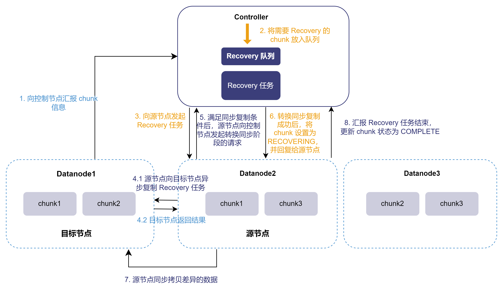

# 在线恢复

在线恢复（Online
Recovery）是一种数据恢复技术，用于在分布式文件系统中修复不一致或损坏的数据副本。与传统的离线恢复方法不同，在线恢复可以在数据节点持续写入数据的过程中进行，而不会中断或影响正常的数据处理操作。DolphinDB
在线恢复采用增量恢复技术，即仅复制副本之间差异的数据，从而减少分区数据恢复的时间。

## 实现机制

DolphinDB 在线恢复基于多副本、事务和版本控制实现，多副本机制为在线恢复提供了数据来源，而事务和 MVCC 版本控制，则保证了数据的正确性和一致性。

在分布式环境下，DolphinDB
会把同一个分区的数据同时写入集群中不同的节点。同一个分区在不同节点上的数据拷贝称为副本（Replica）。用户可以自定义副本数量，建议至少配置两个副本。当数据节点启动时，会向控制节点报告其分区信息。控制节点会对比这些信息与自身记录的分区信息，若发现不一致，在副本数量不低于两个的情况下，控制节点会自动发起在线恢复，从信息一致的节点中选择一个作为源节点，拷贝数据进行修复。

具体而言，DolphinDB 的每个事务都拥有一个唯一的事务 commit id (CID)，且 CID 严格递增。对于每一个 chunk，DolphinDB
可以保存其多个事务的数据快照，通过 MVCC 来进行版本控制并记录版本链。副本数据的不一致通常是缺失了某些事务数据。在线恢复则是根据版本链中记录的
CID，拷贝差异数据，将不一致副本的数据恢复到最新状态。

在线恢复过程分为分异步恢复和同步恢复两个阶段。

### 异步阶段

控制节点发起恢复请求后，首先进行异步恢复阶段。在该阶段，源节点可以得到目的节点不一致副本的最大
CID，并找出本地副本和目标节点副本之间的数据差异，进行增量复制。此时，分区仍可以正常进行读写任务。如果一直有事务写入，CID
不断增加，则在一次拷贝后，仍可能存在不一致的数据，也就无法结束恢复流程。为避免出现这种情况，系统规定在待恢复的数据量小于一定量（由
*dfsSyncRecoveryChunkRowSize* 配置），或者拷贝次数大于 5 次时，开始进行同步恢复。

### 同步阶段

在同步恢复阶段，分区的写入受到阻塞。此时源节点只需要拷贝剩余待恢复的数据到目标节点即可。由于剩余待恢复数据量很小，在短时间内可以完成拷贝，因此对源节点的写入影响也比较小。

## 在线恢复流程

DolphinDB 在线恢复的完整流程如下：

1. 当某个数据节点从故障中恢复重启后，会向控制节点汇报自己的分区信息。
2. 控制节点收到数据节点的汇报后，判断需要进行 Recovery，会将需要 Recovery 的分区放入待 Recovery 队列。
3. Recovery 线程从待 Recovery 队列中取出 Recovery 任务，根据收到的汇报来确定 Recovery
   的源节点（数据拷贝的来源）和目标节点，并向源节点发起 Recovery 任务。
4. 源节点收到任务后，开始一次拷贝，即从自身拷贝数据到目标节点，并接收目标节点返回的拷贝结果（数据拷贝成功或失败）。此过程异步执行，不影响数据库的正常读写。
5. 重复步骤 4，直至两个副本之间的差异小于 1000 行（由 *dfsSyncRecoveryChunkRowSize* 配置），或者拷贝次数大于 5
   次时，源节点向控制节点发起转换为同步阶段的请求。
6. 控制节点收到请求后，将分区状态设置为 RECOVERING，阻塞写入该分区。由于同步节点需要拷贝的数据量比较少，因此耗时很短（少于 1
   秒），对数据库的影响也很小。
7. 源节点收到转同步挥发成功的回复后，继续拷贝差异的数据。直到两个副本完全一致，源节点向控制节点汇报 Recovery 任务结束。
8. 控制节点收到 Recovery 任务结束的报告后，更新分区的状态为 COMPLETE。此时允许数据写入该分区。

在线恢复只复制增量部分数据，能够有效提高恢复性能，且异步恢复过程不影响生产数据的写入。

以包含一个控制节点和三个数据节点的集群为例。该集群副本数为2，Datanode1 从故障中恢复。通过图示展示在线恢复的过程：

## 在线恢复优势

* 大幅缩短恢复时间：只需要复制增量数据，而不是全量复制，大大提高了恢复效率。
* 减少业务中断：异步阶段不会阻塞写入，保证业务连续性；同步阶段虽然会阻塞写入，但耗时很短（不超过 1 秒），可以显著减少业务中断的时间。

## 性能调优与状态监控

用户可以根据需求优化在线恢复性能，通过配置项实现并发恢复，并通过管理函数实时监控和控制恢复过程，确保恢复操作的灵活性和效率。相关配置项和函数如下：

* *dfsRecoveryConcurrency：*设置恢复任务执行的并发度（源节点上可同时执行的最大事务数量）。
* *recoveryWorkers*：同步恢复的工作线程数量（也可通过函数
  `resetRecoveryWorkerNum` 进行动态设置）。
* `getRecoveryTaskStatus` 获取恢复任务的状态。
* `suspendRecovery` 暂停恢复任务。
* `resumeRecovery` 重启恢复任务。
* `cancelRecoveryTask` 取消恢复任务。

