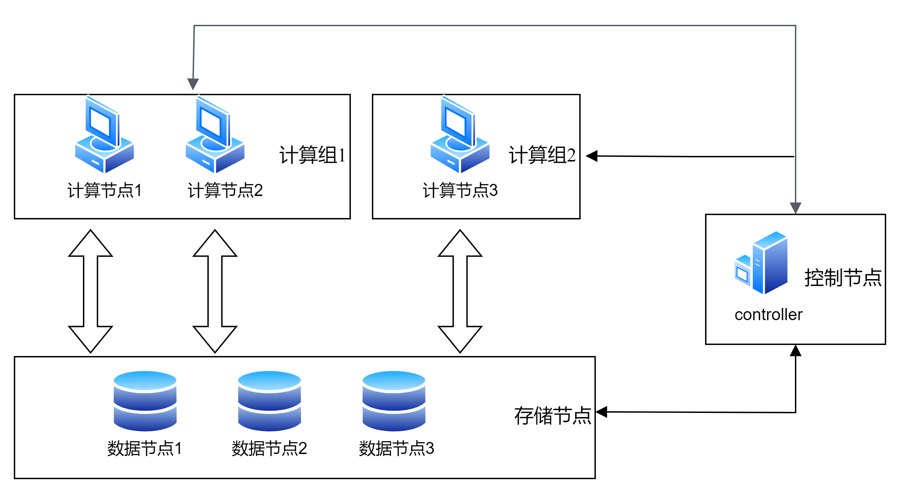
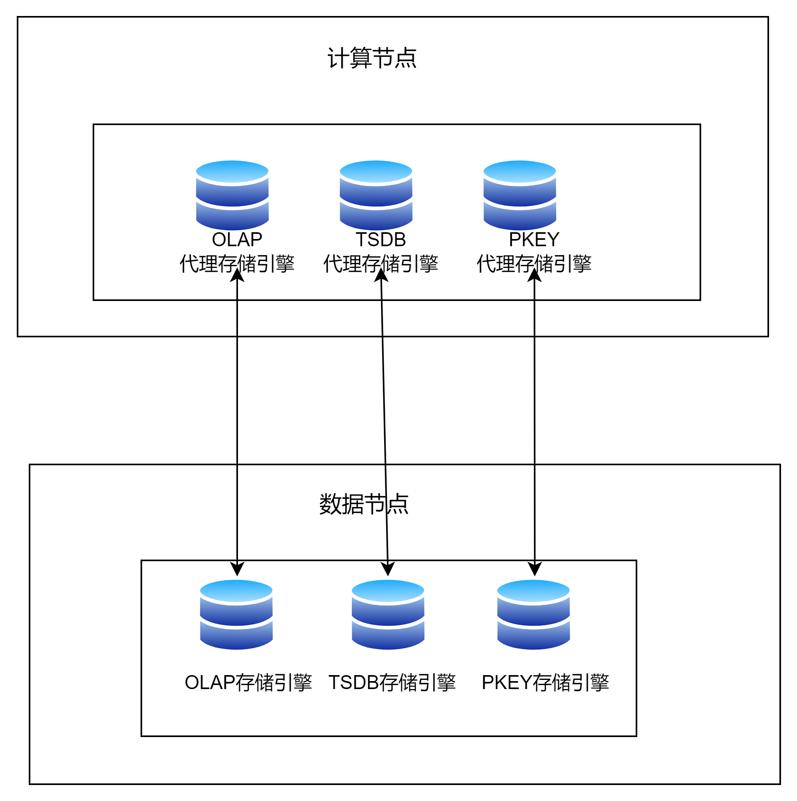
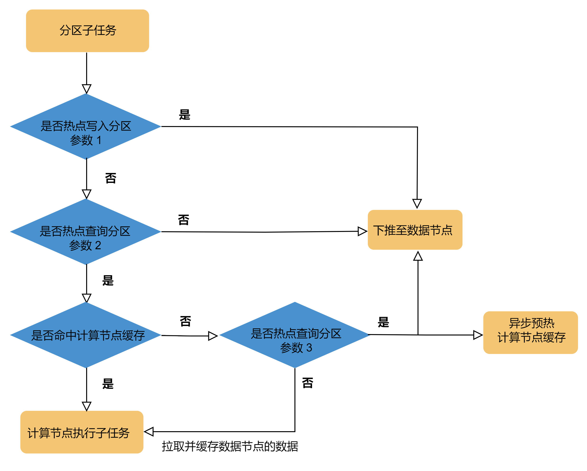

# 存算分离

在 3.00.2 版本之前，DolphinDB 通过引入计算节点实现了存算分离架构的初始架构。计算节点可以分担数据节点的部分计算任务（merge 和 reduce
阶段任务），但由于不缓存数据，每次查询仍需从数据节点拉取数据，带来了额外的网络开销。为进一步完善存算分离架构，自 3.00.2 版本起，DolphinDB
引入了计算组的概念，通过为计算节点设置计算组，对查询的数据进行缓存，从而实现真正意义上的存算分离。

DolphinDB 存算分离具备如下特性：

* **资源隔离：**计算组能够独立运行复杂的计算任务，如 SQL
  聚合、过滤、表连接和流计算，而不会对存储节点造成影响。同时，按计算组分配计算资源，不同计算组之间的计算资源相互隔离。
* **故障隔离：**计算任务异常不会影响存储层，从而缩小故障的影响范围；除此之外，不同计算组之间的故障也不会互相影响。
* **混合查询能力**：对不同类型的查询采用不同的数据调度策略，即将对写入频繁的分区查询调度到存储节点（数据节点）执行，而将对写入不频繁的分区查询调度到计算组。计算组通过缓存这些数据来加速查询。
* **弹性扩缩：**在业务高峰或低谷时期，计算节点可以快速增减，且存储节点对此过程无感知。

## 1 架构设计

### 1.1 存算分离架构

在 DolphinDB
存算分离架构中，集群包含的节点类型与存算一体架构相同。不同之处在于，前者需要配置计算组，并为每个计算组指定相应的计算节点。存算分离结构集群构成图如下所示：

图 1. 图 1 存算分离架构



**计算组**：计算组是 DolphinDB
存算分离架构中新引入的概念，由多个计算节点组成，是资源和故障隔离的基本单位。每个计算组命名唯一，可以负责不同的计算任务。计算组中计算节点的数量和资源由用户配置（*maxMemSize*
和 *workerNum*），这直接影响了计算组的计算能力。计算组中的计算节点具有以下特点：

* 每个计算节点只属于一个计算组。
* 能够处理分布式 SQL 查询，且分布式查询仅在同一个组内的所有计算节点上进行。
* 不负责存储数据，而是在执行 SQL 查询时通过网络访问存储节点获取数据。
* 可以配置一定量的缓存（包括内存和磁盘），用于缓存来自存储节点的数据，以加速查询过程。

**存储节点**：存储节点负责存储数据和本地查询任务。

**控制节点**：控制节点由一个或多个 controller（高可用配置）组成，所有节点共享此控制节点，负责管理系统的整体协调与调度。

### 1.2 代理存储引擎

DolphinDB 支持[多模态存储引擎](multimodal_storage.md)，以适应不同的业务场景。然而，如果在计算节点上实现通用的缓存层，可能无法充分利用不同存储引擎的特性。为此，DolphinDB
提出了代理存储引擎的概念，确保不同存储引擎的数据由对应的代理存储引擎进行管理。目前，DolphinDB 支持对 OLAP、TSDB 和 PKEY
存储引擎的缓存数据进行管理。图 2 展示了代理存储引擎的架构。

图 2. 图 2 代理存储引擎



### 1.3 分布式计算过程

在存算分离架构下，计算组中的计算节点通常负责提交分布式查询任务，任务执行遵循 map → merge → reduce
的流程。由于计算节点具备缓存数据的能力，因此它们可以参与 map
阶段的任务。在执行任务之前，计算节点从控制节点处获取和本次查询相关的所有分区信息，并根据这些信息拆分出子任务。具体任务执行流程如下：

**map
阶段：**将子任务路由到对应的计算节点。若子任务可以命中计算节点缓存，则直接从缓存中查询数据；如果无法命中缓存，则根据配置情况决定是从数据节点拉取数据进行缓存，还是将子任务下推到数据节点执行。

**merge 阶段：**

将上一步 map 阶段各个子任务的执行结果发送至提交任务的计算节点上，由该节点进行数据汇总。

**reduce 阶段（可选）：**

若在 merge 阶段后需要对结果进行进一步处理，则进入 reduce 流程，由提交任务的计算阶段继续处理。

## 2 多级缓存机制

由上文介绍可知，计算节点数据缓存是实现存算分离架构的关键。缓存不仅可以加速数据读取，还能有效降低对存储节点的访问频率，从而减少延迟。

当计算节点开始执行计算任务时，首先会访问控制节点以获取数据存储的位置。如果数据被路由到存储节点，系统将从存储节点拉取数据并缓存在相应的代理存储引擎；如果数据被路由到计算节点，则表示命中缓存，系统会直接从缓存中读取数据。

计算节点采用多级缓存策略。缓存的数据首先存储在计算节点的内存中，内存缓存采用时钟置换算法（ Clock
）进行管理。当内存缓存满时，旧数据将被清理并存储到磁盘中，而磁盘缓存则采用先进先出算法（FIFO）进行管理。存储到磁盘的数据会进行压缩以节省存储空间，当磁盘缓存也满时，最旧的数据将被删除。

不同的代理存储引擎可能具有不同的缓存格式和粒度，例如 OLAP 和 PKEY 引擎在内存和磁盘上的最小缓存粒度均为列；而 TSDB
内存缓存粒度是列的一部分，磁盘缓存粒度是列。然而，多级缓存的总体设计和驱逐算法在不同代理存储引擎之间大致相同。

## 3 查询优化策略

在时序数据场景下，针对热点写入分区，热点查询分区和首次查询分区，可以采用不同的缓存策略，以优化查询性能。为此，DolphinDB
设计了多种配置参数，帮助用户调整缓存管理方案，以确保在存算分离架构下的性能接近存算一体架构。

**热点写入分区缓存策略**

在时序场景中，数据通常以时间作为分区维度，且写入主要集中在最新的少部分分区上。频繁的写入操作使得最新分区的数据不断变化，因此即使有缓存，缓存中的数据也很快变得无效。这种情况会导致大量无效的缓存加载和
I/O 操作。

为了解决这一问题，DolphinDB 引入计算组和数据节点混合查询的能力：

* **不缓存热点写入的分区：**对这些分区的查询将下推到数据节点上执行，这样可以避免不必要的数据传输。
* **缓存非热点写入的分区**：通过缓存来加速对它们的查询。

DolphinDB 还引入了一个配置参数
*computeNodeCachingDelay*单位是秒），控制一个分区最后一次更新后多久能够被缓存到计算节点上：

* 取值为 0 表示允许分区更新后立即被缓存。
* 若取值不为 0，分区更新后经过指定的延迟时间后才允许被缓存；在此延迟时间内，针对该分区的查询将被直接发送给数据节点处理。

**热点查询分区缓存策略**

在扫描型查询中，通常会对分区数据进行一次性查询并进行简单过滤，因此这些分区往往没有热点，导致缓存命中率较低。这种情况不仅使得缓存的价值降低，还会占用计算节点的缓存空间，从而影响其他查询。为了解决这一问题，DolphinDB
利用其架构优势，通过将查询下推至存储节点的能力，实现选择性的存算分离：只有当某个分区被访问频繁时，才会将其缓存到计算组，否则查询将直接在存储节点上执行。

可以通过配置参数 *computeNodeCachingQueryThreshold* 来控制一个分区被访问多少次后才能被缓存到计算节点：

* 取值为 0 则表示首次访问立刻被缓存。
* 取值为 N，则表示一个计算组需要对某个分区执行超过 N 次访问，才会将其缓存到计算节点。推荐 N 的取值范围为1到5。

**计算节点预热缓存**

在几乎所有依赖对象存储的存算分离系统（如 Snowflake, Starrocks,
Redshift）中，一个共通问题是第一次查询有较高的延迟。由于第一次查询时缓存为空，这些系统在计算节点执行查询之前需要首先访问高延迟的 S3
和远端存储来填充缓存。然而，DolphinDB 的存算分离架构基于存算一体实现，允许向存储节点下推任意查询，同时通过配置参数
*enableComputeNodePrefetchData* 开启计算节点的数据预取功能，异步的缓存数据。具体实现为：

下推分区查询到存储节点，同时异步预热计算节点缓存。如果计算组中某个分区的缓存未命中，我们将对该分区的查询下推到存储节点上执行，同时异步地在计算组中执行一份相同的查询，从而缓存分区数据。这种方式规避了因缓存未命中导致的网络传输代价，使用户无感知首次查询时缓存未命中的延迟。同时，在下次访问该分区时，它很可能已经在缓存中了。需要注意的是，这种方法牺牲了一定的隔离性，因为部分查询仍然在存储节点上执行。

相比于 Snowflake, Starrocks, Redshift，DolphinDB
这种查询下推及计算节点数据预取的功能能够大幅降低缓存未命中场景下的延迟，保证存算分离架构下的查询性能接近存算一体架构。

下图展示了在启用上述几种优化后，系统在何时将计算子任务下推到数据节点，何时在计算组内部执行计算。

图 3. 图 3 优化流程



图中注释：

* 参数 1 为 *computeNodeCachingDelay*
* 参数 2 为 *computeNodeCachingQueryThreshold*
* 参数 3 为 *enableComputeNodePrefetchData*

## 4 配置与管理计算组

### 4.1 配置计算组

通过配置文件添加计算组。在集群配置文件（ cluster.nodes ）中，新增一列
computeGroup，用以表示计算组名称。该列只能在计算节点后添加。以下示例配置了两个计算组： orca 和 nova，其中 orca
包含三个计算节点（orca1, orca2, orca3）；nova 包含两个计算节点（ nova1 和 nova2）。

```
localSite,mode,computeGroup
192.168.1.243:23692:node0,datanode,
192.168.1.243:23693:node1,datanode,
192.168.1.243:23694:node2,datanode,
192.168.1.243:23695:node3,datanode,
192.168.1.243:23793:orca1,computenode,orca
192.168.1.243:23794:orca2,computenode,orca
192.168.1.243:23795:orca3,computenode,orca
192.168.1.243:23797:nova1,computenode,nova
192.168.1.243:23796:nova2,computenode,nova
192.168.1.243:23691:agent,agent,
```

注： 若为计算节点配置了计算组，则该节点的别名必须以计算组名为前缀，且不可使用 "." 作为分隔符。

### 4.2 扩缩容计算组

除了上述静态配置外，用户还可以根据需要动态调整计算组的规模，包括增加或减少计算节点。在业务高峰或低谷期，用户可能需要灵活地扩展或缩减计算节点以满足业务需求。通过
addNode 和 removeNode 函数，用户可以方便地增加或删除计算节点。

**增加计算节点**

通过 addNode 函数在线增加一个计算节点，并为其指定计算组。关于 addNode 的详细信息，请参考函数页面，这里仅介绍与计算组相关的参数
*computeGroup*，该参数用于为计算节点指定所属的计算组名称。

注意：使用 addNode 增加节点后，新节点默认为关闭状态，需要通过 Web或命令行启动。

**删除计算节点**

目前不支持通过从计算组中移除计算节点进行缩容。如果需要缩容，只能删除计算节点。可以通过 removeNode 函数在线删除指定的计算节点。

### 4.3 分区缓存信息查询与管理

**计算组分区缓存及路由查询**

在执行分布式查询任务时，查询会根据分区划分为多个子任务，并由控制节点将这些子查询调度到不同的计算节点。用户可以使用
`getComputeGroupChunksStatus` 函数查询路由信息。该函数接受一个参数
*computeGroup*，用于返回指定计算组的缓存和路由信息。如果未提供参数，则默认返回所有计算组的缓存和路由信息。其返回值与
`getClusterChunksStatus` 函数类似，但新增了以下特有的列：

* routedTo：计算节点别名，表示控制节点将对该分区的查询调度到该节点。
* cachedOn：计算节点别名和分区版本号，显示了计算节点所缓存的分区数据的版本号。例如：orca2:[29] 表示 orca2
  的计算节点缓存了分区版本号为 29 的数据。
* computeGroup：分区缓存的计算组名字。请注意，一个分区可以被多个计算组缓存。

**计算节点缓存信息查询与管理**

可以在计算节点上调用 `getComputeNodeCacheStat`
函数查询当前计算节点的缓存总使用量和缓存上限；要获取整个计算组的信息，需要累加组内所有计算节点的使用量和容量。调用
`getComputeNodeCacheDetails`
函数查询当前计算节点中缓存的具体构成信息（对应到表或分区，以及缓存类型）。

在安全关机后，计算节点的内存缓存会自动刷新到磁盘。但在没有安全关机的情况下，仍可以在计算节点上调用以下函数来管理缓存：

* `flushComputeNodeMemCache`：清理当前节点的内存缓存。执行后，内存中的数据将转移到磁盘缓存中。
* `clearComputeNodeDiskCache`：尝试清理当前节点的磁盘缓存。请注意，执行后并不保证所有缓存内容都被清空。
* `clearComputeNodeCache`：尝试清理当前节点的所有缓存，包括内存和磁盘。与
  `clearComputeNodeDiskCache` 类似，执行后不保证所有缓存内容都被清空。

## 5 兼容性说明

3.00.2 及之后的版本，计算节点有两种身份：普通计算节点和计算组中的计算节点。其中，前者产生的分布式查询拆分出的子任务会转发给对应的数据节点（map
阶段），由数据节点完成下推到本地的查询或计算任务，然后由计算节点对各个子任务的结果进行汇总和计算（merge 和 reduce
阶段）。而后者需要加入到一个计算组中，且可以缓存数据，因此能够在计算组中完成分布式查询。用户可以同时选择使用以上两种模式。

需要注意的是，没加入计算组的计算节点不支持数据缓存，因此以下配置项和函数对其无效：*computeNodeCacheDir, computeNodeMemCache,
computeNodeDiskCache, computeNodeClearCache* 和
*computeNodeCacheStats*。

此外，存算分离的引入还导致某些旧版函数行为的变化：

* pnodeRun：当指定了 *nodes* 参数时，函数行为与旧版本一致；当未指定 *nodes* 参数时：

  + 如果在非计算组中的节点上执行该函数，则行为与旧版本一致；
  + 如果在指定了计算组的计算节点上执行该函数，则会到同组的所有计算节点上调用本地函数。
* repartitionDS：当 *local* 设置为 true 时，函数行为与旧版本一致。当 *local* 设置为 false
  时：

  + 如果在非计算组中的节点上执行该函数，则行为与旧版本一致；
  + 如果在计算组中的计算节点上执行该函数，仅将数据源获取到同组内的所有计算节点上。

## 6 权限管理

通过权限管理来控制用户对计算组的访问。例如，研发部门的普通用户只能使用本部门的计算组，而无法访问其他部门的计算组。

用户可以设置权限
COMPUTE\_GROUP\_EXEC，以允许（grant）或拒绝（deny）特定用户或用户组对某个计算组的使用权限。当用户建立新连接时，系统将进行权限校验，以确认用户是否具备连接该计算组的权限。如果没有权限，将抛出异常。此外，如果某个计算组已不存在，相应的访问权限将被撤销（revoke）。

## 7 性能测试

本节对比了 DolphinDB 存算分离架构与存算一体架构的性能。在 3 台服务器上进行测试，配置如下：

* 操作系统：CentOS Linux
* CPU 型号：Intel(R) Xeon(R) Silver 4216 CPU @ 2.10GHz
* 内存：512G(16\*32 DDR4 3200 MT/s)。

本次测试分别在 3 台服务器搭建了 1 个高可用集群，数据采用双副本。每台服务器配置 1 个控制节点，1 个数据节点，2 个计算节点（分为两个计算组）。

创建 OLAP，TSDB，PKEY 分布式表，按日期值分区、SYMBOL hash 分区的组合分区方式 ，写入 2012.01.01 到 2012.03.10
的数据。每个分区 1000000 条随机生成的数据。分别测试了不同存储引擎查询指定日期数据的性能。测试结果如下表所示（单位：毫秒）：

|  | OLAP | TSDB | PKEY |
| --- | --- | --- | --- |
| 数据节点 | 449.023 | 429.9393752 | 479.943 |
| 计算节点（缓存未命中） | 11370.401 | 35215.104 | 9087.79 |
| 计算节点（缓存命中） | 436.844 | 405.1120167 | 462.049 |

可以看到，在未命中缓存的情况下，计算节点的耗时平均是数据节点的 42
倍。这是因为在未命中缓存时，计算节点需要从数据节点获取数据，增加了网络开销；而当命中缓存时，计算节点的查询性能与数据节点相当，甚至更优。这得益于计算节点的缓存机制，其为不同存储引擎的数据都提供了匹配引擎特性的代理存储引擎，从而充分发挥存储引擎在查询数据时的优势。

## 8 配置项与函数参考

本节将列出与存算分离相关的配置项和函数，帮助用户快速了解它们的作用。用户还可以通过点击链接跳转至相应的配置项或函数页面，获取更多详细信息。

**[配置项](../cfg/function_configuration.html#topic_storage_compute_separation)**

* *computeNodeCacheDir*：计算节点的缓存存储位置，一个节点上可配置多个缓存目录。
* *computeNodeCacheMeta*：计算节点缓存元数据的地址。
* *computeNodeMemCacheSize*：计算节点的内存缓存容量上限。
* *computeNodeDiskCacheSize*：计算节点的磁盘缓存容量上限。
* *enableComputeNodeCacheEvictionFromQueryThread*：是否从计算节点的缓存中逐出不再使用的数据。
* *computeNodeCachingDelay*：规定了一个分区在最后一次更新后，需经过设定的时间间隔，才能被缓存到计算节点。
* *computeNodeCachingQueryThreshold*：当一个分区的访问次数超过设定的阈值后，才允许将该分区缓存到计算节点。
* *enableComputeNodePrefetchData*：若设置为
  true，当查询的数据不在计算节点的缓存中时，系统将查询路由到数据节点，并在计算节点上异步执行相同的查询以预热缓存；若设置为
  false，则不会将查询路由到数据节点，计算节点将直接从数据节点拉取数据进行查询

  。

**函数**

* [addNode](../../funcs/a/addNode.md)：在线增加计算组中的计算节点。
* [getComputeGroupChunksStatus](../../funcs/g/getcomputegroupchunksstatus.md)：获取计算组中缓存的所有 chunk 的元数据信息。
* [getComputeNodeCacheStat](../../funcs/g/getcomputenodecachestat.md)：获取计算节点的缓存总使用量和缓存上限。
* [getComputeNodeCacheDetails](../../funcs/g/getComputeNodeCacheDetails.md)：获取计算节点中缓存的具体构成信息。
* [flushComputeNodeMemCache](../../funcs/f/flushcomputenodememcache.md)：将计算节点的内存缓存的内容写入磁盘缓存。
* [clearComputeNodeDiskCache](../../funcs/c/clearcomputenodediskcache.md)：清空计算节点的磁盘缓存。
* [clearComputeNodeCache](../../funcs/c/clearcomputenodecache.md)：清空计算节点的内存缓存和磁盘缓存。
* [setComputeNodeCachingDelay](../../funcs/s/setcomputenodecachingdelay.md)：在线设置当前节点下配置项
  *computeNodeCachingDelay* 的生效值。
* [getComputeNodeCachingDelay](../../funcs/g/getcomputenodecachingdelay.md)：查看当前节点下配置项
  *computeNodeCachingDelay* 的生效值
* [setPrefetchComputeNodeData](../../funcs/s/setprefetchcomputenodedata.md)：在线设置当前节点下配置项
  *enableComputeNodePrefetchData* 的生效值。
* [getPrefetchComputeNodeData](../../funcs/g/getprefetchcomputenodedata.md)：当前节点下配置项
  *enableComputeNodePrefetchData* 的生效值。

