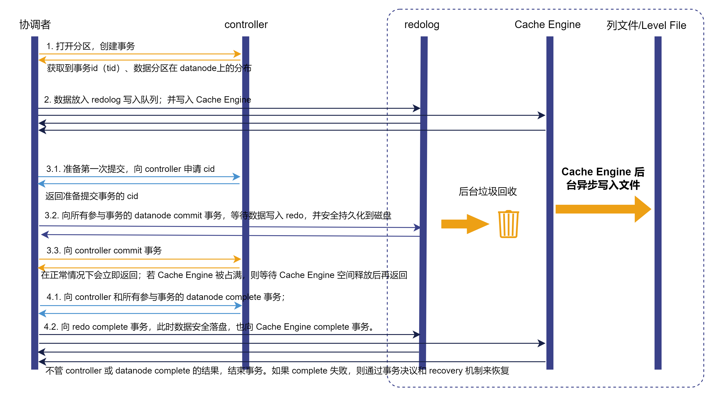

# 分布式事务

事务是指对数据库中的数据对象进行的一系列增、删、改等操作。一次事务的所有操作全部纳入一个不可分割的执行单元，该执行单元里的所有操作要么都成功，要么都失败，只要其中任一操作执行失败，整个事务都将回滚。在分布式系统中，各个节点之间在物理上相互独立，通过网络进行沟通和协调。分布式事务是指分布式系统中的事务，一个分布式事务可能涉及到不同节点和分区的操作。同样，分布式事务要去对参与事务的所有节点的操作，要么全部成功，要么全部回滚，不能出现部分提交的情况。时序数据的某些场景，如物联网中的数据采集，丢失一部分数据并不会带来严重的后果。但作为一个分布式数据库，保证各节点上的数据一致性非常关键。DolphinDB
通过两阶段提交（Two-Phase Commit, 2PC）和多版本并发控制机制（MVCC, Multi-Version Concurrency
Control）实现分布式事务，能够确保每个事务的原子性（Atomicity）、数据的一致性（Consistency）、读写操作之间的隔离性（Isolation）以及已写入数据的持久性（Durability）。

**原子性**

事务是一个原子操作单元，数据写入要么全都执行，要么全都不执行。比如，写入的数据涉及到多个分区，要么全部分区写入成功，要么全部分区写入失败。如果数据有多个副本，要么所有副本写入成功，要么所有副本写入失败。

**一致性**

DolphinDB 的一个事务可以包含对不同分区的写入操作，事务成功或回滚，每个分区的各个副本的状态总是一致的。在集群模式中，DolphinDB
还能确保某一时刻任何节点上查询得到的数据都是一致的。

**隔离性**

DolphinDB 通过多版本并发控制机制（MVCC, Multi-Version Concurrency
Control）实现事务隔离。每进行一次写入或删除操作，数据库的版本号都会增加。如果事务成功（commit），原先的版本会被覆盖，反之则回滚（roll
back）。当用户同时对数据库进行读写操作时，读和写的并发事务会相互隔离。多个事务可以同时对一个分区的不同表进行写入操作。

**持久性**

事务完成后，它对数据的操作是永久性的。

## 分布式事务实现

在传统的单机应用中，所有的操作都在本地进行，事务管理相对简单。而在分布式系统中，实现事务时需要考虑数据分片、网络延迟、节点故障等因素，因此需要设计专门的事务管理机制，如分布式事务协议、事务日志和读写分离等，以确保分布式系统中事务的正确性和高可用性。

一个分布式事务涉及不同节点和分区的操作，所有参与节点要么全部成功执行，要么全部回滚，不能出现部分提交的情况。在 DolphinDB
中对分布式表进行的每一次写入、更新或删除操作被视为一个分布式事务。DolphinDB 通过两阶段提交（Two-Phase Commit,
2PC）、日志记录和多版本并发控制等机制（MVCC, Multi-Version Concurrency
Control），实现分布式事务管理，确保每个事务具备原子性（Atomicity）、数据的一致性（Consistency）、读写操作之间的隔离性（Isolation）以及已写入数据的持久性（Durability）。

### 基本事务流程

DolphinDB 采用两阶段事务提交机制，每次由事务的发起节点作为协调者（coordinator）推进整个事务的执行流程。

1. 协调者提出请求（例如写入数据），创建一个事务，向控制节点申请事务 ID（tid），得到事务所涉及分区在数据节点上的分布情况。
2. 协调者将数据分发到相应的数据节点，各个数据节点将数据写入磁盘。如果存在某个数据节点数据写入失败，则终止该事务。
3. 协调者准备提交，向控制节点申请 commit id（cid）。
4. 协调者向控制节点和所有参与事务的数据节点 commit 事务，开始两阶段提交的第一阶段。如果控制节点或任意数据节点 commit
   失败，则终止并回滚事务。
5. 协调者向控制节点和所有参与事务的数据节点 complete 事务，开始两阶段提交的第两阶段。不管控制节点或数据节点是否 complete
   失败，该事务都结束。如果存在 complete 失败的情况，则通过事务决议和 recovery 机制恢复。

### 开启 Redo Log 与 Cache Engine 的事务流程

Redo Log 是确保事务持久性的关键机制，即使在系统崩溃时，也能保障数据一致性。缺乏 Redo
Log，事务的持久性将会受到影响，因为数据库无法记录事务所做的修改，从而无法在故障或崩溃发生时进行恢复。DolphinDB 利用 Redo Log 和
Cache Engine 来确保事务的持久性并提升写入性能。

DolphinDB 重做日志（Redo Log）与 预写式日志（Write-Ahead
Logging，WAL）的概念相似，其核心理念是：只有在描述事务更改的日志记录已经刷新到持久化存储介质之后，才对数据库的数据文件进行修改。这样做可以避免在每次提交事务时都需要将数据页刷新到磁盘上，同时可以保证数据库发生宕机时，可以通过日志来恢复数据，所有尚未应用的更改都可以通过日志记录回放并重做。

Cache Engine 是 DolphinDB 中的一种数据写入缓存机制。数据在写入 Redo Log 的同时写入 Cache Engine。在 Cache
Engine 中的数据累积到一个阈值或者达到一定时间后，再由 Cache Engine
一次性异步写入数据文件。在一个事务涉及多个分区且数据量较小的情况下，如果每次事务结束都立即写入磁盘，写入效率将会受到影响。而利用 Cache Engine
先将这些事务缓存起来，待累积到一定数量后，以批量的方式一次性写入磁盘，则可以提供较高的压缩比此外，批量顺序写入也有助于提高IO吞吐量，从而有效提升整体系统性能。

一旦数据写入磁盘，事务完成，系统首先回收该事务的 Cache Engine 缓存，再回收 Redo Log 中的事务。DolphinDB 提供三种
Cache Engine 中事务的回收机制：定期回收、待缓存数据量达到阈值、或通过函数手动清理。同时提供两种 Redo
Log的回收机制：定期回收和文件大小达到阈值时回收。

### 事务决议

由上文事务流程可知，DolphinDB
采用两阶段提交（2PC）机制，涉及数据/计算节点与控制节点的协同工作。当任一方出现故障，导致事务无法推进时，需要通过事务决议来确定最终状态。

在 DolphinDB 中，控制节点作为第一阶段提交过程中的最后提交节点，其状态决定了事务的最终状态。因此，无需通过 RPC
从所有参与者收集信息，这简化了决策过程并提高了效率。在两阶段提交过程中，事务参与者检查日志或进行垃圾回收，当发现事务状态是第一阶段完成（COMMITTED）时，主动向控制节点发起决议请求。详细决议流程如下：

1. 处理决议请求：

   控制节点接收到决议请求后，根据事务的 tid、cid 和 chunkId
   信息查询决议结果。首先查看决议结果缓存，如果缓存中可以查到结果，则直接返回结果。否则进行以下 2 步：
2. 事务状态查询：

   * 如果控制节点发起请求，则其事务状态为 COMMITTED，此时直接返回事务状态。
   * 如果数据节点发起请求，则需要依次进行下面两步从控制节点查询事务状态，直至查到事务状态并返回。

     + 从预写入日志（edit log）查询，若查询到结果则返回，否则进入第 3 步。
     + 从分区的版本链查询，若查询到结果则返回，否则返回 ROLLBACK。
3. 处理决议结果：

   根据第 2 步查询到的状态，处理决议结果。可能的事务状态包括 UNCOMMITTED, COMMITTED, COMPLETE 和
   ROLLBACK。

   * UMCOMMITTED：表示控制节点上的事务还未提交完成，暂时不能给出最后的状态，需要推迟决议时间，即将当前决议请求放入队列，等待后续再次决议。
   * COMMITTED：表示控制节点上的事务已提交完成，在控制节点上完成事务，更新事务状态为
     COMPLETE，并将该状态广播给所有参与者。
   * COMPLETE 或 ROLLBACK：直接广播相应结果给所有事务参与者。

DolphinDB
的事务决议结果仅依赖于控制节点上的信息，无需从各个参与者收集信息。这一设计有效避免了因数据节点未恢复而导致的信息收集延迟，从而防止事务决议过程长时间停滞（尤其是在控制节点发起决议时，分区在此期间无法进行写入）。此外，这种方式也减少了因信息收集不足而导致的事务结果错误的风险。

### 事务并发控制

当多个事务不是先后顺序关系时，它们被称为并发事务。在并发情况下，多个事务同时读写同一个分区可能会导致冲突。本节将介绍 DolphinDB
的写写并发控制和读写并发控制机制。

**写写并发控制**

当多个客户端并发写入同一个分区时，会产生写写冲突。DolphinDB 确保同一时间内，一个分区只能被一个事务写入。在发生写写冲突时，DolphinDB 根据数据库
*atomic* 参数设置（“TRANS” 或
“CHUNK”）决定冲突的处理方式。这两种设置的主要区别在于，是否尝试自动解决检测到的冲突。

当 *atomic* 设置为 “TRANS” 时，写入流程如下：

1. 客户端发起写入请求。
2. 数据节点收到写入请求后，计算涉及的分区。
3. 数据节点向控制节点申请事务的 tid。
4. 使用步骤3中的 tid，向控制节点申请涉及分区的分布式锁。如果所有锁申请成功，进入步骤 5；否则，进入步骤 6。
5. 开始向涉及的分区写入数据，事务完成后释放分布式锁，并向客户端返回写入成功。
6. 放弃写入，向客户端返回异常，并返回写入失败的原因。

由以上流程可知，在 TRANS 模式下，当检测到写入冲突时，系统会放弃写入并返回写入失败的原因。因此，用户需要确保不能对同一个分区进行并发写入。

当 *atomic* 设置为 “CHUNK” 时，系统会尝试自动解决冲突，写入流程如下：

1. 客户端发起写入请求。
2. 数据节点收到写入请求后，计算涉及的分区。
3. 数据节点向控制节点申请事务的 tid。
4. 使用步骤 3 中的 tid, 向控制节点申请涉及分区的分布式锁。如果至少有一个分区的锁申请成功，则进入步骤 5；否则，进入步骤 6。
5. 向成功申请锁的分区写入数据，完成事务后释放已写入分区的锁。当所有分区的事务都完成，转入步骤 7 ，否则转步骤 3。
6. 等待一段时间后，回到步骤 3，尝试重新写入。直到多次（最多 250 次）尝试写入都失败，则返回写入失败。
7. 写客户端返回写入成功。

尽管在 CHUNK
模式下，系统能够自动解决写写冲突，但其缺点在于一次写入会被分为多个事务，不能保证事务的原子性。如果发生回滚，可能导致某次写入操作只写入了一部分数据。

**读写并发控制**

DolphinDB 采用两阶段事务机制，结合多版本并发控制机制（MVCC, Multi-Version Concurrency
Control），实现读写快照级别隔离。MVCC
通过保存数据多个事务的数据快照来进行控制，允许同一个数据记录拥有多个不同的版本，记录了一个版本链。每进行一次写入、更新或删除操作，数据的版本号都会增加，从而确保在用户同时对数据库进行读写操作时，读和写的并发事务能够相互隔离。为了有效管理版本，系统会定期回收版本链。

DolphinDB 的分布式事务提供基于 sid（snapshot id）的快照隔离。结合前文介绍的两阶段提交流程，接下来详细说明 DolphinDB
的读写隔离机制：

1. 协调者创建事务，向控制节点申请事务 tid。
2. 当事务第一次 commit 时，控制节点会生成一个全局递增的 cid，并将其记录在参与事务的所有数据节点上。此时，数据节点会生成一个新的
   CHUNK 副本（以”物理表名\_cid”命名），并在该副本上进行数据的操作；为了防止 CHUNK 目录无限增长，数据节点最多保留5个旧版本的
   CHUNK 目录，并根据设置的保留时长进行定期回收。
3. 在完成两阶段提交时，控制节点生成一个全局递增的 sid（snapshot id），并将其记录在版本链上。sid
   的主要作用是协助控制节点获取已完成事务中的最大 cid 并将该 cid 返回给协调节点。如果我们不引入 sid，在查询时直接使用
   cid，存在一个潜在问题，即可能某个事务已经完成，但仍然有另一个小于该事务 cid
   的事务尚未完成。这种情况可能导致在查询时无法查到最新的已完成事务的数据。通过引入全局唯一的 sid，确保了所有已完成的事务都能被查询到。
4. 当协调者向控制节点请求查询最新的元数据信息时，控制节点通过当前版本链上的最大 sid，查询到满足小于等于这个 sid 的最新的
   cid，并返回给数据节点。对应这个 cid 的 CHUNK 版本即为当前可读的最新版本的 CHUNK 数据。
5. 协调者根据获取的 cid 到相应的数据节点上读取此 cid 对应版本的数据。

### 多副本写入事务控制

DolphinDB 支持多副本机制，允许在不同节点上存储分区的多个副本数据。本节将重点介绍多副本写入时的事务控制流程。

1. 当事务开始时，协调者将事务所涉及的分区信息告知控制节点。
2. 控制节点收集写入事务所涉及分区的元数据和存活副本的信息。如果为新增分区，控制节点会创建该分区，并从数据节点中挑选一个或多个节点（由配置项
   *dfsReplicationFactor* 决定）来存储副本数据。
3. 控制节点将分区元数据和存活副本的信息告知协调者。协调者根据副本信息，通过 RPC 向各个副本发起事务操作。
4. 当所有副本的事务 complete
   时，控制节点会更新每个参与事务的副本的版本号。如果在事务过程中某个副本节点出现因宕机等无法继续推进事务，该事务将终止并回滚。

**副本一致性**

数据节点定期向控制节点发送心跳信息。如果某个数据节点因意外宕机等原因变为离线状态，则控制节点将其标为未存活节点。当该节点重启后，它会向控制节点报告其所有分区的信息（包括版本号等）。控制节点将比较其存储的版本号与该节点报告的副本版本号。如果发现副本版本号落后，控制节点会推动自动进行在线恢复，以确保副本之间的数据一致性。关于在线恢复的机制和流程，参考[在线恢复](recovery.html)。

## 事务高可用

事务高可用指在分布式系统或数据库中，确保事务处理在各种故障情况下仍然能够持续进行和完成的能力。DolphinDB 的分布式事务也具备高可用的能力。DolphinDB
通过实现事务高可用性来确保在节点故障的情况下也能持续推进事务。下面将根据参与事务的节点分类，分别介绍 DolphinDB 事务高可用实现。

* 控制节点故障下的事务高可用

  控制节点高可用采用 Raft 算法，能够容忍少于一半的控制节点不可用。当控制节点中出现故障的数量少于一半时，高可用机制可以通过 Raft
  算法将事务状态同步到大多数控制节点。这样即使发生 Leader 切换，新的 Leader 也能获取当前进行中的事务信息。两阶段提交的协调者可以继续与新的
  Leader 进行通信，以推进事务的执行；如果需要做出事务决议，新的 Leader 也能直接给出决议结果。

* 数据节点故障下的事务高可用

  在数据节点故障的情况下，其余数据节点依然可以通过两阶段提交协议确定事务的最终结果，故障节点不会影响事务的决策。故障节点恢复后，只需向当前 Leader
  请求事务决议即可了解事务的最终状态，如果存在数据副本落后，可以通过恢复机制进行同步。

## 支持事务的 SQL 操作

对分布式表的写入、更新和删除操作均支持分布式事务。本节将列出相关的语句和函数。

* DDL：[create](../../progr/sql/create.html) (database/table)，[alter](../../progr/sql/alter.html)，[drop](../../progr/sql/drop.html)。
* DML：[insert into](../../progr/sql/insertInto.html)，[update](../../progr/sql/update.html)，[delete](../../progr/sql/delete.html)。
* 表连接语句：[表连接](../../progr/sql/tb_joiner_intro.html)
* 分布式数据库/表相关操作函数：[addColumn](../../funcs/a/addColumn.html)，[addRangePartitions](../../funcs/a/addRangePartitions.html)，[addValuePartitions](../../funcs/a/addValuePartitions.html)，[createdimensiontable](../../funcs/c/createdimensiontable.html)，[createPartitionedTable](../../funcs/c/createPartitionedTable.html)，[database](../../funcs/d/database.html)，[dropColumns!](../../funcs/d/dropColumns_.html)，[dropDatabase](../../funcs/d/dropDatabase.html)，[dropPartition](../../funcs/d/dropPartition.html)，[dropTable](../../funcs/d/dropTable.html)，[rename!](../../funcs/r/rename_.html)，[renameTable](../../funcs/r/renameTable.html)，[reorderColumns!](../../funcs/r/reorderColumns_.html)，[replaceColumn!](../../funcs/r/replaceColumn_.html)，[tableInsert](../../funcs/t/tableInsert.html) ，[tableUpsert](../../funcs/t/tableUpsert.html)，[truncate](../../funcs/t/truncate.html)，[upsert!](../../funcs/u/upsert_.html)
* 备份恢复函数：[backup](../../funcs/b/backup.html), [backupDB](../../funcs/b/backupDB.html), [backupTable](../../funcs/b/backupTable.html), [restore](../../funcs/r/restore.html), [restoreDB](../../funcs/r/restoreDB.html), [restoreTable](../../funcs/r/restoreTable.html)

