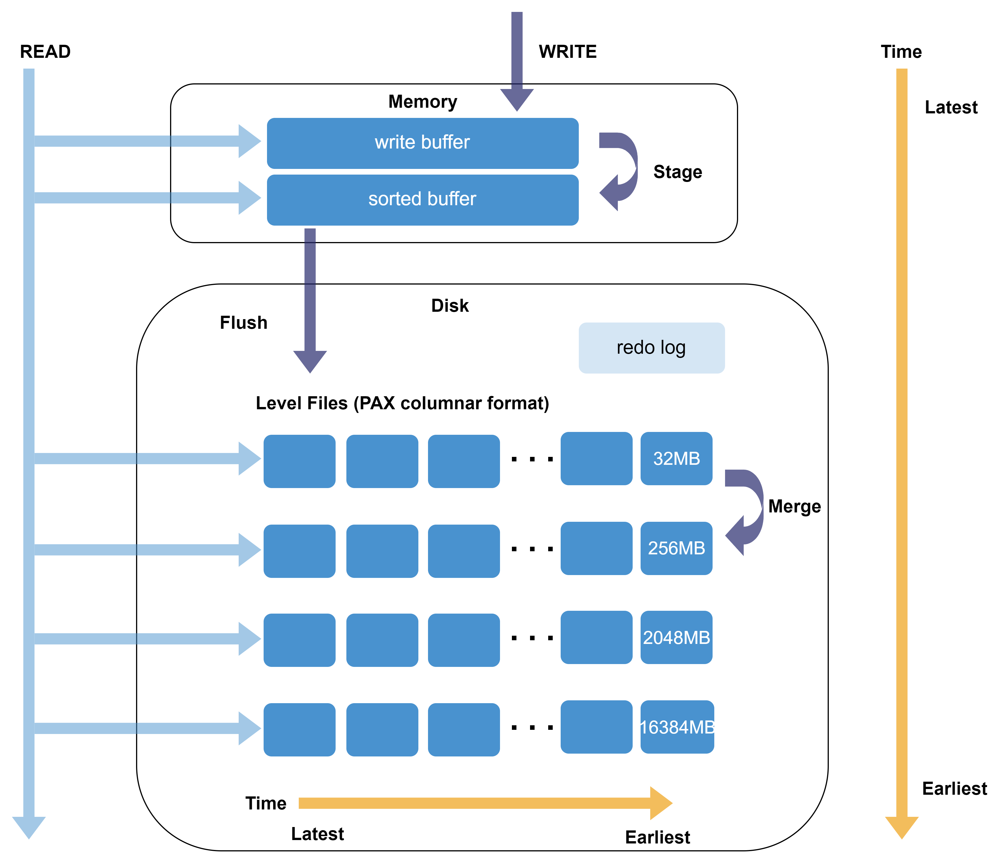
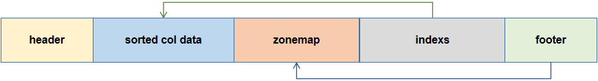
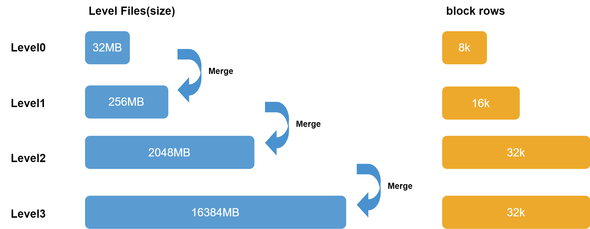
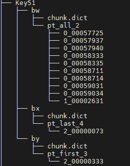
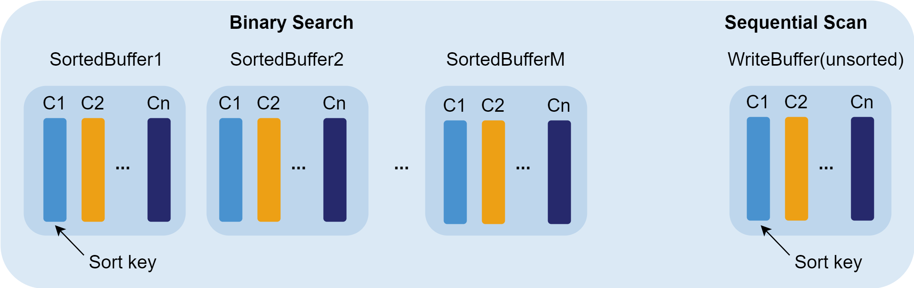
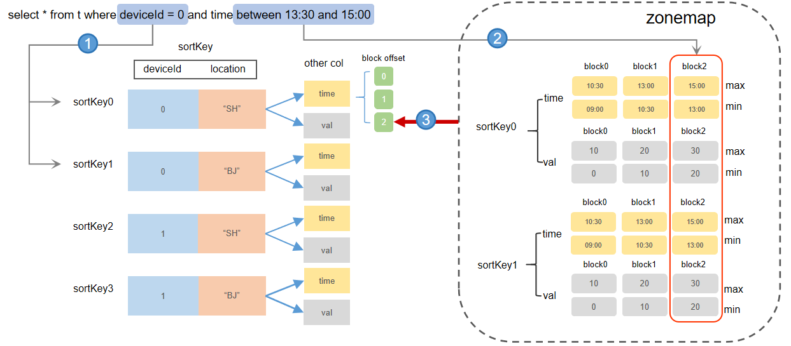

# TSDB 存储引擎

随着传感器数据、金融市场数据和网络日志等时序数据的迅速增长，通用数据库在高效存储和分析方面面临挑战。针对时序数据的特点，专用的时序数据库（TSDB）能够针对数据特点进行优化，显著提升数据处理效率和查询性能。DolphinDB
在 2.0 版本中推出的 TSDB 引擎，旨在更好地支持时序数据的分析与存储，满足用户对时序数据处理的需求。

TSDB 引擎设计采用经典的 LSM-Tree（Log Structured Merge
Tree）模型并引入辅助索引的排序列，进一步优化了性能。

## LSM-Tree

LSM-Tree
是一种将数据存储在高效的数据结构中的技术，它将数据按照时间顺序组织并存储，以便于快速访问和查询。这种数据结构可以有效地处理大量的时间序列数据，并提供高性能的读写操作。TSDB
基于 LSM-Tree 设计，并进行了以下优化：

* **写入：**与 LSM-Tree 直接写入一个有序的数据结构不同，DolphinDB TSDB
  引擎在写入数据到内存时，会先按写入顺序存储在一个写缓冲区域（unsorted write Buffer），当数据量累积到一定程度，再进行排序转化为一个
  sorted buffer。
* **查询：**DolphinDB TSDB 引擎会预先遍历 Level File （对应 LSM-Tree 的 SSTable
  文件），读取查询涉及的分区下所有 Level File
  尾部的索引信息到内存的索引区域（一次性读，常驻内存）。后续查询时，系统会先查询内存中的索引，若命中，则可以快速定位到对应 Level File
  的数据块，无需再遍历磁盘上的文件。



## 排序列

排序列是 TSDB 引擎特有的结构，它在 TSDB 引擎的存储和读取流程中发挥着重要作用。在深入讨论 TSDB 引擎之前，我们首先了解一下排序列的概念。在创建表时通过参数
sortColumns 来定义排序列，其中 sortColumns 的最后一列必须是时间类型，而除了最后一列之外的其他列被称为 sortKey，每个 sortKey
值对应的数据按列存储在一起。sortKey
字段的组合值作为索引键（sortKeyEntery），为数据查询提供了入口，能够迅速定位数据块的位置，从而降低查询时间。在写入过程中，每个事务中的数据会根据
sortColumns 进行排序和去重。

sortColumns 参数在 TSDB 引擎中起到三个作用：确定索引键值、数据排序、数据去重。

**确定索引键值**

TSDB 的索引机制可以提升查询性能。写入数据时，在 Cache Engine 中，数据会根据 sortColumns 指定的列进行排序，TSDB
引擎的索引列就是基于排序列建立的。sortColumns 由两部分组成： sortKey（可以是多列，其组合值作为数据的索引键）, timestamp（时间列）。若
sortColumns 只有一列，则该列将作为 sortKey。

假设 sortColumns 指定了 n 个字段，则系统取前 n-1 个字段的组合值，作为索引键 sortKey，每个 sortKey
值对应的数据按列存储在一起（如下图，假设 sortColumns 为 deviceId 和 timestamp）。


每个 sortKey 内部的数据仍然是按列存储的，其中每个列的数据又按记录数划分为多个 block（按固定行数划分，参见 Level File 层级示意图）。block
是内部最小的查询单元，也是数据压缩的单元，其内部数据按照时间列的顺序排序。

sortKey 需要合理设置，每个分区的 sortKey 值不宜过多。因为同等数据量下，sortKey 值越多，意味着每个 sortKey
对应的数据量越少，不仅会增加命中索引的开销，而且会增大读取每个 sortKey 元数据的开销，进而降低查询效率。

查询时，若查询条件包含 sortColumns 指定的字段，系统会先定位到对应的 sortKey 的数据所在的位置，然后根据 block 内部数据的有序性以及列之间
block 的对齐性，通过时间列快速定位到对应的 block，将相关列的 block 读取到内存中。

注：

1. block 数据的有序性：block 内部数据是按照时间列排好序的，此外每个 sortKey 的元数据都记录了对应每个 block
   的第一条数据，因此根据和每个 block 的第一条数据比较，可以快速过滤掉一些不必要的 block 的查询，从而提升查询性能。
2. block 的对齐性：由于 block 的数据量都是固定的，因此根据时间列快速定位到时间列所在的 block，就能根据该 block 的
   offset 快速定位到其他列的 block。

**数据排序**

在 TSDB Cache Engine 中，每批刷盘的数据会根据 sortColumns 进行排序，然后再写入磁盘，可以推断：

* 每个写入事务的数据一定是有序的。
* 单个 Level File 文件内的数据一定是有序的。
* Level File 之间数据的顺序无法保证。
* 每个分区的数据的有序性无法保证。

sortColumns 的数据排序功能，不保证数据整体的有序性，而只是保证 Level File 内数据按 sortKey 有序排列，以及每个 sortKey 中
block 内数据的有序性，这有助于：

* 查询条件包含 sortKey 字段的范围查询或第一个 sortKey 字段的等值查询时，加速内存查找索引的效率。
* 命中 sortKey 索引时，可以根据 sortKey 的元数据信息，加速 block 的定位。

**数据去重**

TSDB 的去重机制主要用于同一个时间点产生多条数据，需要去重的场景。

去重是基于 sortColumns 进行的，发生在写入时数据排序阶段以及 Level File 的合并阶段。其对应的配置参数为
keepDuplicates（在建表时设置），有三个可选项：ALL（保留所有数据，即不去重，为默认值），
LAST（仅保留最新数据），FIRST（仅保留第一条数据）。

不同去重机制可能会对更新操作产生影响（具体参见 2.2.3 数据更新流程）：若
keepDuplicates=ALL/FIRST，那么每次更新，都需要将分区数据读取到内存更新后再写回磁盘；若
keepDuplicates=LAST，则更新数据将以追加的方式写入，真正的更新操作将会在 Level File 合并阶段进行。

注：

1. 去重策略不能保证磁盘上存储数据不存在冗余，只能保证查询时不会返回冗余结果。查询数据时，会将对应 sortKey 所在各个 Level File
   中的数据块读出，然后在内存中进行去重，再返回查询结果。
2. DolphinDB 不支持约束。现实场景下，很多用户会利用 sortColumns 的去重机制，将数据中的主键或唯一约束设置为
   sortColumns，造成一个 sortKey 键值对应的数据量很少，从而导致 TSDB 数据库数据膨胀。

## 存储结构

在 TSDB 中会存储业务数据和日志文件。其中：

* 业务数据分为两个部分：基线数据和增量数据。基线数据是已经被写入和存储在 LSM-Tree 中的主要数据，它们是持久的、可读取的数据，被称作 Level
  File。增量数据是新写入的还在 Cache Engine
  中的数据，它们在一段时间后会被合并到基线数据中。这两种数据都采用列式存储，即同一列的数据连续存储在一起，不同列的数据则分开存储。数据首先按分区分组后写入
  Cache Engine，Cache Engine 中的数据未被压缩，当缓存的数据量达到刷盘条件时，存储到 Level File
  文件中，在转储的过程中对数据进行压缩，因此 Level File 存储的是压缩后的数据。
* 日志文件包括预写日志（redo log）和元数据（meta）则存储在磁盘上。

### cache engine

写入 TSDB 引擎的数据首先被写入 redo log 和 cache engine，其中写入 cache engine
的数据被追加到写缓冲区的一个可变内存表（MemTable）中。MemTable 中的数据是未排序的，当它的数据量累积到一定大小（由
*TSDBCacheTableBufferThreshold* 配置阈值）时，数据会按照 *sortColumns*
指定的列进行排序，并转化不可变内存表（Immutable MemTable）中。

### 日志文件

redo log 是一种用于记录数据库事务的日志文件，记录了对数据库所做的所有更改。它主要用于保证事务的原子性和持久性。写入 TSDB 引擎的数据首先会写入
redo log 中。每个事务的数据会被存储为一个独立的 redo log。

元数据是关于数据的数据，包含了数据库的结构、表的定义、索引、约束等信息。元数据本身不直接记录事务，但它通常也会被存储在 meta.log
中，以确保在恢复过程中可以重建数据库的结构。

### Level File 文件

**Level File 结构**

TSDB 引擎存储的数据文件在 DolphinDB 中被称为 Level File，即 LSMTree 架构中各层级的文件。Level File
内部采用了行列混存（Partition Attributes Across，简称 PAX），即数据先按照 sortKey 的属性切分数据，每个 sortKey
对应的数据仍然按列存储，其中每列的数据按照固定行数划分为多个 block，并在 Level File 的尾部记录这些 block 的地址及其对应的
sortKey 信息。block 是最小的查询单元，也是数据压缩的单元，其内部数据按照时间列的顺序排序。Level File 文件的结构如下：



其中：

* header：记录了一些保留字段、表结构以及事务相关的信息。
* sorted col data：按 sortKey 顺序排列，每个 sortKey 依次存储了每列的 block 数据块。
* zonemap：存储了数据的预聚合信息（每列每个 sortKey 对应数据的 min，max，sum，notnullcount）。
* indexes：sorted col data 的索引信息，记录了sortKey 个数，每个 sortKey 的记录数、每列 block
  数据块在文件中的偏移量信息，checksum 等。
* footer：存储 zonemap 的起始位置，用来定位预聚合和索引区域。

Level File 的 zonemap 和 indexes 部分在查询时会加载到内存中，用于索引。

**Level File 层级组织**

Level File 各层级间的组织形式如下：



磁盘的 Level File 共分为 4 个层级， 即 Level 0, 1, 2, 3层。层级越高，Level File 文件大小越大，每个 Level
File 中数据划分的 block 大小也越大。自 3.00.1 版本起，TSDB 提供配置项
*allowTSDBLevel3Compaction* 允许用户开启 Level 3 层文件合并功能。同时，函数
`triggerTSDBCompaction`，支持触发 Level 3
层文件的合并。需要注意的是，仅当建表时设置 *keepDuplicates* 为 FIRST 和 LAST 时，才支持 Level 3
层文件合并。



**Level File 合并及数据去重**

多次写入后，相同的 sortKey 的数据可能分散在不同的 Level File 里。为减少无效文件数量，TSDB
引擎设计了文件合并的机制，通过合并操作（compaction）可以提高磁盘空间利用率（压缩率提升）以及提升查询性能。

* **合并机制**

  当较低层级的 Level File 的数量超过10个或该层所有 Level File 的大小超过更高一层单个
  Level File 文件的大小时，系统会将这些 Level File 合并为更高一层的 Level File。每层 Level
  File 单个文件的大小参考上文的 Level File 分层组织。

  默认情况下，TSDB Level File
  文件满足合并要求时，由系统自动触发合并，对用户透明。在某些特殊情况，可能出现文件过多，却没有合并，DolphinDB
  也提供了函数实现手动触发合并。
* **数据去重**

  TSDB 根据 sortColumns
  进行去重，建表时通过参数指定去重模式。包含三种去重模式：保留所有数据，仅保留最新数据，仅保留第一条数据。去重发生在写入时数据排序阶段以及
  Level File
  合并阶段。不同去重机制会对更新操作产生影响：若采用保留所有数据或仅保留第一条数据，则每次更新时都需要将分区数据读取到内存更新后再写回磁盘；若采用仅保留最新数据，则更新数据将以追加的方式写入，真正的更新操作将会在
  Level File 合并阶段进行。请注意：

  + TSDB 去重策略无法确保磁盘上无冗余，只保证查询时无冗余结果。查询时，读取各 Level File 中 sortKey
    对应的数据块，在内存中去重后返回结果。
  + DolphinDB 不支持约束。不建议将数据中的主键或唯一约束设置为 sortColumns。

## 数据压缩

对数据进行压缩，可以在通讯场景下传输更多的数据，显著地提升数据传输吞吐量。TSDB 引擎中的数据首先按分区分组后写入 Cache Engine，Cache Engine
中的数据未被压缩，当缓存的数据量达到刷盘条件时，存储到 Level File 文件中，在转储的过程中对数据进行压缩，因此 Level File
存储的是压缩后的数据。

TSDB 支持无损压缩，其按照 block 的方式去组装构建索引和压缩数据，在数据从 Cache Engine 写入磁盘时进行压缩。可选压缩算法：

* 默认采用 LZ4 压缩算法，适用于一般情况。LZ4主要针对重复字符进行压缩，压缩率与数据重复频率相关。如果同一列中有较多重复项，LZ4
  算法可以获得较高的压缩速度。但相对于 Delta（delta-of-delta encoding） 压缩算法，压缩率提升可能不太明显。
* zstd 压缩算法：zstd 适用于几乎所有数据类型，其压缩比高于 LZ4，但解压缩速度较 LZ4 慢约1倍。
* 对于时间类型或者变化较小的整型数据，建议采用 Delta（delta-of-delta encoding） 压缩算法。Delta
  是专门针对时间戳等连续且等间隔的数据提出的算法，能够极大降低时间戳的存储空间，因此特别适合时间列的压缩。
* chimp 压缩算法：在处理小数部分长度不超过三位的 DOUBLE 类型数据时，chimp 具有很高的压缩率及优越的压缩和解压效率。
* 对于重复较高的字符串，可采用 SYMBOL 类型存储。系统对 SYMBOL 类型数据会使用字典编码，将字符串转化为整型，减少字符串的存储空间。

在现实场景下，金融数据存盘的压缩率一般可达到 20% 到 30% 左右。

## 数据写入

TSDB 引擎写入整体上和 OLAP 一致，都是通过两阶段协议进行提交。写入时，先写 Redo Log（每个写事务都会产生一个 Redo Log），并写入 Cache
Engine 缓存，最后 由后台线程异步批量写入磁盘。需要注意的是，TSDB 引擎和 OLAP 引擎各自单独维护 Redo 以及 Cache
Engine，用户需要通过不同的配置项去设置两个引擎的 Cache Engine 大小，分别为 OLAPCacheEngineSize 和
TSDBCacheEngineSize。

**写入流程如下：**

1. **写 Redo：**先将数据写入 TSDB Redo Log。
2. **写 Cache Engine：**写 Redo Log 的同时，将数据写入 TSDB Cache Engine 的 CacheTable，并在
   CacheTable 内部完成数据的排序过程。
   

   CacheTable 分为两个部分：首先是 write buffer，数据刚写入时会追加到 write buffer 的尾部，该 buffer
   的数据是未排序的。当 write buffer 超过 *TSDBCacheTableBufferThreshold* 的配置值（默认
   16384 行），则按照 sortColumns 指定的列排序，转成一个 sorted buffer (该内存是 read only 的)，同时清空
   write buffer。
3. **写磁盘：**若某写事务到来时，Cache Engine 中的数据累计超过了
   *TSDBCacheEngineSize*的一半，或经过一定时间，系统将进行一次刷盘操作。
   * 刷盘前，系统会将 CacheTable 的所有数据按照 sortColumns 进行归并排序，再按分区写入磁盘 Level 0 层的 Level
     File 文件中（大小为 32M）。
   * 刷盘时，若单个分区的数据量很大，按 32 M 拆分可能产生多个 Level File 文件（见下注1）；若单个分区写入数据量不足 32
     M或拆分后最后一部分数据不足 32 M，也会写为一个 Level File。由于 Level File
     一旦写入就是不可变的，下次写入不会向磁盘的 Level File 文件追加数据 。

     注：
     1. 同属于一个 sortKey 值的数据不会被拆分到不同的 Level File 文件。因此实际场景我们会发现一个
        Level File 的文件可能会大于 32 M，若一个 sortKey
        值对应的数据量特别巨大，甚至可能达到更高！
     2. 可以通过设置刷盘的工作线程数配置项 *TSDBCacheFlushWorkNum* 来提高刷盘效率。
     3. 根据步骤 2，3，可以发现刷盘前数据先局部排序（sorted
        buffer），再整体排序，共执行了两次排序操作。实际就是通过分治的思想，提升了排序的效率。

## 数据查询

相较于 OLAP 引擎，TSDB 引擎增加了索引的机制，因此更适用于点查场景，因此在配置 TSDB 引擎的 sortKey
字段时，可以优先考虑从频繁查询的字段中进行选取（如需了解更多 sortColumns 的设置原则，参考：[合理设置排序字段](tsdb.html#topic_ukd_wx5_tcc__sortColumns)）。

**查询流程如下：**

1. **分区剪枝：**根据查询语句进行分区剪枝，缩窄查询范围。
2. **加载索引：**遍历涉及到的分区下的所有 Level
   File，将其尾部的索引信息加载到内存中（索引信息采用惰性缓存策略，即不会在节点启动时被立即加载进内存，而是在第一次查询命中该分区时才被加载进内存）。查询命中的分区的索引信息一旦被加载到内存后，会一直缓存在内存中（除非因内存不够被置换），后续查询若涉及该分区则不会重复此步骤，而是直接从内存中读取索引信息。

   注： 内存中存放索引的区域大小由配置项
   *TSDBLevelFileIndexCacheSize* 决定，用户可以通过函数 [getLevelFileIndexCacheStats](../../funcs/g/getLevelFileIndexCacheStats.html)
   在线查询内存中的索引占用。若加载的索引大小超过了该值，内部会通过一些缓存淘汰算法进行置换，用户可配置
   *TSDBLevelFileIndexCacheInvalidPercent* 来调整缓存淘汰算法的阈值。
3. **查找内存中的数据：**先搜索 TSDB Cache Engine中的数据。若数据在 write buffer 中，则采用顺序扫描的方式查找；若在
   sorted buffer 种，则利用其有序性，采用二分查找。
4. **查找磁盘上的数据：**根据索引查找磁盘 Level File 中各查询字段的数据块，解压到内存。若查询的过滤条件包含 sortKey
   字段，即可根据索引加速查询。
5. **返回查询结果：**合并上述两步的结果并返回。

其中，索引流程为：


内存索引包含两个部分：sortKey 维护的 block 的偏移量信息（对应 Level File indexes 部分），zonemap 信息（对应 Level
File zonemap 部分）。

1. **查询 indexes 定位 sortKey：**indexes 中记录了每个 Level File 中每个 sortKey 值下每个字段的
   block 的地址偏移量。若查询条件包含 sortKey 字段，则可以根据索引剪枝，缩窄查询范围。命中 sortKey 索引后，即可获取到对应
   sortKey 下所有 block 的地址偏移量信息。

   例如，上图 sortColumns=`deviceId`location`time，查询条件 deviceId = 0，则可以快速定位到所有 Level
   File 中 deviceId= 0 的 sortKey 及其对应所有字段的 block 数据。
2. **根据 zonemap 定位 block：**由 1 定位到 sortKey 后，系统会查询对应 sortKey 在 zonemap
   里的最值信息（min，max）。如果查询条件提供了 sortKey 以外的字段范围，则可以进一步过滤掉一些不在查询范围内的 block 数据。

   例如，上图 sortColumns="deviceId""location""time"，查询条件 time between 13:30 and
   15:00， 则可以根据 time 列的 zonemap 信息，快速定位到查询数据所在的 block 为 “block2”。系统根据该信息再去
   indexes 找到 block2 的地址偏移量信息，然后根据索引到的所有 Level File 的 block2 的地址，把 block
   数据从磁盘中读取出来，再根据去重策略过滤结果后返回给用户端。

## 数据更新

TSDB 引擎的更新效率取决于 keepDuplicates 参数配置的去重机制。

* keepDuplicates=ALL/FIRST 时的更新流程：
  1. **分区剪枝：**根据查询语句进行分区剪枝，缩窄查询范围。
  2. **查到内存更新：**取出对应分区所有数据到内存后，更新数据。
  3. **写回更新后的分区数据到新目录：**将更新后的数据重新写入数据库，系统会使用一个新的版本目录（默认是
     “物理表名\_cid”）来保存更新后的分区数据，旧版本的分区数据文件将被定时回收（默认 30 min）。keepDuplicates=LAST 时的更新流程：
  1. **分区剪枝：**根据查询语句进行分区剪枝，缩窄查询范围。
  2. **查到内存更新：**根据查询条件，查询出需要更新的数据。（查询步骤见 [TSDB
     数据查询](#%E6%95%B0%E6%8D%AE%E6%9F%A5%E8%AF%A2)）
  3. **直接以写数据的方式追加写入：**更新后，直接追加写入数据库。

更新后的数据和旧的数据可能同时存储在磁盘上，但查询时，由于会按照 LAST 机制进行去重，因此可以保证不会查询出旧的数据。旧数据会在 Level File
合并操作时进行删除。

针对不同的数据更新需求，DolphinDB 提供 3 种更新表的方法：

* [update](../../progr/sql/update.html)：标准 SQL 的update语法
* [sqlUpdate](../../funcs/s/sqlUpdate.html)：动态生成 SQL update
  语句的元代码。
* [upsert!](../../funcs/u/upsert_.html)：用于更新键值内存表、索引内存表或分布式表。进行更新时，若新数据的主键值已存在，则更新该主键值的数据；否则添加数据。

注：

1. 更新操作（*keepDuplicates*=LAST）按照直接追加的方式增量修改，更新效率更高，若业务场景需要高频更新，可以配置此策略。
2. 更新操作（*keepDuplicates*=ALL /
   FIRST）按分区全量修改，因此需要确保每次更新操作涉及分区总大小不会超过系统的可用内存大小，否正会造成内存溢出。

## 数据删除

TSDB 引擎的删除流程和 keepDuplicates=ALL/FIRST 时的更新流程基本一致，即按分区取数，删除后写入一个新版本的目录。

**具体流程：**

1. **分区剪枝：**根据查询语句进行分区剪枝，缩窄查询范围。
2. **查到内存删除：**取出对应分区所有数据到内存后，根据条件删除数据。
3. **写回删除后的分区数据到新目录：**将删除后的数据重新写入数据库，系统会使用一个新的 CHUNK 目录（默认是
   “物理表名\_cid”）来保存写入的数据，旧的文件将被定时回收（默认 30 min）。

当采用保留最新数据（*keepDuplicates*=LAST）的机制时，可通过参数设置数据删除的方式：

* 建表时设置参数
  *softDelete*=true，则数据删除采用软删除方式，即将待删除的数据读取到内存中，打上删除标记后，以追加的方式写入一个新的
  Level File 文件，不会删除旧数据，也不会产生新的版本目录。待删除的数据会在 Level File 文件进行合并时才会删除。
* 建表时设置参数 *softDelete*=false，则数据删除流程同保留所有数据或仅保留第一条数据时的流程相同。

软删除方式因不需要读取整个分区数据，且不会产生新版本目录，可以显著提升删除性能，因此在需要频繁删除数据的场景下，建议开启软删除。

针对不同的数据删除需求，DolphinDB 提供以下方法删除数据：

* dropPartition：删除整个分区的数据，不保留分区结构。
* delete：删除分区的数据，保留分区结构。
* sqlDelete：动态生成 SQL delete 语句。
* dropTable：删除整个表的数据，不保留表结构。
* truncate：删除整个表的数据，保留表结构。

## TSDB引擎特点

* 过滤条件使用分区列以及分区内排序字段的点查询非常高效。
* 可以在写入时对数据进行排序和去重。
* 适合存储几百几千列的宽表，也适合存储 array
  vector 和 BLOB 类型的数据。
* 若指定去重时保留最后一条记录（设置 keepDuplicates=LAST），则修改数据时重写数据所在 Level
  File 即可，不需要重写整个分区。
* 写入吞吐量低。TSDB 引擎中，数据需在 Cache Engine 中进行排序；Level File
  会进行合并与压缩。
* 可以在写入时对数据进行排序和去重。
* 读取整个分区数据或整个分区的某几列数据时，效率低于 OLAP。

## TSDB 引擎使用示例

### 创建数据库

下述脚本以创建一个组合分区的数据库为例，和 OLAP 引擎创库时的区别仅在于 engine 设置不同：

方式一：通过 SQL 语句创建数据库。

```
create database "dfs://test_tsdb"
partitioned by VALUE(2020.01.01..2021.01.01),HASH([SYMBOL, 100]), engine='TSDB'
```

方式二：通过 `database` 函数创建数据库。

```
dbName="dfs://test_tsdb"
db1 = database(, VALUE, 2020.01.01..2021.01.01)
db2 = database(, HASH, [SYMBOL, 100])
db = database(directory=dbName, partitionType=COMPO, partitionScheme=[db1, db2], engine="TSDB")
```

### 创建数据表

创建分布式表/维度表时，与 OLAP 引擎不同， TSDB 需要额外设置 sortColumns 这个必选参数，以及 keepDuplicates,
sortKeyMappingFunction 这两个可选参数。

方式一：通过 SQL 语句创建分布式分区表。

```
// 通过标准 SQL 创建
create table dbPath.tableName (
     schema[columnDescription]
)
[partitioned by partitionColumns],
[sortColumns], [keepDuplicates=ALL],
[sortKeyMappingFunction]
```

方式二：通过 `createPartitionedTable` 函数创建分布式分区表。

```
// 通过函数创建
createPartitionedTable(dbHandle, table, tableName, [partitionColumns], [compressMethods],
          [sortColumns], [keepDuplicates=ALL], [sortKeyMappingFunction])
```

特别地，自 3.00.1 版本起，DolphinDB
支持用户通过自定义规则设计数据分区的方案，即在创建分区表的时候将分区列设置为一个函数调用，写入的数据将按函数调用的结果进行分区。参见下例创建一个自定义分区规则的分区表。

例如分区列 id\_date 的数据形如 ax1ve\_20240101\_e37f6,
91f86\_20240102\_b781d，我们期望根据其中的日期（例如 20240101）进行分区，可以通过以下方式建表：

```
//首先定义处理分区列数据的函数
def myPartitionFunc(str) {
	return temporalParse(substr(str, 6, 8),"yyyyMMdd")
}
```

通过 SQL 语句建表。

```
create database "dfs://partitionFunc"
partitioned by VALUE(2024.02.01..2024.02.02)

create table "dfs://partitionFunc"."pt"(
    id_date STRING,
    ts TIMESTAMP,
    value DOUBLE
)
partitioned by myPartitionFunc(id_date)
```

通过 `createPartitionedTable` 函数建表。

```
db = database("dfs://partitionFunc", VALUE, 2024.02.01..2024.02.02)

tb=table(100:0,["id_date", "ts", "value"],[STRING,TIMESTAMP, DOUBLE])

db.createPartitionedTable(table=tb, tableName=`pt,
partitionColumns=["myPartitionFunc(id_date)"])
```

上述示例简单展示了如何在 TSDB
引擎下创建数据库表。在实际使用中，需要根据业务特点，合理设置数据库和表的参数。以下是关于建库和建表的一些关键参数设置建议。

### 建库参数说明

* **是否允许并发写入同一分区（*atomic）***：

  + 默认为 ‘TRANS'，即不允许并发写入同一个分区；
  + 设置为 ‘CHUNK'，则允许多线程并发写入同一分区。注意：需谨慎设置为 'CHUNK'
    模式，因为该模式不能保证事务的原子性。
* **分区设计（*partitionType* 和 *partitionScheme*）：**

  + **TSDB 引擎单个分区推荐大小**：400MB - 1GB（压缩前）

    分布式查询按照分区加载数据进行并行计算（包括查询、删除、修改等操作），若分区粒度过大，可能会造成内存不足、查询并行度降低以及更新删除效率降低等问题；若分区粒度过小，可能会产生大量子任务，增加节点负荷，同时大量小文件的独立写入会增加系统负荷，并可能导致控制节点的的元数据膨胀。
  + **分区设计步骤：**

    1. 以推荐大小作为参照，先根据表中的记录数和每个字段的大小估算数据量，再根据分区方案计算的分区数（如天+股票HASH10
       的组合分区，可以按天数 \* 10），通过数据量/分区数计算得到每个分区的大小。
    2. 若分区粒度不合理，调整分区粒度可以参考以下方案：

       - 粒度过小：若采用了值分区可以考虑改成范围分区，例如按天改成按月；若采用了 HASH
         分区，可以考虑改小 HASH 分区数。
       - 粒度过大：若采用了范围分区可以考虑改成值分区，例如按年改成按月；若采用了 HASH
         分区，可以考虑改大 HASH 分区数；若是一级分区，可以考虑用组合分区，此时新增一级通常是 HASH
         分区，例按天单分区，粒度过大，考虑二级按股票代码 HASH 分区。

合理设置分区至关重要，如需了解详细的分区机制和如何设计合理的分区，可参见数据库分区。

### 建表参数说明

**建表参数说明**

* **根据字段选择恰当的压缩算法（*compressMethods***）：

  + 对重复较高的字符串，使用 SYMBOL 类型存储。需要注意单个分区下 SYMBOL 字段的唯一值数不能超过
    221(2097152) 个，否则会抛异常，见 [S00003](../../error_codes/S00003.html)。
  + 对时序数据或顺序数据（整型）可以使用 delta （即 delta-of-delta
    encoding）算法存储。压缩性能测试参考[物联网应用范例](../../tutorials/iot_examples.html)。
  + 其余类型的数据采用 lz4 压缩算法**。**
* **合理设置排序字段（*sortColumns*）：**

  + *sortColumns* 指定的列数不超过 4 个，同时确保一个分区的 sortKey 的组合数小于
    2000。

    通常金融场景下会以 SecurityID+时间戳的组合、物联网场景下会以 deviceID+时间戳的组合来作为
    sortColumns。

    在 [Level File 文件](tsdb.html) 中提及，Level File
    的每个 sortKey 都对应存储了许多索引信息，因此在数据量固定的情况下，如果 sortKey
    的数量过多，元数据也会变多。极端场景下，数据库可能会膨胀 50 倍！因此不推荐把主键或唯一约束设置为
    *sortColumns*。
  + 建议把查询频率高的字段作为 *sortColumns*中的前置列。

    索引键值是 sortKey 的组合值，查询时，如果过滤条件中包含 sortKey
    字段，即可以快速定位索引，从而快速定位到数据块 block 加速查询。

    由于索引键在内存中是按照其组合值排序的，因此如果将频繁查询的字段前置，查询语句中包含这些字段时，系统可以通过二分查找快速定位索引；否则系统将需要遍历内存中的索引。
  + 如果 *sortColumns* 只有一列，该列将作为 sortKey，此时块内数据是无序的。因此需要遍历每个
    block 的所有数据；如果 *sortColumns*
    有多列，则最后一列必须是时间列。除最后一列外的作为索引列 sortKey ，block
    内部按时间排序。如果查询条件中指定了时间列，则无需遍历对每个 sortKey 下的 block。
  + 类型限制：*sortColumns* 只支持 INTEGER, TEMPORAL, STRING 或
    SYMBOL 类型；sortKey 不能为 TIME, TIMESTAMP, NANOTIME,
    NANOTIMESTAMP 类型。
* **索引降维（*sortKeyMappingFunction*）：**

  如果依靠合理配置 *sortColumns* 仍然不能降低每个分区的 sortKey 数量，则可以通过
  *sortKeyMappingFunction* 参数对索引列进行降维。

  例如：5000 只股票，按照日期分区，设置股票代码和时间戳为 *sortColumns*，每个分区 sortKey 组合数约为
  5000，不满足每个分区 sortKey 组合数不超过 1000 的原则，则可以通过指定
  *sortKeyMappingFunction*=[hashBucket{, 500}] 进行降维，使每个分区的
  sortKey 组合数降为 500。

  + 降维是对每个 sortKey 的字段进行的，因此有几个 sortKey 字段就需要指定几个降维函数。
  + 常用的降维函数是 hashBucket，即进行哈希映射。
  + 降维后可以通过 [getTSDBSortKeyEntry](../../funcs/g/getTSDBSortKeyEntry.html) 查询每个分区的 sortKey 信息。
* **数据去重（*keepDuplicates*）：**

  + 对同一个时间点产生多条数据，可以根据业务需求进行去重设置，此时可以设置
    *keepDuplicates*=FIRST/LAST。
  + 若对去重策略没有要求，则可以根据以下需求进行评估，以设置去重策略：

    - 高频更新：建议指定 *keepDuplicates*=LAST，因为 LAST
      采用追加更新的方式效率更高，见[数据更新](#%E6%95%B0%E6%8D%AE%E6%9B%B4%E6%96%B0)。
    - 高性能查询：较推荐使用
      *keepDuplicates*=ALL，因为其他去重策略在查询时存在额外的去重开销。
    - *atomic*=”CHUNK”：推荐使用
      *keepDuplicates*=FIRST/LAST。此时，若并发写入失败，则直接重复写入，无需删除数据再写。

## 性能调优

分区、索引等因素会显著影响引擎的写入和查询性能，因此在创建数据库和数据表时，需要先了解相关参数配置。本节主要介绍如何通过参数设置，提升 TSDB
的写入或查询性能。

* TSDBRedoLogDir：为了提高写入效率，建议将 TSDB redo log 配置在 SSD 盘。
* TSDBCacheEngineSize：默认是 1G，写入压力较大的场景可以适当调大该值。

  + 若设置过小，可能导致 cache engine 频繁刷盘，影响系统性能；
  + 若设置过大，由于 cache engine 内缓存的数据量很大，但由于未达到 cache engine 的大小的
    50%（且未达到十分钟），因此数据尚未刷盘，此时若发生了机器断电或关机，重启后就需要回放大量事务，导致系统启动过慢。
* TSDBLevelFileIndexCacheSize：默认是 5% \* maxMemSize，该配置项确定了索引数据（Level File
  indexes 和 zonemap）的上限，若配置过小，会造成索引频繁置换。在索引部分，较占内存空间的是 zonemap 部分，用户可以根据 “分区数量
  × sortKey 数量 × （4 × 各字段字节数的和）” 估算 zonemap 所占内存大小。其中， 4 表示 4 种预聚合指标
  min，max，sum，notnullcount）。
* TSDBAsyncSortingWorkerNum：非负整数，默认值为1，用于指定 TSDB cache engine 异步排序的工作线程数。在 CPU
  资源充足的情况下，可以适当增大该值，以提高写入性能。
* TSDBCacheFlushWorkNum：TSDB cache engine 刷盘的工作线程数，默认值是 volumes
  指定的磁盘卷数。若配置值小于磁盘卷数，则仍取默认值。通常无需修改此配置。

