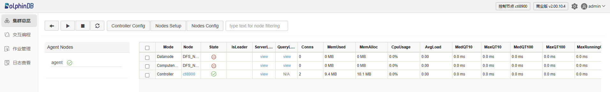
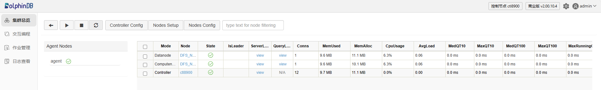

# 如何开始

## 配置集群

在启动一个集群前，先根据需求完成集群配置。

注： 以下例子中的节点数量、IP地址、端口号均用于示例，请根据实际部署情况相应调整设置。

以下是和集群相关的配置文件及配置项：

* *controller.cfg*（控制节点配置文件）：把控制节点的端口设置为 8900，并且打开性能监控。

  ```
  mode=controller
  logFile=ctl.log
  localSite=localhost:8900:ctl8900
  perfMonitoring=1
  ```
* *agent.cfg*（代理节点配置文件）：把代理节点的端口号设置为 8988，并且指定代理节点的控制节点（端口号为 8900）。

  ```
  mode=agent
  localSite=localhost:8988:agent
  controllerSite=localhost:8900:ctl8900
  ```
* *cluster.nodes*（集群成员信息配置文件）：指定集群的代理（端口号为 8988）、 1 个数据节点（端口号为 8811）和 1
  个计算节点（端口号为 8812）。

  ```
  localSite,mode
  localhost:8988:agent,agent
  localhost:8811:DFS_NODE1,datanode
  localhost:8812:DFS_NODE2,computenode
  ```

## 登录

* 单节点（single node）模式下，启动 DolphinDB 服务器后，只要在浏览器输入网址（默认为
  `http://localhost:8848`）即可访问。
* 在集群（cluster）模式下只要在浏览器输入控制节点（controller）的网址加端口号即可访问。

若无法访问 Web 客户端，需要查看以下几个方面：

* 确保 DolphinDB server 的 license 没有过期
* 确保该节点的端口没有被防火墙屏蔽
* 确保 web 目录在 server 目录下面

在 Linux 环境下，如果端口没有开放，可以尝试如下命令：

1. 检查系统中哪些网络接口属于哪个防火墙区域。

   ```
   firewall-cmd --get-active-zones
   ```

   返回：

   ```
   public
   interfaces: eth1
   ```
2. 将 TCP 端口 8848 添加到防火墙的 `public`
   区域，并设置为永久生效。

   ```
   sudo firewall-cmd --zone=public --permanent --add-port=8848/tcp
   ```

   返回：

   `success`。

   说明端口
   8848 已打开，能够进行网络通信。

DolphinDB Web 客户端不会强制用户登录服务器，但是有些功能例如浏览/创建数据库，浏览/创建分区表在登录后才能使用。

如果出于安全策略考虑，需要用户执行任何代码前都先完成登录，可以通过以下设置实现：

* 单节点模式下，在 *server/dolphindb.cfg* 中添加
  `webLoginRequired=true`；
* 集群模式下，在 *controller.cfg* 和 *cluster.cfg* 中添加
  `webLoginRequired=true`。

用户成功登录后，屏幕上方会显示当前登录用户名。如果 10 分钟内无命令执行，会自动退出登录。

## 启动集群

### Linux

* **方法一**

  进入 */DolphinDB/server*
  目录，第一次启动时需要修改文件权限，执行以下 Shell
  指令：

  ```
  chmod +x dolphindb
  ```

  进入
  */DolphinDB/server/clusterDemo* 目录，执行以下 Shell
  指令启动控制节点：

  ```
  sh startController.sh
  ```

  执行以下
  Shell
  指令启动代理节点：

  ```
  sh startAgent.sh
  ```

  可以执行以下
  Shell
  指令，查看节点是否成功启动：

  ```
  ps aux|grep dolphindb
  ```
* **方法二**

  在 Linux
  启动前端交互模式下，打开命令行窗口，执行以下脚本来启动控制器节点：

  ```
  ./dolphindb -mode controller -home data -config config/controller.cfg -clusterConfig config/cluster.cfg -logFile log/controller.log -nodesFile config/cluster.nodes
  ```

  打开另一个命令行窗口，执行以下脚本来启动代理节点：

  ```
  ./dolphindb -mode agent -home data -config config/agent.cfg -logFile log/agent.log
  ```
* **方法三**

  在 Linux
  启动后台模式下，打开命令行窗口，执行以下脚本来启动控制器节点：

  ```
  nohup ./dolphindb -console 0 -mode controller -home data -config config/controller.cfg -clusterConfig config/cluster.cfg -logFile log/controller.log -nodesFile config/cluster.nodes &
  ```

  打开另一个命令行窗口，执行以下脚本来启动代理节点：

  ```
  nohup ./dolphindb -console 0 -mode agent -home data -config config/agent.cfg -logFile log/agent.log &
  ```

### Windows

* **方法一**

  前台启动控制节点和代理节点：进入
  *C:\DolphinDB\server\clusterDemo* 目录，双击
  *startController.bat* 启动控制节点，双击 *startAgent.bat*
  启动代理节点。
* **方法二**

  后台启动控制节点和代理节点：进入
  *C:\DolphinDB\server\clusterDemo* 目录，双击
  *backgroundStartController.vbs* 启动控制节点，双击
  *backgroundStartAgent.vbs* 启动代理节点。
* **方法三**

  打开命令行窗口，执行以下脚本来启动控制器节点：

  ```
  dolphindb.exe -mode controller -home data -script config/dolphindb.dos -config config/controller.cfg -logFile log/controller.log -nodesFile config/nodes.cfg -clusterConfig config/cluster.cfg
  ```

  打开另一个命令行窗口，执行以下脚本来启动代理节点：

  ```
  dolphindb.exe -mode agent -home data -script config/dolphindb.dos -config config/agent.cfg -logFile log/agent.log
  ```

## 启动节点

可以在 Web 管理界面启动或关闭数据节点和计算节点，以及修改集群的配置。在浏览器地址栏中输入控制器节点的 <Host
IP>:<Port> 来启动集群管理器。根据上文配置文件 *controller.cfg*，控制节点的端口号为
8900，打开后的 Web 管理界面如下。



以管理员身份（默认账号：admin ，默认密码：123456）登录 Web 管理界面后，点击 Mode
列左边的复选框全选或选择部分数据节点和计算节点，然后点击 ▶ 启动选中的节点。再点击 🔄，我们可以发现，选中的节点已经启动。



选中节点前的复选框，点击 ⏹ 可以关闭相应的节点。

注： 集群模式下，启动节点过程中，如果按刷新键没有看到节点状态更新状态。 需要注意以下几个方面：

* 有时浏览器缓存较多，需要手动刷新网页 (**Shift** + **F5** 键)。
* 如果长时间状态没有更新，则需要在“日志查看”中查看系统日志，发现具体未启动原因，如：
  + License 过期
  + 节点端口被其它进程占用
  + 节点数量大于 License 指定的最大节点数
  + 正在恢复元数据
  + 其它原因

