# 交互编程

交互编程界面包含以下几个部分：编辑器、变量浏览器、日志浏览器、数据浏览器、数据库浏览器。进行数据库相关操作时，需要先登录。点击数据库浏览器页面的“去登录”按钮，进入登录页面，输入用户名和密码进行登录。也可以在代码编辑框中通过函数
`login` 登录。

在代码编辑框中通过函数 `logout` 登出，或者点击页面右上角的用户注销按钮进行注销。需要注意的是，函数
`logout` 仅清除当前连接的登录状态，刷新页面后会自动重新登录；而注销按钮则可以完全退出登录。

下文将介绍交互编程中各个界面的具体功能。

## 编辑器

在编辑器中，可通过左上角的 ▶ 按钮执行代码、或通过快捷键 "Ctrl"+"E" 执行代码。选中部分（或全部）代码，点击 ▶ 按钮，或按下 "Ctrl"+"E"
按键，便可执行它们。可通过光标定位到某行，按下 "Ctrl"+"E" 按键仅执行这一行代码。若不选中代码，点击 ▶ 按钮便可执行编辑器中的全部代码。

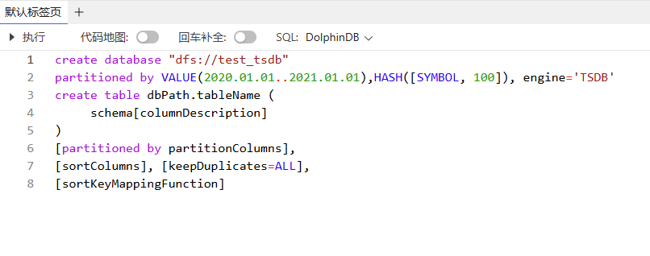

编辑器默认只显示一个标签栏，可根据需要，通过右侧的 **+** 增加代码编辑标签页。

注：

不能在此使用 `print` 打印字节数超过 65536 的字符串，如下例：

```
a = array(STRING,10).append!(string(concat(take(`abcd中文123,100005))));
print a
```

执行以上脚本后，会导致 Web 断连。需要刷新网页才会重新建立连接。

## 变量浏览器

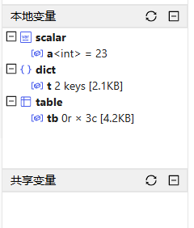

Web 端的变量浏览器显示各个数据形式下变量的名称、数据类型、维度和占用空间。

Web 端的变量浏览器与 GUI 中的变量浏览器十分相似。它们唯一的区别是，在 Web 端不能右键单击变量来取消定义、查看表字段类型等。

通过点击变量浏览器的向量/矩阵/内存表，可在数据浏览器查看其数据。分布式表的数据请通过数据库浏览器查看。

## 数据浏览器

Web 端的数据浏览器显示了编辑器窗口中执行的脚本结果，其与 DolphinDB GUI 中的数据浏览器非常相似。它们的区别如下：

* 在 GUI 中，我们可以右键点击数据浏览器，在弹出菜单中执行复制，排序，输出等操作；在 Web
  端中只能通过光标选中文本复制，不支持排序输出，但支持通过左下角的箭头图标实现小窗查看。

  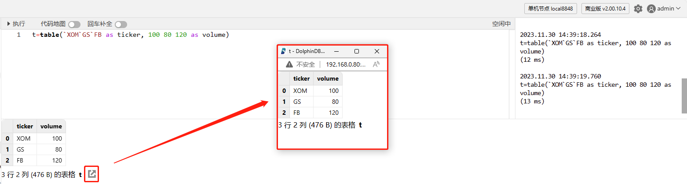
* 在 Web 端中，我们可以通过右上角用户图表左侧的设置按钮，设置显示的小数位数。

  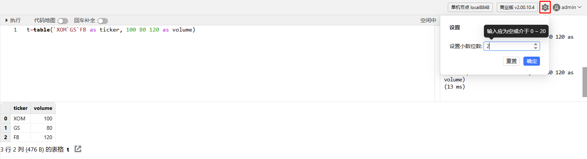

### 例子：查询

在编辑器中输入并执行以下脚本：

```
sym = `C`MS`BAC`BK`WFC
price= 75.67 53.24 29.48 54.42 60.92
qty = 2200 1900 2100 3200 1800
t = table(sym, qty, price)
select *, price*qty as volume from t
```

执行结果将会显示在数据浏览器中：

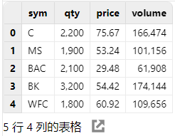

## 日志浏览器

日志浏览器显示每个执行的完成时间、耗时、标量形式的执行结果以及执行过程中的错误信息。

执行结果为标量的数据显示在日志浏览器中。结果为其他形式的数据则显示在数据浏览器中。

例如，我们在编辑器中运行 2 + 3，结果将显示在日志浏览器中。在编辑器中运行 2 + [1, 2, 3]，结果将显示在数据浏览器中。见下图：

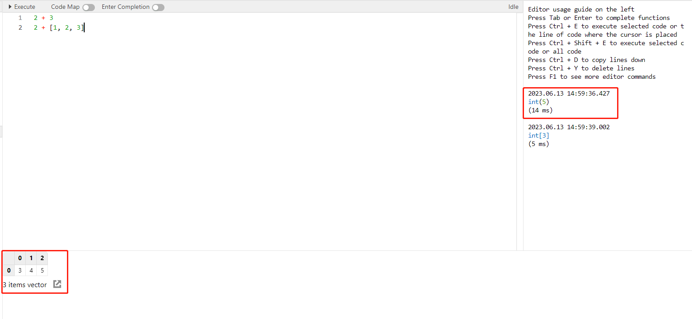

注：

* 暂不支持清理日志浏览器中的信息。
* 日志浏览器最多可输出 100,000 行日志。

## 数据库浏览器

数据库浏览器如下图所示，其提供以下功能：

* 创建数据库和数据表；
* 在数据表中添加列并给数据列添加注释；
* 分层展示已创建的数据库及其所属表的信息。

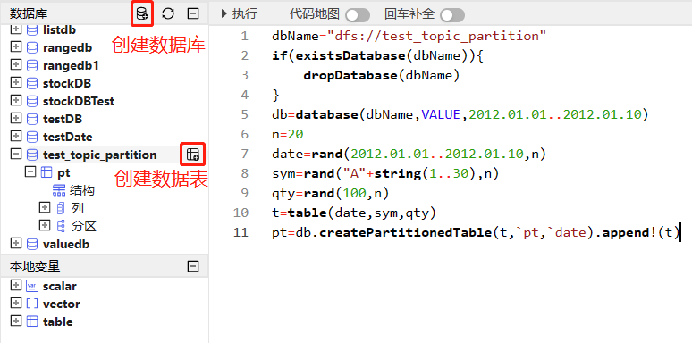

用户可以通过页面和脚本两种方式创建数据库和数据表：

* 通过页面创建数据库

  点击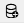图标，打开创建数据库的界面，如下图：

  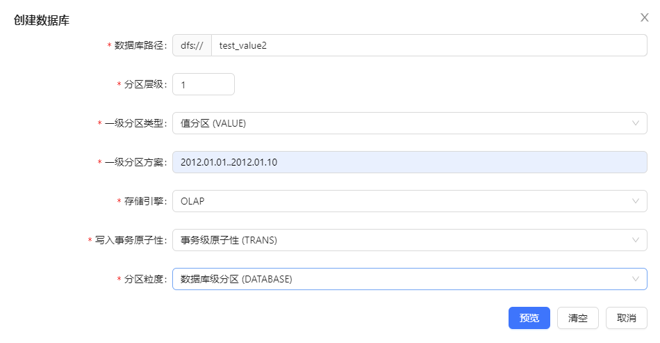

  点击“取消”，取消建库操作；点击“清空”，清空上图中所填写内容；点击“预览”，进入脚本预览窗口，可以看到具体的建库语句，如下图：

  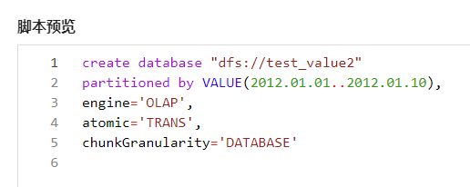
  点击“取消”，取消建库操作；点击“上一步”，返回上一步的建库页面；点击“执行”，创建数据库。成功创建的数据库将显示在左侧的数据库浏览器中。若建库语句不正确，点击执行后会显示报错信息。
* 通过页面创建数据表

  将鼠标悬浮在刚刚创建的数据库名称上，在右侧会显示出创建数据表的图标，见下图：

  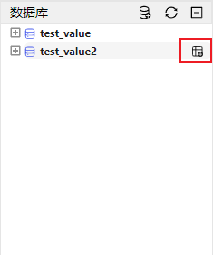

  点击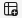图标，打开创建数据表的页面：

  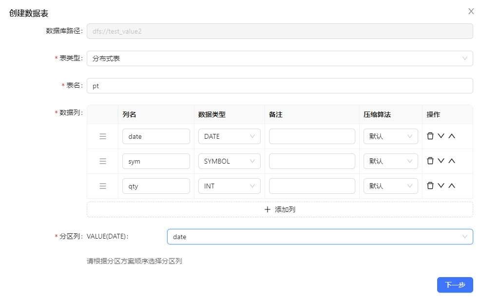

  点击“下一步”，进入创建数据表的脚本预览窗口：

  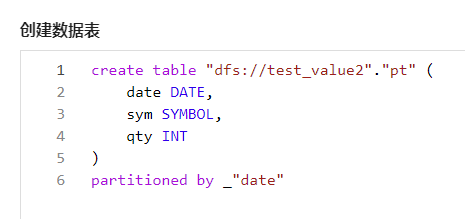

  在此页面，点击右上角的图标，可复制所有脚本；点击“上一步”，返回建表页面；点击“执行”，创建数据表。若成功创建数据表，则出现下图创建成功的提示：

  

  若创建失败，则出现下图，并提示失败原因：

  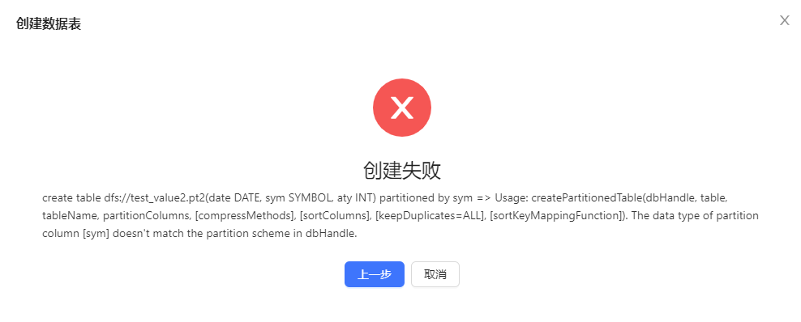
* 通过脚本创建数据库表

  用户也可直接在编辑器中输入代码来创建数据库表。创建成功后，需要点击数据库浏览器左上角的 🔄
  按钮，以便在数据库浏览器窗口中查看刚刚创建的数据库、表。

  例子：在编辑器中输入并执行以下代码，创建分布式表 pt。

  ```
  dbName="dfs://test_topic_partition"
  if(existsDatabase(dbName)){
      dropDatabase(dbName)
  }
  db=database(dbName,VALUE,2012.01.01..2012.01.10)
  n=20
  date=rand(2012.01.01..2012.01.10, n)
  sym=rand("A"+string(1..30), n)
  qty=rand(100, n)
  t=table(date, sym, qty)
  pt=db.createPartitionedTable(t, `pt, `date).append!(t)
  ```

  如下图所示，在数据库浏览器中，分层展示了各数据库及其所属表。点击变量前的 ➕，可以展示数据表的结构、所包含的列，每列的名称及类型、分区。点击变量前的
  ➖，折叠展示的内容。

  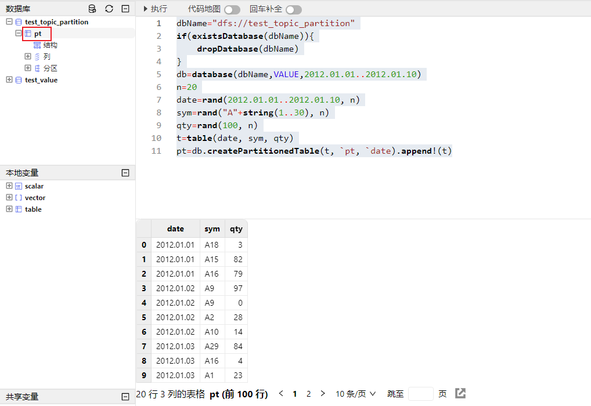

  点击数据表变量 pt，在数据浏览器中会展示该表数据。

  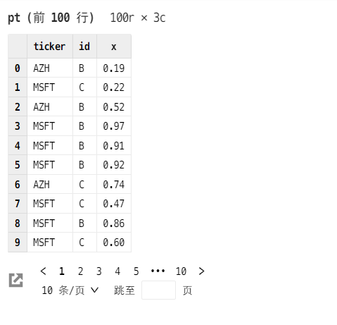

  鼠标悬浮在“列”前，可显示添加列变量的图标，点击该图标进行添加列的操作。

  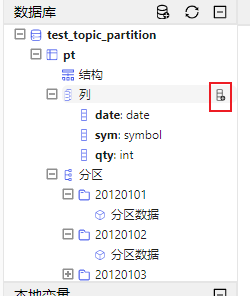

  鼠标悬浮在列变量前，可显示添加列注释的图标，点击该图标对该列添加注释。

  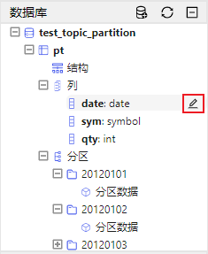

  点击 pt 的结构，会在数据浏览界面中展示它的表结构。点击下图的分区数据，会在数据浏览界面展示该分区所包含的数据。

  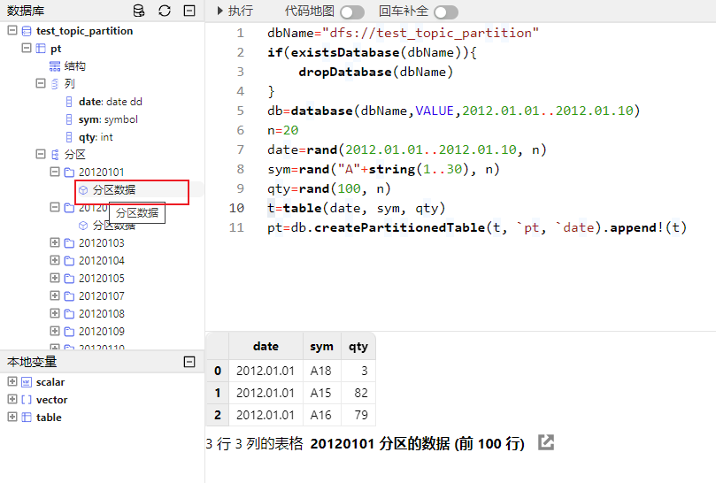

