# 权限管理

在 Web 集群管理界面中，初始管理员（以下简称管理员）可以在控制节点、数据节点和单机节点（亦称为单节点）上完成对用户、用户组的创建、删除、修改及权限设置。

图 1. 权限管理界面

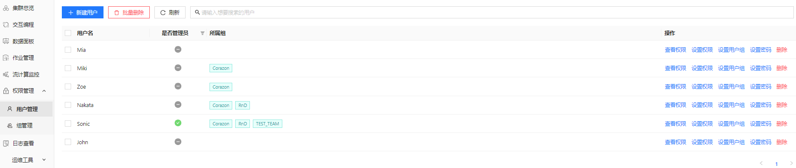

除了常规的用户和组的创建外，管理员还可以为具体的用户和组设置以下应用范围的权限：

* 分布式数据表
* 共享内存表
* 流数据表
* 函数视图
* 全局权限

图 2. 权限设置范围

有关用户和用户组的权限管理方法，见以下各节。

注： 执行以下权限操作之前，请务必确保已经登录管理员账号。DolphinDB 的初始管理员账号名称为 admin，初始密码为
123456。

## 用户管理

管理员可以为用户设置用户类型（普通用户或管理员）、所属组以及前述的不同应用范围的访问权限。操作方法如下。

### 新建用户

如需创建一个用户：

1. 点击权限管理>用户管理。
2. 点击新建用户。

   图 3. 新建用户对话框

   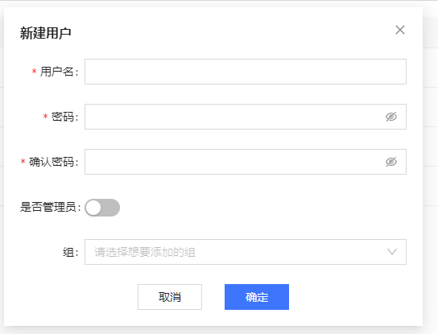
3. 分别设置用户名、密码、用户类型（是否管理员）和所属组。其中，密码长度必须由 6 到 20 个英文字母、符号或数字构成，且不含空格和中文字符。
4. 确认无误后点击确定。
5. 确定后，会调用函数 [createUser](../../../funcs/c/createUser.dita) 进行用户创建。创建成功后，在界面上提示"用户创建成功"。

图 4. 用户添加完成

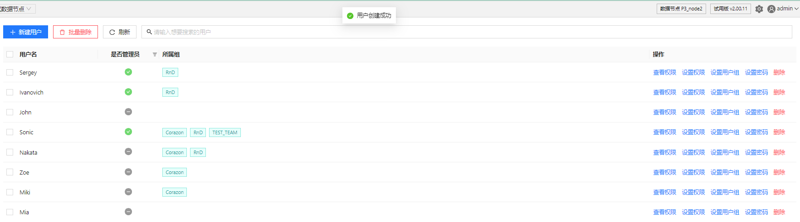

### 设置权限

创建后，管理员可以为用户在不同应用范围下设置访问权限。以设置分布式数据库范围内的用户权限为例，方法如下：

1. 点击用户列表操作栏内设置权限按钮，切换到设置权限页面。

   图 5. 设置权限按钮

   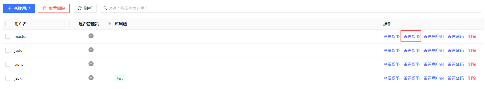
2. 点击分布式数据库
3. 点击新增权限。

   图 6. 设置用户的分布式数据库使用权限

   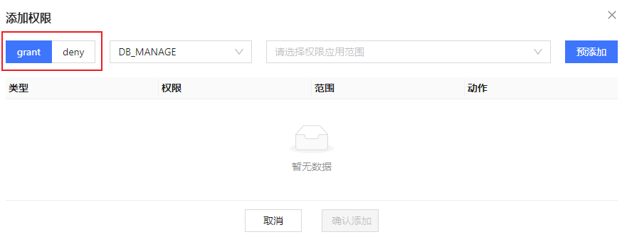
4. 点击 grant 或 deny 以选择权限的大类，即，grant （授予）或
   deny （拒绝）权限。
5. 在 deny
   右边的下拉列表中选择要赋予的**权限类型**。根据当前选项卡的不同，会在下拉框提供不同的权限类型。例如， 分布式数据库的权限类型包括目录级权限类型
   CATALOG\_MANAGE、CATALOG\_READ、CATALOG\_WRITE、CATALOG\_INSERT、CATALOG\_UPDATE
   和 CATALOG\_DELETE
   ，模式级权限类型SCHEMA\_MANAGE、SCHEMAOBJ\_CREATE、SCHEMAOBJ\_DELETE、SCHEMA\_READ、SCHEMA\_WRITE/SCHEMA\_INSERT/SCHEMA\_UPDATE/SCHEMA\_DELETE，库级权限类型
   DB\_MANAGE、DBOBJ\_CREATE、DBOBJ\_DELETE、DB\_OWNER、DB\_WRITE、DB\_INSERT、DB\_UPDATE、DB\_DELETE、DB\_READ
   和表级权限类型 TABLE\_WRITE、TABLE\_READ、TABLE\_INSERT、TABLE\_UPDATE、TABLE\_DELETE。

   图 7. 选择用户的权限类型

   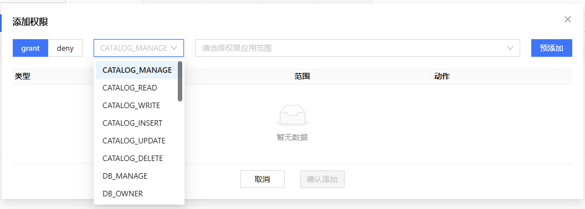
6. 选择或输入权限的**应用范围**。根据当前选项卡和用户在第5步选择的权限类型，会提供不同的权限应用范围。对于分布式数据库而言：
   * 如果选择了目录级权限类型，则会展示出该集群下的所有 Catalog。
   * 如果选择了模式级权限类型，则会展示出该集群下的 Schema 树，即包含所有 Catalog
     的所有Schema。
     + 此类目录级权限只能赋给有 Catalog 的 Schema，不能赋给无 Catalog 的数据库。
   * 如果选择了库级权限类型，则只会展示出该集群下的所有分布式数据库。
     + 此类库级权限可以赋给无 Catalog 的数据库和有 Catalog 的 Schema。
     + 要赋给 Schema 库级权限，使用 `grant` 命令时 *obj*
       需要填写数据库的路径（dbUrl）而非 Schema 名。
   * 如果选择了表级权限类型，则会展示出该集群下的所有分布式数据表。
     + 对于有 Catalog 的数据库，数据表以 Catalog → Schema → table 树形结构展示。
     + 无 Catalog 的数据库在默认分组内（当前命名为 DATABASES\_WITHOUT\_CATALOG），数据表以
       database → table 结构展示。
   * 如果选择了 DB\_OWNER，则需要用户手动输入应用范围（"\*" 或以 "\*"
     结尾的数据库名，前者表示对所有数据库生效，后者表示对指定前缀命名的所有数据库生效）。

   图 8. 选择权限应用范围

   
7. 点击**预添加**按钮，对即将赋予的权限进行预览和确认。

   图 9. 预添加按钮

   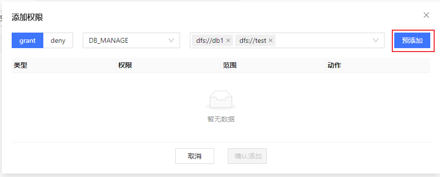
8. 预览即将赋予的权限，此时根据需要对预添加的权限进行**移除**。

   图 10. 权限添加预览界面

   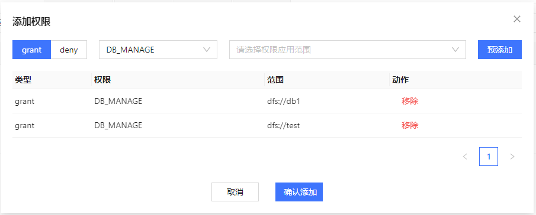
9. 确认无误，点击**确认添加**按钮，调用函数 [grant](../../../funcs/g/grant.md) 和 [deny](../../../funcs/d/deny.md) 对用户正式赋予权限，赋予成功后，在界面上提示"权限赋予成功"

如需撤销用户权限，管理员可以点击**撤销/批量撤销**后，对用户**已赋予/已禁止**的权限进行撤销，会调用函数 [revoke](../../../funcs/r/revoke.md) 撤销权限，撤销成功后，在界面上提示"撤销成功"。

图 11. 撤销/批量撤销权限

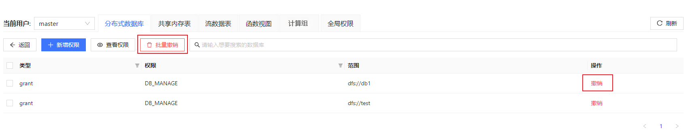

为用户设置其他应用范围的权限如共享内存表、流数据表、函数视图和全局权限的方法与上述步骤的界面和操作方法相似，故不再赘述。

### 查看权限

如需查看用户当前具有的权限，选中用户后点击查看权限：

查看用户权限

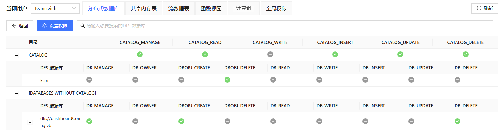

由于 [getUserAccess](../../../funcs/g/getUserAccess.md) 函数将
Schema 相关权限直接合并到库级权限，因此，Schema 相关权限的列名也是以 DB\_ 开头的。

此外，在设置了用户权限后，用户权限亦可在交互编程界面的库表浏览器中可见：

1. 在交互编程界面，将光标悬浮在现有数据库右侧：

   图 12. 交互编程界面中查看用户权限

   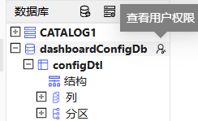
2. 点击图标。

   图 13. 用户权限

   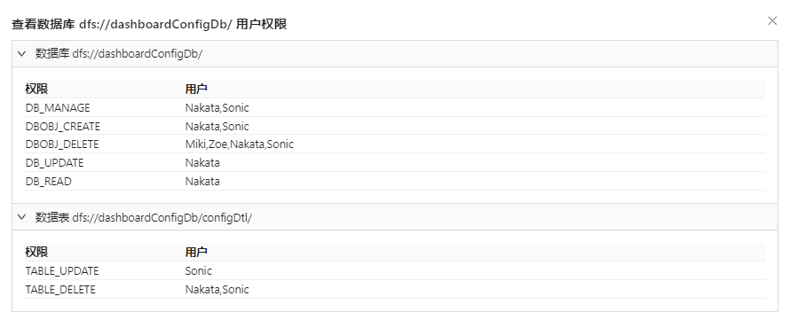

## 组管理

在用户权限管理中，如果用户很多，管理员通过一对一的用户管理方式意味着极大的管理成本。因此，将用户纳入预先设置好权限的组，通过组权限的策略调整实现对批量用户的权限管理能够极大地缓解前述问题。以下对组管理的功能做出介绍（**查看权限和设置权限功能与上文一致**，不再重复）。

### 新建组

建立组的方法如下：

1. 点击新建组，弹出新建组弹窗。

   图 14. 新建组按钮

   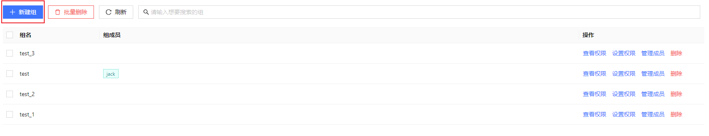
2. 进行新建组表单的填写：
   1. 输入**组名**；
   2. 在非组成员中选择要添加的**初始成员**；
   3. 点击中间的**箭头**，确认选择初始成员；
   4. 点击确定后，会调用函数 [createGroup](../../../funcs/c/createGroup.md)
      进行组创建，创建成功后，在界面上提示"组创建成功"。

   图 15. 新建组表单

   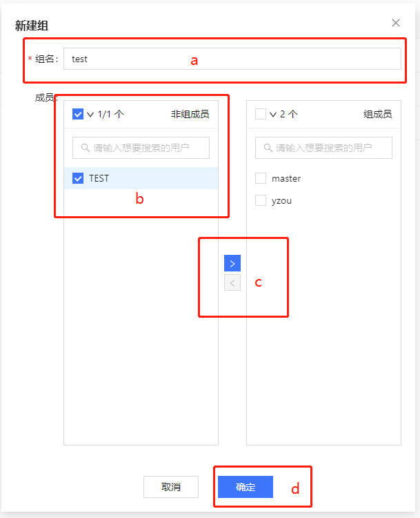

### 删除组

对已存在的组可以进行删除操作，可以**删除单个组或者批量删除多个组**。

如需删除单个组：

1. 点击组列表操作栏内**删除**按钮，弹出确认框。

   图 16. 删除单个组

   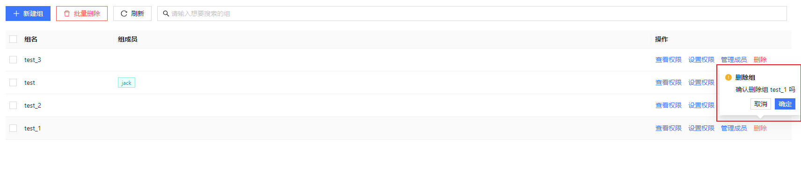
2. 点击确定后，会调用函数 [deleteGroup](../../../funcs/d/deleteGroup.dita) 进行组删除。删除成功后，在界面上提示"组删除成功"。

如需批量删除组：

1. 选中想要删除的组，点击表头上的**批量删除**按钮，弹出确认框。

   图 17. 组批量删除

   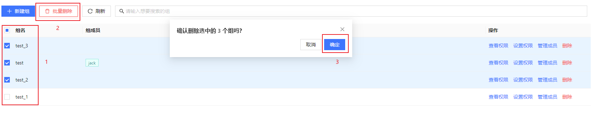
2. 确认想要删除的组后，点击确定，会调用函数 [deleteGroup](../../../funcs/d/deleteGroup.dita)
   进行组删除。删除成功后，在界面上提示"组删除成功"。

### 管理组成员

如需管理组成员：

1. 点击组操作栏内管理成员按钮，弹出成员管理对话框。

   图 18. 组成员管理按钮

   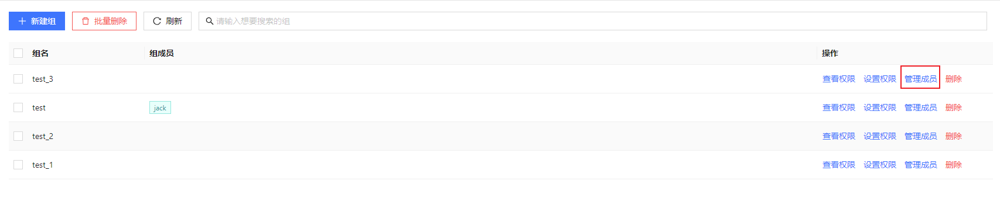
2. **左侧为当前组的非组成员，右侧为当前组的组成员**。选中想要移入/移出的用户，通过中间的箭头进行交换后，点击**预览修改**对组内用户的改动进行预览。

   图 19. 组成员管理表单

   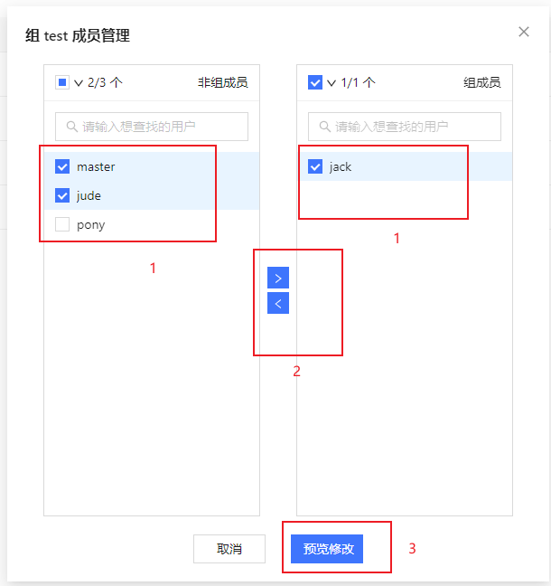
3. 依次确认该组**原组成员**，即将**移入用户**和即将**移出用户**，确认无误后，在预览弹窗点击确定，会调用脚本 [addGroupMember](../../../funcs/a/addGroupMember.md) 和 [deleteGroupMember](../../../funcs/d/deleteGroupMember.md)
   完成组内用户的修改。修改成功后，在界面上提示"组成员修改成功"。

   图 20. 组内成员修改预览

   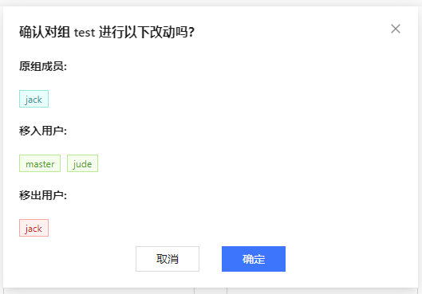

有关用户权限的详细介绍，参考：[用户权限管理](../../../tutorials/ACL_and_Security.md)。

**相关信息**

* [用户权限管理](../../../tutorials/ACL_and_Security.html "用户权限管理")

