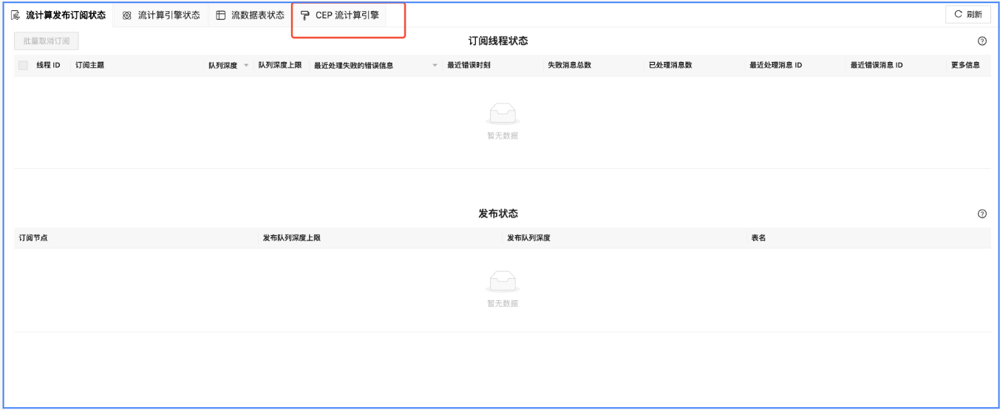
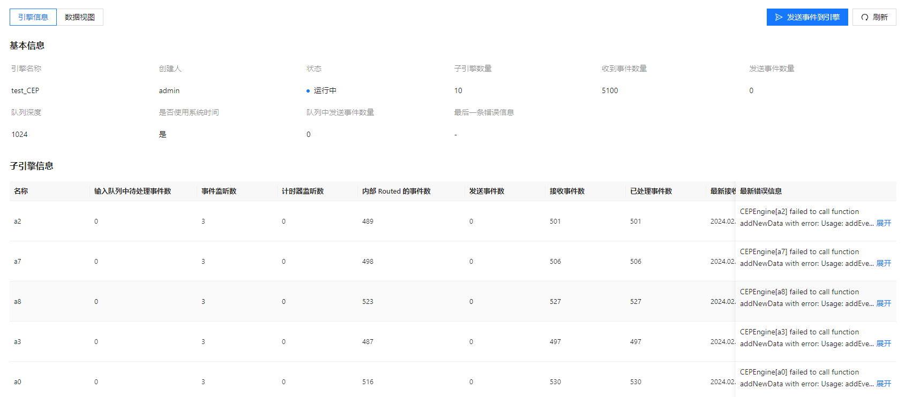
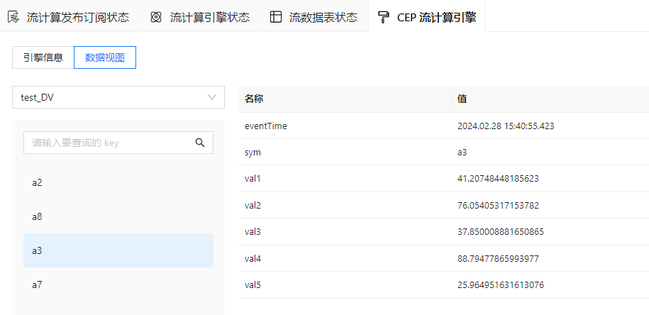
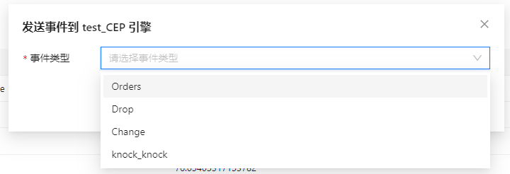
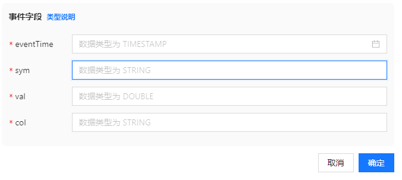

# CEP 流计算引擎状态

通过本页，用户可以实时监控 CEP 内部数据状态（例如监控值变化），同时提供便捷交互操作进行测试。该页面仅支持 3.00 版本 server。

包含以下信息：

* 主要展示功能为：CEP 引擎及其子引擎的基本信息。
* 数据视图：查看用户自定义数据的最新快照。
* 发送事件到 CEP 引擎。

## 引擎信息

本栏展示引擎的基本信息和子引擎信息。

包含以下信息：

* 通过基本信息用户可以得到引擎名称、引擎的工作状态和性能数据、引擎错误处理情况，从而进行故障诊断，实时监控引擎状态。
* 子引擎信息包含：引擎名称、输入监控、队列中待处理事件数、事件监听数、计时器监听数、内部 Routed
  的事件数、发送事件数、接收事件数、已处理事件数、最新接收事件的时间、最新错误时间。通过以上信息用户掌握子引擎的信息配置、事件处理、错误事件信息，全面了解子引擎运行情况，及时调整、优化性能和功能。
* 页面右上角手动刷新可以刷新当前所有 CEP 引擎的状态，进行实时监控。

## 数据视图

本栏展示用户自定义数据的监控页面。

包含以下信息：

* 用户点击或搜索查询 key，面板展示对应的名称和值。
* key 值动态增加，面板增加相应的 key。同时，页面提供手动刷新按钮。

## 发送事件到引擎

支持用户发送事件到 CEP 引擎。

包含以下信息：

* 用户配置发送的目标引擎、事件类型，填写事件字段，点击确认，执行操作。
* 事件字段类型说明参照 DolphinDB [数据类型](../../../progr/data_types.md)。

