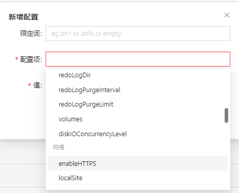

# 配置管理

在配置管理上，管理员可以对以下内容进行设置：

* 控制节点配置
* 集群节点管理
* 集群节点配置
* 计算组配置

具体使用方法，见以下各节。

## 控制节点配置

管理员可以通过配置管理>控制节点配置页面中的按钮新增、修改或删除控制节点相关的配置项。

图 1. 控制节点上的配置管理面板

新增控制节点配置的方法如下：

1. 点击新增控制节点配置。
2. 在配置项列输入配置项名称并在值列输入配置项值。

   图 2. 添加控制节点配置项

   

   注： 在实际环境中，设置的配置项名称和值应与 DolphinDB Server
   版本支持的配置项保持一致。详细配置项名称可以参考：[参数配置](../../cfg/para_cfg.html)。
3. 点击保存。

如需修改已有的配置项，点击配置项右侧的编辑。

如需删除已有的配置项，点击配置项右侧的删除。

## 集群节点管理

在此界面中，管理员可以配置集群节点的相关设置。通过配置管理>集群节点管理页面中的按钮新增、修改或删除集群节点。自
3.00.2 版本开始，DolphinDB server 支持配置计算节点组，用户也可在该页面上进行相关配置。

图 3. 集群节点管理界面

**集群非计算组节点管理**

新增集群节点的方法如下：

集群普通节点是指不属于计算组的节点。对于这些节点，可以通过以下方法进行新增、编辑或删除：

* 点击**新增节点**。输入别名、节点类型（数据节点、控制节点、代理节点、计算节点）、主机 IP
  地址和端口号。点击**保存**，则将该节点保存至集群配置中。
* 点击已有节点右侧的**编辑**，可以修改节点信息配置项。
* 点击**取消**，则取消新增/编辑操作。
* 点击已有节点右侧的**删除**，可以删除该节点。

**计算组节点管理**

在”集群节点管理“界面，可以新增计算组及为计算组增加节点、修改已有计算组的节点、删除已有计算组或其中的部分节点。

* 新建计算组

点击**新建计算组**，打开新增计算组的对话框。

通过该对话框，为计算组批量添加计算节点。其中，计算组名称是该计算组的标识，它将作为计算组中所有节点别名的前缀。若节点别名中未使用计算组名称作为前缀，则无法创建计算组。注意：新添加的计算组名称前缀必须与任何现有计算组的前缀不同，以避免名称冲突。

在批量添加节点栏，需要填写节点的主机名/IP
地址和端口号。其中，不同节点可以使用相同的主机名/IP，但端口号必须唯一，不能重复使用。

在计算组配置栏，可以对计算组的节点增加配置。这里的配置项将对该计算组中的所有节点生效。

在完成以上内容填写后，点击**完成**，可以创建并在线添加计算组。此时通过”集群总览界面“可以启动/关闭计算组所有节点或指定节点、查看所有节点的状态。

* 在已有计算组中新增节点

在已有计算组的下方，点击**新增节点**，可以为该计算组增加计算节点。同创建计算组时填写的参数一样，计算节点的名称必须以计算组名为前缀。填写名称、主机名/IP
和端口号后，点击保存，完成在线添加节点。

* 编辑已有计算组节点

可以对已有计算组中的节点信息进行编辑，点击节点所在行右侧的**编辑**，可修改对应信息，修改完成后，点击**保存**，保存修改后的内容。

* 删除已有计算组或节点

点击已有计算组旁边的**删除计算组**，可以删除这个计算组。如果仅需要删除计算组中的部分节点，则点击节点当前行右侧的**删除**，点击**确定**后删除节点。

## 集群节点配置

管理员可以通过配置管理>集群节点配置页面中的按钮添加、修改或删除
DolphinDB Server 内置的集群节点配置项或自定义配置项。

图 4. 集群节点配置界面

目前已支持的集群节点配置包含以下类别：

| 配置项类别 | 配置项详情 |
| --- | --- |
| 线程 | * localExecutors * maxBatchJobWorker * maxDynamicWorker * webWorkerNum * workerNum |
| 内存 | * chunkCacheEngineMemSize * maxMemSize * memoryReleaseRate * regularArrayMemoryLimit * warningMemSize |
| 磁盘 | * batchJobDir * chunkMetaDir * dataSync * jobLogFile * logFile * logLevel * maxLogSize * redoLogDir * redoLogPurgeInterval * redoLogPurgeLimit * volumes * diskIOConcurrencyLevel |
| 网络 | * enableHTTPS * localSite * maxConnections * maxConnectionPerSite * tcpNoDelay |
| 发布流 | * maxMsgNumPerBlock * maxPersistenceQueueDepth * maxPubQueueDepthPerSite * maxPubConnections * persistenceDir * persistenceWorkerNum |
| 订阅流 | * maxSubConnections * maxSubQueueDepth * persistOffsetDir * subExecutorPooling * subExecutors * subPort * subThrottle |
| 系统 | * console * config * home * maxPartitionNumPerQuery * mode * moduleDir * newValuePartitionPolicy * perfMonitoring * pluginDir * preloadModules * init * startup * run * tzdb * webRoot * webLoginRequired |
| 其他 | 用户自定义的非DolphinDB内置的配置项归于此类。 |

添加集群节点配置项的方法如下：

1. 点击新增配置。
2. 从配置项中按照类别选择已内置的配置项或输入自定义的配置项名称。

   图 5. 添加集群节点配置项

   

   注： 手动输入的配置项名称如果不存在于 DolphinDB
   内置的配置项列表中，将会被归入其他类别。有关详细的配置项信息，参考：[参数配置](../../cfg/para_cfg.html)。
3. 【可选】设置配置项的限定词。例如，dnode1 或留空。
4. 设置配置项的值。例如，设置数据节点 dnode1.startup=startup.dos。

   

   重启该节点后查看配置文件 cluster.cfg。

   

如需修改已有的配置项，点击配置项右侧的编辑。

如需删除已有的配置项，点击配置项右侧的删除。

**计算组配置**

在**集群节点管理界面**完成新增或修改计算组后，在此页面中便可以查看计算组的信息及其相关配置。也可以选择计算组修改其配置项，包括新增配置，编辑已有配置或删除已有配置。

