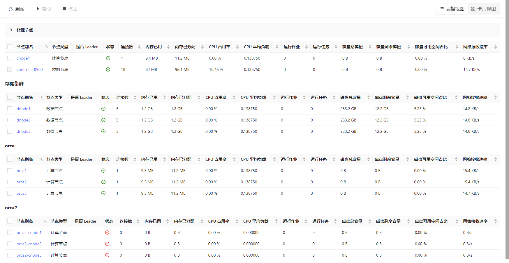
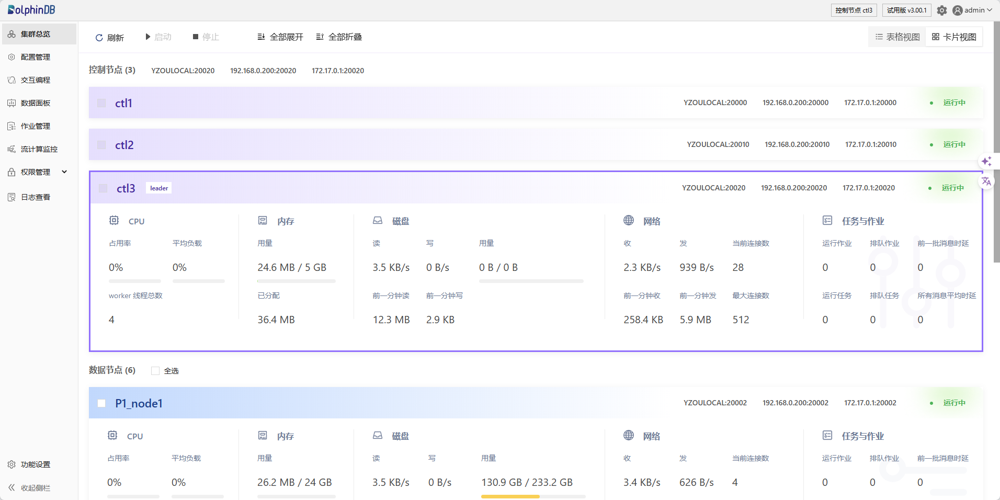
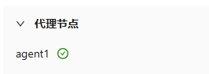
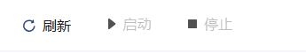
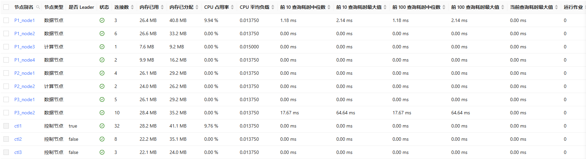
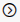
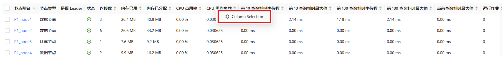
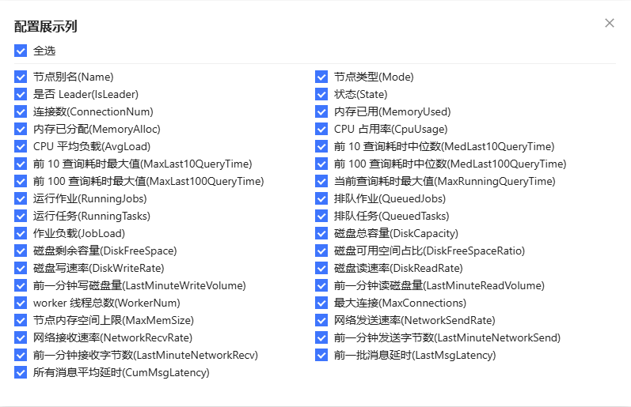

# 集群总览

集群总览界面可于控制节点访问，并以管理员账户登录。

图 1. 控制节点下的集群总览——表格视图

用户可以切换当前视图。

图 2. 控制节点下的集群总览——卡片视图

## 代理节点列表

它显示代理节点的名称和状态。

## 工具栏

选中一个或多个数据节点后，点击 ▶ 启动数据节点。

选中一个或多个数据节点后，点击 ⏹ 关闭数据节点。

点击 🔄 刷新数据节点的状态。

## 性能监控面板

性能监控面板显示控制器和数据节点的多个性能监控指标。

用户可以选择想要显示的指标。右键单击性能监控面板，选择 "Column Selection"，然后选择想要显示的指标。选择完成后，点击右上角的按钮返回性能监控面板。

