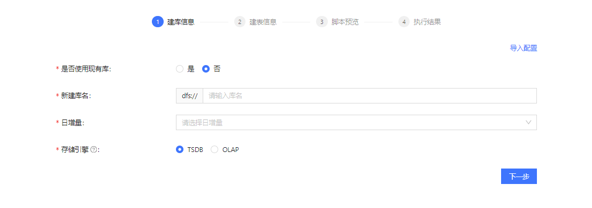
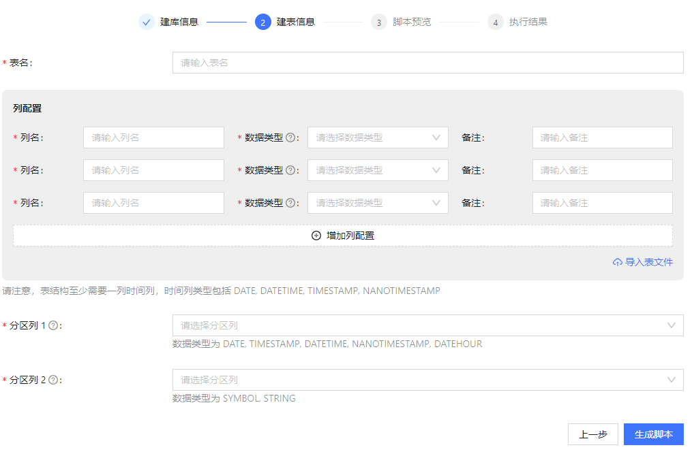
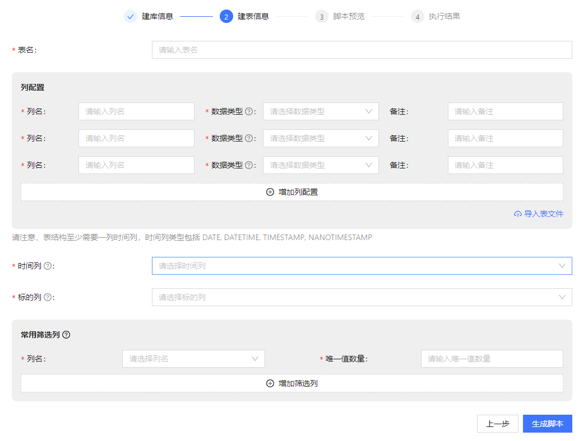
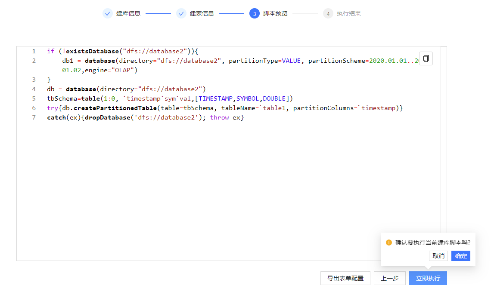
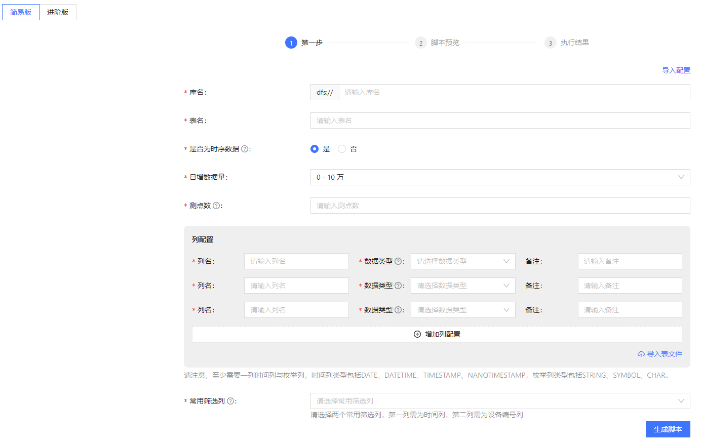
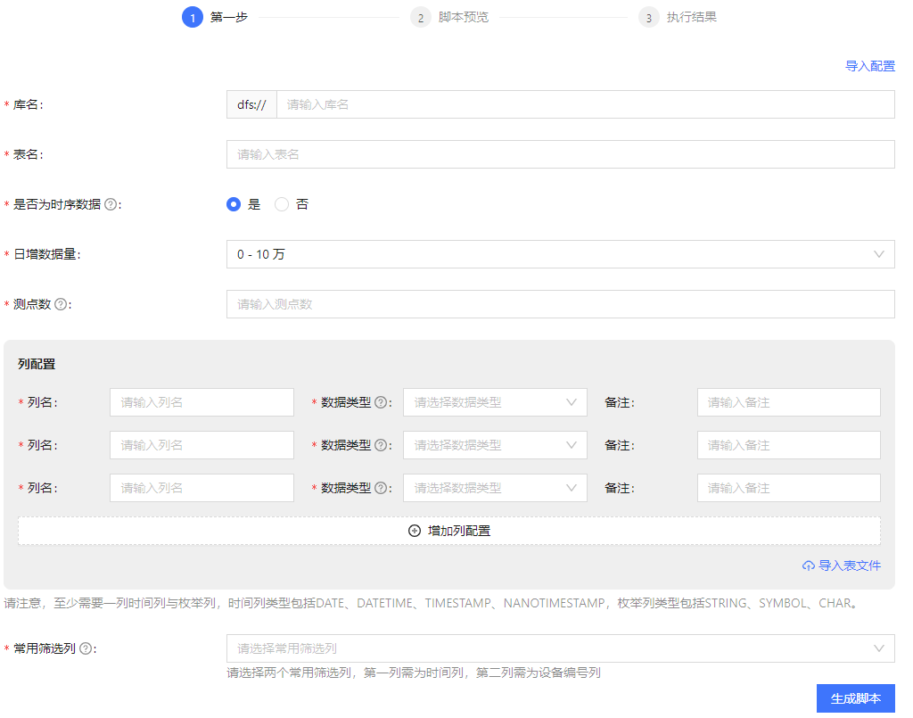
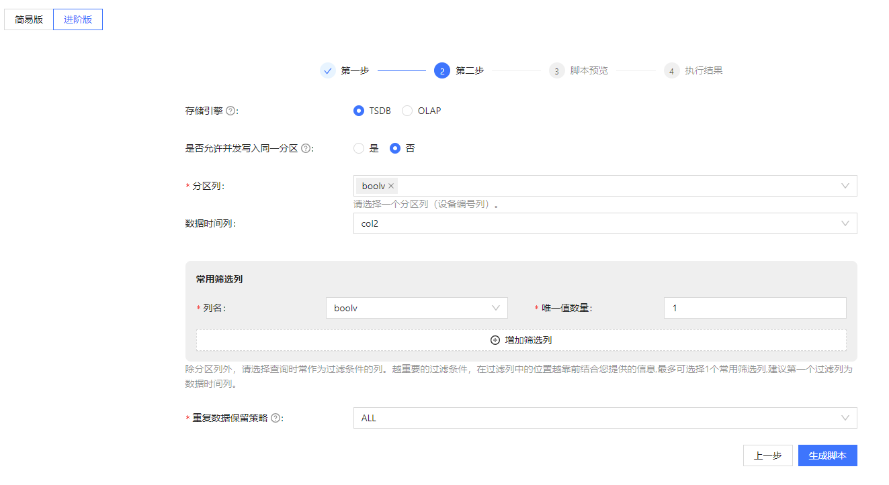

# 功能设置

此页面展示了可配置的某些功能，用户可以根据业务需求选择开启或关闭功能。目前可通过该页面配置以下2个功能：

* 金融库表向导：面向金融客户，在开启该功能后，会在左侧面板中展示”金融库表向导“入口，通过该入口进入创建金融库表的页面。
* 物联网库表向导：面向物联网客户。使用方法同“金融库表向导”。

通过界面向导可以收集用户对数据库表地需求信息，然后生成符合需求的建库建表脚本，从而帮助用户便捷高效地完成数据库表地创建。

## 金融库表向导

在金融场景中，很多因素（例如日增量、标的信息等）会影响建库建表时的参数设置。本页面设置了一些常用的因素，引导用户根据需求选择合适的信息，最终创建符合需求的数据库表。创建库表包含以下4个步骤：建库信息、建表信息、脚本预览、执行结果。

### 建库信息

建库信息页面负责搜集用户的数据信息和对库表的选择。在此页面可以选择在已有的库下创建表，或者新增一个库来创建表。

* 使用现有库：通过下拉框选择库名后，点击下一步进入创建表的页面。也可以点击右上角的”导入配置“，通过导入一个数据库配置文件来填充该页面。

  
* 新建库：首先输入库名，其次根据每日的数据量选择”日增量“，最后选择存储引擎。完成以上操作后，点击”下一步“进行创建表的页面。也可以点击右上角的”导入配置“，通过导入一个数据库配置文件来填充该页面。

  

### 建表信息

在此页面填写相关信息，并生成建表的脚本。目前有2种填写信息的方法：

* 直接在界面上输入文字或选择信息，生成创建数据库表的脚本。
* 通过 csv/txt 文件生成：通过点击”导入表文件“按钮，导入表文件来生成创建数据库表的脚本。表文件可以存储在 server
  服务器上或者存储在本地。

完成内容填写后，点击”生成脚本“按钮，进入”脚本预览“页面。或者点击”上一步“，返回”建库信息“页面。

下面2张图分别展示了”已有库下创建表“和”新建库下创建表“的”建表信息“页面。两个页面的信息大部分相同，区别在于在已有库下创建表时，页面下方会显示建库时指定的分区列，而新建库表时需要选择时间列和标的列（日增量超过
100 万行时才显示该列）用作分区列。

图 1. 已有库下建表

图 2. 新建库下建表

注意：上图中页面下方展示的”常用筛选列“仅在存储引擎选择为 ”TSDB“ 时才显示。在这里指定在查询中经常被作为筛选条件的列。筛选列需要符合以下条件：

* 数量不多于 2 列。
* 数据类型需为能枚举的类型，如 INT、STRING、SYMBOL等。

### 脚本预览

该页面用于展示通过上述操作生成的脚本，用户可在该页面浏览脚本，不可修改脚本内容。若脚本正确无误，则点击”立即执行“创建表；也可以点击”导出表单配置，将数据库表的配置信息导出到一个
json 文件中。若需要修改脚本，则点击”上一步“返回”建表信息“页面，修改内容，或者复制脚本后修改内容。

## 物联网库表向导

针对物联网数据包含测点数、采集频率、日增数据量等特点，只需要创建 TSDB
引擎下的数据库表。物联网库表向导页面的大部分功能和金融库表向导页面相同，但它根据用户对数据库的熟悉程度，分为简易版和进阶版两种创建库表的页面。

### 简易版

在简易版页面，系统为存储、索引等相关信息提供了默认的配置信息，无需用户手动配置，从而降低用户创建库表的难度。用户按照界面表单提供信息生成库表创建脚本，执行之后即可生成库表。

这里对物联网场景下如何设置”常用筛选列“进行说明，其它字段参考上文中的金融库表向导说明。”常用筛选列“指在查询中经常被作为筛选条件的列。需要根据过滤条件的重要性对筛选列进行排序，越重要的过滤条件，筛选列的位置越靠前。根据以下信指定筛选列：

* 数据为时序数据，或数据为非时序数据但数据量大于 200 万行：常用筛选列第一列需为时间列，第二列需要设备编号列。
* 其余情况下：选择设备编号列即可。

### 进阶版

进阶版相较简易版，需要用户自定义的属性有所增加。用户可在此页面自定义存储引擎类型、分区列以及重复数据处理策略等信息。在进阶版中分两步填写库表信息：填写基本信息和填写高阶信息。其中，填写基本信息的方法与上文简易版向导中填写信息的方法一致，在此不再赘述。本节将详细介绍高阶信息的填写方法。

如上图所示，这里需要选择存储引擎，选择是否允许并发写入同一分区、设置分区列、设置重复数据保留策略等。各个字段的设置参考如下：

**存储引擎**：根据业务特点选择存储引擎。TSDB 引擎的使用场景参考[TSDB 存储引擎](../../db/tsdb.md)。OLAP
引擎的使用场景参考[OLAP 存储引擎](../../db/olap.md)。

**是否允许并发写入同一分区**：若开启该功能，则可以对同一分区进行并发操作，这可以提高写入速度，但极小概率会出现数据不一致。

**分区列**：根据基本信息，该配置项会推荐分区列及数据类型。建议用户需按照推荐的信息进行选择。

**数据时间列**：当选择了 TSDB 引擎，数据为非时序数据，且总数据量大于 200 万行时，需要选择该列。

**常用筛选列**：根据基本信息，该配置项会推荐常用筛选列与数据类型。建议用户选择不超过推荐个数的筛选列。

**重复数据保留策略**：该配置项提供了三种策略处理同分区中排序列（sortColumns）
值相同的数据：ALL：保留所有数据；LAST：仅保留最新数据；FIRST：仅保留第一条数据。

完成以上的配置后，点击“生成脚本”生成创建数据库表的脚本，或者点击“上一步”返回信息填写页面，修改信息；也可以复制脚本后进行修改。

