# 交互编程之多标签页与 Git 集成

随着 Web 集群管理器中的交互编程功能被深度使用，代码管理正在成为困扰许多用户的一个难题。单编辑器的架构已经无法满足日益增长的代码复杂度的要求。为此，DolphinDB
为交互编程模块新增了多标签页和 Git 集成的功能。本文将详细介绍这两项功能的使用方法，帮助用户快速掌握高效的代码管理技巧，提升开发效率。

## 1. 开发背景

Web
集群管理器的交互式编程功能，作为一项旨在提供便捷且丰富特性的核心组件，已在实际应用中得到广泛采用。然而，随着用户深度使用，团队协作场景下的需求日益变得迫切。先前的基于单编辑器页面的架构在代码管理方面存在一定局限性，逐渐无法满足用户的需求。

具体来说，我们观察到两种典型的用户行为模式。一部分使用者习惯于将大量的、具有不同功能的代码片段存储在单一编辑器中，并根据实际需求选择性地执行其中的一部分。这种方式尽管在处理小型脚本时具有一定的灵活性，但随着代码规模的增长和复杂性的提升，其弊端也逐渐显现。大量的代码堆积在单一编辑器中，无疑会增加代码导航和维护的难度，导致代码组织混乱、难以查找和修改，最终降低开发效率，并增加出错的风险。

另一部分使用者则倾向于借助外部平台，例如协作文档库或 Git 仓库，来管理代码。他们将代码存储在这些外部平台上，并在需要使用时将其复制粘贴到 Web
集群管理器的编辑器中执行。这种方法虽然可以利用外部平台提供的版本控制和协作功能，但也引入了新的问题。频繁的复制粘贴操作不仅繁琐耗时，也容易引入人为错误，而且割裂了代码的编辑环境和存储环境，使得代码的版本管理和同步变得更加复杂。

为了解决上述问题，并进一步提升交互式编程功能的实用性和便捷性，我们针对性地推出了两项重要的改进：新增多标签页编辑器和 Git 集成（目前已支持 GitHub 和
GitLab）。

## 2. 多标签页的编辑器

DolphinDB Web 集群管理器自 v3.00.2.1 起支持配备了多标签页编辑器，支持使用标签页管理交互编程中的代码，用户可以像使用现代浏览器一样轻松管理多个
DolphinDB 脚本。

### 2.1 新建标签页

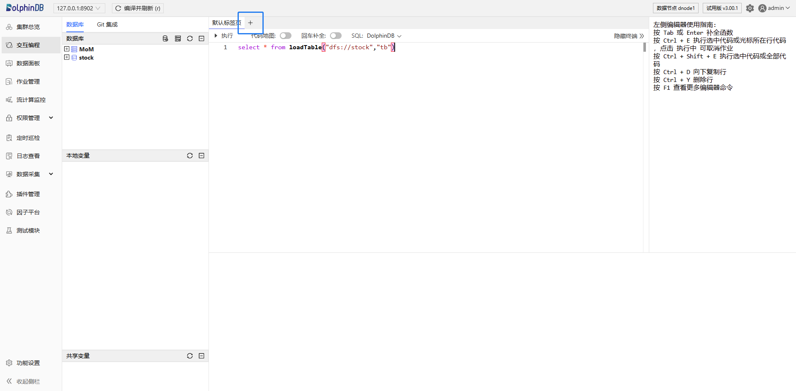

点击编辑器区域上方的 **+** 按钮即可创建一个新的标签页。每个标签页都代表一个独立的代码编辑和存储区域，可以在其中编写和执行不同的 DolphinDB
脚本。

### 2.2 重命名标签页

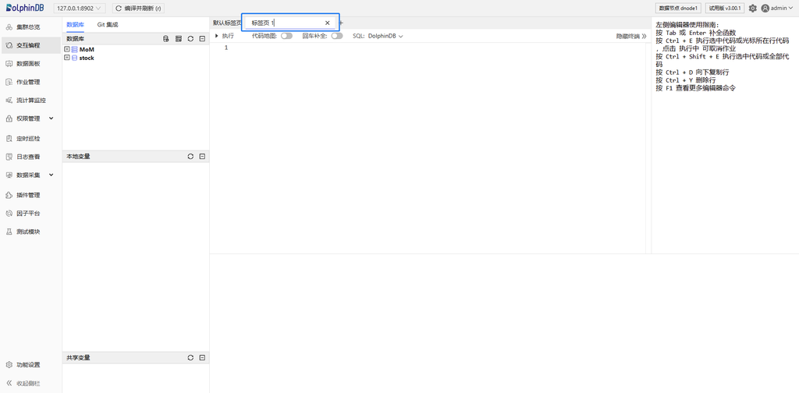

双击标签页的标题即可对其进行重命名。清晰的标签页名称有助于区分不同的脚本。例如，可以使用文件名、功能描述或其他有意义的名称来标识标签页。

### 2.3 关闭标签页

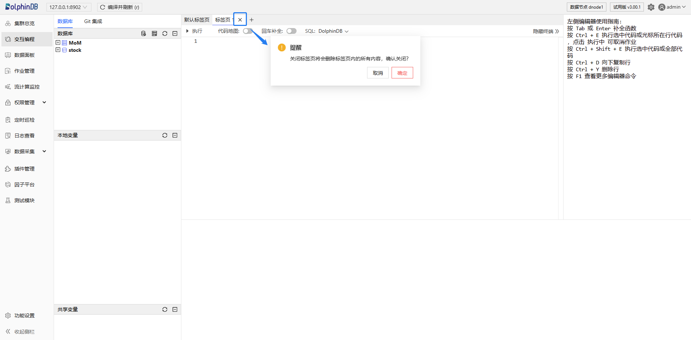

点击标签页标题右侧的 **x**
按钮即可关闭该标签页。请注意，标签页内容保存在浏览器的本地存储中。关闭浏览器或清除浏览器数据将导致标签页内容丢失，且**无法恢复**。
请务必定期保存重要的代码到文件或 Git 仓库。

通过多标签页编辑器，可以同时处理多个 DolphinDB 脚本，轻松切换、组织和管理代码，显著提高工作效率。

## 3. Git 集成

DolphinDB Web 集群管理器自 v3.00.2.5 起支持 Git 集成，可直接连接到 GitHub 或 GitLab
仓库，实现脚本的版本控制、协同编辑和便捷的代码同步。

### 3.1 连接 Git 账户

首先，需要将 GitHub 或 GitLab 账户连接到 DolphinDB Web 交互编程页面。目前，我们支持以下四种连接方式：

**GitLab Access Token**

1. 获取 GitLab Personal Access Token ([Personal access tokens |
   GitLab](https://docs.gitlab.com/ee/user/profile/personal_access_tokens.md))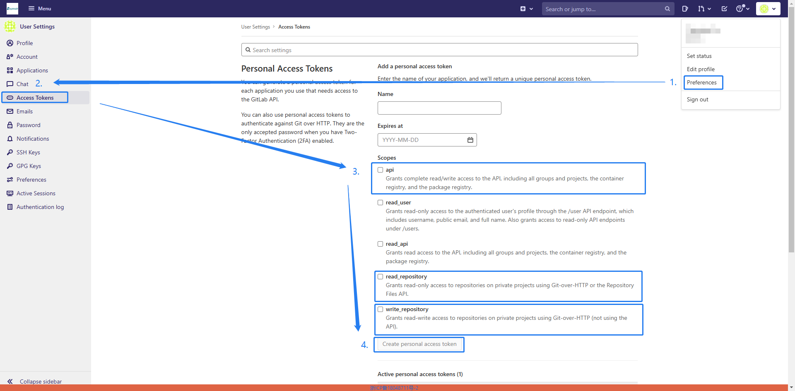
2. 在 DolphinDB Web 界面填写 Access Token、GitLab 根 URL
   (例如，`https://gitlab.example.com`) 和 API 根路径 (通常为
   `/api/v4`，可选项)。

**GitLab OAuth**

1. 在 GitLab 中创建一个 Application ([Create a user owned
   application](https://docs.gitlab.com/ee/integration/oauth_provider.html#create-a-user-owned-application))，获取 Application ID (即 Client ID)。

   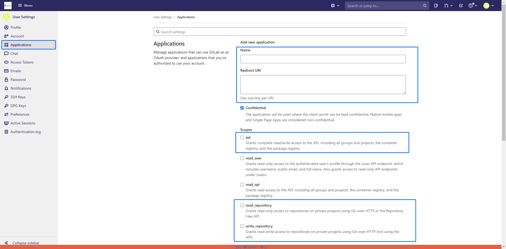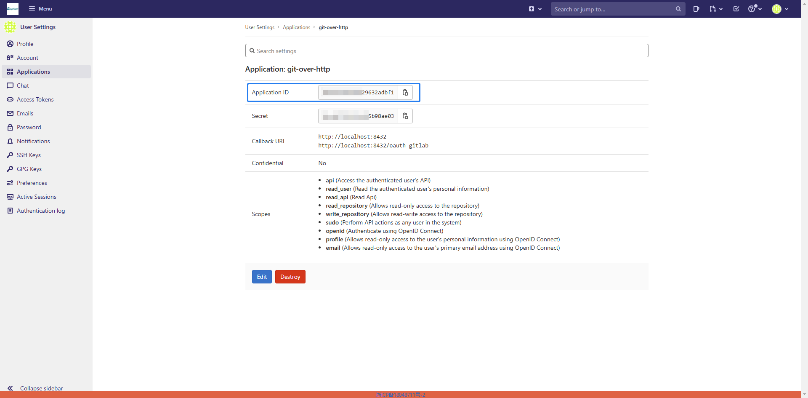
2. 设置 Redirect URL 为 DolphinDB Web 部署地址加上 `/oauth-gitlab`
   路径
   (例如，`your-dolphindb-web-address/oauth-gitlab`)。此处的示例是一个在本期启动
   DolphinDB Web 的例子，Redirect URL 被设置为
   http://localhost:8432/oauth-gitlab。

   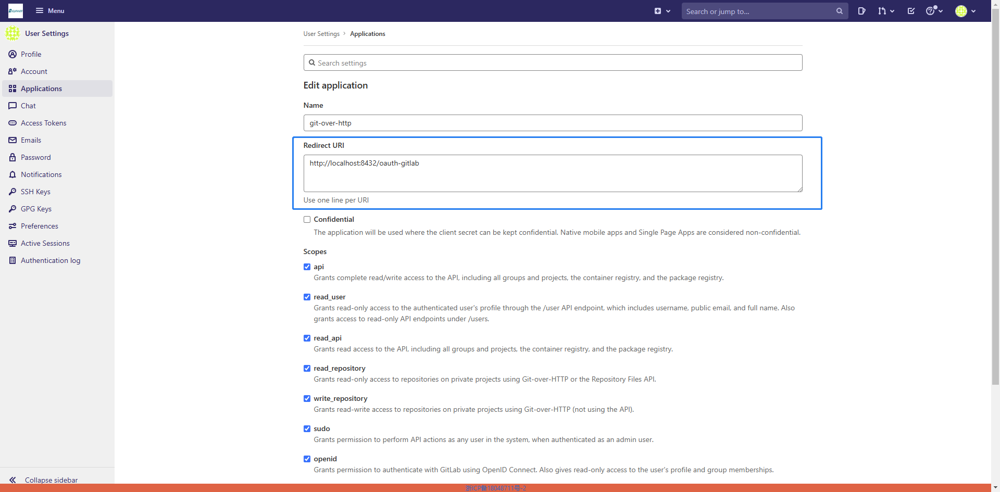
3. 在 DolphinDB Web 界面填写 Client ID 并点击“确定”，页面将被重定向到 GitLab 授权页面进行授权。

**GitHub Access Token**

1. 创建 GitHub Access Token ([Managing your personal access tokens
   - GitHub Docs](https://docs.github.com/en/authentication/keeping-your-account-and-data-secure/managing-your-personal-access-tokens))

   导航到 <https://github.com/settings/tokens>连接您的
   Github 帐户，然后创建一个可以操作 Repo 的 GitHub Access Token

   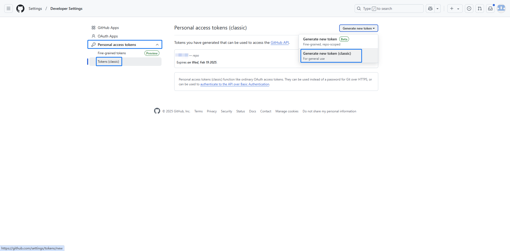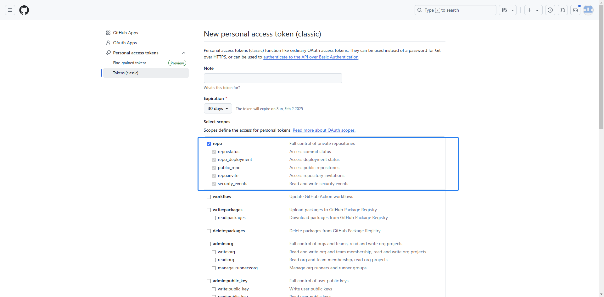
2. 在 DolphinDB Web 界面填写 Access Token 即可。

   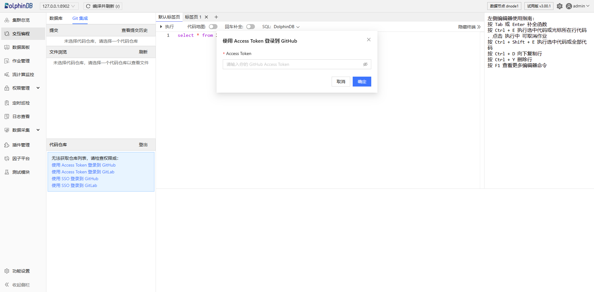

**GitHub OAuth**

1. 在 GitHub 中创建一个 Oauth Application ([Creating an OAuth app - GitHub
   Docs](https://docs.github.com/en/apps/oauth-apps/building-oauth-apps/creating-an-oauth-app) )，获取 Client ID 和 Client Secret。

   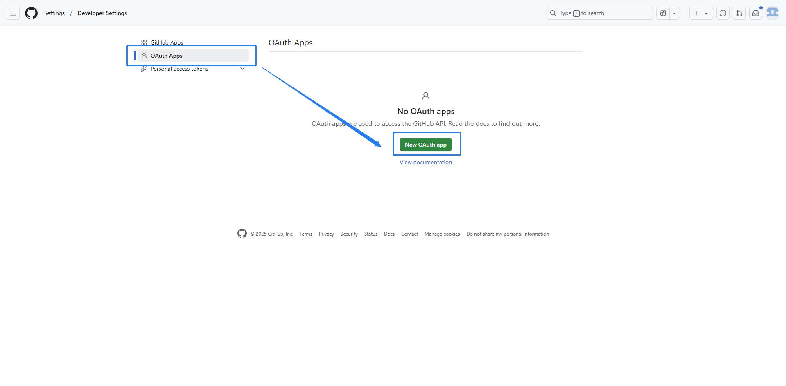
2. 设置 Redirect URL 为 DolphinDB Web 部署地址加上 `/oauth-github`
   路径
   (例如，`https://127.0.0.1:8848/oauth-github`)。

   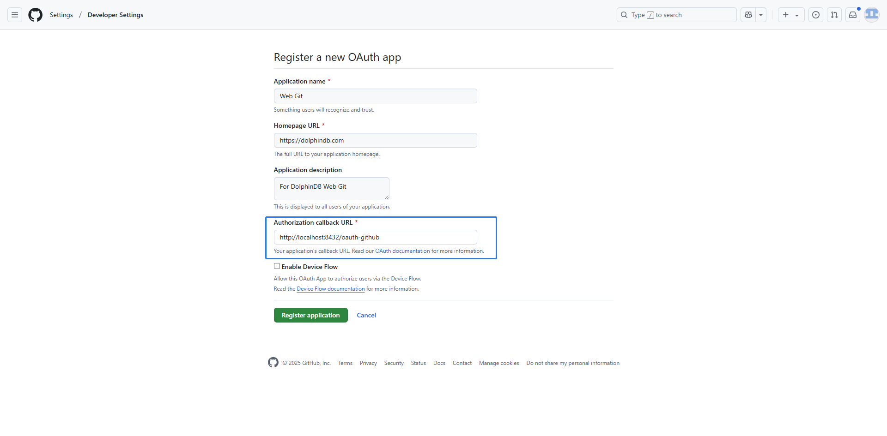
3. 在 DolphinDB Web 界面填写 Client ID 和 Client Secret 并点击“确定”，页面将被重定向到
   GitHub 授权页面进行授权。**请确保 DolphinDB Server 已启用 HTTP 插件，以支持使用 SSO 登录到
   GitHub。**

   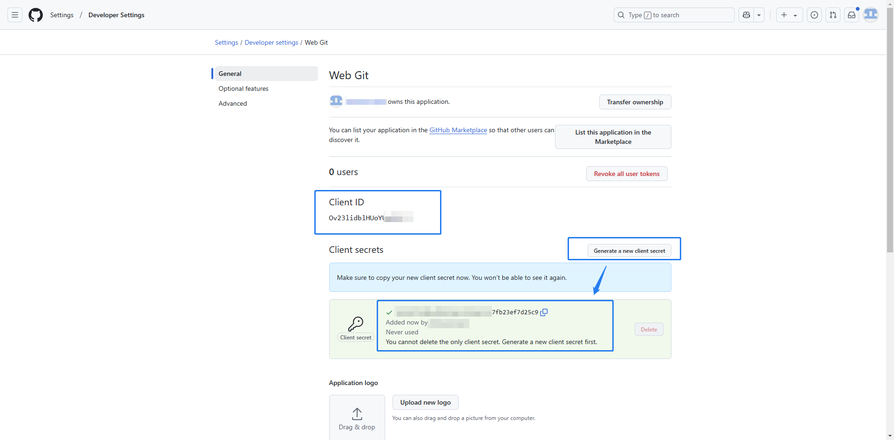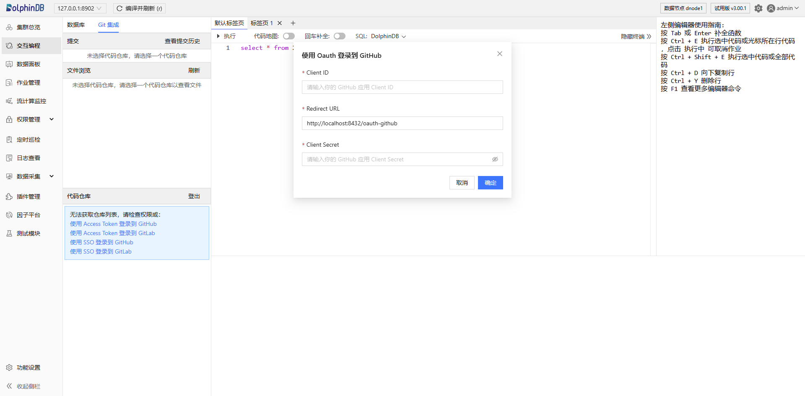

### 3.2 浏览和打开仓库文件

连接 Git 账户后，可以在“代码仓库”界面查看所有当前账户有权访问的代码仓库。

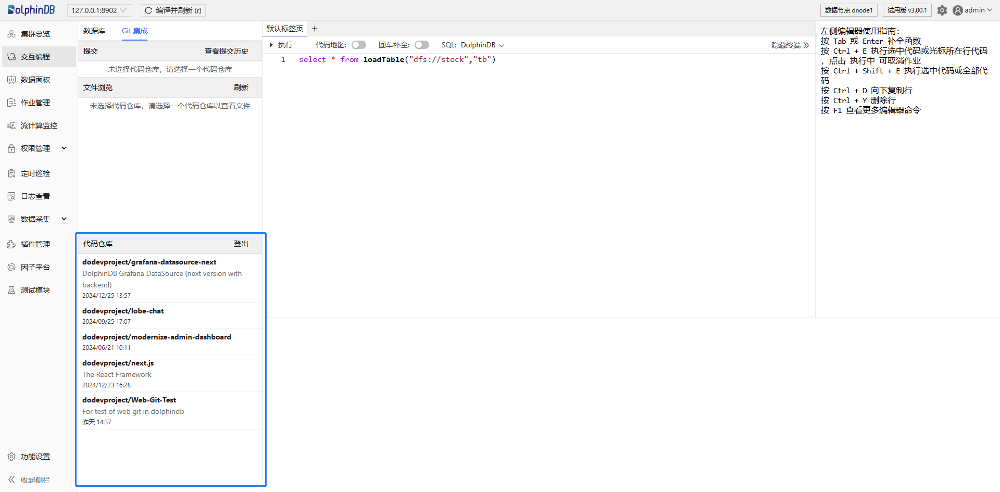

选择一个仓库后，在“文件浏览”界面，可以查看仓库的文件树状结构，并通过搜索框快速查找文件。

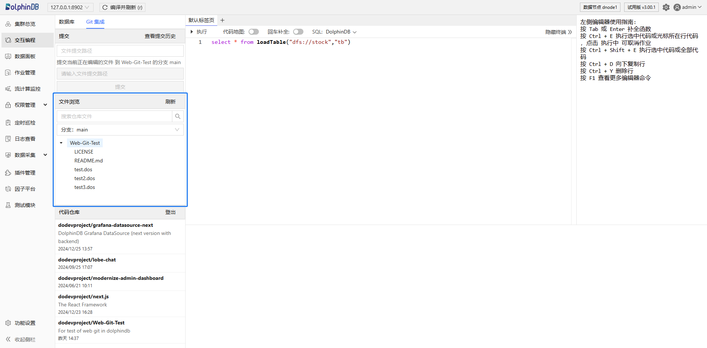

点击文件名即可在新标签页中打开文件，并使用 DolphinDB Web 交互编程的全部功能，包括代码执行和数据库查询。

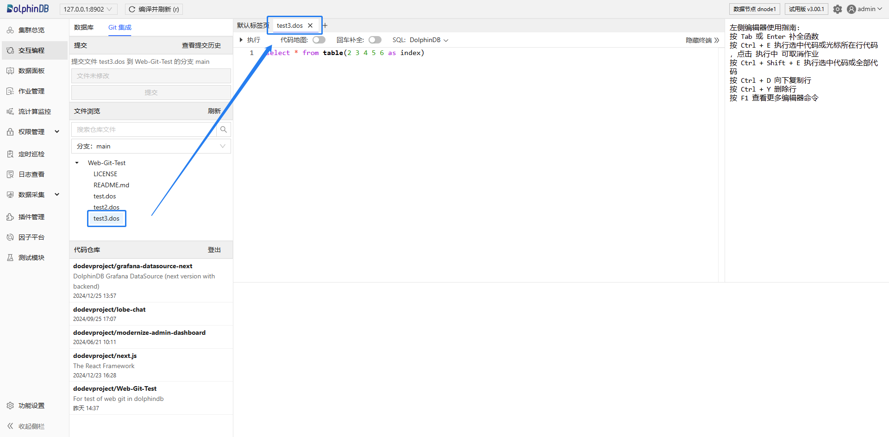

### 3.3 修改和提交文件

修改现有文件后，可在“提交”界面填写提交信息，并将更改提交到远程 Git 仓库。目前，我们支持单文件提交。

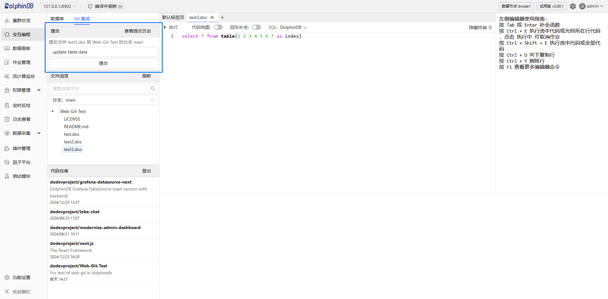

要创建新文件，请新建一个标签页并编写代码。在“提交”界面，选择目标仓库和分支，并填写文件提交路径（例如，`新的文件.dos`
表示提交到根目录，`src/新的文件.dos` 表示提交到 `src`
目录）。填写提交信息后，即可将新文件添加到仓库。

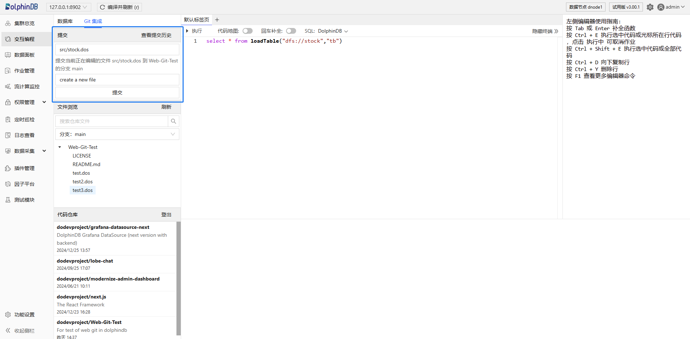

输入文件提交路径和提交信息后，就可以在仓库里创建一个新的文件了。**同时，会创建一个新的标签页，展示提交的，已被 Git
跟踪的标签页，此时可以安全地关闭先前的，未被 Git 跟踪的标签页。**

### 3.4 查看文件历史记录

在“提交”界面，点击“查看提交历史”按钮即可查看文件的提交记录。

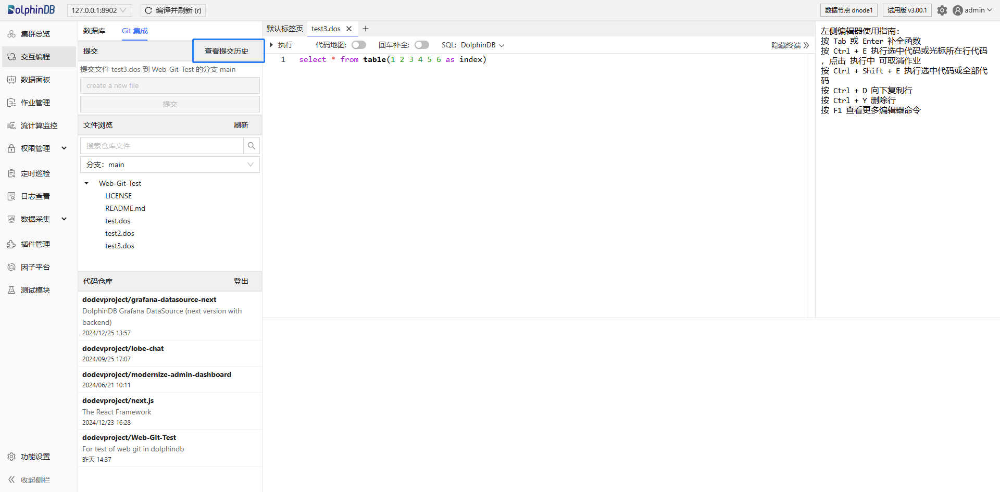
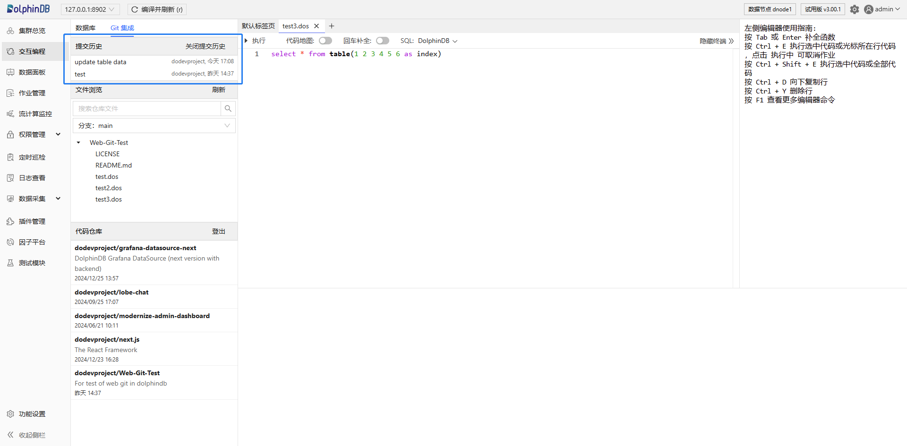

点击某条记录，可以在新的只读标签页中查看该提交下的文件内容。

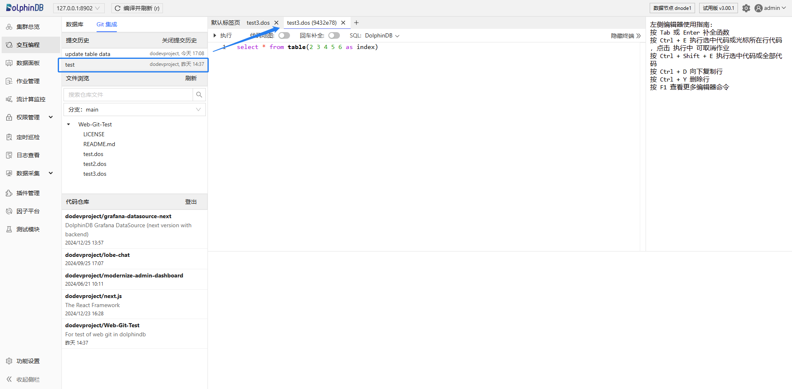

标签页名称会显示提交的 hash 值。 如需编辑历史版本，请将代码复制到可编辑的标签页。

### 3.5 同步来自远程仓库的更新

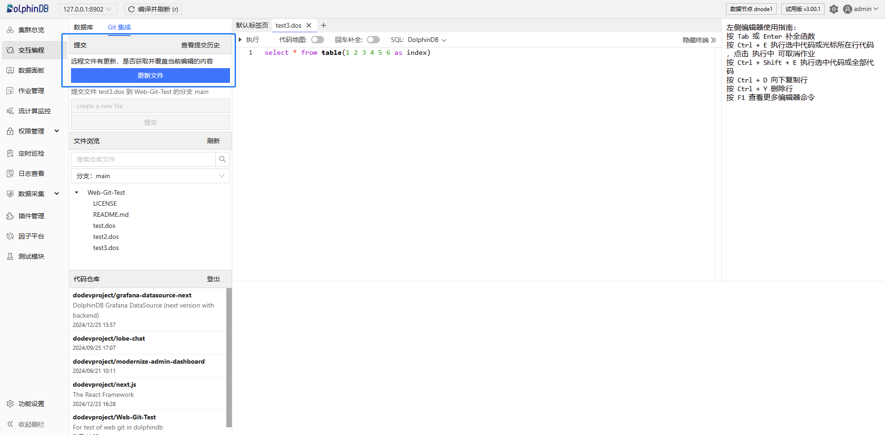

对于正在编辑的被 Git 跟踪的文件，可以随时从远程仓库拉取最新更新并覆盖本地版本。
**请注意，拉取更新会覆盖本地修改，请确保已备份需要保留的内容。**

## 4. 总结

本文主要介绍了 Web 集群管理器交互编程功能的新变化。多标签页和 Git
集成功能的引入，旨在解决代码管理的难题，提升用户体验。多标签页允许用户像使用浏览器一样管理多个脚本，提高代码组织能力，方便切换。而 Git
支持则实现了版本控制、协同编辑和代码同步，用户可以通过多种方式连接 Git 账户，浏览和修改仓库文件，查看文件历史记录，同步来自远程仓库的更新。这些改进将显著提高
Web 集群管理器交互编程的效率和便捷性。

