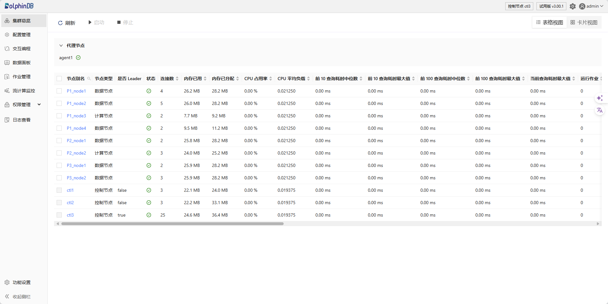

# Web 操作手册

用户可以在集群管理器的 Web 界面对同一集群中的代理节点、数据节点和计算节点进行管理。

图 1. 控制节点下的 Web 集群管理器

注： 使用 Web 集群管理器前，请确保浏览器版本满足以下要求：

* Chrome/Firefox/Edge 浏览器：版本高于 100
* Safari 浏览器：版本高于 16

Copyright

**©2025 浙江智臾科技有限公司 浙ICP备18048711号-3**
