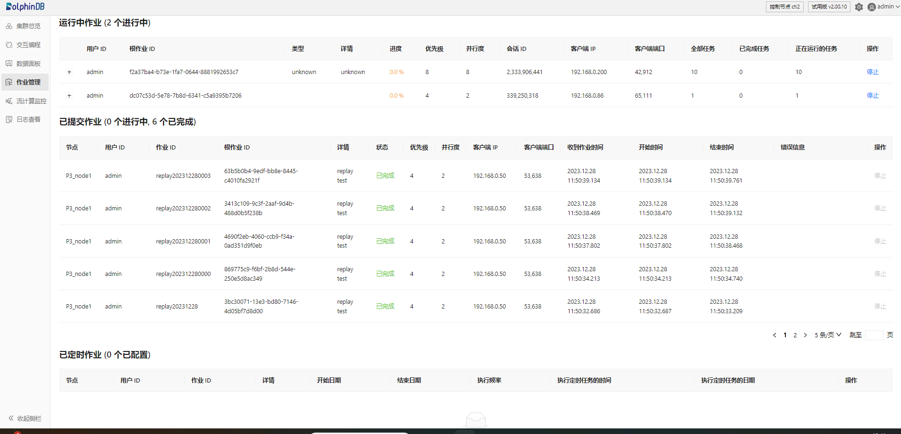

# 作业管理

Web 端的作业管理界面类似于 GUI 的作业管理器。唯一区别是：Web 端的作业管理仅支持查看、停止和删除作业，不支持作业筛选和批量停止。

Web 端的作业管理界面按照作业状态将其分为运行中作业、已提交作业和已定时作业三部分，包括各个作业的用户ID、作业ID、详情等信息，见下图：

* 运行中作业：包含正在进行中的作业的相关信息，如进度、优先级、任务数量等。点击左侧的 ➕，可显示作业下各节点任务的详细信息；点击
  ➖，折叠详细信息；点击“停止”，可取消作业。
* 已提交作业：包含已提交作业（包括进行中和已完成）的相关信息，如状态、开始时间、结束时间、错误信息等。点击“停止”，可取消作业。
* 已定时作业：包含已设置定时的作业的相关信息，如开始日期、结束日期、执行频率等。点击“删除”，可取消作业。

Copyright

**©2025 浙江智臾科技有限公司 浙ICP备18048711号-3**
