# 数据采集平台

数据采集平台是一款专为数据采集与管理设计的高效工具，支持 MQTT 和 Kafka
两种主流数据通信协议。得益于该平台直观易用的界面，用户能够轻松对接不同协议的测点，从而极大简化了用户的配置与管理流程，使数据采集的启动与停止变得更为快捷与高效。

## 用前注意

* 版本要求：数据采集要求 server 版本号不低于 2.00.14/3.00.2。
* 在使用该模块时，默认会加载插件 MQTT 和 Kafka。在集群模式中，对于需要使用采集平台的节点，建议在集群配置文件 cluster.cfg
  中通过 *preloadModules* 参数指定这两个插件，以预加载它们。

使用数据采集平台前，须先登录用户身份。

图 1. 图 1-1 登录页面

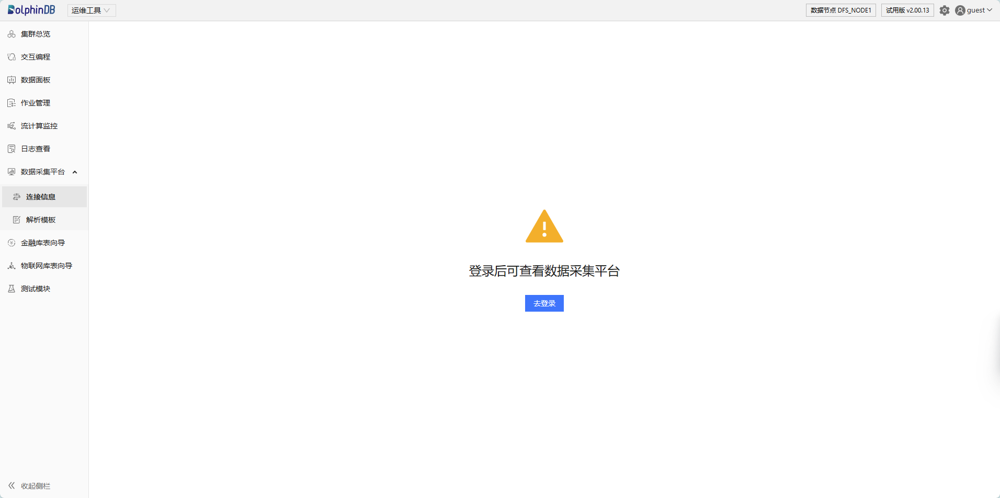

如果当前登录身份为管理员，则初始化平台后即可使用该功能。

图 2. 图 1-2 管理员初始化平台界面

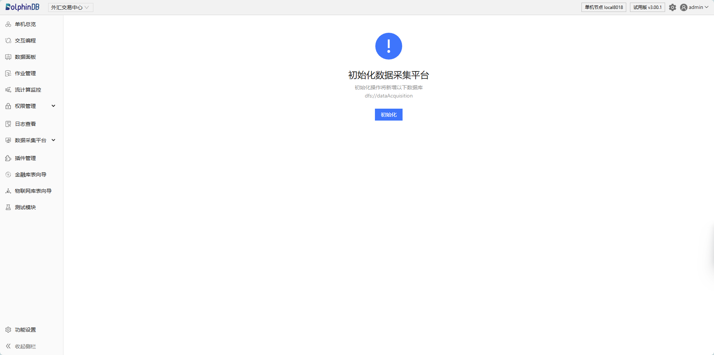

如果登录身份为普通用户，则需要联系管理员初始化平台再进行使用。

图 3. 图 1-3 普通用户须联系管理员

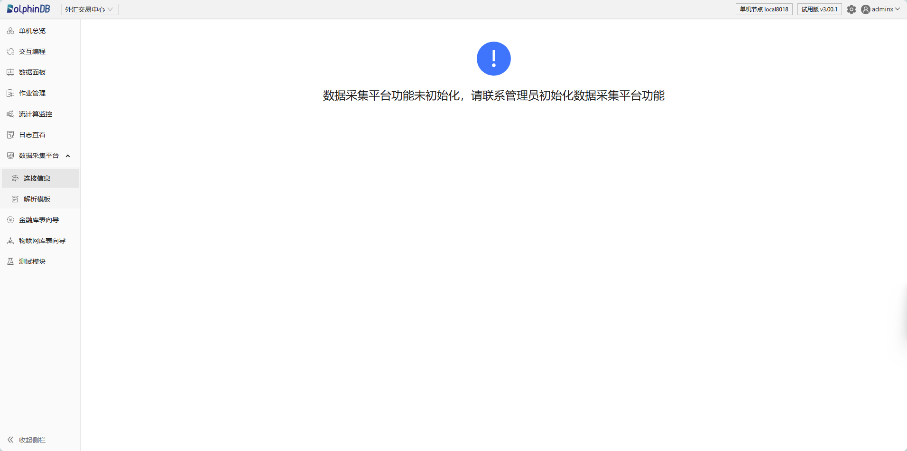

## 连接信息

连接信息页面包含连接管理和订阅管理两个模块。

图 4. 图 2-1 连接信息

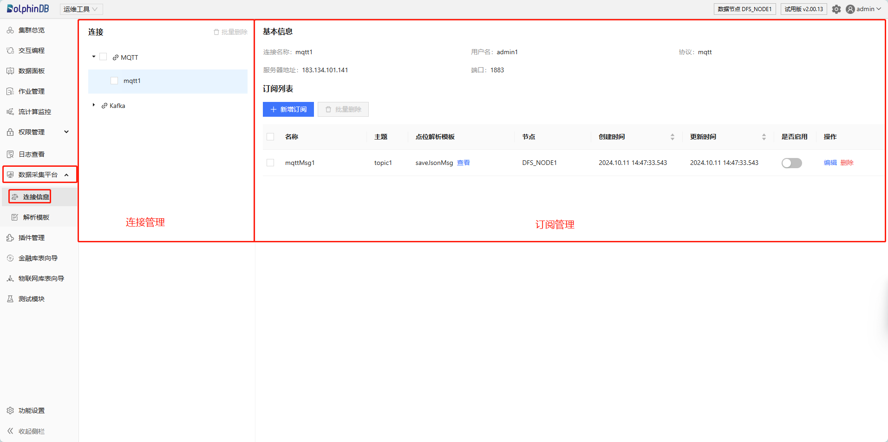

### 连接管理

连接管理模块负责 MQTT 和 Kafka 的连接信息管理，具体功能包括：

* 展示协议下所有连接。
* 新建/编辑/（批量）删除连接。
* 展示协议调试日志信息。

  图 5. 图 2-2 新建连接/查看日志

  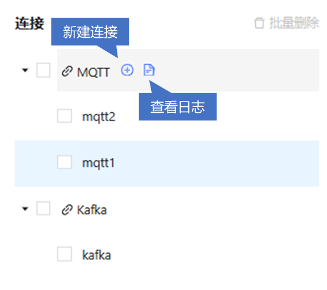

#### 新建连接

**新建 MQTT 连接**

点击 MQTT 后的“新建连接”，进入创建 MQTT 协议连接页面。

填写 MQTT 协议连接基本信息：

* 连接名称：输入 MQTT 连接的名称，支持中文和英文。注意：不可与列表中已有连接重名，不可为空，不可包含空格，最大长度为 50。
* 服务器地址：输入 MQTT 服务器的 IP 地址或域名。
* 端口：输入 MQTT 服务器监听的端口号。MQTT 默认端口为
  1883（非加密连接），但根据服务器的配置，可能使用其他端口。注意：有效值为 1-65535 的整数。
* 用户名/密码：输入 MQTT 服务器的用户名和密码。其中密码支持明文和暗文两种输入模式。

点击确定即可完成创建。

图 6. 图 2-3 创建 MQTT 协议连接

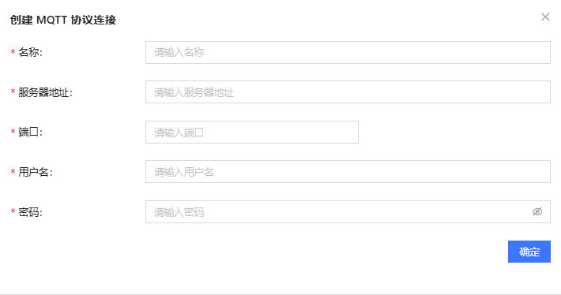

**新建 Kafka 连接**

点击 Kafka 后的“新建连接”，进入创建 Kafka 协议连接页面。仅需填写连接名称、服务器地址和端口信息（有效值为 0-65535
的整数），点击确定即可完成创建。Kafka 消费的用户名和密码在后续订阅参数中配置。

图 7. 图 2-4 创建 Kafka 协议连接

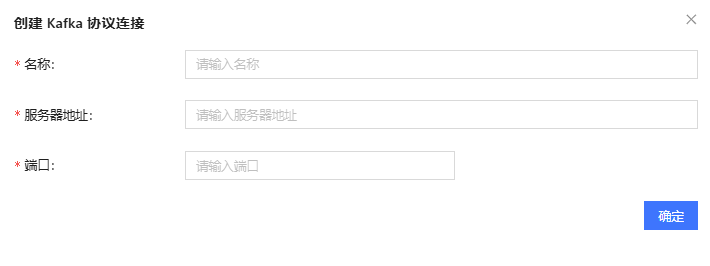

#### 查看调试日志

点击对应协议后的“查看日志”，可查看与该协议相关的最近 5\*106 字节的日志中与该协议相关的日志信息。

图 8. 图 2-5 日志信息

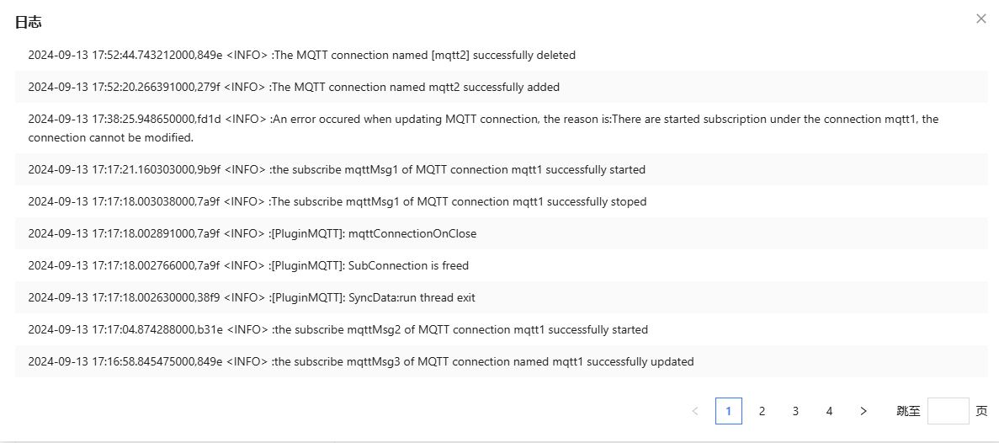

#### 编辑/删除连接

点击对应连接后的操作符号以进行编辑/删除。

图 9. 图 2-6 编辑/删除链接

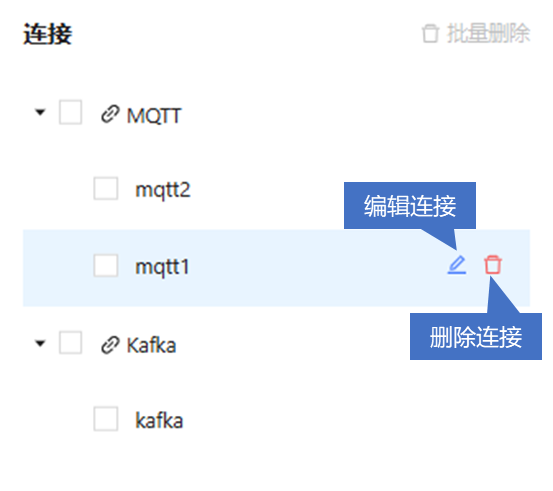

**编辑连接**

点击编辑连接对应的符号，进入编辑页面，对连接信息进行修改。

**删除连接**

支持单个或批量删除连接。删除时需要选择是否同时销毁该连接下所有订阅相关的流表。如果选择销毁流表，则与该连接下所有订阅相关的数据表将被删除，请谨慎操作。

图 10. 图 2-7 删除连接

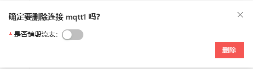

图 11. 图 2-8 批量删除连接

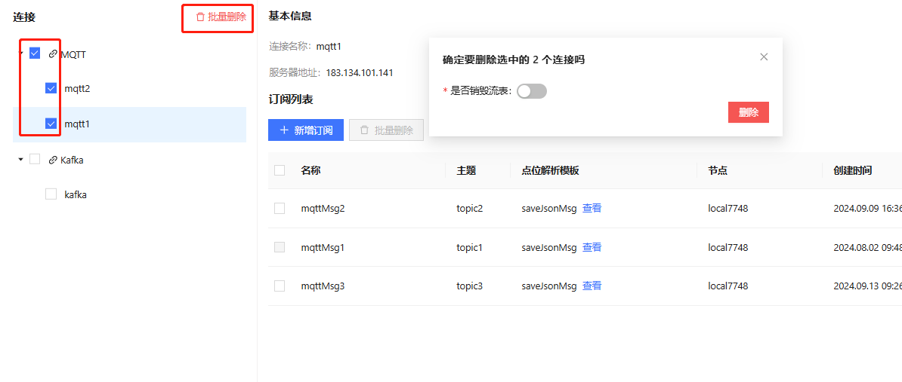

### 订阅管理

订阅管理模块用于管理连接下的订阅信息，具体功能包括：

* 展示连接下的所有订阅。
* 新增/编辑/（批量）删除订阅信息。
* 启用/禁用订阅。

  图 12. 图 2-9 订阅管理

  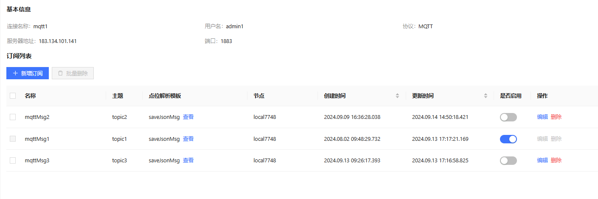

订阅管理界面展示了当前连接的基本信息和具体订阅相关信息。

* 当前连接的基本信息包含连接名称， 用户名，协议，服务器地址和端口号。
* 订阅相关信息包括订阅名称，主题，点位解析模板，创建时间，更新时间，订阅是否启用和操作等。操作包含对连接信息的编辑和删除。可按照创建时间/更新时间对订阅进行排序。

#### 新增订阅

**新增 MQTT 订阅**

点击新增订阅，进入创建订阅页面。

输入订阅基本信息：

* 订阅名称：输入 MQTT 连接的名称，支持中文和英文，不可与列表中已有连接重名。
* 订阅主题：输入 MQTT 服务器上的主题（Topic），MQTT 服务器会根据订阅的主题来过滤并分发消息给相应的订阅者。
* 节点：指定处理订阅消息的节点。如果未指定，则默认为当前操作的节点。在多节点环境中，此选项允许用户灵活地将消息处理任务分配给不同的节点。
* 是否需要点位解析：选择是否需要对接收到的消息进行点位解析。点位解析是指将接收到的数据按照特定的规则或模板进行解析，以提取出有用的数据点或字段，并将这些数据点或字段存储到流表中供后续处理或分析。

  + 无需点位解析时（即使用默认解析模板
    saveJsonMsg），仅需填入流表名称（系统将自动创建流表），系统会将订阅到的数据以完整的字符串形式存入指定的流表中，不进行
    JSON 解析。

    图 13. 图 2-10 无需点位解析创建订阅

    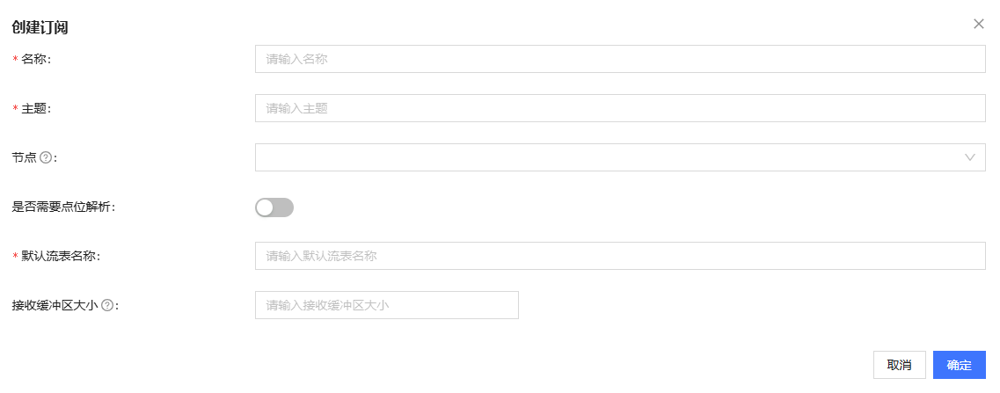
  + 需要进行点位解析时，需要选择解析模板，可选自定义模板或内置模板，并填写相应模板参数。其中自定义解析模板的输出流表需要用户**自行创建**。

    图 14. 图 2-11 需要点位解析创建订阅

    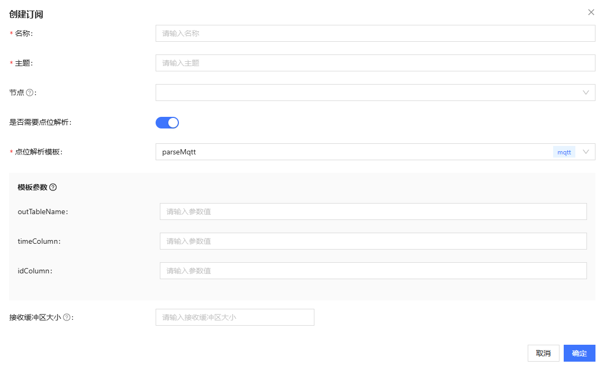

* 接收缓冲区大小：设置接收缓冲区的大小，以控制一次接收消息的最大数据量。如果未设置，系统将使用默认值 20480 字节。

点击确定即可完成订阅。

**新增 Kafka 订阅**

相较 MQTT，Kafka 订阅无需设置接收缓冲区大小，增加了分区、偏移量以及消费者参数配置项。

* 分区与偏移量需同时设置，或者均不设置。有效值为非负整数。
* 消费者参数和值由用户自行配置，可参考[此文档](https://github.com/confluentinc/librdkafka/blob/master/CONFIGURATION.md)。

  + [*group.id*](http://group.id/) 是必须配置的参数，用于标识消费者所属的消费组。
  + 设置偏移量与分区时，[*group.id*](http://group.id/) 参数会失效。
  + 点击增加消费参数配置，可配置其他参数。

    图 15. 图 2-12 创建 Kafka 订阅

    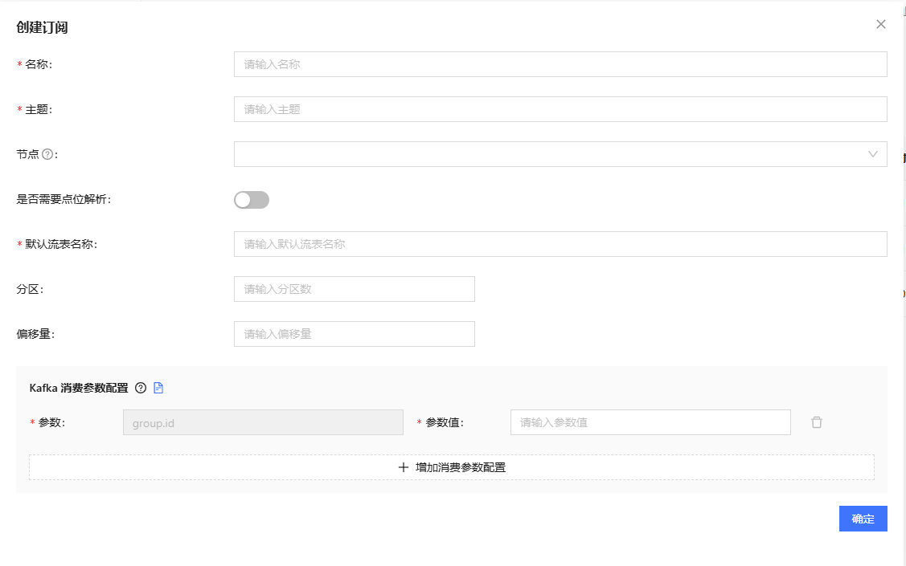

#### 启用/查看/停用/编辑/删除订阅

可通过界面操作启用或停用订阅。

图 16. 图 2-13 启用/停用订阅

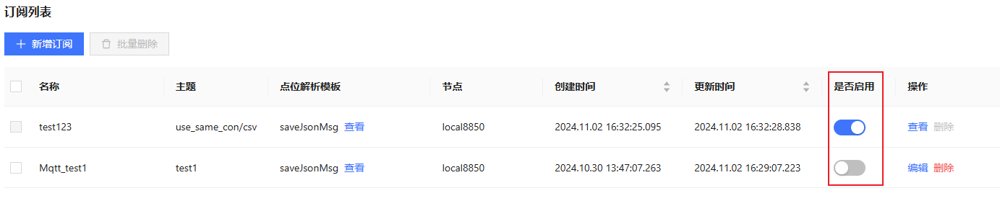

对于启用的订阅，不能进行编辑或删除操作。通过“查看”按钮，可以进入查看页面，查看订阅的详细信息。

对停用的订阅可以进行编辑或者删除操作。已启用的订阅需先停用后才能进行编辑或删除。

点击编辑，进入修改订阅页面，对订阅信息进行修改。修改后将默认按照更新时间对订阅进行排序。

支持单个或批量删除订阅。删除时需要选择是否销毁流表。

图 17. 图 2-14 删除单个订阅

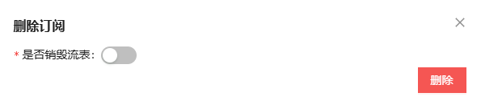

图 18. 图 2-15 批量删除订阅

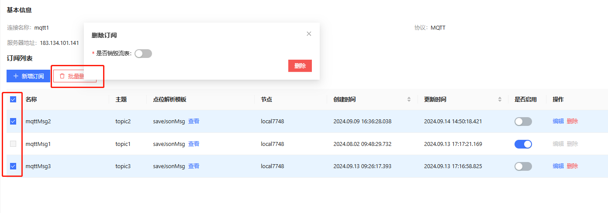

## 解析模板

数据解析模板管理包含功能：

* 展示所有解析模板信息，包括模板名称，协议，备注，模板的使用数和引用数，模板的创建时间和更新时间等。
* 新增/编辑/批量（删除）解析模板。

  图 19. 图 3-1 解析模板页面

  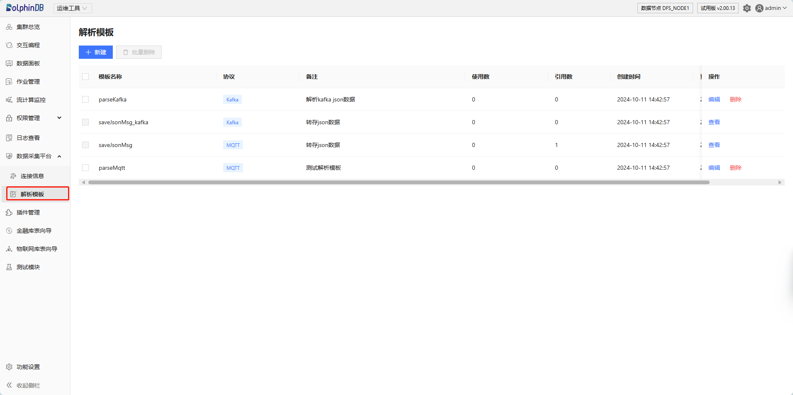

DolphinDB 内置了解析模板 saveJsonMsg\_Kafka 和 saveJsonMsg，用于将 JSON 数据转存至指定的流表中。

### 新建模板

点击新建，进入创建模板界面。填写模板名称、协议（目前仅支持 MQTT 和 Kafka 协议）、备注信息及自定义模板代码。

注意：Kafka 的数据解析模板返回值需要为一个表。

图 20. 图 3-2 创建模板

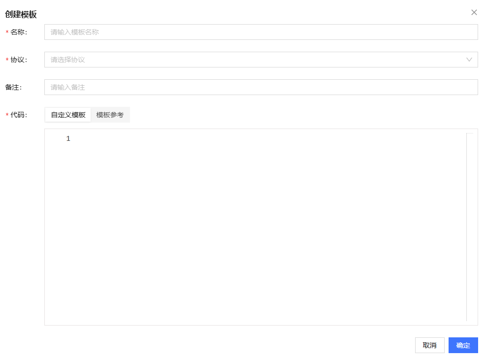

可点击模板参考，根据参考模板编辑代码。

图 21. 图 3-3 模板参考

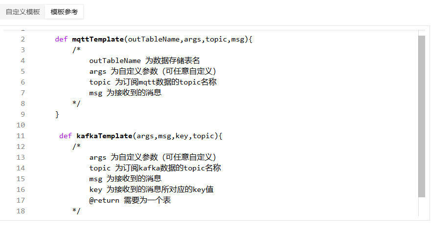

### 编辑/删除模板

用户可对已有模板进行编辑和删除操作。内置模板和已被使用的模板无法进行修改和删除。

点击对应模板右侧的”编辑“，即可修改模板信息。

图 22. 图 3-4 编辑模板

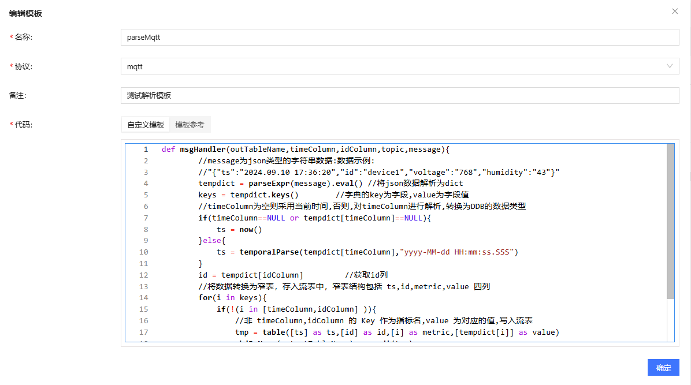

点击”删除“即可删除单个模板，多选模板则可进行批量删除。

图 23. 图 3-5 删除单个模板

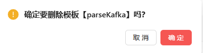

图 24. 图 3-6 批量删除模板

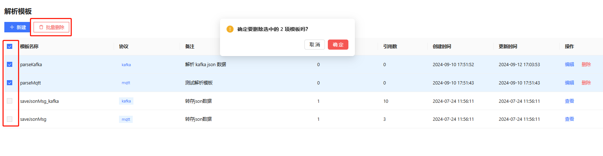

