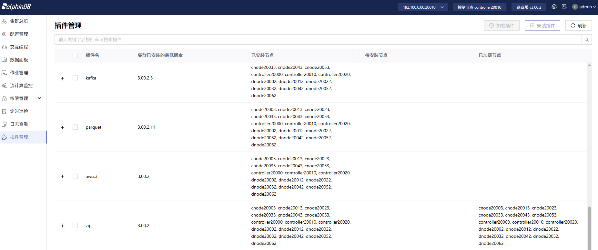
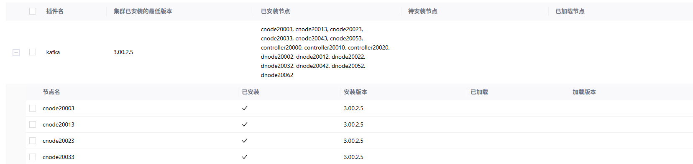
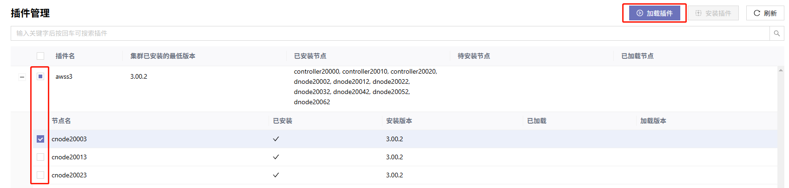
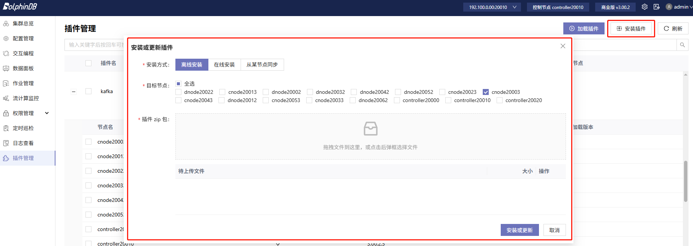

# 插件管理

通过插件管理界面，管理员用户可以在任一节点上统一管理集群中的插件，包括查看插件版本、一键安装与加载插件，从而确保插件版本与集群中部署的 DolphinDB server
版本一致，避免节点间插件版本不一致的问题。

## 查看插件信息

在集群中任一节点以管理员身份登录 Web 客户端，即可从侧边栏进入**插件管理**页面。

### 集群总览

插件管理的主页面展示了当前集群中所有已安装的插件列表，包括每个插件在集群中的最低版本、已安装该插件的节点以及当前已加载该插件的节点等信息。用户可以通过顶部的搜索栏快速查找特定插件。

注： 未启动的节点将统一显示在**待安装节点**下。请确保所有节点正常运行，再进行插件管理。

图 1. 图 1 插件总览

### 节点详情

点击插件前的“**+**”按钮，可查看该插件在各个节点的安装和加载情况：

图 2. 图 2 插件管理节点详情

## 加载已安装插件

如需将某一插件加载到集群中所有已安装该插件的节点，可选择目标插件并点击右上角**加载插件**。

如需将插件加载到集群中特定节点，可展开目标插件下的二级菜单，选择要加载的节点，并点击右上角**加载插件**。

图 3. 图 3 加载插件

注： 若节点所安装的插件版本与 DolphinDB server 的大版本（如 2.00.x 和
3.00.x）不一致，则插件无法加载。与 DolphinDB 大版本不一致的插件将显示在列表顶部，可参考后文“安装或更新插件”一节解决。

## 安装或更新插件

插件管理页面提供三种插件的安装/更新方式，用户可根据需要进行选择。

点击页面右上角**安装插件**，即可打开弹窗界面。

图 4. 图 4 安装或更新插件界面

### 离线安装

适用于离线环境无法在线安装，或安装自己开发的插件的场景。官方插件安装包可以在 [DolphinDB 插件市场](https://marketplace.dolphindb.cn/)下载。若安装自己开发的插件，需要确保插件 ZIP 包命名符合 DolphinDB
插件市场命名格式，插件开发教程详见[官方文档](../../../plugins/plg_dev_tutorial.md)。插件命名格式说明：

<插件名>-<操作系统>-<CPU架构>-<server版本号>-<插件版本号>-<编译标识(可选)>.zip，例如
*arrow-Linux-X86-3.00.2-3.00.2.zip*。

* 插件名：字母和数字的组合
* 操作系统：Linux 或 Windows
* CPU 架构：X86, ARM32 或 ARM64
* server 版本号：3 个数字段，以 . 号分隔，例如 3.00.2
* 插件版本号：3 到 5 个数字段，以 . 号分隔，例如 3.00.2 或 3.00.2.1.1
* 编译标识（可选）：JIT 或 ABI

在弹窗中选择**离线安装**。选择目标节点并上传 ZIP 包后，点击**安装或更新**即可。

### 在线安装

用户可通过在线安装的方式，直接获取 DolphinDB 官方提供的最新（或指定）版本插件。在线安装时节点所在机器必须能够访问 DolphinDB
官方的插件市场，默认访问国内的插件市场。

在弹窗中选择**在线安装**，选择要安装/更新的插件、目标节点、插件版本（默认为与当前 DolphinDB server
匹配的最新版本）和插件仓库，点击**安装或更新**即可。此方式与使用内置函数`installPlugin`效果相同，详情可参见[函数文档](../../../funcs/i/installPlugin.md)。

注： 插件仓库分为国内与国外两个地址，使用在线安装时必须确保节点所在机器能够访问至少其中一个仓库（默认为国内仓库）。若节点位于海外，建议选择国外仓库以提升速度。

### 从其他节点同步

若集群中某一节点安装了插件，或节点之间安装的插件版本不一致时，可以使用同步功能将指定节点的插件同步到其他节点。

在弹窗中选择**从某节点同步**，选择要安装/更新的插件、目标节点、源节点，点击**安装或更新**即可。

