# 查询向导

Web 提供查询向导功能。用户可使用向导查询或脚本查询两种方式，并在查询成功后预览、导出结果数据。

* 向导查询是指用户可通过填写表单的方式针对某表设置查询条件，该操作等同于对 where 条件和筛选字段进行界面化定义，其动态生成的 SQL
  语句将展示在编辑器中。成功查询后，用户可预览并直接下载 CSV 文件的结果数据。
* 脚本查询则是指用户可直接在界面中编写 SQL 脚本，在成功执行后预览并导出数据。

## 新建查询

点击图 1 红框中位于表名同行最右方的图标以打开弹窗。

图 1. 图1 点击图标以进入界面

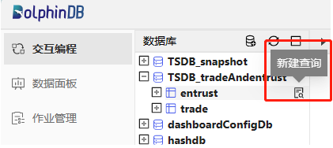

弹窗界面如图 2 所示。

图 2. 图2 查询界面

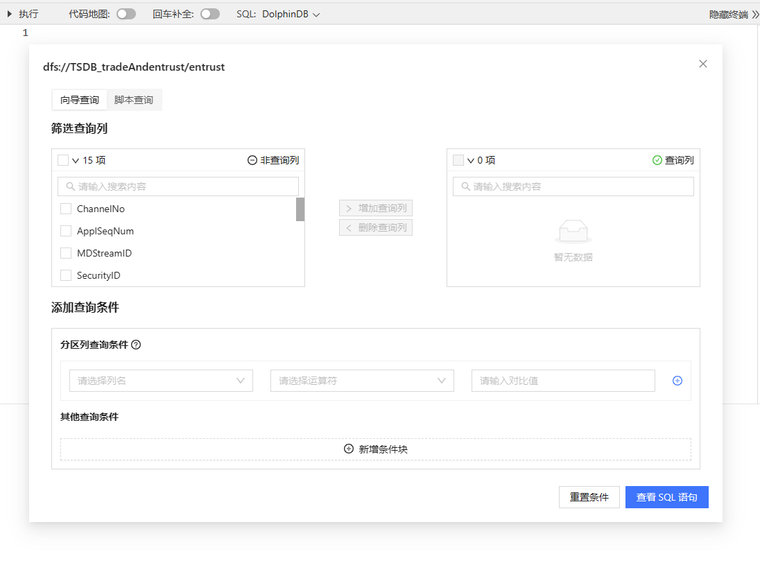

用户可单击图 3 中红框的对应文本以切换查询方式。

图 3. 图3 两种查询方式

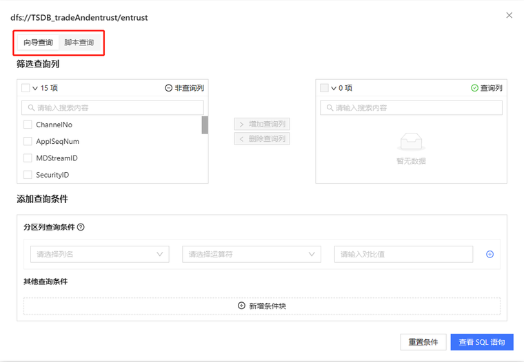

接下来将依次介绍两种查询方式的具体使用。

## 向导查询

如图 4 所示，向导查询界面中主要包括两个模块——“筛选查询列”和“添加查询条件”。

图 4. 图4 向导查询界面

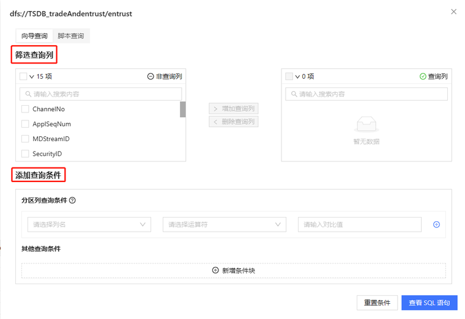

### 查询列

该模块主要分为左右两个选择框和中间的动作按钮。

如图
5，左边为非查询列的选择框，用户可在此勾选指定列以增加查询列；右边为查询列的选择框，用户可在此勾选指定列以删除查询列。中间为“增加查询列”和“删除查询列”的动作按钮，其功能如名。

图 5. 图5 筛选查询列的主要模块

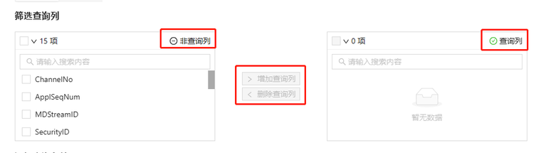

#### 增加查询列

如图 6 所示

* 在左边的非查询列中，用户可勾选列名前的方框以选择一个或多个列；亦可点击项目数前的方框以实现全选；
* 选中列后再点击“增加查询列”按钮；
* 操作成功后，非查询列中的指定列将移动到查询列中，且两边的统计列数将发生对应变化。

图 6. 图6 增加查询列

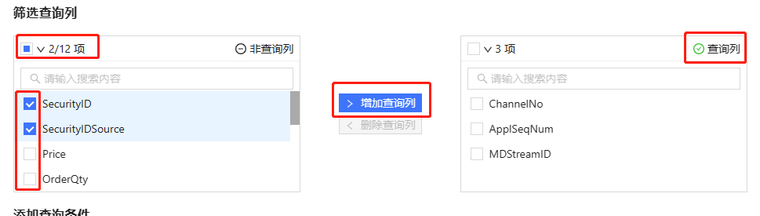

#### 删除查询列

如图 7 所示

* 在右边的查询列中，用户可勾选列名前的方框以选择一个或多个列；亦可点击项目数前的方框以实现全选；
* 选中列后点击“删除查询列”按钮；
* 操作成功后，查询列中的指定列将移动到非查询列中，且两边的统计列数将发生对应变化。

图 7. 图7 删除查询列

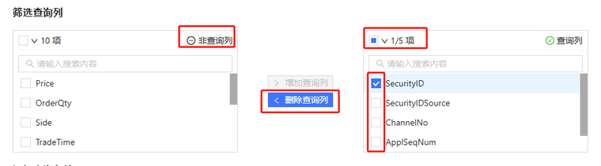

### 查询条件

查询条件包含三个必填项——“列名”、“运算符”和“对比值”。用户可设置一个或多个查询条件，条件之间存在“且”、“或”的逻辑关系。

如图 8 所示，该模块主要分为分区列查询条件和其他查询条件，其逻辑关系为“且”。

图 8. 图8 添加查询条件的主要模块

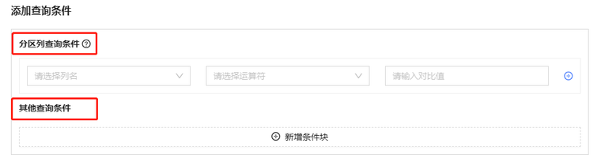

#### 分区列查询条件

若当前表中存在分区列，则用户须至少填写一个分区列查询条件。分区列的查询条件间只支持“且”的逻辑关系。

若当前表中不存在分区列，则将不显示此模块。

**新增分区条件**

下拉框中将显示当前表支持查询的所有分区条件列。如图 9 所示，单击下拉框，选择分区条件列。

注： 目前已支持大多数列类型，可参考本文[支持列小节](#yhp_srx_nyb__section_dbz_vjv_yzb)。

图 9. 图9 新增分区列

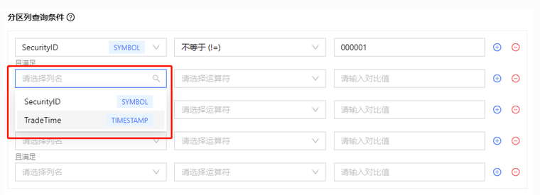

**新增条件运算符**

下拉框中将显示当前类型的分区条件列所支持的所有运算符。如图 10 所示，单击下拉框，选择条件运算符。

图 10. 图10 新增条件运算符

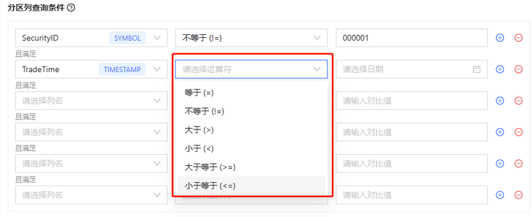

**新增条件对比值**

根据运算符的不同，对比值会出现下拉框、日期表等，也可能需要用户手动输入。[列类型和运算符的说明小节](#yhp_srx_nyb__section_dbz_vjv_yzb)中将对此进行详细说明。

**新增条件项**

如图 11 所示，用户可单击图标，增加条件项。新增条件项与已增条件项为“且”的逻辑关系。

图 11. 图11 新增条件项

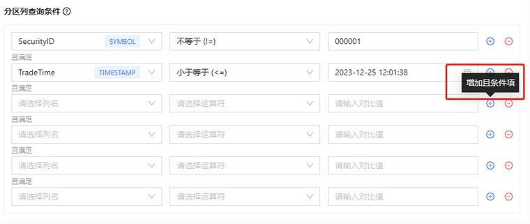

**删除条件项**

如图 12 所示，用户可单击图标，删除条件项。

图 12. 图12 删除条件项

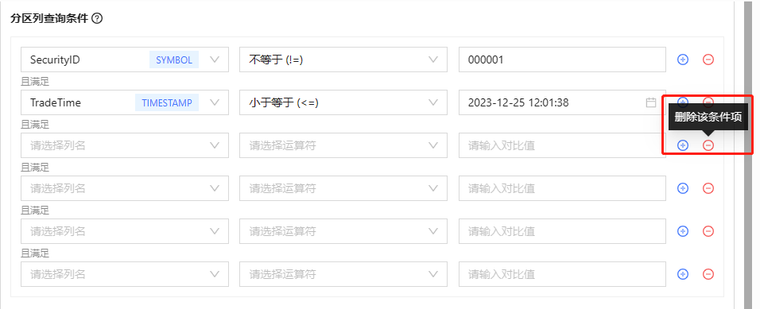

#### 其他查询条件

此处可填写当前表支持查询的列中除分区列以外的所有列构成的查询条件。查询条件间支持“且、“或”的逻辑关系。

注： 目前已支持大多数列类型，可参考本文[支持列小节](#yhp_srx_nyb__section_dbz_vjv_yzb)。

图 13. 图13 其他查询条件初始状态

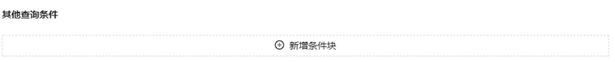

图 14. 图14 条件块与条件项

如图14 所示，其他查询条件中包含“条件块”与“条件项”。

条件块与条件块间的逻辑关系为“或”，用户可创建一个或多个条件块。

条件块由条件项组成，一个条件块中可以包含一个或多个条件项，条件项的逻辑关系为“且”。

**新增条件块**

如图 15 所示，用户可单击图标，增加条件块。新增条件块与已增条件块为“或”的逻辑关系。

图 15. 图15 新增条件块

**删除条件块**

如图 16 所示，用户可单击图标，删除条件项。

图 16. 图16 删除条件块

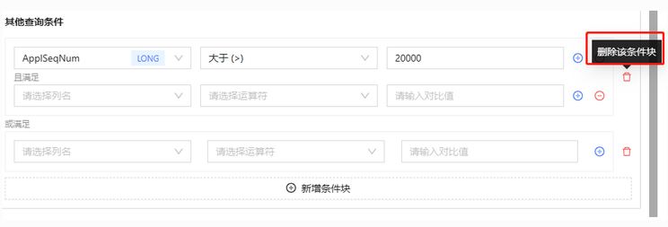

**新增条件项**

如图 17 所示，用户可单击图标，增加条件项。新增条件项与同条件块中的已增条件项为“且”的逻辑关系。

图 17. 图17 新增条件项

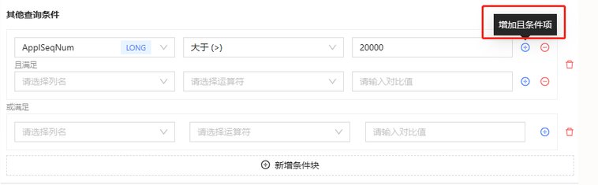

**删除条件项**

如图 18 所示，用户可单击图标，删除条件项。

图 18. 图18 删除条件项

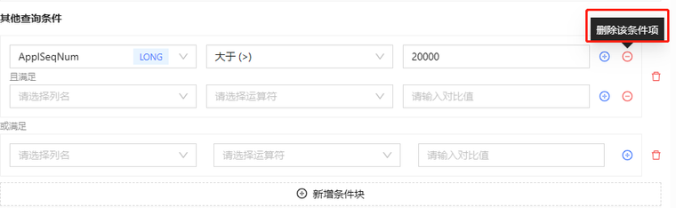

**新增条件列**

下拉框中将显示当前表支持查询的条件列。如图 19 所示，单击下拉框，选择条件列。

图 19. 图19 新增查询列

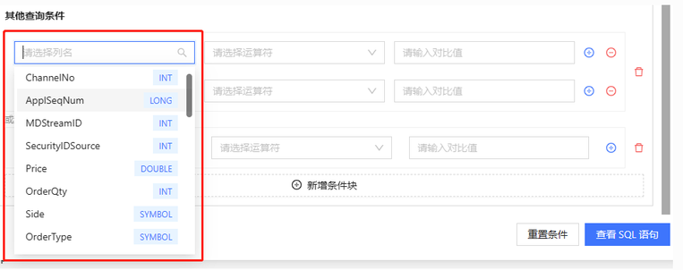

**新增条件运算符**

下拉框中将显示当前类型的条件列所支持的所有运算符。如图 20 所示，单击下拉框，选择条件运算符。

图 20. 图20 新增条件运算符

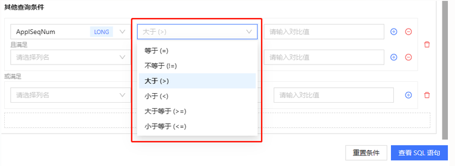

**新增条件对比值**

根据运算符的不同，对比值会出现下拉框、日期表等，也可能需要用户手动输入。[列类型和运算符的说明小节](#yhp_srx_nyb__section_dbz_vjv_yzb)中将对此进行详细说明。

#### 列类型与预算符的说明

以下为支持的列类型。

|  |  |  |  |
| --- | --- | --- | --- |
| **列类型** | **示例** | **分类** | **范围** |
| BOOL | 1b, 0b, true, false | Logical | 0~1 |
| SHORT | 122h | Integral | -2 15 +1~2 15 -1 |
| INT | 21 | Integral | -2 31 +1~2 31 -1 |
| LONG | 22l | Integral | -2 63 +1~2 63 -1 |
| DATE | 2013.06.13 | Temporal |  |
| MONTH | 2012.06M | Temporal |  |
| TIME | 13:30:10.008 | Temporal |  |
| MINUTE | 13:30m | Temporal |  |
| SECOND | 13:30:10 | Temporal |  |
| DATETIME | 2012.06.13 13:30:10 or 2012.06.13T13:30:10 | Temporal | [1901.12.13T20:45:53, 2038.01.19T03:14:07] |
| TIMESTAMP | 2012.06.13 13:30:10.008 or 2012.06.13T13:30:10.008 | Temporal |  |
| NANOTIME | 13:30:10.008007006 | Temporal |  |
| NANOTIMESTAMP | 2012.06.13 13:30:10.008007006 or 2012.06.13T13:30:10.008007006 | Temporal | [1677.09.21T00:12:43.145224193, 2262.04.11T23:47:16.854775807] |
| FLOAT | 2.1f | Floating | 有效位数: 06~09 位 |
| DOUBLE | 2.1 | Floating | 有效位数: 15~17 位 |
| SYMBOL |  | Literal |  |
| STRING | “Hello” or ‘Hello’ or `Hello | Literal |  |
| DATEHOUR | 2012.06.13T13 | Temporal |  |
| DECIMAL32(S) | 3.1415926$DECIMAL32(3) | Decimal | (-1\*10^(9-S), 1\*10^(9-S)) |
| DECIMAL64(S) | 3.1415926$DECIMAL64(3), , 3.141P | Decimal | (-1\*10^(18-S), 1\*10^(18-S)) |
| DECIMAL128(S) | 3.1415926$DECIMAL128(3) | Decimal | (-1\*10^(38-S), 1\*10^(38-S)) |

注意：

* 在查询 SYMBOL 和 STRING 类型列时须避免使用单引号（'），否则会导致查询失败。
* 暂不支持筛选各类型列的空值，如有需要请自行编写 SQL 查询。

更多可参考 [DolphinDB-数据类型](../../../progr/data_types.md)。以下为支持的运算符。

| 列类型 | 支持的运算符 |
| --- | --- |
| 时间类型、数值类型 | =, !=, >, <, >=, <= |
| SYMBOL, STRING | like, not like, in, not in, =, != |
| 其他类型 | =, != |

**匹配（like）或 不匹配（not like）的使用说明：**输入对比值时须带有通配符 “%”。“%”
表示任意 0 个或者多个字符，可匹配任意类型和长度的字符。

注： 使用时请注意区分大小写。更多可参考 [DolphinDB-like](../../../progr/sql/like.md)。

以下为使用示例：

* 688%（匹配以 “688” 开头的字符串，能够匹配例如 “688101.SH”、”688101”的字符串）
* %SZ%（匹配包含 “SZ” 的字符串， 能够匹配例如 “300951.SZ”、 “SZ.300951”的字符串）
* %6（匹配以 “6” 结尾的字符串，能够匹配例如 “abcd6” 的字符串）

包含（in）或者不包含（not in）的使用说明：

用户可在对比值的下拉框中选择一个或多个枚举值。注意，下拉框中仅展示部分枚举值，且存在响应延时。用户可手动输入未显示的枚举值，单击回车键以完成操作。更多可参考
[DolphinDB-in](../../../progr/sql/in.md)。

关于其他运算符的更多说明可参考： [运算符](../../../progr/operators/operators.md)。

### 预览 SQL 语句

在填写完查询列与查询条件后，即可点击图 21 红框中的“查看 SQL 语句”以查看动态生成的 SQL 语句。

图 21. 图21 预览 SQL 语句

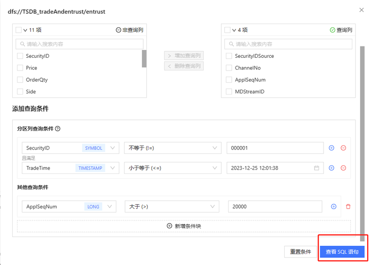

若需要清空当前页面的写入内容，则可点击“重置条件”。

图 22. 图22 动态生成的 SQL 语句示例

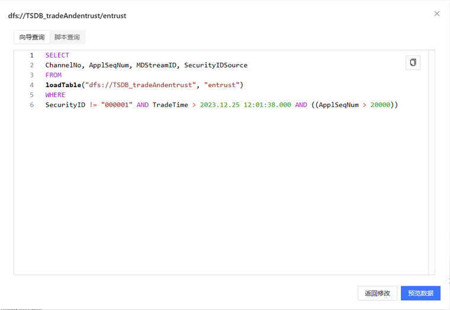

注意，该页面不支持修改。若需要修改，则点击“返回修改”。

如图 23 所示，用户可点击代码框右上角的符号以复制代码。

图 23. 图 23 复制 SQL 语句

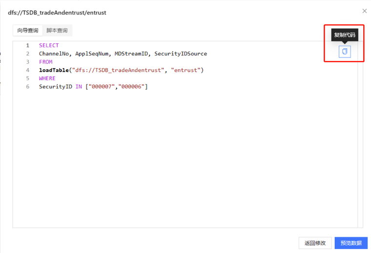

### 预览数据

如图 24 所示，在生成的 SQL 语句页面点击“预览数据”。

图 24. 图24 预览数据

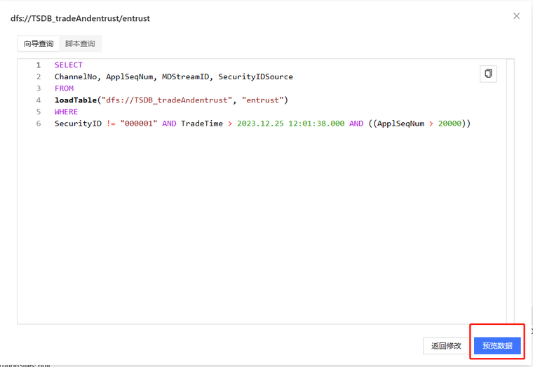

如图 25，预览数据页面将显示结果表格。

注意：预览数据最多可显示 2000 万行数据。若当前数据总量大于 2000 万行，则页面将显示截断后的数据。

图 25. 图25 预览数据的结果示例

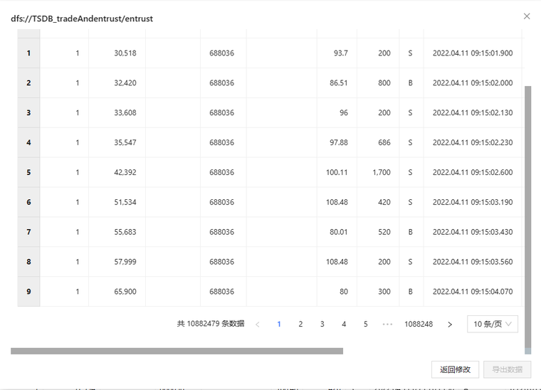

### 导出数据

如图 26，若需导出数据，则点击“导出数据”。将导出一个 CSV 文件。

注意：若当前数据总量大于 50 万行或结果为空，则不支持导出数据功能。

图 26. 图26 导出数据

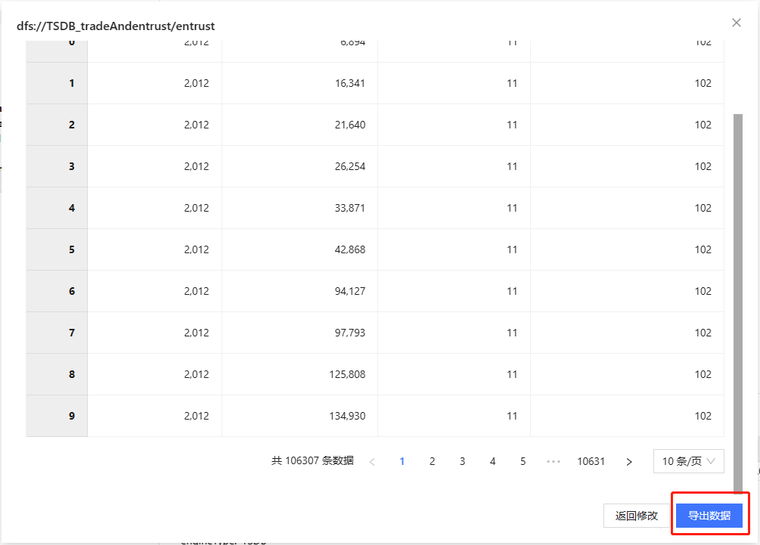

点击后即会弹出一个窗口，在此输入将导出的文件名。

图 27. 图27 填写导出数据的文件名

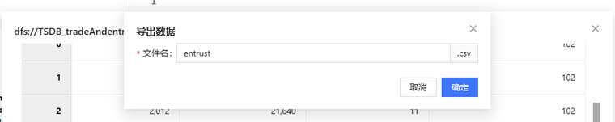

导出成功后，会显示一个“导出成功”的弹窗。用户可在下载队列中查看导出文件。

图 28. 图28 导出成功的弹窗

## 脚本查询

用户亦可在编辑界面中直接输入 SQL 语句以建立查询，在成功执行脚本后预览并导出数据。

### 输入脚本

进入界面后，会自动生成一个当前表的示例脚本。

如图 29 所示，用户可直接输入脚本。

图 29. 图29 脚本查询界面

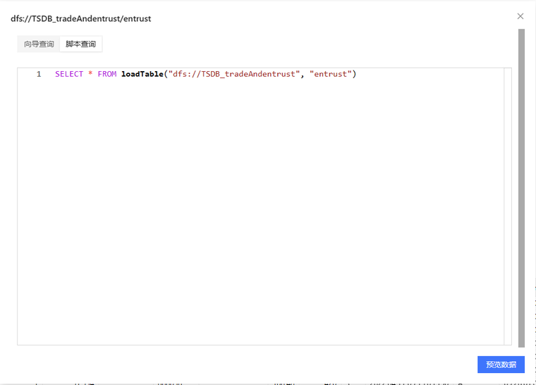

### 导出数据

导出数据可参考向导查询小节中的[对应内容](#topic_tlc_ljv_yzb)。

