# 定时巡检

巡检是确保系统的稳定性的重要环节，能够及时发现潜在隐患。为方便用户进行数据库巡检，DolphinDB 自 3.00.2.2
版本起实现了定时巡检功能，支持丰富的巡检指标，包括集群基础信息、集群运行状态和服务器运行状态等。同时提供了邮件告警功能，当发现异常时可以通过邮件及时通知用户。

DolphinDB 巡检操作基于 Web 页面进行，具备易操作、实时监控和便捷查看日志等优势。本文将详细介绍如何通过 Web 制定巡检计划、设置巡检指标以及查看巡检报告。

## 初始化

首次使用定时巡检功能时，必须由管理员 admin
在数据节点进行初始化，其他用户或节点无法执行该操作。点击左侧边栏的“定时巡检”，进入初始化页面，点击**初始化**按钮，等待系统完成初始化后，即可进入定时巡检主页。

通过定时巡检主页，可以新增巡检、设置邮件告警，搜索巡检计划等。通过该页面可以了解巡检任务的执行情况、启用或停止巡检计划、查看巡检结结果。

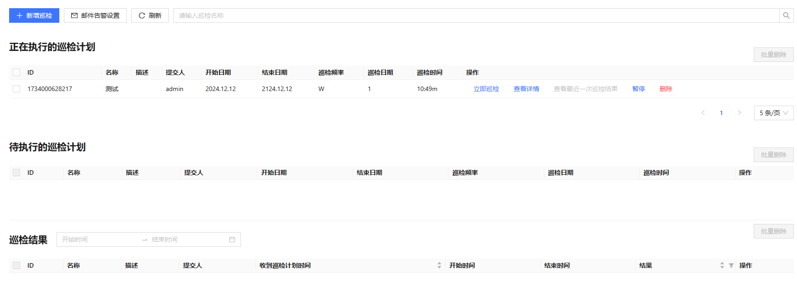

## 新增巡检

点击上图中**新增巡检**按钮，进入新增巡检计划页面，如下图。

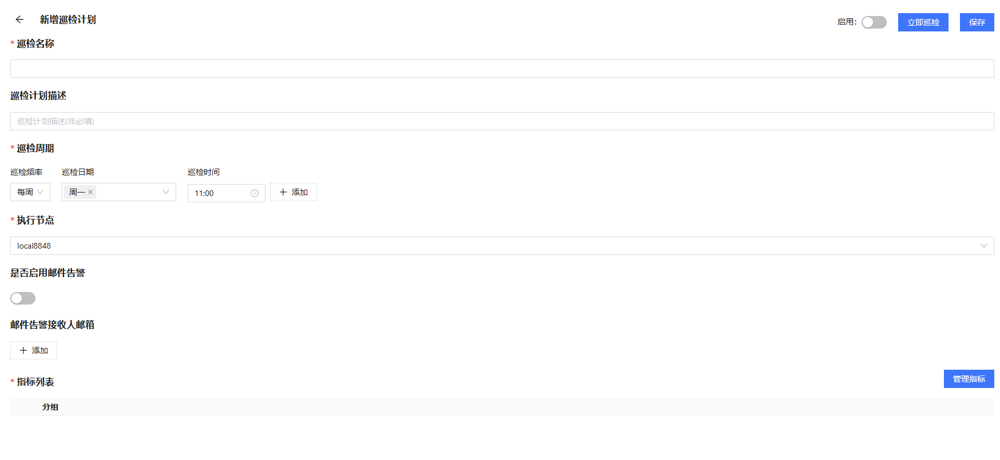

如果需要邮件告警，可以在主页中设置发送邮件的邮箱。在设置邮箱之前，需在集群中所有数据节点和计算节点上安装 httpClient
插件。安装完成后，点击主页上的**邮件告警设置**按钮，进入设置页面。然后，启用“是否启用”开关，填写发送人邮箱名称、账号、密码，以及邮箱的 SMTP
服务器地址和端口，最后保存设置。

点击主页中的**新增巡检**，进入新增巡检计划页面。通过该页面设置新的巡检计划。巡检计划中必须指定巡检名称、巡检周期、执行节点和巡检指标。用户可按需设置是否启用邮件告警的功能。

### 添加指标

新的巡检指标必须通过“添加指标”页面进行添加。点击上图的**管理指标**按钮，进入“添加指标”页面，如下图：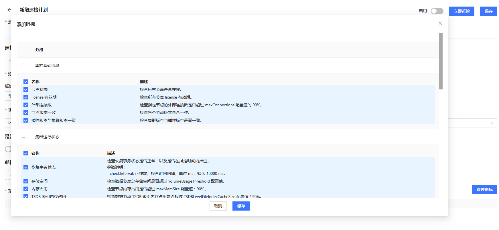

该页面列举了所有支持的巡检指标，用户可以点击勾选框以新增指标，取消勾选以删除指标，点击保存按钮保存到指标列表。

新增指标成功后，将回到“新增巡检计划”页面。通过该页面的“指标列表”，也可以进一步编辑或删除指标，如下图：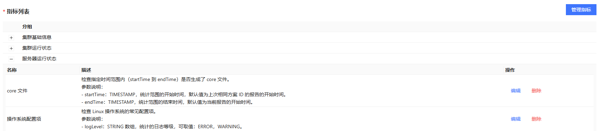

### 编辑指标

点击指标分组前的 **+/-** 按钮，可以展开或收展指标列表。点击**编辑**按钮可以查看指标脚本内容或编辑参数，如下图：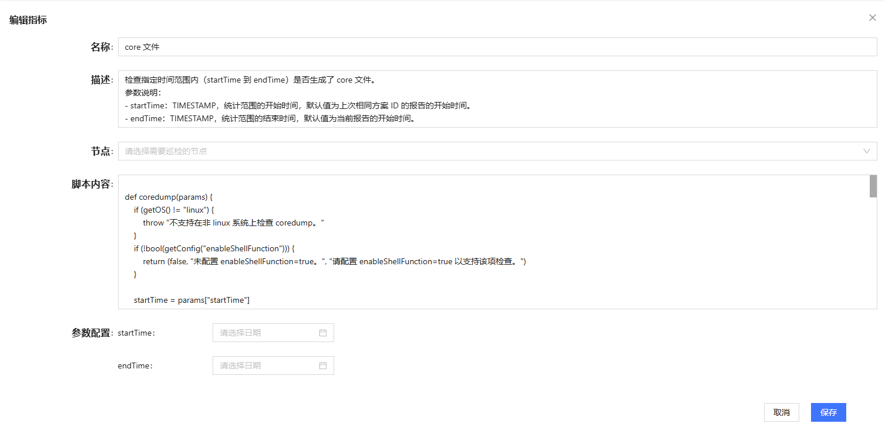

在描述中展示了该指标的详情和参数说明。所有指标的参数都设置了默认值，可通过页面下方的参数配置修改参数值。

巡检计划保存后，如果需要启用巡检任务，则点击**启用**开关；巡检计划将出现在“正在执行的巡检计划”列标中。点击**立即巡检**按钮，巡检计划将出现在“待执行的巡检计划”列表中。

## 巡检计划状态

”巡检结果“列表中会展示正在执行和已经执行完成的巡检结果。通过该列表，可以查看巡检的基本信息，包括名称、表示、起始时间、结果等。也可以点击**查看详细报告**、**查看日志**进一步查看详细信息**。**

## 查看报告和日志

巡检计划执行一段时间后，点击**刷新**按钮，查看巡检结果。若巡检计划已完成，可以点击查看详细报告：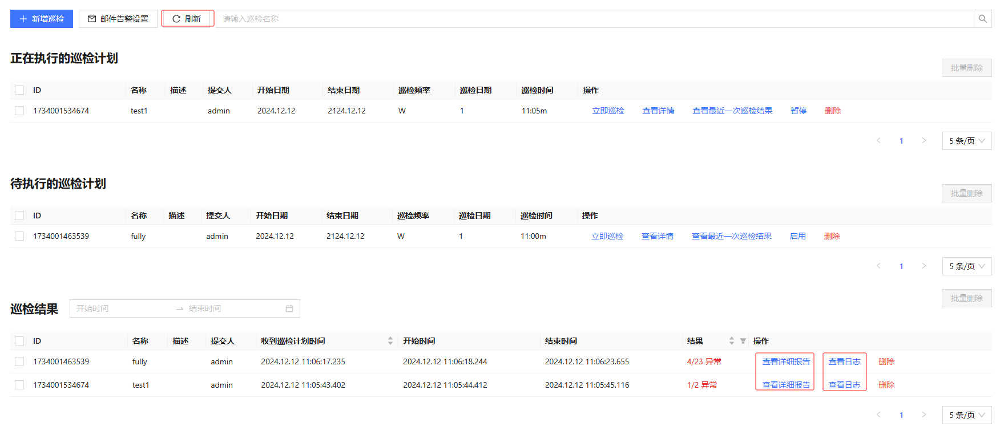

详细报告包含了该次巡检运行的指标的详细结果，其中，”巡检结果总览“下包含了所有失败的巡检指标。

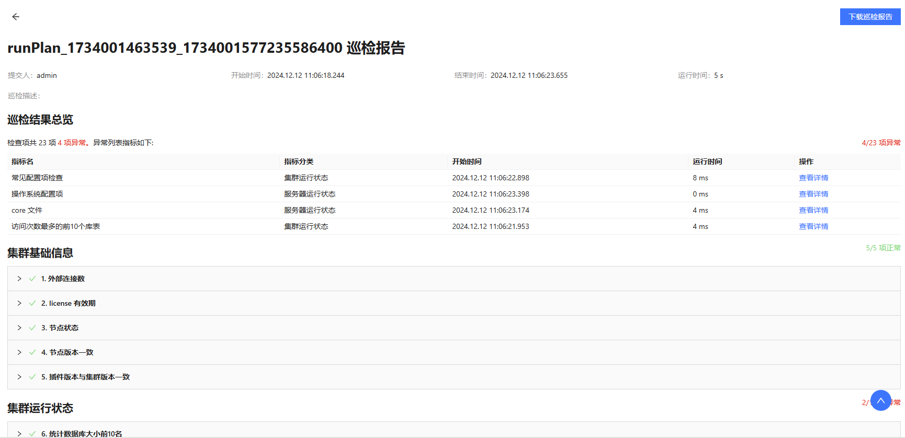

### 查看详报告

在巡检结果总览列表下，点击右侧的**查看详情**按钮，跳转到该指标的结果详情：

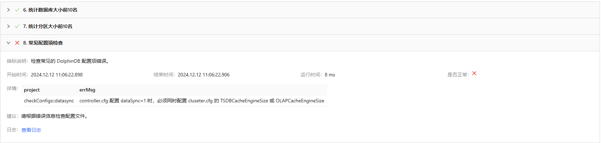

若需要下载巡检报告，可点击”巡检结果详细报告“页面的**下载巡检报告**按钮。

### 查看日志

在”巡检结果“列表中，点击巡检结果右侧的**查看日志**，可查对应巡检指标的完整日志。

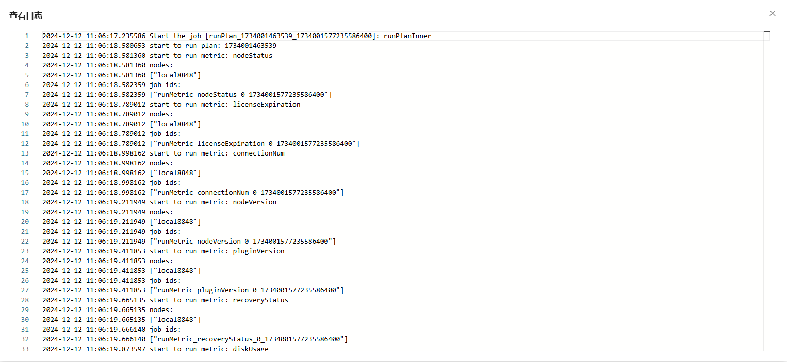

此外，如果启用了邮件告警，在巡检失败时，将向指定邮箱发送巡检结果概述邮件。

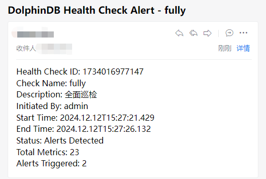

## 暂停和启用巡检

返回主页，点击图中**暂停**按钮，可停止正在执行的巡检。该计划将立即进入待执行的巡检队列，如图：

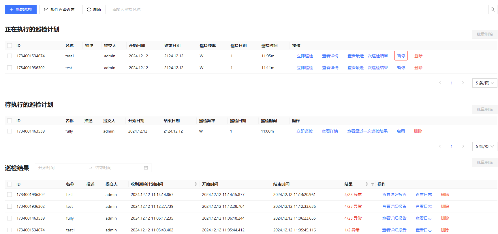

在“待执行的巡检计划”栏中，点击巡检计划列表后面的**启用**按钮，将启用该计划。同时该计划将立即进行”正在执行的巡检计划“列表中。

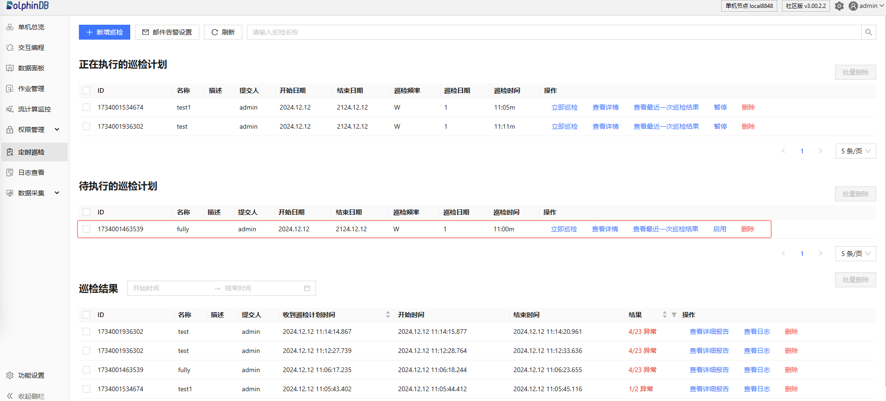

## 查看和编辑巡检

在“待执行的巡检计划”栏中，点击**查看详情**，进入巡检计划查看页面。在该页面可以查看巡检计划的详细内容。也可以修改指标，操作步骤参考“[新增巡检](#topic_ejp_tyg_rdc)”小节，本节不再赘述。

## 删除巡检计划或结果

返回主页，在”待执行的巡检计划“栏中，点击巡检计划列表右侧的**删除**按钮，可以删除该巡检计划。在”巡检结果“栏中，点击巡检结果列表右侧的**删除**按钮，可以删除该巡检结果。

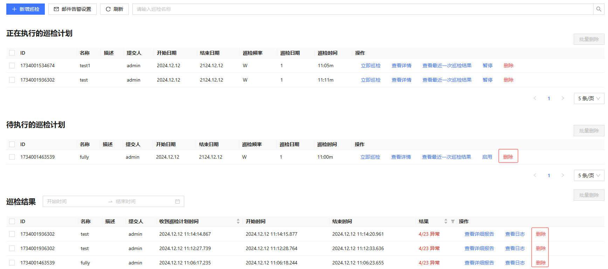

