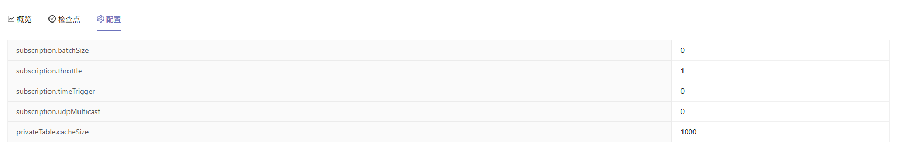

# 流图监控

通过流图监控模块，用户可以直观监控通过 Orca
创建的流图任务及其运行状态，帮助用户实时掌握各流图的任务数量、执行次数和当前状态等。点击流图名称跳转至详情页面，查看具体任务结构与执行情况。

## 流图基本信息

在此页面，用户可查看流图的基本信息。

点击**删除流图**标签可以删除该流图。点击**删除流图**后，将弹出确认框。输入“YES”并点击**删除流图**，即可完成删除操作。

## 流图可视化

该页面直观展示流图的结构与状态，帮助用户全面了解流图的组成与运行情况。包含三部分内容：概览、检查点和配置。

**概览**

可视化展示流图的节点结构及数据流向。

支持点击任一节点查看其详细信息。

向下滚动到底部，该表格展示当前流图的所有订阅线程及其状态。

**检查点**

展示当前流图中各作业及子作业的检查点信息。可查看每个作业的检查点配置及状态。

**配置**

展示该流图的订阅相关的配置信息。

