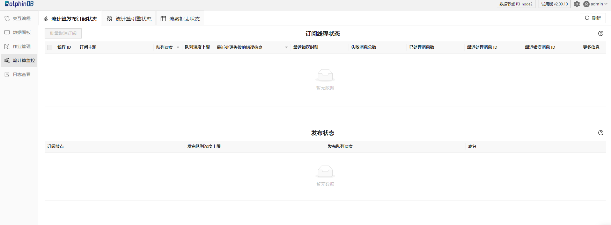
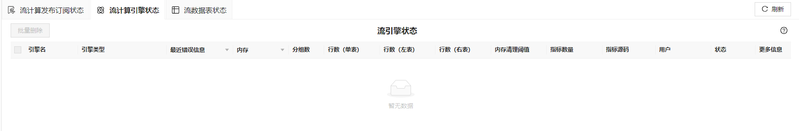
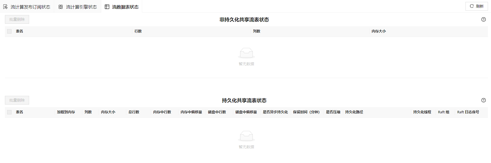

# 流计算监控

流计算监控负责监控各类流计算任务的状态。用户通过点击功能面板里的流计算监控进入监控页面，可以查看以下任务的状态：

* 流计算发布订阅状态：显示流计算订阅节点的工作线程的状态和、本地发布节点和它的所有订阅节点之间的连接状态。表中各字段说明可分别查看
  **getStreamingStat().subWorkers** 和 **getStreamingStat().pubConns**。
* 流计算引擎状态：显示各类流计算引擎的状态，表中各字段说明可查看
  **getStreamEngineStat()**。
* 流数据表状态：显示非持久化共享流数据表和持久化共享流数据表的状态，表中各字段说明可查看
  **getStreamTables** 函数。

通过页面顶部的标签可以切换并查看所需内容。顶部的刷新按钮可对当前标签页的内容进行即时刷新。

## 流计算发布订阅状态

### 订阅节点工作线程状态

* 主要展示内容为线程 ID、订阅主题、队列深度、队列深度上限、最近处理失败的错误信息、最近错误时刻、失败消息总数、已处理消息数、最近处理消息 ID
  和最近错误消息 ID。
* 其余信息全部放在更多信息列进行展示，用户可以进行点击查看，以弹窗的形式展示。
* 可使用颜色监控队列深度，0 为绿色，1-10000 为橙色，10000 以上为红色。
* 可按照队列深度进行倒序排列。
* 可按照错误信息进行倒序排列，有错误信息的放在上面。
* 由于表格宽度有限，错误信息进行简要展示，用户可点击查看详细错误信息。

### 发布状态

* 订阅节点：订阅节点的 IP 地址和端口号。
* 发布队列深度上限：发布节点上的消息队列深度的上限。
* 发布队列深度：发布节点上的当前消息队列深度。根据队列深度的不同，数字将呈现不同的颜色，当数字为 0 时，显示绿色；当数字为 1-10000
  时，显示橙色；当数字大于 10000 时，显示红色。
* 表名：发布节点上所有共享流数据表的表名。

## 流计算引擎状态

通过本页，用户可以了解系统创建好的所有流计算引擎，也可以选择引擎进行批量删除。

包含以下信息：

* 主要展示内容为流引擎的公共列：引擎名、引擎类型、最近错误信息、内存、分组数、行数（单表）、行数（左表）、行数（右表）、内存清理阈值、指标数量、指标源码、用户、状态。
* 对流引擎的私有信息放在更多信息列进行展示，用户可以进行点击查看，以弹窗的形式展示。
* 由于表格宽度有限，错误信息进行简要展示，用户可点击查看详细错误信息。
* 可按照内存进行降序排列。
* 指标源码过长，显示不完全时可通过鼠标悬浮查看到完整内容。

## 流数据表状态

通过本页，用户可以了解所有共享流数据表的状态、持久化线程的状态，也可以选择流数据表进行批量删除。

### 非持久化共享流数据表状态

本栏展示非持久化共享流数据表的状态，包含以下信息：

* 表名：流数据表的名称。
* 行数：内存中的行数。
* 列数：表所包含的列数。
* 内存大小：表所占用的内存大小。

### 持久化共享流数据表状态

本栏展示持久化共享流数据表的状态，包含以下信息：

* 表名：流数据表的名称。
* 加载到内存：是否已加载到内存。
* 列数：表所包含的列数。
* 内存大小：内存中保留的记录数（sizeInMemory）。
* 总行数：流数据表中的总记录数（totalSize）。
* 内存中行数：加载到内存中的总行数。
* 内存中偏移量：当前内存中数据相对总记录数的偏移量（memoryOffset）。memoryOffset = totalSize -
  sizeInMemory。
* 磁盘中行数：已经持久化到磁盘的记录总数。
* 磁盘中偏移量：当前磁盘上数据相对总记录数的偏移量。
* 是否异步持久化：是否采用异步的方式进行持久化。
* 保留时间：日志文件的保留时间，单位为分钟。
* 是否压缩：是否采用压缩存储。
* 持久化路径：流数据表在磁盘上的存储路径。若路径很长，未显示完整，则点击“详细”，查看完整的路径信息。
* 持久化线程：异步进行流数据表持久化的工作线程数量。
* Raft 组：高可用流数据表所属 Raft 组的ID。对于普通的流数据表，该值为空。
* Raft 日志序号：最新的 Raft 日志的逻辑序列号。

### 持久化线程状态

当开启了异步持久化时，将会在本栏显示持久化工作线程的状态。包含以下信息：

* 线程 ID：当前持久化工作线程的 ID。
* 订阅队列深度上限：持久化线程中消息队列深度的上限。
* 订阅队列深度：持久化线程中消息队列的深度。根据队列深度的不同，数字将呈现不同的颜色，当数字为 0 时，显示绿色；当数字为 1-10000
  时，显示橙色；当数字大于 10000 时，显示红色。
* 表名：已经持久化的流数据表。

