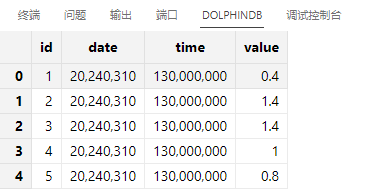
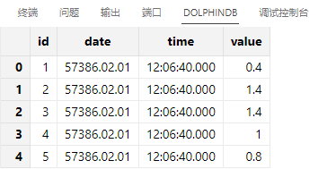
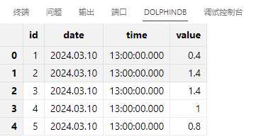

# 二进制记录导入

与其他数据格式相比，二进制记录文件可以更有效地存储和传输数据，保留我们数据的结构与格式，并且因为二进制文件是人类不可读的字符，具有更高的安全性。因此当我们面临较大数据量的传输且需要保护数据的安全时，此时我们可以使用二进制文件来进行数据的导入与导出。本节将介绍如何使用
DolphinDB 导入导出二进制文件。

## 数据准备

二进制记录文件的导入必须预先了解数据的格式，文件中的每行包含的记录有相同的数据类型和固定的长度才能进行解析。DolphinDB 提供了
`writeRecord` 函数，可用于将数据转换为特定格式的二进制文件。

首先，生成模拟数据表：

```
id = [1,2,3,4,5]
date = take(20240310,5)
time = take(130000000,5)
value = rand(10,5)\5
tmp = table(id,date,time,value)
```

使用 writeRecord 将数据转为二进制文件：

```
dataFilePath = "./binaryFile/demo1.bin"
f = file(dataFilePath,"w")
writeRecord(handle = f, object = tmp)
f.close()
```

注：

写入的二进制文件必须事先创建，writeRecord 写入的数据必须具有固定长度，因此无法写入字符串数据。

## 导入内存清洗并入库

DolphinDB 内置了 `loadRecord` 函数和 `readRecord!`函数用于加载二进制文件，其区别如下：

* `readRecord!`：将二进制文件转换为 DolphinDB 数据对象，但不可包含字符串类型。
* `loadRecord`：将每个字段长度固定的行式二进制文件加载到内存中，可包含字符串类型。

`readRecord!` 在读取二进制文件时，需要提前指定用于保存读取数据的变量，故需要先创建对应表结构用于存储数据：

```
tmpTB = table(1:0,["id","date","time","value"],[INT,INT,INT,DOUBLE])
```

在导入数据前，需要先使用 `file` 函数以可读的模式打开二进制文件：

```
dataFilePath = "./binaryFile/demo1.bin"
f = file(dataFilePath)
```

最后使用 `readRecord!` 导入数据并关闭文件：

```
readRecord!(f, tmpTB)
f.close()
tmpTB
```



上述文件中，我们是以 INT 类型保存的日期数据，如果直接将 tmpTB 中的类型转换为时间类型读取数据，读取的数据会是错误的：

```
tmpTB1 = table(1:0,["id","date","time","value"],[INT,DATE,TIME,DOUBLE])
f = file(dataFilePath)
readRecord!(f, tmpTB1)
f.close()
tmpTB1
```



此时我们可以先将以 INT 类型读取的数据中的时间字段转为字符串类型再使用 `temporalParse`
函数进行日期和时间类型数据的格式转换：

```
replaceColumn!(table = tmpTB, colName="date",
newCol=tmpTB.date.format("00000000").temporalParse("yyyyMMdd"))
replaceColumn!(table = tmpTB, colName="time",
newCol=tmpTB.time.format("000000000").temporalParse("HHmmssSSS"))
tmpTB
```



使用 `loadRecord` 导入二进制文件与加载文本文件类似，指定文件路径及数据的 schema
即可，无需预先创建存储的变量及打开文件。因为二进制文件无法自动识别数据类型，因而必须先指定
schema才可读取数据。`loadRecord` 的 *schema*参数为一个元组，组中的每个向量表示一个列的名称、数据类型。如果该列是字符串，还需指定字符串长度。

```
dataFilePath = "./binaryFile/demo1.bin"
schema = [("id",INT),("date",INT),("time",INT),("value",DOUBLE)]
loadRecord(dataFilePath, schema)
```

