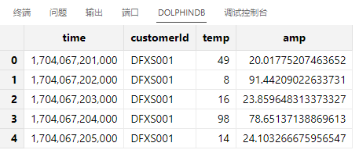
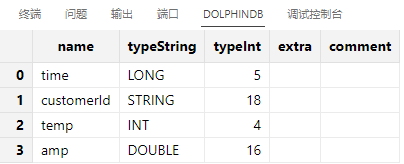
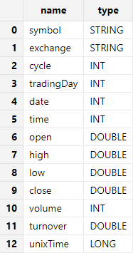
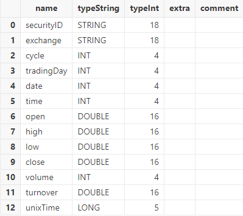
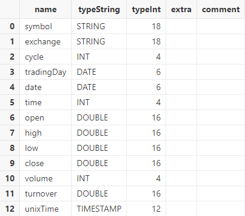
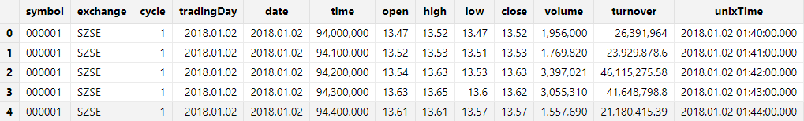
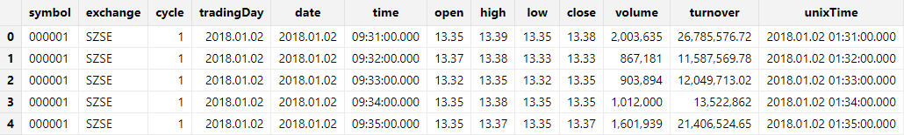

# HDF5 文件导入

HDF5（Hierarchical Data Format version
5）是一种用于存储和组织大型和复杂数据集的文件格式。它是一种灵活的数据存储格式，旨在支持各种类型的数据，包括数字图像、时间序列数据、科学模拟数据等。HDF5
文件可以容纳多种数据对象，如数据集（Dataset）、组（Group）、数据类型（Datatype）等，同时支持多种压缩技术和数据加密。HDF5文件具有层次结构，可以以树状方式组织数据，使得数据的存储和检索更加灵活和高效。

DolphinDB 开发了 HDF5 插件用于将 HDF5 文件导入 DolphinDB，并支持进行数据类型转换。本节将介绍如何使用 HDF5 插件导入 HDF5 文件。

## HDF5 插件安装

HDF5 插件默认安装，可直接使用以下脚本加载使用：

```
loadPlugin("hdf5")
```

## HDF5 文件加载函数介绍

DolphinDB HDF5 插件提供 `loadHDF5`, `loadPandasHDF5`,
`loadHDF5Ex`, `HDF5DS` 四个导入函数：

* `loadHDF5`：将 HDF5 文件中指定数据集加载为内存表，可在内存中对导入数据进行处理、分析。
* `loadPandasHDF5`：将由 Pandas 保存的 HDF5 文件中的指定数据集加载为 DolphinDB
  数据库的内存表。
* `loadHDF5Ex`：将 HDF5 文件中的数据集直接导入数据库中，包括分布式数据库和内存数据库。
* `HDF5DS`：将 HDF5 文件中的指定数据集划分为多个小数据源，可搭配 mr 函数进行灵活的数据处理。

通用参数详解见下表。

| **参数** | **说明** |
| --- | --- |
| filename | 字符串，表示数据文件的路径。 |
| datasetName | 字符串，表示 HDF5 文件中的 dataset 名称，即表名。 |
| schema | 表对象，用于指定各字段的数据类型。它包含以下两列：   * name：字符串，表示列名。 * type：字符串，表示各列的数据类型。 |
| startRow | 整数，指定从哪一行开始读取 HDF5 数据集。若不指定，默认从数据集起始位置读取。 |
| rowNum | 整数，指定读取 HDF5 数据集的行数。若不指定，默认读到数据集的结尾。 |

## 入门示例

### 载入内存后入库

`loadHDF5` 函数用于将数据导入 DolphinDB 内存表，其用法与 `loadText`
基本一致，区别在于导入 HDF5 文件中的数据还需要指定需要导入的数据集名称。

下例调用 `loadHDF5` 函数导入*[demo1.h5](scripts/demo1.h5)* 文件中的 data 数据集，并查看生成的数据表的结构。

```
dataFilePath = "./hdf5file/demo1.h5"
tmpTB = hdf5::loadHDF5(dataFilePath, "data");
select * from tmpTB
```



调用 schema 函数查看表结构（字段名称、数据类型等信息）：

```
tmpTB.schema().colDefs;
```



注：

如果 HDF5 文件是通过 Pandas 保存的，需要使用 `loadPandasHDF5` 函数加载。

将 HDF5 文件中的数据加载为内存表对象后，可以使用 `tableInsert` 或
`append!` 方法将数据写入分布式数据库。需要注意的是，目标库表必须提前创建。

建库和建表的脚本如下：

```
create database "dfs://demoDB" partitioned by HASH([SYMBOL,25])
create table "dfs://demoDB"."data"(
    time LONG,
    customerId SYMBOL,
    temp INT,
    amp DOUBLE
)
partitioned by customerId
```

注：

原始数据中，time 列为 LONG 类型。为方便展示如何将数据导入数据库，在建库建表时暂时将 time 列设置为 LONG
类型。关于时间类型的转换操作，请参见后文的详细说明。

完成建库建表后，可以使用以下脚本将数据导入到目标数据库中：

```
dfsTable = loadTable("dfs://demoDB", "data")
tableInsert(dfsTable, tmpTB)
```

### 直接导入数据库

除了显式构建内存表再入库的方法，DolphinDB 还提供了 `loadHDF5Ex`
方法，可以将数据加载、清洗、入库一次性完成。使用 `loadHDF5Ex` 方法前，需要在系统中创建相应的分布式库表。

以上一小节的样例数据 *[demo1.h5](scripts/demo1.h5)* 为例，使用
`loadHDF5Ex` 将 demo1.h5 文件的 data 数据集直接导入 demoDB 库：

```
// 清除库中数据
truncate("dfs://demoDB","data")
// 导入数据库
dataFilePath = "./hdf5file/demo1.h5"
hdf5::loadHDF5Ex(database("dfs://demoDB"), "data",
"customerId", dataFilePath, "data");
```

查看导入后的分布式表：

```
dfsTable = loadTable("dfs://demoDB","data")
select * from dfsTable
```


`loadHDF5Ex` 和 `loadHDF5` 的主要区别在于，使用
`loadHDF5Ex`
时，用户需要指定目标库表的信息，包括分布式库名、表名和分区列等。除了这部分特有的参数外，`loadHDF5Ex`
还提供了一个 *transform*
参数，用于封装数据清洗和预处理的逻辑。通过这个参数，用户可以在数据加载过程中直接进行处理，而无需将数据导入内存后再进行额外的处理。关于
*transform* 参数的具体使用方法，参考数据清洗与预处理小节。

## 数据导入格式处理

HDF5 插件在导入数据时，会通过文件属性自动获取数据类型并将其转换为 DolphinDB 对应的数据类型。支持的 HDF5 数据类型及数据转化规则见 [HDF5 插件 > 支持的数据类型](../../plugins/hdf5/hdf5.html#%E6%94%AF%E6%8C%81%E7%9A%84%E6%95%B0%E6%8D%AE%E7%B1%BB%E5%9E%8B)。

在某些情况下，自动识别的字段名称和数据类型可能无法完全满足实际需求。为此，DolphinDB 允许用户通过数据导入函数自定义
***schema***参数，对导入的数据进行结构调整，以更好地适应具体的应用场景。

### 提取 HDF5 文件 schema

在导入数据前，可以通过 `extractHDF5Schema` 函数预先获取 HDF5 文件指定数据集的 schema
信息，包括字段名称和数据类型。通过查看 schema，可以确认数据的列数、列名和数据类型是否符合预期。如果列名或数据类型不匹配，可以修改提取到的 schema
表，并在后续加载数据时通过指定正确的 *schema* 参数来确保数据得到正确解析。

例如，使用 `extractHDF5Schema` 函数获取hdf5Sample.h5 文件的表结构：

```
dataFilePath = "./hdf5file/hdf5Sample.h5"
hdf5::extractHDF5Schema(dataFilePath,"sample")
```



### 指定字段名称和类型

当系统自动识别的字段名称或者数据类型不符合预期时，可以通过修改 `extractHDF5Schema` 获取的 schema
表或直接创建 schema 表，为 HDF5 文件中的每列指定目标字段名称和数据类型。

**指定字段名称**

例如，将 *[hdf5Sample.h5](scripts/hdf5Sample.h5)*
文件的 symbol 列的列名修改为 securityID。可以通过以下脚本修改 schema：

```
dataFilePath = "./hdf5file/hdf5Sample.h5"
schemaTB = hdf5::extractHDF5Schema(dataFilePath,"sample")
update schemaTB set name = ["securityID","exchange","cycle","tradingDay","date","time","open","high","low","close","volume","turnover","unixTime"]
```

使用 `loadHDF5` 函数导入HDF5 文件时，将修改后的 schemaTB 作为 *schema*
参数传入：

```
tmpTB = hdf5::loadHDF5(dataFilePath, "sample", schemaTB);
```

调用 `schema` 函数查看表结构。可以发现，symbol 列名已修改为 securityID。

```
tmpTB.schema().colDefs;
```



**指定类型**

原始数据中的时间列是以 INT 类型保存的时间戳，在此处我们期望的 tradingDay 和 date 列类型为 DATE，unixTime 列类型为
TIMESTAMP，修改 schema 中 type 类型：

```
dataFilePath = "./hdf5file/hdf5Sample.h5"
schemaTB = hdf5::extractHDF5Schema(dataFilePath,"sample")
update schemaTB set type="DATE" where name="tradingDay" or name="date"
update schemaTB set type="TIMESTAMP" where name="unixTime"
```

使用 `loadHDF5` 函数导入 HDF5 文件时，指定 *schema* 参数为 schemaTB：

```
tmpTB = hdf5::loadHDF5(dataFilePath, "sample", schemaTB);
```

调用 `schema` 函数查看表结构。可以发现，导入的 tradingDay 列和 date 列的数据类型为
DATE，unixTime 列的数据类型为 TIMESTAMP。

```
tmpTB.schema().colDefs;
```



### 导入若干行数据

`loadHDF5` 接口支持从 HDF5 文件中按需导入数据集的指定行数。通过参数 *startRow* 和
*rowNum*，用户可以灵活控制从数据集的哪个起始行开始读取以及读取的行数，从而实现对大规模数据的分块导入或针对特定区间的数据处理需求。

从数据集的第 10 行开始读取 100 行数据：

```
tmpTB = hdf5::loadHDF5(dataFilePath, "sample", schemaTB, 9, 100);
```

注：

*startRow* 的行号从 0 开始，因此 *startRow*=9 意味着从数据集的第 10 行数据开始读取。

查看导入的行数：

```
select count(*) from tmpTB
/*
count
-----
100
*/
```

查看前 5 行的内容：

```
select top 5 * from tmpTB;
```



## 数据清洗与预处理

DolphinDB
提供了丰富的内置函数，支持各类常见的数据清洗任务，如：处理缺失值、重复值和异常值，数据去极值，数据中性化和标准化。本节仅通过部分常用场景的示例进行说明。

HDF5 插件支持两种数据加载方式：一种是将数据加载到内存后进行数据清洗和预处理（使用
`loadHDF5`），另一种是在数据加载过程中直接进行处理（使用
`loadHDF5Ex`）。这两种方法在数据清洗和预处理的基本操作上是相似的，区别在于
`loadHDF5Ex` 允许通过 *transform*
参数在数据加载时就执行清洗和预处理。具体来说，*transform*
参数接受一个一元函数，该函数将加载的数据表作为输入，并返回处理后的结果。处理后的数据会直接写入分布式数据库，而无需先将数据导入内存。此处，我们重点介绍
`loadHDF5Ex` 中 *transform* 参数的具体应用。

### 数值类型表示的日期和时间转换

在 HDF5 的数据集中，日期和时间通常以整型或长整型的形式存储。当有些时间列数据以整型的形式表示时，直接对其解析会导致结果不正确，以 hdf5Sample.h5
为例，其 time 列以数值形式表示时间，例如以 9:31:00.000 表示为 93100000。针对这种场景，可通过
`loadHDF5Ex` 函数的 *transform* 参数封装
`replaceColumn!` 函数实现类型转换。

首先，创建目标分布式数据库和表：

```
dataFilePath = "./hdf5file/hdf5Sample.h5"
dbPath = "dfs://testDB"
db = database(dbPath,VALUE,2018.01.02..2018.01.30)
schemaTB = hdf5::extractHDF5Schema(dataFilePath,"sample")
update schemaTB set type="DATE" where name="tradingDay" or name="date"
update schemaTB set type="TIME" where name="time"
update schemaTB set type="TIMESTAMP" where name="unixTime"
tb = table(1:0,schemaTB.name,schemaTB.type)
pt = db.createPartitionedTable(tb,`tb1,`date);
```

自定义函数 `i2t`，封装数据处理逻辑，将 time 列转换为 TIME 类型：

```
def i2t(mutable t){
    replaceColumn!(table=t, colName=`time, newCol=t.time.format("000000000").string().temporalParse("HHmmssSSS"))
    return t
}
```

注：

在自定义函数体内对数据进行处理时，请尽量使用本地的修改（以 ! 结尾的函数）来提升性能。

调用 `loadHDF5Ex` 函数，并且指定 *transform* 参数为 `i2t`
函数，系统会对文本文件中的数据执行 `i2t` 函数，并将结果保存到数据库中：

```
schemaTB = hdf5::extractHDF5Schema(dataFilePath,"sample")
update schemaTB set type="DATE" where name="tradingDay" or name="date"
update schemaTB set type="TIMESTAMP" where name="unixTime"
hdf5::loadHDF5Ex(database("dfs://testDB"), "tb1", "date", dataFilePath,"sample", schemaTB, , , i2t)
```

查看数据库中前 5 条数据，time 列数据符合预期：

```
select top 5 * from loadTable("dfs://testDB", "tb1")
```



### 填充空值

在实际数据处理中，我们通常需要进行缺值处理，如缺值删除、填充等。在 DolphinDB 中内置了 `bfill`,
`ffill`, `interpolate`,
`nullFill`
等函数填充空值。当内置函数要求多个参数时，我们可以使用部分应用将多参数函数转换为一个参数的函数。

例如，调用 `nullFill!` 函数对 HDF5 文件中的空值进行填充，可在定义的 tranform
函数中增加以下语句：

```
nullFill!(t,0)
```

## 并行导入

由于一个 HDF5 文件中可能包含多个数据集，因此 HDF5
文件的并行导入分为两个部分：一是多文件的并行导入，二是多数据集的并行导入。多文件的并行导入可参考文本文件的并行导入。下面我们介绍多数据集如何并行导入 。

首先使用 `lsTable` 函数获取文件中的所有数据集。

```
dataFilePath = "./hdf5file/demo1.h5"
datasets = hdf5::lsTable(dataFilePath).tableName
```

再定义入库函数，并调用 submitJob 函数提交后台任务，后台并行写入。

```
def writeData(dbName,tbName,file,datasetName){ //将数据写入数据库中
t = hdf5::loadHDF5(file,datasetName)
replaceColumn!(table = t, colName = `time, newCol = timestamp(t.time)) //转换时间类型
tableInsert(loadTable(dbName,tbName), t)
}
dbName = "dfs://demoDB_multi"
tbName = "data"
for(datasetName in datasets){
jobName = "loadHDF5" + datasetName
submitJob(jobName, jobName, writeData{dbName， tbName}, dataFilePath, datasetName)
}
```

最后使用 select 语句计算并行导入批量文件所需时间。

```
select max(endTime) - min(startTime) from getRecentJobs(2);
```

## 单个大文件导入

HDF5 插件也支持 `HDF5DS` 函数，用于将大文件切分为多个小的数据源，分成多个数据源导入，以避免内存不足的问题。与
`textChunkDS` 函数不同的是： `textChunkDS`
函数根据数据块的大小切分数据源，而 HDF5DS 函数则是预先指定需要切分的数据源数据量，将整个表均分。

下例展示了导入一个大文件的流程。首先将 dsNum 参数指定为 2，将样例数据均分为 2 份：

```
dataFilePath = "./hdf5file/demo1.h5"
datasetName = "data"
ds = hdf5::HDF5DS(dataFilePath, datasetName, , 2)
```

然后调用 `mr` 函数写入到数据库中：

```
truncate(dbUrl = "dfs://demoDB",tableName = "data")
pt = loadTable("dfs://demoDB", "data")
mr(ds = ds, mapFunc = append!{pt}, parallel = false)
```

## 复杂类型的解析

HDF5
文件中的复杂类型表通常包括复合类型表（H5T\_COMPOUND）、数组类型表（H5T\_ARRAY）及嵌套类型表（复合类型和数组类型的嵌套）。下面将以几个例子，介绍复杂类型表导入
DolphinDB 后的数据类型及结构。

### 复合类型表

HDF5 中的数据结构如下：

|  | 1 | 2 |
| --- | --- | --- |
| 1 | struct{a:1 b:2 c:3.7} | struct{a:12 b:22 c:32.7} |
| 2 | struct{a:11 b:21 c:31.7} | struct{a:13 b:23 c:33.7} |

在导入 DolphinDB 后会将每个元素都会被解析为一行数据，复合类型的 key 解析为列名，value
则作为数据值。每行的数据类型根据数据转换规则确定。

导入DolphinDB 后的结构如下：

| **a** | **b** | **c** |
| --- | --- | --- |
| 1 | 2 | 3.7 |
| 11 | 21 | 31.7 |
| 12 | 22 | 32.7 |
| 13 | 23 | 33.7 |

### 数组类型表

HDF5 中数据结构如下：

|  | 1 | 2 |
| --- | --- | --- |
| 1 | array(1,2,3) | array(4,5,6) |
| 2 | array(8,9,10) | array(15,16,17) |

在导入 DolphinDB 时也会将每一个数组解析为一行，字段名为 “array\_数据索引“。导入 DolphinDB 后的表结构如下：

| array\_1 | array\_2 | array\_3 |
| --- | --- | --- |
| 1 | 2 | 3 |
| 4 | 5 | 6 |
| 8 | 9 | 10 |
| 15 | 16 | 17 |

### 嵌套类型表

嵌套类型是指 HDF5 表中为复合类型表，复合类型表中的每一个元素中还包括了复合类型或数组类型数据。HDF5 中的结构如下：

|  | 1 | 2 |
| --- | --- | --- |
| 1 | struct{a:array(1,2,3)  b:2  c:struct{d:"abc"}} | struct{a:array(7,8,9)  b:5  c:struct{d:"def"}} |
| 2 | struct{a:array(11,21,31)  b:0  c:struct{d:"opq"}} | struct{a:array(51,52,53)  b:24  c:struct{d:"hjk"}} |

对嵌套的复杂类型，结果中会添加'A'前缀代表数组，'C'前缀代表复合类型。元素内部复合类型和数组类型的解析和上述非嵌套结构相同。最终导入 DolphinDB
的结构如下：

| Aa\_1 | Aa\_2 | Aa\_3 | b | Cc\_d |
| --- | --- | --- | --- | --- |
| 1 | 2 | 3 | 2 | abc |
| 7 | 8 | 9 | 5 | def |
| 11 | 21 | 31 | 0 | opq |
| 51 | 52 | 53 | 24 | hjk |

