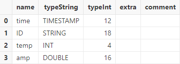

# Parquet 文件导入

Apache Parquet 文件采用列式存储格式，可用于高效存储与提取数据。

DolphinDB 开发了 Parquet 插件支持将 Parquet 文件导入和导出 DolphinDB，并进行数据类型转换。本节将介绍如何使用 Parquet 插件导入
Parquet 文件。

## Parquet 插件安装

用户可通过 DolphinDB 插件市场一键下载 Parquet 插件，如下所示：

```
installPlugin("parquet")
```

插件下载好后，用户通过 loadPlugins 函数加载 Parquet 插件：

```
loadPlugin("parquet")
```

## Parquet 文件加载函数介绍

DolphinDB Parquet 插件支持
`loadParquet`，`loadParquetEx`，`parquetDS`
三个导入函数。各导入函数的使用场景及区别如下：

* `loadParquet` ：将 Parquet 文件数据加载为内存表，可在内存中对导入数据进行处理、分析。
* `loadParquetEx`：将 Parquet 文件数据加载到 DolphinDB 数据库的分区表中。
* `parquetDS` ：将 Parquet 文件中的指定数据集划分为多个小数据源，可搭配 `mr`
  函数进行灵活的数据处理。

通用参数详解见下表。

| **参数** | **说明** |
| --- | --- |
| filename | 字符串，表示数据文件的路径。 |
| schema | 表对象，用于指定各字段的数据类型。它包含以下两列：   * name：字符串，表示列名。 * type：字符串，表示各列的数据类型。 |
| column | 整数向量，表示要读取的列索引。若不指定，读取所有列。 |
| rowGroupStart | 非负整数，从哪一个 row group 开始读取 Parquet 文件。若不指定，默认从文件起始位置读取。 |
| rowGroupNum | 整数，指定读取 row group 的数量。若不指定，默认读到文件的结尾。 |

## 入门示例

### 载入内存后入库

`loadParquet` 函数用于将数据导入 DolphinDB 内存表，其用法与
`loadText` 一致。下例调用 `loadParquet` 函数导入 *[demo1.parquet](scripts/demo1.parquet)*
文件，并查看生成的数据表的结构。

```
dataFile = "./parquetFile/demo1.parquet"
tmpTB = parquet::loadParquet(dataFile)
```

查看数据表：

```
select * from tmpTB;
```


调用 `schema` 函数查看表结构（字段名称、数据类型等信息）：

```
tmpTB.schema().colDefs;
```


将 Parquet 文件中的数据加载为内存表对像后，可以使用 `tableInsert` 或
`append!` 方法将数据写入分布式数据库。需要注意的是，目标库表必须提前创建。

建库和建表的脚本如下：

```
create database "dfs://demoDB" partitioned by HASH([SYMBOL,25])
create table "dfs://demoDB"."data"(
    time TIMESTAMP,
    customerId SYMBOL,
    temp INT,
    amp DOUBLE
)
partitioned by customerId
```

完成建库建表后，可以使用以下脚本将数据导入到目标数据库中：

```
dfsTable = loadTable("dfs://demoDB", "data")
tableInsert(dfsTable, tmpTB)
```

### 直接导入数据库

除了显式构建内存表再入库的方法，Parquet 插件的 `loadParquetEx` 方法可以将 Parquet
文件的数据加载、清洗、入库一次性完成。使用 `loadParquetEx` 方法前，需要在系统中创建相应的分布式库表。

以上一小节的样例数据 *demo1.parquet* 为例，使用 `loadParquetEx` 将
demo1.parquet 文件的 data 数据集直接导入 dfs://demoDB 库：

加载数据并入库：

```
truncate(dbUrl="dfs://demoDB", tableName="data")
parquet::loadParquetEx(database("dfs://demoDB"), "data", ["time"], dataFile)
pt = loadTable("dfs://demoDB", "data")
select * from pt
```


## 数据导入格式处理

### 提取 Parquet 文件 schema

在导入数据前，可以通过 `extractParquetSchema` 函数预先获取 Parquet 文件指定数据集的 schema
信息，包括字段名称和数据类型。通过查看 schema，可以确认数据的列数、列名和数据类型是否符合预期。如果列名或数据类型不匹配，可以修改提取到的 schema
表，并在后续加载数据时通过指定正确的 *schema* 参数来确保数据得到正确解析。

例如，使用 `extractParquetSchema` 函数获取*demo1.parquet* 文件的表结构：

```
dataFile = "./parquetFile/demo1.parquet"
parquet::extractParquetSchema(dataFile)
```


### 指定字段名称和类型

当系统自动识别的字段名称或者数据类型不符合预期时，可以通过修改 `extractParquetSchema`获取的 schema
表或直接创建 schema 表，为 Parquet 中的每列指定目标字段名称和数据类型。

**指定字段名称**

例如，将 *demo1.parquet* 文件的 customerId 列的列名修改为 ID。可以通过以下脚本修改 schema：

```
dataFile = "./parquetFile/demo1.parquet"
schemaTB = parquet::extractParquetSchema(dataFile)
update schemaTB set name = "ID" where name = "customerId"
```

使用 `loadParquet` 函数导入 Parquet 文件时，将修改后的 schemaTB 作为 *schema*
参数传入：

```
tmpTB = parquet::loadParquet(dataFile,schemaTB)
```

调用 `schema` 函数查看表结构。可以发现，customerId 列名已修改为 ID。

```
tmpTB.schema().colDefs;
```



**指定类型**

原始数据中的时间列是以 INT 类型保存的 temp 列，在此处我们期望的 temp 列类型为 DOUBLE 列，修改 schema 中 type 类型：

```
dataFile = "./parquetFile/demo1.parquet"
schemaTB = parquet::extractParquetSchema(dataFile)
update schemaTB set type = "DOUBLE" where name = "temp"
```

使用 `loadParquet` 函数导入 Parquet 文件时，指定 *schema* 参数为
schemaTB：

```
tmpTB = parquet::loadParquet(dataFile,schemaTB)
```

调用 `schema` 函数查看表结构。可以发现，导入的 temp 列的类型为 DOUBLE。

```
tmpTB.schema().colDefs;
```


### 导入指定列

Parquet 插件也支持导入特定列，但与文本文件在 schema 中指定导入列不同的是，Parquet 通过 *column*参数指定导入列：

```
parquet::loadParquet(dataFile, , [0,1,3])
```


## 数据清洗与预处理

DolphinDB
提供了丰富的内置函数，支持各类常见的数据清洗任务，如：处理缺失值、重复值和异常值，数据去极值，数据中性化和标准化。本节仅通过部分常用场景的示例进行说明。

Parquet 插件支持两种数据加载方式：一种是将数据加载到内存后进行数据清洗和预处理（使用
`loadParquet`），另一种是在数据加载过程中直接进行处理（使用
`loadParquetEx`）。这两种方法在数据清洗和预处理的基本操作上是相似的，区别在于
`loadParquetEx`允许通过 *transform*
参数在数据加载时就执行清洗和预处理。具体来说，*transform*
参数接受一个一元函数，该函数将加载的数据表作为输入，并返回处理后的结果。处理后的数据会直接写入分布式数据库，而无需先将数据导入内存。此处，我们重点介绍
`loadParquetEx`中 *transform* 参数的具体应用。

### 日期与时间类型之间的转换

若 Parquet 文件中日期以 TIMESTAMP 类型存储，在导入数据库时希望以 DATETIME 的形式存储，这种情况可通过
`loadParquetEx` 函数的 *transform* 参数转换该日期列的数据类型，步骤如下。

首先，创建目标分布式数据库和表：

```
create database "dfs://demoDB1" partitioned by HASH([SYMBOL,25])
create table "dfs://demoDB1"."data"(
    time DATETIME,
    customerId SYMBOL,
    temp INT,
    amp DOUBLE
)
partitioned by customerId
```

自定义函数 `t2d`，封装数据处理逻辑，将 time 列的类型替换为 DATETIME。

```
def t2d(mutable t){
    return t.replaceColumn!(`time,datetime(t.time))
}
```

调用 `loadParquetEx` 函数，并且指定 *transform* 参数为
`t2d` 函数，系统会对 Parquet 文件中的数据执行 `t2d`
函数，并将结果保存到数据库中。

```
dataFile = "./parquetFile/demo1.parquet"
db = database("dfs://demoDB1")
parquet::loadParquetEx(db,`data,`customerId,dataFile,,,,,t2d);
```

查看表内前 5 行数据。可以发现 time 列存储类型和格式正确：

```
select top 5 * from loadTable("dfs://demoDB1","data")
```


### 填充空值

在实际数据处理中，我们通常需要进行缺值处理，如缺值删除、填充等。在 DolphinDB 中内置了 `bfill`,
`ffill`, `interpolate`,
`nullFill`
等函数填充空值。当内置函数要求多个参数时，我们可以使用部分应用将多参数函数转换为一个参数的函数。

例如，调用 `nullFill!` 函数对 Parquet 文件中的空值进行填充，可在定义的 tranform
函数中增加以下语句：

```
nullFill!(t,0)
```

## 并行导入

我们可以通过调用 `submitJob` 函数，实现多 Parquet 文件的并行导入。首先定义写入函数：

```
def writeData(dbName, tbName, file){  // 将数据写入数据库中
    t = parquet::loadParquet(file)
    bfill!(t)   // 缺失值填充
    tableInsert(loadTable(dbName, tbName), t)
}
```

调用 `submitJob` 函数，后台多线程写入，批量导入数据。

```
dataDir = "./parquetFile/"
filePaths = dataDir+files(dataDir).filename
dbName = "dfs://demoDB_multi"
tbName = "data"
for(file in filePaths){
    jobName = "loadParquet"
    submitJob(jobName, jobName, writeData, dbName, tbName, file)
}
```

## 单个大文件导入

`parquetDS` 函数用于切分原始文件，生成多个数据源，从而避免内存不足的问题。但 parquetDS 在切分文件是根据文件中的
row group 切分数据，自动将每个 row group 切分为一个数据源，生成的数据源数量等于 row group 的数量。导入大文件时，首先使用
`parquetDS` 将数据切分为多个小的数据源。

```
dataFilePath = "./parquetFile/demo1.parquet"
ds = parquet::parquetDS(dataFilePath)
ds.size()
```

这里我们的样例数只切分了一份数据源，然后调用 `mr` 函数写入到数据库中。

```
pt = loadTable("dfs://demoDB","data")
mr(ds=ds, mapFunc=append!{pt}, parallel=false)
select * from pt
```

