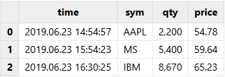

# 文本文件导入

DolphinDB 提供了灵活的文本文件导入机制，其内置函数支持通过明确指定列分隔符（如 CSV
文件中常用的逗号）来实现数据导入。而对于结构不规则、没有固定分隔符的文件，例如需要按预定列宽截取内容的特殊文件格式，用户需要借助 API
读取，或开发对应的插件进行导入。

本节将通过 CSV 文件导入实践案例，介绍文本文件的各种导入方法及各类常见问题的处理方法。

## 内置文本数据导入函数

目前 DolphinDB 支持
`loadText`，`pLoadText`，`loadTextEx`，`textChunkDS`
四个导入函数。其中：

* `loadText`：将文本文件导入为内存表。
* `ploadText`：并行导入文本文件为分区内存表，相比于
  `loadText`，其导入速度更快。
* `loadTextEx`：将文本文件直接导入数据库中，包括分布式数据库和内存数据库。
* `textChunkDS`：将文本文件划分为多个小的数据源，可以与 `mr`
  函数结合，进行灵活的数据处理。

通用参数详解见下表。

| **参数** | **说明** |
| --- | --- |
| filename | 字符串，表示数据文件的路径。 |
| delimiter | 字符串标量，表示数据文件中各列的分隔符。分隔符可以是一个或多个字符，默认是逗号（","）。 |
| schema | 表对象，用于指定各字段的数据类型。它可以包含以下四列（其中，name 和 type 这两列是必需的）:   * name：字符串，表示列名。 * type：字符串，表示各列的数据类型。 * format：字符串，表示数据文件中日期或时间列的格式。 * col：整型，表示要加载的列的下标。该列的值必须是升序。 |
| skipRows | 0 到 1024 之间的整数，表示从文件头开始忽略的行数，默认值为 0。 |
| arrayDelimiter | 数据文件中数组向量列的分隔符。默认是逗号。配置该参数时，必须同步修改 *schema* 的 type 列修为数组向量类型。 |
| containHeader | 布尔值，表示数据文件是否包含标题行，默认为空。若不设置，则系统将会分析第一行数据并确定其是否为标题行。 |

注：

上述内置函数支持从 DolphinDB 服务器所在的磁盘加载文本文件数据，因此用户需要先将已解压的文件传到 DolphinDB 所在的服务器。

## 入门示例

用户既可以通过显式构建内存表将数据加载至内存进行处理后再写入数据库，也可以选择直接将数据导入数据库。

### 载入内存后入库

DolphinDB 提供了 `loadText`
函数，能够将文本文件中的数据加载到内存，用户可以在内存中对数据进行处理和清洗，然后再将处理后的数据写入数据库。

以 CSV 文本文件 *[demo1.csv](scripts/demo1.csv)*为例，文件包含以下字段：时间戳（time）、设备
ID（customerId）、温度信息（temp）和电流信息（amp）：

```
time,customerId,temp,amp
2024.01.01T00:00:01.000,DFXS001,49,20.017752074636518
2024.01.01T00:00:02.000,DFXS001,8,91.442090226337313
2024.01.01T00:00:03.000,DFXS001,16,23.859648313373327
2024.01.01T00:00:04.000,DFXS001,98,78.651371388696134
2024.01.01T00:00:05.000,DFXS001,14,24.103266675956547
```

由于 CSV 文件以逗号作为分隔符，而 *delimiter* 参数的默认值为逗号，因此可以直接使用 `loadText`
函数将数据导入 DolphinDB 内存表：

```
dataFilePath = "/home/data/demo1.csv"
loadText(filename = dataFilePath)
```

也可以通过显式指定 *delimiter* 参数来明确分隔符：

```
tmpTB = loadText(filename = dataFilePath, delimiter = ",")
```

查看导入后的内存表：

```
select * from tmpTB;
```


在将数据加载到内存并进行处理后，可以使用 `tableInsert` 或 `append!`
方法将数据写入分布式数据库。需要注意的是，目标库表必须提前创建。

建库和建表的脚本如下：

```
create database "dfs://demoDB" partitioned by VALUE([2024.03.06])
create table "dfs://demoDB"."data"(
    time TIMESTAMP,
    customerId SYMBOL,
    temp INT,
    amp DOUBLE
)
partitioned by time
```

完成建库建表后，可以使用以下脚本将数据导入到目标数据库中：

```
dfsTable = loadTable("dfs://demoDB", "data")
tmpTB = loadText(filename = dataFilePath)
tableInsert(dfsTable, tmpTB)
```

### 直接导入数据库

除了显式构建内存表再入库的方法，DolphinDB 还提供了 `loadTextEx`
方法，可以将数据加载、清洗、入库一次性完成。使用 `loadTextEx` 方法前，需要在系统中创建相应的分布式库表。

以上一小节的样例数据 *[demo1.csv](scripts/demo1.csv)*
为例，使用 `loadTextEx` 将 *demo1.csv* 数据直接导入 demoDB 库：

```
// 清除库中数据
truncate("dfs://demoDB","data")
// 导入数据库
dataFilePath="/home/data/demo1.csv"
loadTextEx(dbHandle=database("dfs://demoDB"), tableName="data",
partitionColumns=["time"], filename=dataFilePath);
```

查看导入后的分布式表：

```
pt = loadTable("dfs://demoDB","data")
select * from pt
```


`loadTextEx` 和 `loadText` 的主要区别在于，使用
`loadTextEx`
时，用户需要指定目标库表的信息，包括分布式库名、表名和分区列等。除了这部分特有的参数外，`loadTextEx`
还提供了一个 *transform*
参数，用于封装数据清洗和预处理的逻辑。通过这个参数，用户可以在数据加载过程中直接进行处理，而无需将数据导入内存后再进行额外的处理。关于
*transform* 参数的具体使用方法，参考数据清洗与预处理小节。

## 数据导入格式处理

大多数系统在导入文本数据时需要用户手动指定数据格式，而 DolphinDB
在导入数据时能够**自动识别格式**，极大地方便了用户。自动识别数据格式包括两部分：字段名称和数据类型的识别。如果文件的第一行没有任何一列以数字开头，系统默认将其视为文件头，并将第一行的内容作为字段名称。DolphinDB
会提取部分数据作为样本，自动推断各列的数据类型。需要注意的是，由于推断基于部分数据进行，因此某些列的数据类型可能会被识别错误。不过，对于大多数文本文件，用户无需手动指定字段名称和数据类型，数据就能正确导入到
DolphinDB 中。

尽管如此，在某些情况下，自动识别的字段名称和数据类型可能无法完全满足实际需求。为此，DolphinDB 允许用户通过数据导入函数自定义
***schema***参数，对导入的数据进行结构调整，以更好地适应具体的应用场景。

### 提取文本文件 schema

在导入数据前，可以通过 `extractTextSchema` 函数预先获取文本文件的 schema
信息，包括字段名称、数据类型等。通过查看
schema，可以确认数据的列数、列名和数据类型是否符合预期。如果列数不匹配，检查是否为分隔符设置不正确；如果列名或数据类型不匹配，可以修改提取到的
schema 表，并在后续加载数据时通过指定正确的 *schema* 参数来确保数据得到正确解析。

例如，使用 `extractTextSchema` 函数获取*sample.csv* 文件的表结构：

```
dataFilePath="/home/data/sample.csv"
schemaTB=extractTextSchema(dataFilePath)
schemaTB;
/* output
name       type
---------- ------
symbol     SYMBOL
exchange   SYMBOL
cycle      INT
tradingDay DATE
date       DATE
time       INT
open       DOUBLE
high       DOUBLE
low        DOUBLE
close      DOUBLE
volume     INT
turnover   DOUBLE
unixTime   LONG
*/
```

### 指定字段名称和类型

当系统自动识别的字段名称或者数据类型不符合预期时，可以通过修改 `extractTextSchema` 获取的 schema
表或直接创建 schema 表，为文本文件中的每列指定目标字段名称和数据类型。

**指定字段名称**

例如，将 *sample.csv* 文件的 symbol 列的列名修改为 securityID。可以通过以下脚本修改 schema：

```
dataFilePath="/home/data/sample.csv"
schemaTB=extractTextSchema(dataFilePath)
update schemaTB set name = ["securityID","exchange","cycle","tradingDay","date","time","open","high","low","close","volume","turnover","unixTime"]
```

使用 `loadText` 函数导入文本文件时，将修改后的 schemaTB 作为 *schema* 参数传入：

```
tmpTB=loadText(filename=dataFilePath,schema=schemaTB);
```

调用 `schema` 函数查看表结构。可以发现，symbol 列名已修改为 securityID。

```
tmpTB.schema().colDefs;
/* output
name       typeString typeInt extra comment
---------- ---------- ------- ----- -------
securityID SYMBOL     17
exchange   SYMBOL     17
cycle      INT        4
tradingDay DATE       6
date       DATE       6
time       INT        4
open       DOUBLE     16
high       DOUBLE     16
low        DOUBLE     16
close      DOUBLE     16
volume     LONG       5
turnover   DOUBLE     16
unixTime   LONG       5
*/
```

**指定类型**

例如，*sample.csv* 文件的 volume 列被自动识别为 INT 类型，但实际需求是将其导入为 LONG 类型。可以通过以下脚本修改
schema：

```
dataFilePath="/home/data/sample.csv"
schemaTB=extractTextSchema(dataFilePath)
update schemaTB set type="LONG" where name="volume";
```

使用 `loadText` 函数导入文本文件时，指定 *schema* 参数为 schemaTB：

```
tmpTB=loadText(filename=dataFilePath,schema=schemaTB);
```

调用 `schema` 函数查看表结构。可以发现，导入的 volume 列的数据类型为 LONG。

```
tmpTB.schema().colDefs;
/* output
name       typeString typeInt extra comment
---------- ---------- ------- ----- -------
symbol     SYMBOL     17
exchange   SYMBOL     17
cycle      INT        4
tradingDay DATE       6
date       DATE       6
time       INT        4
open       DOUBLE     16
high       DOUBLE     16
low        DOUBLE     16
close      DOUBLE     16
volume     LONG       5
turnover   DOUBLE     16
unixTime   LONG       5
*/
```

### 指定日期和时间类型的格式

对于**日期或时间类型**的数据，如果自动识别的数据类型不符合预期，不仅需要在 *schema* 的 type 列中指定数据类型，还需要在
format 列中指定格式（用字符串表示），如："MM/dd/yyyy"。有关 DolphinDB 时序对象的格式，参考：日期和时间的调整及格式。

为方便展示，我们使用以下脚本生成的示例数据文件：

```
dataFilePath="/home/data/timeData.csv"
t=table(["20190623 14:54:57","20190623 15:54:23","20190623 16:30:25"] as time,`AAPL`MS`IBM as sym,2200 5400 8670 as qty,54.78 59.64 65.23 as price)
saveText(t,dataFilePath);
```

加载数据前，使用 `extractTextSchema` 函数获取该数据文件的 schema:

```
schemaTB=extractTextSchema(dataFilePath)
schemaTB;

/* output
name  type
----- ------
time  SECOND
sym   SYMBOL
qty   INT
price DOUBLE
*/
```

系统自动识别 time 列的数据类型为 SECOND，不符合预期。如果直接加载该文件，time 列的数据会显示为空。为了确保 time
列的数据能够正确加载，我们需要通过 *schema* 参数手动指定该列的数据类型为 DATETIME，并明确设置日期时间的格式为 "yyyyMMdd
HH:mm:ss"。

```
update schemaTB set type="DATETIME" where name="time"
schemaTB[`format]=["yyyyMMdd HH:mm:ss",,,];
```

使用 `loadText` 函数导入文本文件时，指定 *schema* 参数为 schemaTB：

```
tmpTB=loadText(filename=dataFilePath,schema=schemaTB)
tmpTB;
```



### 导入指定列

在导入数据时，可以通过 *schema* 参数的 col 列指定只导入文本文件中的某几列。

例如，在进行数据分析时，只需要 symbol、date、open、high、close、volume、turnover 列的数据。首先，调用
`extractTextSchema` 函数得到目标文本文件的表结构。

```
dataFilePath="/home/data/sample.csv"
schemaTB=extractTextSchema(dataFilePath);
```

使用 `rowNo` 函数为各列生成列号，赋值给 schemaTB 表中的 col 列，然后修改 schema
表，仅保留表示需要导入的字段的行。

```
update schemaTB set col = rowNo(name)
schemaTB=select * from schemaTB where name in `symbol`date`open`high`close`volume`turnover;
```

注：

* 列号从 0 开始。例如，symbol 列在文件中的第一列，列号为 0。
* 导入数据时不能改变各列的先后顺序。如果需要调整列的顺序，建议先加载数据文件，然后调用`reorderColumns!`
  函数进行修改。

使用 `loadText` 函数导入文本文件时，指定 *schema* 参数为 schemaTB 导入指定列：

```
tmpTB=loadText(filename=dataFilePath,schema=schemaTB);
```

调用 `schema` 函数查看表结构。可以发现，仅指定列被导入。

```
tmpTB.schema().colDefs;
/* output
name       typeString typeInt extra comment
---------- ---------- ------- ----- -------
symbol     SYMBOL     17
date       DATE       6
open       DOUBLE     16
high       DOUBLE     16
low        DOUBLE     16
close      DOUBLE     16
volume     LONG       5
turnover   DOUBLE     16
*/
```

### 跳过文本数据前若干行

在文本文件导入过程中，常常遇到需要跳过文件头部的说明、注释或其他非数据行。DolphinDB 提供了 *skipRows* 参数，允许用户直接跳过文件前
n 行。考虑到文件头部说明通常简明扼要，系统对 *skipRows* 参数的取值设置了上限为 1024 行。

以 `loadText` 函数导入 *sample.csv* 为例，首先导入全部文件数据，并查看表的总行数：

```
dataFilePath="/home/data/sample.csv"
tmpTB=loadText(filename=dataFilePath)
select count(*) from tmpTB;

/* output
count
-----
5040
*/
```

查看前 5 行的内容：

```
select top 5 * from tmpTB;
```


使用 *skipRows* 跳过文件的前 1000 行：

```
tmpTB=loadText(filename=dataFilePath,skipRows=1000)
select count(*) from tmpTB;

/* output
count
-----
4041
*/
```

查看前 5 行的内容：


需要注意的是，如果文件第一行是列名，该行也会被跳过，导致列名变为默认的 col0、col1、col2 等。

若需要指定跳过前 n 行的同时保留原始列名，可先通过 `extractTextSchema` 函数得到文本文件的
schema，在导入时指定 *schema* 参数：

```
schema=extractTextSchema(dataFilePath)
tmpTB=loadText(filename=dataFilePath,schema=schema,skipRows=1000)
select count(*) from tmpTB;

/* output
count
-----
4041
*/
```

查看前 5 行的内容：

```
select top 5 * from tmpTB;
```


## 数据清洗与预处理

DolphinDB
提供了丰富的内置函数，支持各类常见的数据清洗任务，如：处理缺失值、重复值和异常值，数据去极值，数据中性化和标准化。本节仅通过部分常用场景的示例进行说明。

DolphinDB 支持两种数据加载方式：一种是将数据加载到内存后进行数据清洗和预处理（使用
`loadText`），另一种是在数据加载过程中直接进行处理（使用
`loadTextEx`）。这两种方法在数据清洗和预处理的基本操作上是相似的，区别在于
`loadTextEx` 允许通过 *transform*
参数在数据加载时就执行清洗和预处理。具体来说，*transform*
参数接受一个一元函数，该函数将加载的数据表作为输入，并返回处理后的结果。处理后的数据会直接写入分布式数据库，而无需先将数据导入内存。此处，我们重点介绍
`loadTextEx` 中 *transform* 参数的具体应用。

### 数值类型表示的日期和时间转换

在数据文件中，日期和时间通常以整型或长整型的形式表示。然而，在进行数据分析时，我们通常需要将这些数值数据转换为标准的时间类型，并将其导入数据库进行存储。针对这种场景，直接修改
*schema* 会导致该列数据为空，可通过 `loadTextEx` 函数的 *transform*
参数封装 `replaceColumn!` 函数实现类型转换。

首先，创建目标分布式数据库和表：

```
dataFilePath="/home/data/sample.csv"
dbPath="dfs://testDB"
db=database(dbPath,VALUE,2018.01.02..2018.01.30)
schemaTB=extractTextSchema(dataFilePath)
update schemaTB set type="TIME" where name="time"
tb=table(1:0,schemaTB.name,schemaTB.type)
tb=db.createPartitionedTable(tb,`tb1,`date);
```

自定义函数 `i2t`，封装数据处理逻辑，将 time 列的类型替换为毫秒精度。

```
def i2t(mutable t){
    return t.replaceColumn!(`time,time(t.time/10))
}
```

注：

在自定义函数体内对数据进行处理时，请尽量使用本地的修改（以 ! 结尾的函数）来提升性能。

调用 `loadTextEx` 函数，并且指定 *transform* 参数为 `i2t`
函数，系统会对文本文件中的数据执行 `i2t` 函数，并将结果保存到数据库中。

```
loadTextEx(dbHandle=db,tableName=`tb1,partitionColumns=`date,filename=dataFilePath,transform=i2t);
```

查看表内前 5 行数据。可以发现 time 列存储类型和格式正确：

```
select top 5 * from loadTable(dbPath,`tb1);
```


### 日期与时间类型之间的转换

若文本文件中日期以 DATE 类型存储，在导入数据库时希望以 MONTH 的形式存储，这种情况也可通过 `loadTextEx`
函数的 *transform* 参数转换该日期列的数据类型，步骤与上一小节一致。

首先，创建目标分布式数据库和表：

```
dataFilePath="/home/data/sample.csv"
dbPath="dfs://testDB"
db=database(dbPath,VALUE,2018.01.02..2018.01.30)
schemaTB=extractTextSchema(dataFilePath)
update schemaTB set type="MONTH" where name="tradingDay"
tb=table(1:0,schemaTB.name,schemaTB.type)
tb=db.createPartitionedTable(tb,`tb2,`date)
```

自定义函数 `d2m`，封装数据处理逻辑，将 tradingDay 列的类型替换为 MONTH。

```
def d2m(mutable t){
    return t.replaceColumn!(`tradingDay,month(t.tradingDay))
}
```

调用 `loadTextEx` 函数，并且指定 *transform* 参数为 `i2t`
函数，系统会对文本文件中的数据执行 `i2t` 函数，并将结果保存到数据库中。

```
tmpTB=loadTextEx(dbHandle=db,tableName=`tb2,partitionColumns=`date,filename=dataFilePath,transform=d2m);
```

查看表内前 5 行数据。可以发现 tradingDay 列存储类型和格式正确：

```
select top 5 * from loadTable(dbPath,`tb2);
```


### 填充空值

在实际数据处理中，我们通常需要进行缺值处理，如缺值删除、填充等。在 DolphinDB 中内置了 `bfill`,
`ffill`, `interpolate`,
`nullFill`
等函数填充空值。当内置函数要求多个参数时，我们可以使用部分应用将多参数函数转换为一个参数的函数。

例如，调用 `nullFill!` 函数对文本文件中的空值进行填充。

```
db=database(dbPath,VALUE,2018.01.02..2018.01.30)
tb=db.createPartitionedTable(tb,`tb1,`date)
tmpTB=loadTextEx(dbHandle=db,tableName=`tb1,partitionColumns=`date,filename=dataFilePath,transform=nullFill!{,0});
```

## 导入数组向量类型的数据

DolphinDB 中的数组向量 (array vector)
是一种特殊的向量，用于存储可变长度的二维数组。在数据表中，数组向量可以将数据类型相同且含义相近的多列存为一列，例如，股票的多档报价数据存为一个数组向量。

数据表中使用数组向量具有以下优势：

* 显著简化某些常用的查询和计算
* 若不同列中含有大量重复数据，使用数组向量存储可提高数据压缩比，提升查询速度

DolphinDB 提供 3 种方法，以导入组数向量类型的数据：

1. 直接导入符合条件的文本文件
2. 将文本文件导入内存后，将多列合并成一个数组向量，再导入分布式数据库
3. 使用 `loadTextEx` 函数时指定 *transform*
   参数，自动处理数组向量后将文本文件导入分布式数据库

### 直接导入符合条件的文本文件 （2.00.4及以上版本）

在导入文本文件时，暂不支持将多列数据合并导入 DolphinDB 数据表的一列（数组向量类型）。如需将数据导入为数组向量，需经过以下两步：

1. 将文本文件的多列数据合并存储到一列中，并通过标识符进行分隔。
2. 导入数据时，通过 *arrayDelimiter* 参数指定分隔符，系统会将包含指定分隔符的列解析为数组向量。

构建包含数组向量的表，并将其存入 CSV 文件：

```
bid = array(DOUBLE[], 0, 20).append!([1.4799 1.479 1.4787, 1.4796 1.479 1.4784, 1.4791 1.479 1.4784])
ask = array(DOUBLE[], 0, 20).append!([1.4821 1.4825 1.4828, 1.4818 1.482 1.4821, 1.4814 1.4818 1.482])
TradeDate = 2022.01.01 + 1..3
SecurityID = rand(`APPL`AMZN`IBM, 3)
t = table(SecurityID as `sid, TradeDate as `date, bid as `bid, ask as `ask)
saveText(t,filename="/home/data/t.csv",delimiter=',',append=true)
```

修改 schema 中对应列的类型为数组向量类型。

```
path = "/home/data/t.csv"
schema=extractTextSchema(path);
update schema set type = "DOUBLE[]" where name="bid" or name ="ask"
```

使用 `loadText` 或 `loadTextEx` 导入数据，通过参数
*arrayDelimiter* 指定数组向量列的分隔符。本例中的分隔符为 “,”。

```
//用 loadText 将文本文件导入内存表
t = loadText(path, schema=schema, arrayDelimiter=",")

//用 loadTextEx 将文本文件导入分布式数据库
//创建目标数据库表
db = database(directory="dfs://testTSDB", partitionType=VALUE, partitionScheme=`APPL`AMZN`IBM, engine="TSDB" )
name = `sid`date`bid`ask
type = ["SYMBOL","DATE","DOUBLE[]","DOUBLE[]"]
tbTemp = table(1:0, name, type)
db.createPartitionedTable(tbTemp, `pt, `sid, sortColumns=`date)
pt = loadTextEx(dbHandle=db, tableName=`pt, partitionColumns=`sid, filename=path, schema=schema, arrayDelimiter=",")
```

### 使用 loadText 导入内存后处理

如果不能方便地对文本文件进行修改，也可以先将数据导入内存后，将多列数据合并成一个数组向量，再导入分布式数据库。

下例展示如何将行情快照数据的买 10 档或卖 10 档作为 1 个 vector 存入单个 cell 中。

建库建表及模拟数据生成语句参见[建库建表及模拟数据生成脚本](scripts/text_files_import/tsdbDatabaseTableGenerationAndDataSimulationForWritingArrayVector.dos)。

在本例中，我们首先使用 `loadText` 函数将模拟数据导入内存，再使用
`fixedLengthArrayVector` 函数将买 10 档和卖 10 档的各项数据分别整合为 1
列，最后将处理后的数据写入数据库。

```
snapFile="/home/data/snapshot.csv"
dbpath="dfs://LEVEL2_Snapshot_ArrayVector"
tbName="Snap"

schemas=extractTextSchema(snapFile)
update schemas set type = `SYMBOL where name = `InstrumentStatus

//使用 loadText 加载文本，耗时约1分30秒
rawTb = loadText(snapFile,schema=schemas)
//合并10档数据为1列，耗时约15秒
arrayVectorTb = select SecurityID,TradeTime,PreClosePx,OpenPx,HighPx,LowPx,LastPx,TotalVolumeTrade,TotalValueTrade,InstrumentStatus,fixedLengthArrayVector(BidPrice0,BidPrice1,BidPrice2,BidPrice3,BidPrice4,BidPrice5,BidPrice6,BidPrice7,BidPrice8,BidPrice9) as BidPrice,fixedLengthArrayVector(BidOrderQty0,BidOrderQty1,BidOrderQty2,BidOrderQty3,BidOrderQty4,BidOrderQty5,BidOrderQty6,BidOrderQty7,BidOrderQty8,BidOrderQty9) as BidOrderQty,fixedLengthArrayVector(BidOrders0,BidOrders1,BidOrders2,BidOrders3,BidOrders4,BidOrders5,BidOrders6,BidOrders7,BidOrders8,BidOrders9) as BidOrders ,fixedLengthArrayVector(OfferPrice0,OfferPrice1,OfferPrice2,OfferPrice3,OfferPrice4,OfferPrice5,OfferPrice6,OfferPrice7,OfferPrice8,OfferPrice9) as OfferPrice,fixedLengthArrayVector(OfferOrderQty0,OfferOrderQty1,OfferOrderQty2,OfferOrderQty3,OfferOrderQty4,OfferOrderQty5,OfferOrderQty6,OfferOrderQty7,OfferOrderQty8,OfferOrderQty9) as OfferOrderQty,fixedLengthArrayVector(OfferOrders0,OfferOrders1,OfferOrders2,OfferOrders3,OfferOrders4,OfferOrders5,OfferOrders6,OfferOrders7,OfferOrders8,OfferOrders9) as OfferOrders,NumTrades,IOPV,TotalBidQty,TotalOfferQty,WeightedAvgBidPx,WeightedAvgOfferPx,TotalBidNumber,TotalOfferNumber,BidTradeMaxDuration,OfferTradeMaxDuration,NumBidOrders,NumOfferOrders,WithdrawBuyNumber,WithdrawBuyAmount,WithdrawBuyMoney,WithdrawSellNumber,WithdrawSellAmount,WithdrawSellMoney,ETFBuyNumber,ETFBuyAmount,ETFBuyMoney,ETFSellNumber,ETFSellAmount,ETFSellMoney from rawTb
//载入数据库，耗时约60秒
loadTable(dbpath, tbName).append!(arrayVectorTb)
```

由上述代码可以看出，数据导入到分布式数据表，共耗时约 2 分 45 秒。

### 使用 loadTextEx 的 transform 参数自动处理入库

使用上文中提到的通过为 `loadTextEx` 指定 *transform*
参数的方式，一步到位地将数据导入分布式数据库。

自定义函数 `toArrayVector`，将 10 档数据合并为 1 列，重新排序列，并返回处理后的数据表。

```
def toArrayVector(mutable tmp){
  //将10档数据合并为1列，添加到tmp表中。也可以使用update!方法添加。
	tmp[`BidPrice]=fixedLengthArrayVector(tmp.BidPrice0,tmp.BidPrice1,tmp.BidPrice2,tmp.BidPrice3,tmp.BidPrice4,tmp.BidPrice5,tmp.BidPrice6,tmp.BidPrice7,tmp.BidPrice8,tmp.BidPrice9)
	tmp[`BidOrderQty]=fixedLengthArrayVector(tmp.BidOrderQty0,tmp.BidOrderQty1,tmp.BidOrderQty2,tmp.BidOrderQty3,tmp.BidOrderQty4,tmp.BidOrderQty5,tmp.BidOrderQty6,tmp.BidOrderQty7,tmp.BidOrderQty8,tmp.BidOrderQty9)
	tmp[`BidOrders]=fixedLengthArrayVector(tmp.BidOrders0,tmp.BidOrders1,tmp.BidOrders2,tmp.BidOrders3,tmp.BidOrders4,tmp.BidOrders5,tmp.BidOrders6,tmp.BidOrders7,tmp.BidOrders8,tmp.BidOrders9)
	tmp[`OfferPrice]=fixedLengthArrayVector(tmp.OfferPrice0,tmp.OfferPrice1,tmp.OfferPrice2,tmp.OfferPrice3,tmp.OfferPrice4,tmp.OfferPrice5,tmp.OfferPrice6,tmp.OfferPrice7,tmp.OfferPrice8,tmp.OfferPrice9)
	tmp[`OfferOrderQty]=fixedLengthArrayVector(tmp.OfferOrderQty0,tmp.OfferOrderQty1,tmp.OfferOrderQty2,tmp.OfferOrderQty3,tmp.OfferOrderQty4,tmp.OfferOrderQty5,tmp.OfferOrderQty6,tmp.OfferOrderQty7,tmp.OfferOrderQty8,tmp.OfferOrderQty9)
	tmp[`OfferOrders]=fixedLengthArrayVector(tmp.OfferOrders0,tmp.OfferOrders1,tmp.OfferOrders2,tmp.OfferOrders3,tmp.OfferOrders4,tmp.OfferOrders5,tmp.OfferOrders6,tmp.OfferOrders7,tmp.OfferOrders8,tmp.OfferOrders9)
  //删除合并前的列
	tmp.dropColumns!(`BidPrice0`BidPrice1`BidPrice2`BidPrice3`BidPrice4`BidPrice5`BidPrice6`BidPrice7`BidPrice8`BidPrice9`BidOrderQty0`BidOrderQty1`BidOrderQty2`BidOrderQty3`BidOrderQty4`BidOrderQty5`BidOrderQty6`BidOrderQty7`BidOrderQty8`BidOrderQty9`BidOrders0`BidOrders1`BidOrders2`BidOrders3`BidOrders4`BidOrders5`BidOrders6`BidOrders7`BidOrders8`BidOrders9`OfferPrice0`OfferPrice1`OfferPrice2`OfferPrice3`OfferPrice4`OfferPrice5`OfferPrice6`OfferPrice7`OfferPrice8`OfferPrice9`OfferOrderQty0`OfferOrderQty1`OfferOrderQty2`OfferOrderQty3`OfferOrderQty4`OfferOrderQty5`OfferOrderQty6`OfferOrderQty7`OfferOrderQty8`OfferOrderQty9`OfferOrders0`OfferOrders1`OfferOrders2`OfferOrders3`OfferOrders4`OfferOrders5`OfferOrders6`OfferOrders7`OfferOrders8`OfferOrders9)
  //对列重新排序
	tmp.reorderColumns!(`SecurityID`TradeTime`PreClosePx`OpenPx`HighPx`LowPx`LastPx`TotalVolumeTrade`TotalValueTrade`InstrumentStatus`BidPrice`BidOrderQty`BidOrders`OfferPrice`OfferOrderQty`OfferOrders`NumTrades`IOPV`TotalBidQty`TotalOfferQty`WeightedAvgBidPx`WeightedAvgOfferPx`TotalBidNumber`TotalOfferNumber`BidTradeMaxDuration`OfferTradeMaxDuration`NumBidOrders`NumOfferOrders`WithdrawBuyNumber`WithdrawBuyAmount`WithdrawBuyMoney`WithdrawSellNumber`WithdrawSellAmount`WithdrawSellMoney`ETFBuyNumber`ETFBuyAmount`ETFBuyMoney`ETFSellNumber`ETFSellAmount`ETFSellMoney)
	return tmp
}
```

调用 `loadTextEx` 函数，并且指定 *transform* 参数为
`toArrayVector`
函数，系统会对文本文件中的数据执行`toArrayVector` 函数，并将结果保存到数据库中。

```
db=database(dbpath)
db.loadTextEx(tbName, `Tradetime`SecurityID, snapFile, schema=schemas, transform=toArrayVector)
```

数据导入分布式表耗时约 1 分 40 秒，比使用 `loadText` 的方法快了 65 秒。

## 并行导入

### 单个文件多线程载入内存

`ploadText` 函数与 `loadText`
函数的用法一致，区别在于，`ploadText`
函数可将一个文本文件以多线程的方式载入内存，并且生成内存分区表，适用于快速载入大型文件（至少16MB）的场景。它充分利用了多核 CPU
来并行载入文件，并行程度取决于服务器本身 CPU 核数量和节点的 *workerNum* 配置。

下面比较 `loadText` 函数与 `ploadText` 函数导入同一个文件的性能。

首先通过脚本生成一个 4GB 左右的文本文件：

```
filePath="/home/data/testFile.csv"
appendRows=100000000
t=table(rand(100,appendRows) as int,take(string('A'..'Z'),appendRows) as symbol,take(2010.01.01..2018.12.30,appendRows) as date,rand(float(100),appendRows) as float,00:00:00.000 + rand(86400000,appendRows) as time)
t.saveText(filePath);
```

分别通过 `loadText` 和 `ploadText` 来载入文件。本例所用节点是 6 核 12
超线程的CPU。

```
timer loadText(filePath);
Time elapsed: 12629.492 ms

timer ploadText(filePath);
Time elapsed: 2669.702 ms
```

结果显示在此配置下，`ploadText` 的性能是 `loadText` 的 4.5
倍左右。

### 多个文件并行导入数据库

在大数据应用领域，数据导入往往不只是一个或两个文件的导入，而是数十个甚至数百个大型文件的批量导入。为了达到更好的导入性能，建议以并行方式批量导入数据文件。

`loadTextEx` 函数可将文本文件导入指定的数据库中，包括分布式数据库或内存数据库。由于 DolphinDB
的分区表支持并发读写，因此可以支持多线程导入数据。

使用 `loadTextEx`
将文本数据导入到分布式数据库，具体实现为将数据先导入到内存，再由内存写入到数据库，这两个步骤由同一个函数完成，以保证高效率。

下例展示如何将磁盘上的多个文件批量写入到 DolphinDB 分区表中。首先，在 DolphinDB 中执行以下脚本，生成 100 个文件，共约 778MB，包括
1000 万条记录。

```
n=100000
dataFilePath=".testData/multiImport_"+string(1..100)+".csv"
for (i in 0..99){
    trades=table(sort(take(100*i+1..100,n)) as id,rand(`IBM`MSFT`GM`C`FB`GOOG`V`F`XOM`AMZN`TSLA`PG`S,n) as sym,take(2000.01.01..2000.06.30,n) as date,10.0+rand(2.0,n) as price1,100.0+rand(20.0,n) as price2,1000.0+rand(200.0,n) as price3,10000.0+rand(2000.0,n) as price4,10000.0+rand(3000.0,n) as price5)
    trades.saveText(dataFilePath[i])
};
```

创建数据库和表：

```
dbPath="dfs://DolphinDBdatabase"
db=database(dbPath,VALUE,1..10000)
tb=db.createPartitionedTable(trades,`tb,`id);
```

DolphinDB的 `cut` 函数可将一个向量中的元素分组。下面调用 `cut`
函数将待导入的文件路径进行分组，再调用 `submitJob` 函数，为每个线程分配写入任务，批量导入数据。

```
def writeData(db,file){
   loop(loadTextEx{db,`tb,`id,},file)
}
parallelLevel=10
for(x in dataFilePath.cut(100/parallelLevel)){
    submitJob("loadData"+parallelLevel,"loadData",writeData{db,x})
};
```

通过 `getRecentJobs` 函数可以取得当前本地节点上最近 n 个批处理作业的状态。使用 select
语句计算并行导入批量文件所需时间，得到在 6 核 12 超线程的 CPU 上耗时约 1.59 秒。

```
select max(endTime) - min(startTime) from getRecentJobs() where jobId like ("loadData"+string(parallelLevel)+"%");

/*
max_endTime_sub
---------------
1590
*/
```

执行以下脚本，将 100 个文件单线程顺序导入数据库，记录所需时间，耗时约 8.65 秒。

```
timer writeData(db, dataFilePath);
Time elapsed: 8647.645 ms
```

结果显示在此配置下，并行开启 10 个线程导入速度是单线程导入的 5.5 倍左右。

查看数据表中的记录条数：

```
select count(*) from loadTable("dfs://DolphinDBdatabase", `tb);

/*
count
------
10000000
*/
```

## 单个大文件导入

DolphinDB 支持使用 Map-Reduce 自定义数据导入，将数据按行进行划分，并将划分后的数据通过 Map-Reduce 导入到DolphinDB。可使用
`textChunkDS` 函数将文件划分为多个小文件数据源，再通过 `mr`
函数写入到数据库中。在调用 `mr` 将数据存入数据库前，用户还可进行灵活的数据处理，从而实现更复杂的导入需求。

### 导入到多个不同的数据表

例如，将文件中的股票和期货数据存储到两个不同的数据表。

在 DolphinDB 中执行以下脚本，生成一个大小约为 1.6GB 的数据文件，其中包括股票数据和期货数据。

```
n=10000000
dataFilePath="/home/data/chunkText1.csv"
trades=table(rand(`stock`futures,n) as type, rand(`IBM`MSFT`GM`C`FB`GOOG`V`F`XOM`AMZN`TSLA`PG`S,n) as sym,take(2000.01.01..2000.06.30,n) as date,10.0+rand(2.0,n) as price1,100.0+rand(20.0,n) as price2,1000.0+rand(200.0,n) as price3,10000.0+rand(2000.0,n) as price4,10000.0+rand(3000.0,n) as price5,10000.0+rand(4000.0,n) as price6,rand(10,n) as qty1,rand(100,n) as qty2,rand(1000,n) as qty3,rand(10000,n) as qty4,rand(10000,n) as qty5,rand(10000,n) as qty6)
trades.saveText(dataFilePath);
```

分别创建用于存放股票数据和期货数据的分布式数据库和表:

```
dbPath1="dfs://stocksDatabase"
dbPath2="dfs://futuresDatabase"
db1=database(dbPath1,VALUE,`IBM`MSFT`GM`C`FB`GOOG`V`F`XOM`AMZN`TSLA`PG`S)
db2=database(dbPath2,VALUE,2000.01.01..2000.06.30)
tb1=db1.createPartitionedTable(trades,`stock,`sym)
tb2=db2.createPartitionedTable(trades,`futures,`date);
```

定义以下函数，用于划分数据，并将数据写入到不同的数据库。

```
def divideImport(tb, mutable stockTB, mutable futuresTB)
{
	tdata1=select * from tb where type="stock"
	tdata2=select * from tb where type="futures"
	append!(stockTB, tdata1)
	append!(futuresTB, tdata2)
}
```

再通过 `textChunkDS` 函数划分文本文件，以 300MB 为单位进行划分，文件被划分成了 6 部分。

```
ds=textChunkDS(dataFilePath,300)
ds;
/* output
(DataSource<readTableFromFileSegment, DataSource<readTableFromFileSegment, DataSource<readTableFromFileSegment, DataSource<readTableFromFileSegment)
*/
```

调用 `mr` 函数，指定 `textChunkDS` 函数结果为数据源，将文件导入到数据库中。由于
map 函数（由 *mapFunc*参数指定）只接受一个表作为参数，这里我们使用部分应用将多参数函数转换为一个参数的函数。

```
mr(ds=ds, mapFunc=divideImport{,tb1,tb2}, parallel=false);
```

注：

这里不同的小文件数据源可能包含相同分区的数据。DolphinDB 不允许多个线程同时对相同分区进行写入，因此要将 `mr`
函数的 *parallel* 参数设置为 false，否则会抛出异常。

分别查看 2 个数据库中表的前 5 行，股票数据库中均为股票数据，期货数据库中均为期货数据。

```
// stock
select top 5 * from loadTable(dbPath1, `stock);
// futures
select top 5 * from loadTable(dbPath2, `futures);
```

stock 表：


futures 表：


### 快速加载文件的首尾部分数据

可使用 `textChunkDS` 将大文件划分成多个小的数据源，然后加载首尾两个数据源。

在 DolphinDB 中执行以下脚本生成数据文件：

```
n=10000000
dataFilePath="/home/data/chunkText2.csv"
trades=table(rand(`IBM`MSFT`GM`C`FB`GOOG`V`F`XOM`AMZN`TSLA`PG`S,n) as sym,sort(take(2000.01.01..2000.06.30,n)) as date,10.0+rand(2.0,n) as price1,100.0+rand(20.0,n) as price2,1000.0+rand(200.0,n) as price3,10000.0+rand(2000.0,n) as price4,10000.0+rand(3000.0,n) as price5,10000.0+rand(4000.0,n) as price6,rand(10,n) as qty1,rand(100,n) as qty2,rand(1000,n) as qty3,rand(10000,n) as qty4, rand(10000,n) as qty5, rand(1000,n) as qty6)
trades.saveText(dataFilePath);
```

再通过 `textChunkDS` 函数划分文本文件，以 10MB 为单位进行划分。

```
ds=textChunkDS(dataFilePath, 10);
```

调用 `mr` 函数，加载首尾数据源。

```
head_tail_tb = mr(ds=[ds.head(), ds.tail()], mapFunc=x->x, finalFunc=unionAll{,false});
```

查看 head\_tail\_tb 表中的记录数：

```
select count(*) from head_tail_tb;

/*
count
------
192262
*/
```

## 注意事项与常见问题

### 不同编码的数据的处理

由于 DolphinDB 的字符串采用 UTF-8 编码，若加载的文件不是 UTF-8
编码，需在导入后进行转化。DolphinDB提供了`convertEncode`、`fromUTF8`
和 `toUTF8` 函数，用于导入数据后对字符串编码进行转换。

例如，使用 `convertEncode` 函数转换表 tmpTB 中的 exchange 列的编码：

```
dataFilePath="/home/data/sample.csv"
tmpTB=loadText(filename=dataFilePath, skipRows=0)
tmpTB.replaceColumn!(`exchange, convertEncode(tmpTB.exchange,"gbk","utf-8"));
```

### 数值类型的解析

DolphinDB 能够识别以下几种形式的数值数据：

* 数字表示的数值，例如：123
* 含有千位分隔符的数值，例如：100,000
* 含有小数点的数值，即浮点数，例如：1.231
* 科学计数法表示的数值，例如：1.23E5

若指定数据类型为数值类型，DolphinDB 在导入时会自动忽略数字前后的字母及其他符号，如果没有出现任何数字，则解析为 NULL
值。下面结合例子具体说明。

首先，执行以下脚本，创建一个文本文件。

```
dataFilePath="/home/data/testSym.csv"
prices1=["2131","$2,131", "N/A"]
prices2=["213.1","$213.1", "N/A"]
totals=["2.658E7","-2.658e7","2.658e-7"]
tt=table(1..3 as id, prices1 as price1, prices2 as price2, totals as total)
saveText(tt,dataFilePath);
```

创建的文本文件中，price1 和 price2 列中既有数字，又有字符。若导入数据时不指定 *schema* 参数，系统会将这两列均识别为
SYMBOL 类型：

```
tmpTB=loadText(dataFilePath)
tmpTB;

id price1 price2 total
-- ------ ------ --------
1  2131   213.1  2.658E7
2  $2,131 $213.1 -2.658E7
3  N/A    N/A    2.658E-7

tmpTB.schema().colDefs;

name   typeString typeInt comment
------ ---------- ------- -------
id     INT        4
price1 SYMBOL     17
price2 SYMBOL     17
total  DOUBLE     16
```

若指定 price1 列为 INT 类型，指定 price2 列为 DOUBLE 类型，导入时系统会忽略数字前后的字母及其他符号。如果没有出现任何数字，则解析为
NULL 值。

```
schemaTB=table(`id`price1`price2`total as name, `INT`INT`DOUBLE`DOUBLE as type)
tmpTB=loadText(dataFilePath,,schemaTB)
tmpTB;

id price1 price2 total
-- ------ ------ --------
1  2131   213.1  2.658E7
2  2131   213.1  -2.658E7
3                2.658E-7
```

### 自动去除双引号

在 CSV 文件中，有时会用双引号来处理数值中含有的特殊字符（譬如千位分隔符）的字段。DolphinDB
处理这样的数据时，会自动去除文本外的双引号。下面结合例子具体说明。

在下例所用的数据文件中，num 列为使用千位分节法表示的数值。

```
dataFilePath="/home/data/test.csv"
tt=table(1..3 as id,  ["\"500\"","\"3,500\"","\"9,000,000\""] as num)
saveText(tt,dataFilePath);
```

导入数据并查看表内数据，DolphinDB 自动去除了文本外的双引号。

```
tmpTB=loadText(dataFilePath)
tmpTB;

/*
id num
-- -------
1  500
2  3500
3  9000000
*/
```

