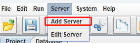
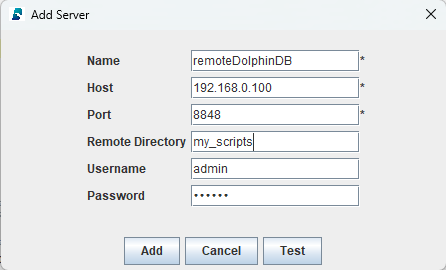
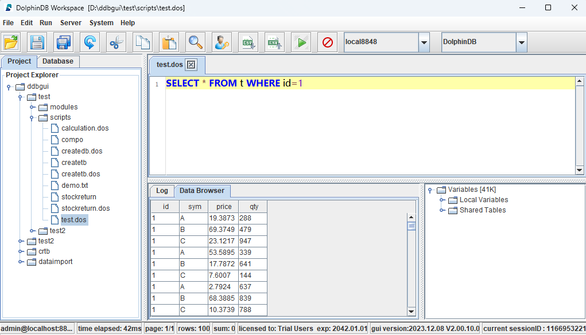
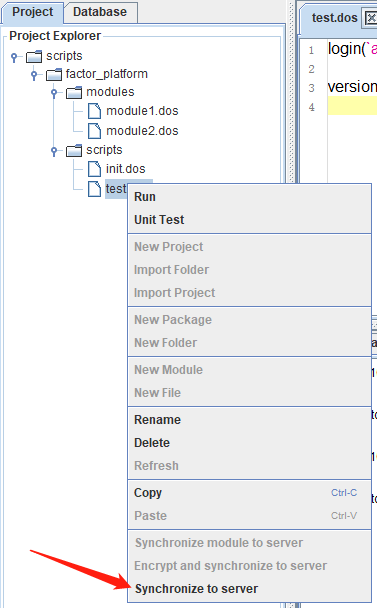

# GUI 客户端

DolphinDB GUI 客户端是基于 Java 的图形化编程以及数据浏览界面，可在任何支持 Java
的操作系统上使用，例如：Windows、Linux、Mac。该客户端运行速度快，功能齐全，用户友好，适用于管理和开发 DolphinDB
脚本、模块，以及数据库交互，查看运行结果等。

用户能够在 GUI 客户端进行以下操作：查找/替换文本、保留字高亮显示、系统函数提示、行号显示，选择部分代码执行、执行结果浏览、查看 log
信息、临时变量浏览、数据库浏览。通过 Project 浏览器，可以浏览所有项目。通过 Database 浏览器，可以浏览所有 DFS 数据库以及其分区表的
schema。此外，用户能够通过界面中的下拉列表选择已建立的 session，使用 SQL 语言进行脚本编写的用户能够从 SQL 方言兼容性列表中为当前 session 选择
MySQL、Oracle 或 DolphinDB 作为兼容的 SQL 方言。

## 安装与启动

在启动 GUI 前，需要确保：

* 安装 Java 运行环境。推荐使用 64 位的 Java 8 版本。如需查看 Java 的版本信息，可在命令行中使用
  *java -version* 命令，符合要求的 Java 版本如下：

  ```
  > java -version
  java version "1.8.0_121"
  Java(TM) SE Runtime Environment (build 1.8.0_121-b13)
  Java HotSpot(TM) 64-Bit Server VM (build 25.121-b13, mixed mode)
  ```

  若版本信息的最后一行如下，那么 DolphinDB GUI 无法正常启动。

  ```
  Java HotSpot(TM) Client VM
  ```
* 已将 JRE（Java Runtime Environment） 添加至系统路径中。

DolphinDB GUI 在 Windows 环境下，双击 *gui.bat* 即可直接运行。

在 Linux 和 Mac 环境下，在 Terminal 中使用 `cd` 命令前往 GUI 压缩包解压后的目录后输入：

```
./gui.sh
```

注： 使用 GUI 连接 3.00.00 或以上版本的 DolphinDB Server 时， 请确保 GUI 版本不低于
1.30.21.1。如需升级 GUI 版本，请前往 <https://dolphindb.cn/product#downloads>。

以下为 DolphinDB GUI 的主要功能：

## Server

GUI 菜单中的
**server** 是指 DolphinDB 数据库服务器。

点击 **Add Server**，添加需要连接的 DolphinDB
Server 节点。

填写以下 Server 信息：

* **Name** 这个节点在本地添加的 Server 列表中的唯一标识。
* **Host** DolphinDB Server 所在的服务器 IP 。
* **Port** DolphinDB Server 待连接节点的端口号。
* **Remote Directory** 远端目录，[数据同步](#gui_client__section_a2l_fg4_ryb)功能的目的路径。可以是绝对路径或相对路径，其中相对路径相对于 <HomeDir> 。<HomeDir>
  可通过函数 [getHomeDir](../funcs/g/getHomeDir.html) 获取。
* **Username** 登录用户名。
* **Password** 登录密码。



点击 **Test**可以测试是否可与目标节点连接成功。

确认上述信息无误后，可以点击 **Add** 完成本次添加。

完成添加后，会自动出现在
**server** 下拉菜单中。

提示： 连接远端服务器时，建议连接数据节点，因为 DolphinDB 关于数据库的操作都是在数据节点上执行的。

## Log in（登录）

登录数据库服务器主要有三种方法：

* 在添加 server 的时候指定用户名和密码。默认的管理员初始账号和密码为：admin/123456。
* 点击界面中的  按钮
* 在脚本中使用 `login` 函数

## Workspace（工作空间）

第一次启动 GUI 时，用户需指定 workspace 路径，用于项目管理。Workspace
下面可以有多个项目。一个用户只能同时使用一个 workspace。

## Project（项目管理）

指定 workspace 后，可以通过右击 workspace，点击 **New Project**
来创建新的项目，也可以通过 **Import Folder** 或 **Import Project** 导入已有的项目。

## File（文件管理）

创建 project 后，用户可以在新建 project 下通过 **New Folder**
创建脚本目录，并在新建文件夹下通过 **New File** 生成脚本文件。脚本文件创建之后，即可通过编辑器来编写、修改、执行脚本。

## 运行

GUI
编程界面提供代码查询、修改、高亮显示、函数提示等功能。用户可以选择部分代码执行，也可以点击文件执行代码。执行完毕，可以立刻看到执行结果，以及查看所有的局部变量和共享变量的值。

图 1. 脚本运行与结果



## Synchronize to Server（数据同步）

在远端服务器上执行一个脚本文件或者调用了一个 module 都会在该服务器上查找对应的脚本文件。当 GUI 和 DolphinDB
server 不在一个机器上时，可能需要把本地最新编辑的脚本文件同步到远程服务器上。为此，DolphinDB 提供了 Synchronize to
Server，即文件同步功能。在项目浏览器中右击需要同步的目录或者文件，并选择 **Synchronize to
server**，将其传送到服务器的对应目录。

通过以下方式指定 Remote Directory 后才可使用文件同步功能：

* 添加远程服务器时通过 Remote Directory 指定相应目录；需要注意，远端服务器的用户必须拥有创建
  Remote Directory 的权限。
* 若上步中未指定，则可通过 **Server > Edit Server** 菜单来指定。

举个例子，如果将 Remote Directory 设置为 "/home/usr1"，并且需要同步的本地文件名是
"C:/users/usr1/Project/scripts/test.dos"，那么系统会在远端自动创建目录和相应文件
"/home/usr1/Project/scripts/test.dos"。

## 常见问题

1. **无法正常启动**

   如果 DolphinDB GUI
   无法正常启动，可能有以下三个原因：

   * 没有安装 Java。Java
     下载地址：https://www.oracle.com/technetwork/java/javase/downloads/index.html。
   * Java 不在系统路径中。在 Windows 环境下，需要查看是否在
     `Path` 中；在 Linux 环境中，需要查看是否在
     `PATH` 中。
   * 安装的 Java 版本不符合要求。DolphinDB GUI 使用环境需要 64 位 Java 8
     及以上版本。32 位的 Java 即使版本正确，由于不支持 Server 模式，只有 Client 模式，将无法启动
     GUI。我们可以在命令行中使用 `java -version` 命令查看 Java 的版本信息。符合要求的
     Java 最低版本为 1.8.0。例如：

     ```
     java -version

     java version "1.8.0_121"

     Java(TM) SE Runtime Environment (build 1.8.0_121-b13)

     Java HotSpot(TM) 64-Bit Server VM (build 25.121-b13, mixed mode)
     ```

     如果版本信息的最后一行如下，那么 DolphinDB GUI 将无法正常启动。

     ```
     Java HotSpot(TM) Client VM
     ```
2. **如何处理包含中文字符的脚本中的乱码**

   如果中文显示出现乱码，需要在
   **File > Preferences** 中设置中文字体，例如微软雅黑（Microsoft Yahei）。 然后使用
   `print` 命令查看输出结果，乱码会消失。
3. **如何修改小数点后的精度显示**

   DolphinDB GUI 默认的小数点后精度是
   4 位。如需调整，在 **File > Preferences > Default number of decimal
   places** 中修改，例如修改为 8。
4. **处理内存溢出（OOM）错误**

   如果出现
   `java.lang.OutOfMemoryError: Java heap space` 的错误信息，说明
   GUI 的默认 2048MB 启动内存不能满足实际运行需要而导致内存溢出。可以通过修改 *gui/gui.bat* 或者
   *gui/gui.sh* 中的 `-Xmx`
   启动参数来扩大内存。例如：

   ```
   start javaw -classpath dolphindb.jar;dolphingui.jar;jfreechart-1.0.1.jar;jcommon-1.0.0.jar;jxl-2.6.12.jar;rsyntaxarea.jar;autocomplete.jar -Dlook=cross -Xmx4096m com.xxdb.gui.XXDBMain
   ```

