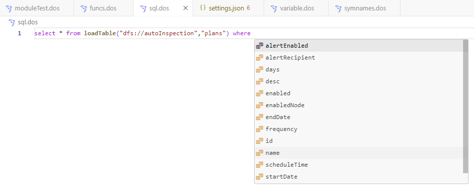
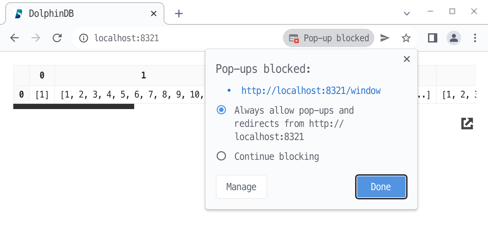
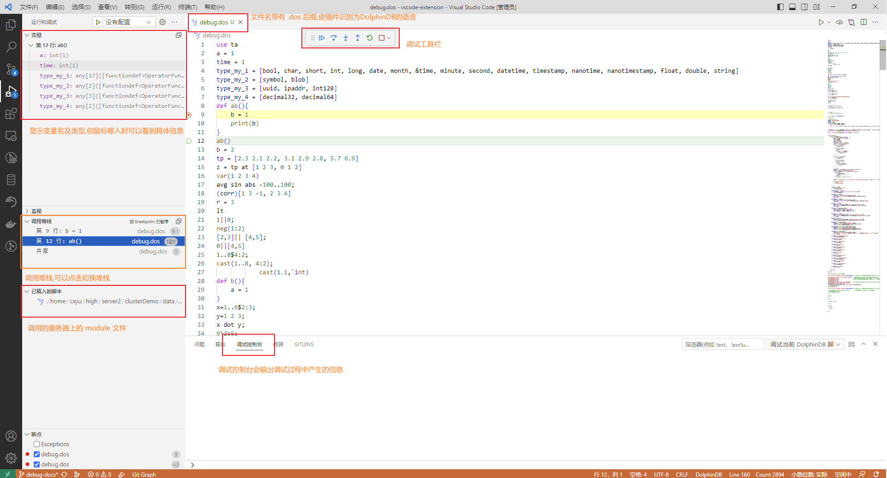
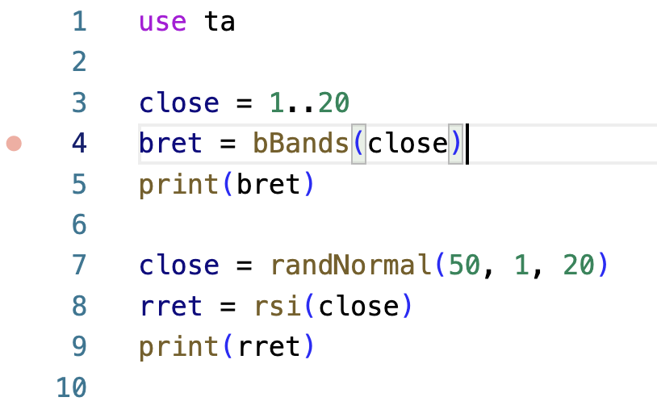
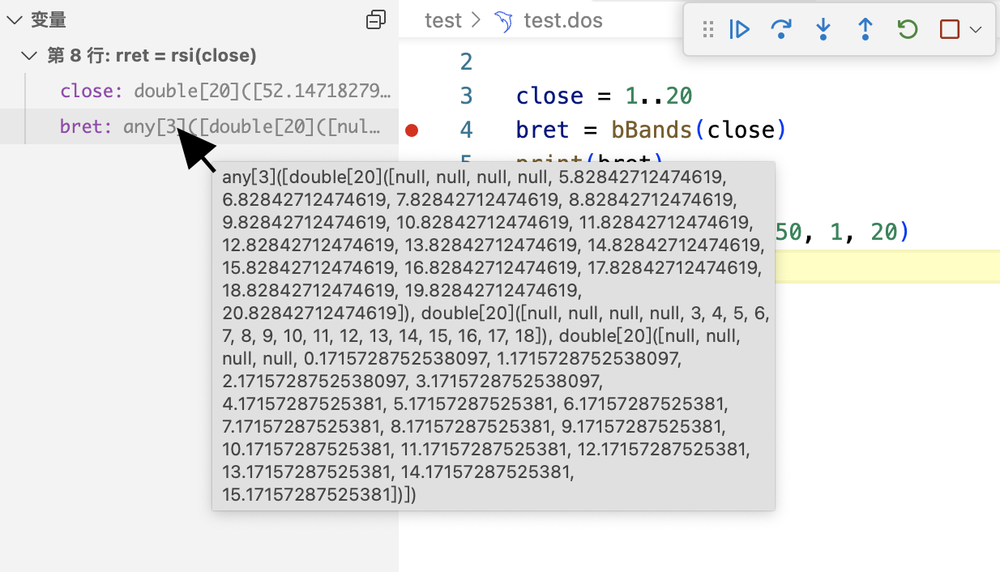
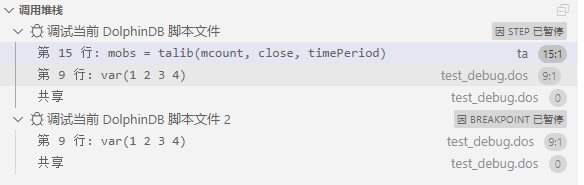
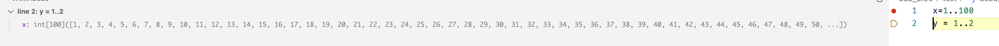

# VS Code 插件

VS Code
是微软开发的一款轻便又有极强扩展性的代码编辑器。它提供强大的插件框架，可通过插件支持不同编程语言，达到语法高亮、智能语法提示以及代码运行等效果。

DolphinDB 开发了针对 Dolphin Script 的 VS Code 插件。用户可以通过该插件编写并执行脚本来操作 DolphinDB
数据库，或查看数据库中的数据。该插件具备以下主要功能：

**智能提示与编辑增强**

* 代码高亮。
* 关键字、常量、内置函数的代码补全。
* 内置函数的文档提示、参数提示。
* 函数名、变量名提示。
* 其他模块中的函数名提示。
* 模块导入提示。
* 连接到数据库后，支持库表名称和字段名称提示。

**代码导航与执行管理**

* 函数定义跳转。
* 变量定义跳转。
* 终端可以展示代码执行结果以及 `print` 函数输出的消息。
* 在底栏中展示执行状态，点击后可取消作业。

**数据管理与可视化**

* 在底部面板中以表格的形式展示表格、向量、矩阵等数据结构。
* 在侧边面板中管理多个数据库连接，展示数据库表及会话变量。
* 在浏览器弹窗中显示表格、向量、矩阵等数据结构。
* 支持从 DolphinDB 导出表数据到磁盘（.csv 格式 文件）。

图 1. 界面


## 使用方法

安装如下：

1. 前往[下载页面](https://code.visualstudio.com)安装或升级
   VS Code，插件版本：
   * 3.0.210 以下​​：要求 ​​VS Code v1.68.0 及以上​；
   * 3.0.210​ 及以上​：要求 ​​VS Code v1.82.0​​ 及以上。
2. 在 VS Code 插件面板中搜索 dolphindb, 点击 Install
   安装插件。如因网络原因安装遇阻，可以前往[下载链接](https://marketplace.visualstudio.com/items?itemName=dolphindb.dolphindb-vscode)手动下载后缀为 `.vsix` 的插件，下载后拖到 VS
   Code 插件面板中。
3. 点击 Version History 下载最新的版本到本地。安装插件后，退出 VS Code
   所有窗口并重新打开 VS Code，否则可能无法在浏览器中查看变量（见后文）。

### 查看、编辑服务器连接配置方法

1. 成功安装插件后，在 VS Code 编辑器的活动栏（Activity Bar）中会显示一个表示
   DolphinDB 数据库管理面板的图标。点击该图标可以在左侧边栏中看到 DolphinDB 面板，包含连接、数据库、变量管理三个子面板。

   图 2. 连接管理

   
2. 点击右上角的 `settings` 按钮。
3. 在 `settings.json` 配置文件中编辑
   `dolphindb.connections` 配置项。

   * `name` 和 `url` 属性是必填的（不同的连接对象必须有不同的
     `name`），默认自动登录 admin 账号（"autologin":
     true）。将光标移动到属性上可以查看对应属性的说明。
   * `dolphindb.connections`
     配置项是一个对象数组，默认有四个连接配置，可按情况修改或增加连接对象。

### 打开或新建一个 DolphinDB 脚本文件

1. 点击 VS Code 编辑器右下角状态栏的语言选择按钮，如下图

   图 3. 语言选择

   
2. 在语言选择弹框中输入 `dolphindb`,
   按回车键将当前文件关联的语言切换为 DolphinDB 语言。

   图 4. 语言切换

   

注：

* 如果脚本文件名是 `.dos` 后缀（DolphinDB Script
  的缩写），插件会自动识别为 DolphinDB 语言，自动启用语法高亮及代码补全、提示
* 如果脚本文件名不是 `.dos` 后缀, 比如
  `.txt` 后缀，则需要手动关联 DolphinDB 语言，方法如下：

### 执行代码

在打开的 DolphinDB 脚本文件中，按快捷键 **Ctrl + E** 将代码发送到 DolphinDB
Server 执行。第一次执行代码时会自动连接到 DOLPHINDB 区域中选中的连接。

* 如果当前有选中的代码，会将选中的代码发送至 DolphinDB Server 执行
* 如果当前无选中的代码，会将当前光标所在的行发送至 DolphinDB Server 执行

执行代码后，VS Code
编辑器下方的终端内会有基于文本的输出，如果执行的代码最后一条语句返回了表格、数组、矩阵，则会自动切换到 VS Code 编辑器下方面板的 DolphinDB
区域中以表格的形式展示表格、向量、矩阵等数据结构。

提示： 将 DolphinDB 标签页的内容拖动到终端的右侧，如下图

图 5. 代码执行


### 代码提示

DolphinDB 的 VS Code
插件为脚本编辑提供基于上下文和工作区的代码提示，帮助用户更便捷地使用自定义函数、跳转至函数或变量定义，并高效编写数据库查询语句。

#### 定义跳转

VS Code 插件支持跳转到选定函数或变量的定义。对于函数，还可跨模块跳转至从其他模块引入的函数（前提是目标模块位于当前工作区内）。

* **函数定义跳转**

将光标移动到目标函数上。按下 F12，或右键单击选择“转到定义”。

图 6. 跳转到定义


编辑器将跳转到该函数的定义位置。


* **变量定义跳转**

变量定义跳转的使用方式与函数定义跳转相同，但不支持跨模块跳转。


#### 函数名与变量名提示

在编辑代码时，可自动补全已定义的函数名或变量名称，并提供相关描述。


在**函数或变量定义**上方添加注释时，代码提示将以描述的形式展示这些注释，便于理解其作用。


若使用规范格式编写函数注释，可自动生成函数文档，并在提示描述中显示。


#### 跨模块函数名提示

处于**工作区** 内的模块文件中的函数，在编辑代码时可被**自动补全**。例如，在
`LanguageServer::ModuleExample`
模块中定义了一个函数，在工作区的其他文件中输入其名称的一部分，系统会自动补全，并在描述中显示该函数所属的模块。


如果当前文件尚未引入该模块，插件会自动在文件顶部添加模块引入语句。


此外，在函数调用补全时，插件会补全完整的函数名称（包含模块名），避免命名冲突，确保代码的清晰度和可读性。

#### 模块导入提示

在输入 `use` 时，自动提示当前工作区内的可用模块名称。


#### 数据库对象提示

在编写数据库查询语句时自动提示数据库、表、字段等对象名称，需先通过插件连接到数据库。当输入 `select from`
时，自动提示 Catalog 和共享变量中的表名。


当输入 `loadTable` 时，自动提示分布式数据库的库名和表名。


库表名称确定后，在 `order by`, `where`, `group
by` 等语句中，可自动补全**字段名称**及**常用关键字**（如
`asc`、`desc`）。


### 查看变量

* 切换执行代码所用的连接 (原有连接不会断开)
* 点击连接右侧的按钮手动断开连接
* 查看会话变量的值
* 非 scalar, pair 类型的变量右侧有两个图标
  + 点击左边的图标，在编辑器下方面板的 DolphinDB 区域中查看变量
  + 点击右边的图标，在浏览器弹窗中查看变量 (需要配置浏览器允许弹窗,
    见后文)。弹窗功能需要浏览器中有一个打开的 `DolphinDB Data Browser` 标签页
    (URL 可能是 http://localhost:8321/)，如果缺少这个标签页，插件会先自动打开这个页面：

如下图所示：

图 7. 数据浏览器


注： 请使用近两年的浏览器版本，例如 Chrome 100+ 或 Edge 100+ 或 Firefox
100+，并配置浏览器允许该网站弹窗显示。

图 8. 弹窗显示设置



### 查看函数

在 VS Code 编辑器中输入 DolphinDB 内置函数时，点击函数右侧的箭头可以展开函数的文档：

图 9. 查看函数说明


函数输入完成后，将鼠标悬浮于函数名称上，也可查看函数文档。

如果需要将函数名高亮显示，可在 VS Code 配置文件 *settings.json* 中加上下面的 textmate
规则：

```
"editor.tokenColorCustomizations": {
    "textMateRules": [
        // function: bold
        { "scope": "entity.name.function", "settings": { "fontStyle": "bold" }},
        { "scope": "support.function", "settings": { "fontStyle": "bold" }} ,
    ]
},
```

### 上传文件

用户可以通过 DolphinDB 的 VS Code 插件以下述两种方式上传文件：

1. 在 VS Code 的资源管理器中选中需要上传的文件并右击，在右键菜单中选择 **DolphinDB:
   上传到服务**。
2. 打开需要上传的文件后，在 VS Code 界面的右上角单击上传按钮。之后，需要用户输入上传到 server
   的文件路径（不能为空）。回车后，等待提示 *文件成功上传* 即可。

此外，用户可以通过配置 `dolphindb.connections` 的
`mappings` 属性来自定义本地路径和 server 路径的映射关系，方便插件在后续文件上传过程根据
mappings 映射 server 路径。在 VS Code 设置界面，选中扩展下的 DolphinDB，打开 *setting.json*
文件，在需要配置的 connection 中添加或修改 `mappings`中的键值对 ，左侧 "键" 为本地地址，右侧 "值"
为服务器地址。

图 10. 配置项


添加完成后，插件会根据当前连接中用户配置的 `mappings` 对路径进行映射。

例如，用户当前连接中配置的 `mappings` 为：

```
{
    "/path/to/local/": "/path/at/remote/",
    "/path/to/local/dir1/": "/data/server/dir1/",
    "D:/path/to/local/": "/data/server/",
    "default": "/data/server/"
}
```

文件上传时路径映射的规则如下：

1. 以自动的方式进行映射，`key`
   代表本地路径，`value` 代表 server
   路径，配置完成后，会选择最长匹配项作为上传路径。例如，用户上传的文件路径为 */path/to/local/dir1/file.dos*
   ，此时，同时存在 */path/to/local/* 和 */path/to/local/dir1/*
   均可匹配用户路径，但以最长匹配项 */path/to/local/dir1/* 优先匹配。
2. 可配置 `defalut` 字段作为默认匹配。如果当前路径没有匹配
   `dolphindb.mappings` 中的其余项，则以 `default`
   对应的 server 路径作为上传路径。例如，用户上传的文件路径为 */user/dosuments/file.dos*，此时匹配不到
   `mappings` 的其余项，则以 `default` 字段映射的 server
   路径作为上传路径，即 */data/server/file.dos*。
3. 若 `dolphindb.mappings` 中没有匹配项，则以
   `getHomeDir()` + `/uploads/` +
   `文件名` 作为上传路径。

### 导出文件

注意，该功能要求 server 版本不小于 2.00.11。导出步骤如下：

1. 运行需要保存的表，使其展示在数据视图中。
2. 点击数据视图左上角的“DolphinDB：导出表格”的图标。
3. 选择保存路径，编辑文件的名称后，点击保存按钮，将表数据保存至指定路径。此时在右下角会显示“文件成功导出到 xxxx”。

## 调试脚本

DolphinDB 的 VS Code
插件可用于调试用户脚本，用户可以使用实时追踪运行脚本、显示中间变量的值以及展示函数调用栈信息等功能，从而写出更快更好的脚本。

注：

* Python Parse 不支持调试功能。
* 使用调试功能之前，请确保 DolphinDB Server 版本不低于 2.00.10.1 或 1.30.22.1。

具体调试方法如下：

图 11. 调试方法


其中，

* Debug Server（DolphinDB Server）：真正执行中断、挂起、数据查询操作的数据库进程
* Debug Adapter：处理两侧的交互信息
* DAP：Debug Adapter Protocol，由 Microsoft 提出的一种通用的 Debug
  信息交互协议
* Debug Client：VS Code 调试界面，主要负责与用户交互。下图是该界面的主要部件及功能概览：

图 12. 调试界面



编写脚本的方法如下：

后续步骤介绍基于以下例子脚本。出于调试目的以及代码可读性，我们建议每行只写一条语句。

```
  use ta

  close = 1..20
  bret = bBands(close)
  print(bret)

  close = randNormal(50, 1, 20)
  rret = rsi(close)
  print(rret)
```

设置断点的方法如下：

1. 在选定行左侧空白处单击鼠标左键设置断点。

   图 13. 设置断点

   
2. 为了接下来的调试演示，我们在第 4 行和第 8
   行分别设置了断点，设置断点后，编辑器区的左侧空白区域处会出现红色的圆点，表示断点设置成功。

   图 14. 断点设置成功

   

启动调试的方法如下：

1. 在左下角的连接管理面板中选择用于调试的服务器。

   图 15. 选择调试服务器

   
2. 在底部状态栏中设置语言模式为 `DolphinDB`。

   图 16. 设置语言模式

   
3. 按 **F5** 或通过左侧边栏的运行和调试打开主边栏，点击 **运行和调试**。

   图 17. 运行和调试

   

启动后的界面如下图所示，

图 18. 启动后界面


其中，

* 调试界面的左侧是调试信息区，右侧是编辑器区，下方是调试控制台。
* 调试信息区展示变量的值、函数调用栈等信息。
* 编辑器区用黄色的背景标出了将要执行的行。
* 调试控制台用于显示输出信息和异常信息。

注：

调试过程如果无法启动，打开调试控制台，通过错误信息检查排查错误原因。可能的错误原因包括：

* DolphinDB Server 版本太低会报错 `Server sent no
  subprotocol`，调试服务器连接失败，请确保 DolphinDB Server 版本不低于 2.00.10.1 或
  1.30.22.1。

调试方法如下：

启动调试后，VS Code 的界面上方会出现如下图所示的调试工具栏：

图 19. 调试工具栏


从左到右的名称及对应的键盘快捷键分别为：

* 继续（F5）
* 逐过程（F10）
* 单步调试（F11）
* 单步跳出（Shift + F11）
* 重启（Ctrl + Shift + F5）
* 停止（Shift + F5）

提示： 继续、逐过程和单步调试是调试中最常用的三个功能，推荐使用快捷键来操作。

用于调试的按钮功能和使用方法如下：

* 逐过程（F10）：在上个调试界面中，黄色的背景标出了即将被 Server 执行的第 4 行代码所对应的语句。我们按下
  F10，让 Server 程序执行完第 4 行代码。此时的调试界面如下图所示，黄色的背景变成了第 5 行代码所对应的语句。

  图 20. 逐过程

  
* 继续（F5）：我们可以利用逐过程的方式一条语句一条语句地执行脚本，但是这样做的效率较低。着重关注断点所在的语句有助于提升执行调试效率。在这里，我们关心的是第
  8 行代码所对应的语句，按下 F5 后，Server 程序会一直执行到第 8 行代码。此时的调试界面如下图所示，黄色的背景变成了第 8
  行代码所对应的语句。

  图 21. 继续

  
* 查看变量：在调试界面的左侧，即调试主边栏中，我们可以在略上方的位置看到变量的值，如下图所示：

  图 22. 查看变量

  

  在这里，`close` 和 `bret`
  这两个变量因为过长而导致显示不全，我们可以将光标悬浮在变量的值上方，即可看到完整的值。

  图 23. 变量完整值

  

  右键点击变量，选择”查看变量“，在数据视图中会展示该变量的详细信息。

  图 24. 查看变量

  
* 单步调试（F11）：单步调试用于进入函数内部，查看函数内部的执行情况。在上一步，我们运行到了第8行代码，即
  `rsi` 函数的调用语句。按下 F11 后，Server程序会进入 `rsi`
  内。此时对应的调试界面如下图所示，黄色的背景标示程序已经运行到该函数内部，且即将执行第一条语句。

  图 25. 单步调试

  
* 查看调用堆栈：我们将目光再次移动到调试主边栏中。在略下方的位置，可以看到当前的函数调用栈，如下图所示。

  图 26. 查看调用堆栈

  

  单击调用栈的某一行，就能在上游函数和下游函数之间切换。此时，调试主边栏上方的变量部分也会显示该层函数所对应的变量的值。
* 动态更新断点：在脚本执行的过程中，我们可以动态地更新断点。例如，我们可以在 152 行和 153
  行的位置新增两个断点，如下图所示，编辑器区的左侧空白区域处会出现两个红色的圆点，表示断点已经新增成功。

  图 27. 动态更新断点

  

  当然，我们也可以取消断点。例如，我们单击 152 行左侧空白处来删除 152
  行对应的断点。如下图所示，编辑器区左侧空白区域处 152 行对应的红色圆点消失，表示 152 行处的断点已经取消成功。

  
* 跳出函数：实际过程中，我们经常需要执行完这个函数并返回上层函数。例如，我们点击调试工具栏中的单步跳出按钮 ，即可执行完当前函数体的所有内容并返回到上一层函数。此时，如下图所示，我们已经返回到
  `test.dos`中的第9行代码所对应的语句，代表执行完第8行对应的 `rsi` 函数。

  图 28. 跳出函数

  
* 重启以及停止：重启和停止按钮的功能与其名字相符。例如，我们点击调试工具栏中的重启按钮 ，即可重启调试；相应地，点击停止按钮 ，即可停止调试。

语法解析的方法如下：

调试开始时, DolphinDB 会对代码进行初步检测, 如果代码有语法错误, 不会进入调试状态,
并且调试控制台会输出错误信息。

图 29. 语法解析


断点管理的方法如下：

如下图所示，在调试主边栏的下方，可以看到所有断点的信息，包括断点的状态、断点的文件名和文件路径以及行号。值得注意的是右上方有两个按钮，禁用所有断点  以及删除所有断点 。

* 点击禁用所有断点 
  可以暂时关闭所有断点，恢复正常程序的执行；再次点击此按钮或者手动添加新断点时，会自动开启所有断点。
* 点击删除所有断点  可以删除所有断点，包括已经禁用的断点。

图 30. 断点管理


多目标调试的方法如下：

在启动一个调试会话的同时, 启动另一个调试会话，VS Code 即可自动切换到多目标模式：

* 各个会话现在在 **调用堆栈** 视图中显示为顶级元素。

  图 31. 调用堆栈

  
* 调试工具栏显示当前活动的会话（所有其他会话在下拉菜单中可用）。

  图 32. 会话列表

  
* 调试操作（例如, 调试工具栏中的所有操作）在活动会话上执行可以使用调试工具栏中的下拉菜单或在 **调用堆栈**
  视图中选择其他元素来更改活动会话。

以下脚本语法存在使用上的局限性：

* `functionview` 能够通过初步语法检查,
  但使用此类语法在调试时会出错。
* 含有 `include` 语句的脚本调试会报错“Does not support
  Debug mode when using include”。可以考虑用 `use` 替代。
* `submitJob`, `remoteRun`
  等远程调用类函数不能跟踪函数栈调用。
* 匿名函数、lambda 表达式、闭包的用法。

暂不支持以下调试方法

* 内联断点、条件断点、记录点、监视
* 查看长度较大的变量

  图 33. 长度较大变量

  

## 常见问题

* 如果按 **Ctrl + E** 快捷键无反应：
  + 可能是由于未关联 DolphinDB 语言（此时语法高亮也未生效）
  + 也可能由于快捷键与其他插件冲突，需要在 VS Code 的 **文件** > **首选项** >
    **键盘快捷方式** (**File** > **Preferences** >
    **Keyboard Shortcuts**`) 中自定义快捷键，在搜索框中输入 **CTRL+E**, 删除和
    **DolphinDB: 执行代码** （DolphinDB: Execute Code） 冲突的其他插件的快捷键。
    
* 如果出现执行代码后一直卡在执行中，打开 vscode 顶部的 `帮助 (Help)` > `切换开发人员工具
  (DevTools)` 在弹出的窗口中切换到控制台标签页查看，如果存在如下内容：`Webview fatal
  error: Error: Could not register service workers: InvalidStateError:
  Failed to register a ServiceWorker: The document is in an invalid
  state..`，则按下面的步骤操作：
  1. 先更新 VS Code 到最新版本。
  2. 如果还不能解决，尝试下面的方法结束所有的 `Code.exe` 进程，并删除 service worker
     缓存：
     + linux:

       ```
       pkill code && rm -rf .config/Code/Service\
             Worker/{CacheStorage,ScriptCache}
       ```
     + windows:
       1. 退出 vscode 之后，打开任务管理器，结束所有残留的 vscode 僵尸进程

          ```
          taskkill
                        /F /IM Code.exe
          ```
       2. 在文件管理器中打开
          `C:/Users/你的用户名/AppData/Roaming/Code/Service
          Worker/`
       3. 删除 `CacheStorage` 和
          `ScriptCache` 两个文件夹
  3. 如果操作以上内容后仍存在问题，则重启电脑。参考 <https://github.com/microsoft/vscode/issues/125993>

* 如果出现执行代码并返回表格后，底部没有自动切换到 DolphinDB 视图的情况，需要重置 DolphinDB
  视图的位置，如下图所示

  图 34.

  
* 如果出现 dataview (数据视图)
  面板右键隐藏后无法再次显示，且执行脚本一直卡在执行中的情况，尝试以下方法解决：

  1. 执行 `defs()` 函数
  2. 按 **CTRL + SHIFT + P** 呼出命令面板，搜索 **open
     view**
  3. 点击打开视图
  4. 搜索数据视图（英文名是 dataview）
  5. 点击后即可打开。
* VS Code 有大约为 `1 GB` 的内存限制。建议使用
  `limit` 限制返回记录数；或者将结果赋给某个变量，如 `a = select *
  from`，后续通过点击侧边栏变量旁边的按钮进行分页懒加载，按需取回单页数据。
* 为了在浏览器中展示表格等数据，每个 VS Code 窗口会启动一个本地 HTTP 服务器，其可用端口范围可以通过
  `dolphindb.ports` 配置，默认为 `8321-8420`，鼠标悬浮在
  ports 上可查看详细解释。在浏览器中弹窗展示的功能，要求近两年的版本，如 Chrome 100+ 或 Edge 100+ 或 Firefox
  100+
* 若连接数据库时出现报错无法连接的报错，可参考下图关闭代理：

  图 35. 关闭代理

  

