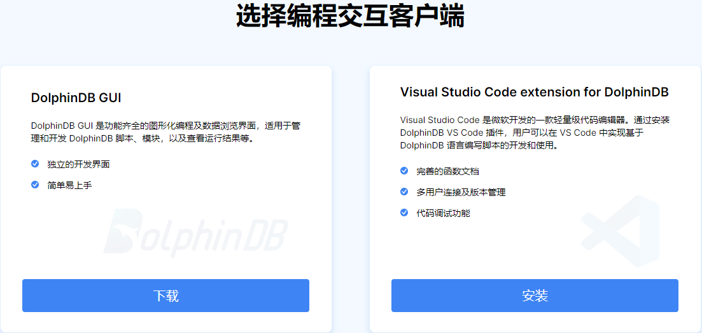

# 部署

DolphinDB 系统包括：服务器程序（dolphindb.exe）、Web 集群管理工具、图形界面客户端 DolphinDB GUI、DolphinDB VS
Code 插件、API 以及面向不同使用场景的插件。

## 安装系统

### 下载 Server 压缩包

1. 前往：<https://www.dolphindb.cn/downloads.html>。

   图 1. 下载页面

   
2. 点击 立即下载 即可下载 DolphinDB server 社区版压缩包。
3. 解压 DolphinDB server 压缩包，其中含有 Web 集群管理工具、服务端程序以及 license
   文件。解压完成后不需要进一步安装。

注： 如需企业试用版，点击 申请企业试用版
填写申请表单并提交。DolphinDB 技术支持人员与您联系后，您会收到企业试用版 license 文件。若 license 文件名不是
*dolphindb.lic*，需要将其改名为 *dolphindb.lic* 并替换社区版中
/server/ 路径下的同名文件，即可使用企业试用版。

### 选择编程交互客户端

图 2. 客户端

DolphinDB 公司开发了支持 DolphinDB 数据库编程语言的 VS Code 插件，便于用户使用 VS Code 编写 DolphinDB
脚本，并在 DolphinDB 服务器上运行。VS Code
使用者无需安装其它软件，直接下载插件即可使用，学习成本低，上手快。因此，**推荐具有深度编程需求的用户选择使用 VS Code 插件（即 Visual
Studio Code extension for DolphinDB）**。

有关 VS Code 插件的安装和使用，参考：[DolphinDB VS
Code 插件](../db_distr_comp/vscode.html)。

DolphinDB 也支持使用 DolphinDB GUI 客户端来连接 DolphinDB、编辑脚本。有关 DolphinDB GUI
的安装和使用，参考：[GUI 客户端](../db_distr_comp/gui.html)。

### 开发资源（可选）

为满足不同场景需求下的用户操作，DolphinDB 提供了 C++，Java, Python 和 C# 等开发接口，包含 JDBC，Grafana
在内的连接器以及数十个面向不同应用场景的插件作为可选的开发资源。

* 更多相关内容，查看：[开发资源](https://www.dolphindb.cn/product/development-resources)。
* 有关 DolphinDB 的连接器安装步骤及使用方法，参考：[连接器
  & API](../api/connapi_intro.html)。
* 有关 DolphinDB 的插件使用说明，参考：[插件](../plugins/plg_intro.html)。

## 配置

完成以上系统安装后，即可搭建单机集群或多机集群。

### 独立服务器（单节点模式）

作为一个独立的工作站或服务器使用，下载后即可使用，无需配置。详见：[单节点部署教程](../tutorials/standalone_server.html)。

DolphinDB 支持嵌入式 ARM 环境。详见：[ARM版本单节点部署教程](../tutorials/ARM_standalone_deploy.html)。

单节点模式拥有与集群模式相同的功能，区别在于单节点模式不支持扩展节点和高可用，而集群模式可以方便地扩展到多个服务器节点以及支持高可用。

### 单机集群搭建

控制节点（controller）、代理节点（agent)、数据节点（data node）、计算节点（compute
node）部署在同一个物理机器上。详见：[单服务器集群部署](../tutorials/single_machine_cluster_deploy.html)。

### 多机集群搭建

在多个物理机器上部署 DolphinDB 集群。详见：[多服务器集群部署](../tutorials/multi_machine_cluster_deployment.html)。

DolphinDB 提供数据、元数据以及客户端的高可用方案，使得数据库节点发生故障时，数据库依然可以正常运作，保证业务不会中断。详见：[高可用集群部署](../tutorials/ha_cluster_deployment.html)。

### 功能及应用场景

| **功能** | **单节点** | **单机集群** | **多服务器集群** |
| --- | --- | --- | --- |
| 多模存储引擎 | √ | √ | √ |
| 支持事务 | √ | √ | √ |
| 分布式计算 | √ | √ | √ |
| 多范式编程 | √ | √ | √ |
| 实时流数据 | √ | √ | √ |
| 系统管理及接口 | √ | √ | √ |
| 云上部署 | √ | √ | √ |
| 扩展节点 | x | √ | √ |
| 数据高可用（多副本） | x | √ | √ |
| 应用高可用 | x | x | √ |

| **应用场景** | **单节点** | **单机集群** | **多服务器集群** |
| --- | --- | --- | --- |
| 开发 | √ | √ | √ |
| 研究 | √ | √ | √ |
| 小规模生产环境 | √ | √ | √ |
| 可扩展 | x | √ | √ |
| 企业级生产环境 | x | x | √ |

## 使用系统

* 使用 Web 集群管理工具可以启动关闭数据节点、查看集群各节点的性能指标、浏览分布式数据库整体数据分区情况及详细数据。详见：[Web 操作手册](../db_distr_comp/db_man/web/intro.html)。
* GUI 客户端提供了方便开发 DolphinDB 脚本的图形界面。详见：[GUI 客户端](../db_distr_comp/gui.html)。
* 在 DolphinDB 中创建分区数据库和表。DolphinDB
  支持范围、哈希、值、列表、以及组合分区，可灵活应对各类企业实际业务场景，详见：[建库建表](../db_distr_comp/db_oper/create_db_tb.html)。
* 使用 DolphinDB 流数据引擎进行实时数据处理与分析。详见：[流数据](../stream/str_intro.html)。

提示： 使用系统前建议先阅读：

* [量化金融范例](../tutorials/quant_finance_examples.html)
* [物联网范例](../tutorials/iot_examples.html)

## 用户权限设置

DolphinDB 提供了完善、安全的权限管理机制，适用于企业级的不同应用场景，详见：[用户权限管理](../tutorials/ACL_and_Security.html)。

## 常见错误原因

* 节点启动后立即退出，在 log 文件中显示错误原因为 "`The license has expired`"。

  原因：license 过期。

  解决方案：联系 DolphinDB 技术支持 support@dolphindb.com，更新 license 文件
  *dolphindb.lic*。
* 集群管理器上启动节点后，节点仍然显示未启动状态。

  原因：需要手动刷新集群节点状态。

  解决方案：点击集群管理器上刷新按钮。

  在使用过程中如果遇到各种问题，可以查看 log 文件获取问题信息。每个数据节点和控制节点都有独立的 log 文件，默认在
  home 目录下（例如单节点部署是 *server/dolphindb.log*，集群部署是
  *server/log/\*.log*），里面有系统详细的运行日志；也可以联系 support@dolphindb.com 或致电 0571-82853925。

有关更多 DolphinDB server 使用中可能出现的错误码及说明，参考：[错误代码](../error_codes/err_codes.html)。

