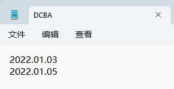

# addMarketHoliday

## 语法

`addMarketHoliday(marketName, holiday, [dateType = 'holidayDate'])`

## 详情

在线添加一个交易市场节假日或交易日文件，通过此文件生成一个交易日历。调用该函数后，在 *marketHolidayDir* 指定的目录下会生成一个和
*marketName* 同名的 csv 文件。

注：

* 该函数只能由管理员调用。
* 该函数仅对当前节点有效。集群环境中，通过 `pnodeRun` 调用该函数，使其在其它节点生效。

## 参数

**marketName** 字符串标量，表示交易日历标识，例如：国外交易所的 ISO Code、国内交易所简称或自定义交易日历名称。

注：

* *marketName* 必须由4个大写字母组成，且不能与 *marketHolidayDir* 下的文件名相同。

**holiday** DATE 类型向量，表示日期。

* 当 *dateType*='holidayDate' 时，*holiday* 需要指定为休市日期，因为系统默认周末为休市日，所以
  *holiday* 只需指定非周末的休市日期。
* 当 *dateType*='tradingDate' 时，*holiday* 需要指定为交易日期。

**dateType** 字符串，用于指定交易日历文件的数据是休市日期还是交易日期。可选值为
‘holidayDate’（默认）或 'tradingDate'。

## 例子

例1. 以下例子展示如何通过该函数手动添加名为 "DCBA" 的交易日历标识。本例需要添加的数据为非周末的休市日期。

```
addMarketHoliday("DCBA",2022.01.03 2022.01.05)
```

运行后，在 /server/marketHoliday/ 路径下会新增一个名为
DCBA.csv 的文件，其中包含了已添加的节假日。

图 1. DCBA



注： 使用该函数添加已存在于交易日历中的交易日历标识时，会出现 `The added market
'<marketName>' already exists.` 的提示，说明该交易日历标识已存在于
/server/marketHoliday/ 目录下，不需要重复添加。

```
temporalAdd(2022.01.01,1,"DCBA")
```

返回：2022.01.04

```
index = [2022.01.01, 2022.01.02, 2022.01.03, 2022.01.04]
s = indexedSeries(index, 1..4)
s.resample("DCBA", sum);
```

返回：

```
label	col1
2021.12.31   6
2022.01.04   4
```

例2. 2024 年2月18日为周日。如果因调休开盘，可以通过指定
*dateType*='tradingDate'，创建一个交易日历（包含所有易日期）。本例中需要添加的数据为交易日期，包括周末开盘的日期。

```
tradingDates=[2024.02.08, 2024.02.09, 2024.02.18, 2024.02.19, 2024.02.20, 2024.02.21]
addMarketHoliday(marketName="AAAA", holiday=tradingDates, dateType='tradingDate')
```

运行以上代码后，在 /server/marketHoliday/ 路径下会新增一个名为
*AAAA.csv* 的文件，包含1列数据，字段名称为 tradingDate，数据为 tradingDates。

```
temporalAdd(2024.02.09, 1, "AAAA")
```

返回：2024.02.18

```
temporalAdd(2024.02.21, 1, "AAAA")
//计算得到的日期如果不在 AAAA.csv 文件中记录，则会报错：The returned date does not exist in trading calendar [AAAA].
```

**相关信息**

* [updateMarketHoliday](../u/updateMarketHoliday.html "updateMarketHoliday")
* [getMarketCalendar](../g/getMarketCalendar.html "getMarketCalendar")
* [getTradingCalendarType](../g/gettradingcalendartype.html "getTradingCalendarType")

