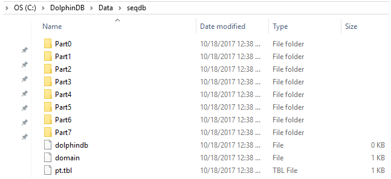
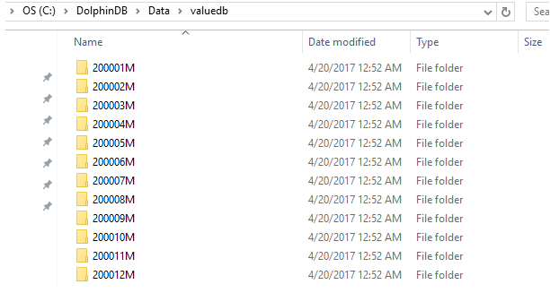

# database

## 语法

`database(directory, [partitionType], [partitionScheme], [locations],
[engine='OLAP'], [atomic='TRANS'])`

2.00.4
版本以后，若配置项 *enableChunkGranularityConfig* = true:

`database(directory, [partitionType], [partitionScheme], [locations],
[engine='OLAP'], [atomic='TRANS'], [chunkGranularity='TABLE'])`

## 参数

**directory** 是保存数据库的目录的路径。如果需要创建分布式文件系统中的数据库，*directory*
应该以 "dfs://" 开头，如果需要创建内存在线事务处理数据库，应该以 "oltp://" 开头。

**partitionType**
有六种类型：顺序分区（SEQ），范围分区（RANGE），哈希分区（HASH），数值分区（VALUE），列表分区（LIST）和组合分区（COMPO）。

**partitionScheme**
描述了分区是如何创建的。它通常是一个向量，在序列域是一个整型标量。分区方案的说明决定了分区类型。*partitionScheme*
支持以下数据类型：CHAR, SHORT, INT, DATE, MONTH, TIME, MINUTE, SECOND, DATETIME 和 SYMBOL。

| 分区类型 | 分区符号 | 分区方案 |
| --- | --- | --- |
| 顺序分区 | SEQ | 整型标量。表示分区的数量。 |
| 范围分区 | RANGE | 向量。向量的任意两个相邻元素定义分区的范围。 |
| 哈希分区 | HASH | 元组。第一个元素是分区列的数据类型，第二个元素是分区的数量。 |
| 值分区 | VALUE | 向量。向量的每个元素定义了一个分区。 |
| 列表分区 | LIST | 向量。向量的每个元素定义了一个分区。 |
| 组合分区 | COMPO | 向量。向量的每个元素是一个数据库句柄。向量长度表示分区的层级，最小是2，最大是3。 |

**locations** 是元组，指定分区的位置。元组中元素的数量应该与 *partitionType* 和
*partitionScheme* 共同决定的分区数量相同。若要在多个节点上保存分区时， 可以使用分布式文件系统或使用
*locations* 参数指定每个分区在哪些节点。如果没有指定 *locations*
参数，所有分区属于当前节点。我们不能指定分层域的分区。

**engine = 'OLAP'** 设置数据库存储引擎。取值为：'OLAP' , 'TSDB', 'IMOLTP'或'PKEY'，默认值为
'OLAP'。关于存储引擎的介绍，请参见[数据库](../../db_distr_comp/cfg/db_intro.md)。

注： TSDB 和 PKEY
引擎只支持创建分布式数据库。

**atomic** 表示写入事务的原子性层级，决定了是否允许并发写入同一分区。可选值为 'TRANS' 和 'CHUNK'，默认值为 'TRANS'。

* 设置为
  'TRANS'，写入事务的原子性层级为事务，即一个事务写入多个分区时，若某个分区被其他写入事务锁定而出现写入冲突，则该事务的写入全部失败。因此，该设置下，不允许并发写入同一个分区。
* 设置为
  'CHUNK'，写入事务的原子性层级为分区。若一个事务写入多个分区时，某分区被其它写入事务锁定而出现冲突，系统会完成其他分区的写入，同时对之前发生冲突的分区不断尝试写入，尝试数分钟后仍冲突才放弃。此设置下，允许并发写入同一个分区，但由于不能完全保证事务的原子性，可能出现部分分区写入成功而部分分区写入失败的情况。同时由于采用了重试机制，写入速度可能较慢。

**chunkGranularity** 是一个字符串，用于指定分区的粒度。可选值为：

* 'TABLE'：表级分区，设置后支持同时写入同一分区的不同表。
* 'DATABASE'：数据库级分区，设置后只支持同时写入不同分区。

该参数只有在配置 *enableChunkGranularityConfig* = true 时启用。

## 详情

创建一个数据库句柄。

我们需要指定 *partitionType* 和 *partitionScheme*
创建新的分布式数据库。当我们重新打开已有的分布式数据库，只需要指定 *directory*。我们不能用不同的 *partitionType* 或
*partitionScheme* 覆盖已有的分布式数据库。

当 *directory*
为本地磁盘路径时，将创建本地磁盘数据库。磁盘数据库仅应用于备份数据和本地计算的场景，其相较于分布式表，在使用上具有一定局限，例如不能进行权限控制等。

## 例子

1.创建没有分区的磁盘数据库。

```
db=database(directory="C:/DolphinDB/Data/db1/");
t=table(take(1..10,10000000) as id, rand(10,10000000) as x, rand(10.0,10000000) as y);
saveTable(db, t, `t1);
```

2.对于分布式数据库，每种类型的分区都有一个例子。

* 顺序分区（SEQ）：分区是基于输入数据文件中行的顺序。它只能在本地文件系统中使用，不能在分布式文件系统中使用。

```
n=1000000
ID=rand(100, n)
dates=2017.08.07..2017.08.11
date=rand(dates, n)
x=rand(10.0, n)
t=table(ID, date, x);
saveText(t, "C:/DolphinDB/Data/t.txt");

db = database(directory="C:/DolphinDB/Data/seqdb", partitionType=SEQ, partitionScheme=8)
pt = loadTextEx(db, `pt, ,"C:/DolphinDB/Data/t.txt");
```

在 "C:/DolphinDB/data/seqdb"
文件夹中，有8个新建的子文件夹。每个对应输入数据文件中的分区。如果输入数据文件比计算机的可用内存大，我们可以把数据载入分区。



* 范围分区（RANGE）：分区是由分区方案中的两个元素决定的。范围包含下限不包含上限。

```
n=1000000
ID=rand(10, n)
x=rand(1.0, n)
t=table(ID, x);
db=database(directory="dfs://rangedb", partitionType=RANGE, partitionScheme=0 5 10)
pt = db.createPartitionedTable(t, `pt, `ID);
pt.append!(t);

pt=loadTable(db,`pt)
x=select * from pt
select count(x) from pt;
```

| count\_x |
| --- |
| 1000000 |

在上述例子中，数据库 db 有两个分区：[0,5)和[5,10)。表 t 在数据库 db 中保存为以 ID 为分区列的分区表 pt。


把数据文件输入为范围域的分布式数据库：

```
n=1000000
ID=rand(10, n)
x=rand(1.0, n)
t=table(ID, x);
saveText(t, "C:/DolphinDB/Data/t.txt");

db=database(directory="dfs://rangedb", partitionType=RANGE, partitionScheme=0 5 10)
pt = loadTextEx(db, `pt, `ID, "C:/DolphinDB/Data/t.txt");
```

* 哈希分区（HASH）：我们需要指定分区列的数据类型和分区数量。

```
n=1000000
ID=rand(10, n)
x=rand(1.0, n)
t=table(ID, x)
db=database(directory="dfs://hashdb", partitionType=HASH, partitionScheme=[INT, 2])

pt = db.createPartitionedTable(t, `pt, `ID)
pt.append!(t);

select count(x) from pt;
```

| count\_x |
| --- |
| 1000000 |

上面的例子中，数据库 db 有两个分区。表 t 被保存为以 ID 为分区列的分区表 pt。

注意：如果导入哈希分区数据库的数据的分区列包含空值，则该条数据会被丢弃。

```
ID = NULL 3 6 NULL 9
x = rand(1.0, 5)
t1 = table(ID, x)
pt.append!(t1)
select count(x) from pt;
```

| count\_x |
| --- |
| 1000003 |

* 数值分区（VALUE）：分区方案中的每个元素决定一个分区。

```
n=1000000
month=take(2000.01M..2016.12M, n);
x=rand(1.0, n);
t=table(month, x);

db=database(directory="dfs://valuedb", partitionType=VALUE, partitionScheme=2000.01M..2016.12M)
pt = db.createPartitionedTable(t, `pt, `month);
pt.append!(t);

pt=loadTable(db,`pt)
select count(x) from pt;
```

| count\_x |
| --- |
| 1000000 |

上述例子定义了一个具有204个分区的数据库。每个分区表示从2000年1月到2016年12月的月份。使用
`createPartitionedTable` 和 `append!` 函数，把表 t
保存为数据库 db 中以 month 作为分区列的分区表 pt。



* 列表分区（LIST）：分区方案的每个元素决定分区。

```
n=1000000
ticker = rand(`MSFT`GOOG`FB`ORCL`IBM,n);
x=rand(1.0, n);
t=table(ticker, x);

db=database(directory="dfs://listdb", partitionType=LIST, partitionScheme=[`IBM`ORCL`MSFT, `GOOG`FB])
pt = db.createPartitionedTable(t, `pt, `ticker)
pt.append!(t);

pt=loadTable(db,`pt)
select count(x) from pt;
```

| count\_x |
| --- |
| 1000000 |

上述例子中的数据库有两个分区。第一个分区有3支股票，第二个分区有2支股票。


* 组合分区（COMPO）：可以有2个或3个分区列。每个分区列可以是按范围分区、值分区、哈希分区或列表分区。分区列的顺序是无关的。

```
n=1000000
ID=rand(100, n)
dates=2017.08.07..2017.08.11
date=rand(dates, n)
x=rand(10.0, n)
t=table(ID, date, x)

dbDate = database(, partitionType=VALUE, partitionScheme=2017.08.07..2017.08.11)
dbID = database(, partitionType=RANGE, partitionScheme=0 50 100)
db = database(directory="dfs://compoDB", partitionType=COMPO, partitionScheme=[dbDate, dbID])

pt = db.createPartitionedTable(t, `pt, `date`ID)
pt.append!(t)

pt=loadTable(db,`pt)
select count(x) from pt;
```

| count\_x |
| --- |
| 1000000 |

数值域根据天数分成5个分区：


范围域有2个分区：


请注意，虽然这里的数据库文件有两级文件夹，但是分层域只有一个层次的分区。与之对比，双重分区具有两个层次分区。

3.创建分布式数据库

我们可以根据上述例子的语法，在分布式文件系统中建立分布式数据库。唯一区别是，在 `database`
函数中，*directory* 参数要以 "dfs://" 开头。

在执行下面例子之前，我们需要在 web 界面上启动 DFS 集群，并且提交数据节点的脚本。

在分布式文件系统中保存分层域的分区表：

```
n=1000000
ID=rand(100, n)
dates=2017.08.07..2017.08.11
date=rand(dates, n)
x=rand(10.0, n)
t=table(ID, date, x);

dbDate = database(, partitionType=VALUE, partitionScheme=2017.08.07..2017.08.11)
dbID=database(, partitionType=RANGE, partitionScheme=0 50 100);
db = database(directory="dfs://compoDB", partitionType=COMPO, partitionScheme=[dbDate, dbID]);
pt = db.createPartitionedTable(t, `pt, `date`ID)
pt.append!(t);
```

我们可以在以下目录查看数据库文件：


DFS\_NODE1 只有4个关于日期的文件夹；在 "20170807" 文件夹中只有一个 ID
文件夹。这是因为有4个数据节点和基于日期和 ID
的2\*5=10个分区。默认情况下，每个分区在分布式文件系统中有3个备份。因此，总共有5\*2\*3=30个分区来保存4个数据节点。不是所有数据节点都有10个分区。

在分布式文件系统中把数据文件输入到范围域的分布式数据库中：

```
n=1000000
ID=rand(10, n)
x=rand(1.0, n)
t=table(ID, x);
saveText(t, "C:/DolphinDB/Data/t.txt");

db=database(directory="dfs://rangedb", partitionType=RANGE, partitionScheme=0 5 10)
pt = loadTextEx(db, `pt, `ID, "C:/DolphinDB/Data/t.txt");
```

4.关于 *locations* 参数的例子：

```
n=1000000
ID=rand(10, n)
x=rand(1.0, n)
t=table(ID, x);

db=database(directory="dfs://rangedb5", partitionType=RANGE, partitionScheme=0 5 10, locations=[`node1`node2, `node3])
pt = db.createPartitionedTable(t, `pt, `ID);
pt.append!(t);
```

上述例子定义了具有两个分区的数值域。第一个分区在 node1 和 node2 上，第二个分区在 node3 上。所有的位置必须在这些节点所在的计算机中的
dolphindb.cfg 文件的 sites 参数定义：

```
sites=111.222.3.4:8080:node1, 111.222.3.5:8080:node2, 111.222.3.6:8080:node3
```

sites 中的参数是用逗号分隔的。每个 site 包含3部分：主机名，端口号和别名。分区可以复制多个 sites。在这个例子中，每个节点位于不同的计算机。

我们也可以直接使用主机名和端口号表示位置。函数将会变成：

```
db=database(directory="dfs://rangedb6", partitionType=RANGE, partitionScheme=0 5 10, locations=[["111.222.3.4:8080", "111.222.3.5:8080"], "111.222.3.6:8080"])
```

5. 关于 *atomic* 参数的例子：

```
if(existsDatabase("dfs://test"))
dropDB("dfs://test")
db = database(directory="dfs://test", partitionType=VALUE, partitionScheme=1..20, atomic='CHUNK')
dummy = table(take(1..20, 100000) as id, rand(1.0, 100000) as value)
pt = db.createPartitionedTable(dummy, "pt", `id)

dummy1 = table(take(1..15, 1000000) as id, rand(1.0, 1000000) as value)
dummy2 = table(take(11..20, 1000000) as id, rand(1.0, 1000000) as value)
submitJob("write1", "writer1", append!{pt, dummy1})
submitJob("write2", "writer2", append!{pt, dummy2})
submitJob("write3", "writer3", append!{pt, dummy1})
submitJob("write4", "writer4", append!{pt, dummy2})
select count(*) from pt
// output
4,000,000
```

创建 IMOLTP 数据库

```
dbName = "oltp://test_imoltp"
db = database(directory=dbName, partitionType=VALUE, partitionScheme=1..100, engine="IMOLTP")
```

