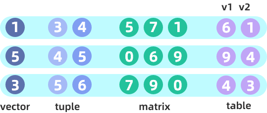

# fixedLengthArrayVector

## 语法

`fixedLengthArrayVector(args…)`

## 参数

**args** 可以是一个或多个向量/固定长度数组向量/元组/矩阵或表。*args*
的每个元素必须具有相同的数据类型，且必须是数组向量支持的类型。

## 详情

将向量、矩阵或表拼接为一个数组向量。其拼接方式如下图所示（对应例1）：

注： 向量的长度（元组中每个向量的长度）、矩阵、表的行数必须相同。



## 首发版本

2.00.4

## 例子

例1. 图例代码

```
vec = 1 5 3
tp = [3 4 5, 4 5 6]
m =  matrix(5 0 7, 7 6 9, 1 9 0)
tb = table(6 9 4 as v1, 1 4 3 as v2)
f = fixedLengthArrayVector(vec, tp, m, tb)
f;

[[1,3,4,5,7,1,6,1],[5,4,5,0,6,9,9,4],[3,5,6,7,9,0,4,3]]

typestr(f);
// output
FAST INT[] VECTOR
```

例2. 将多列合并成一列

下例简单示意了将 2 档 bid 报价存储为数组向量的例子。

```
login("admin","123456")
syms="A"+string(1..30)
datetimes=2019.01.01T00:00:00..2019.01.31T23:59:59
n=200
if(existsDatabase("dfs://stock")) {
      dropDatabase("dfs://stock")
}
db=database("dfs://stock", RANGE, cutPoints(syms,3), engine="TSDB");
t=table(take(datetimes,n) as trade_time, take(syms,n) as sym,take(500+rand(10.0,n), n) as bid1, take(500+rand(20.0,n),n) as bid2)
t1=select trade_time, sym, fixedLengthArrayVector(bid1,bid2) as bid from t

quotes=db.createPartitionedTable(t1,`quotes,`sym, sortColumns=`sym`trade_time).append!(t1)
select * from quotes
```

| trade\_time | sym | bid |
| --- | --- | --- |
| 2019.01.01T00:00:00 | A1 | [503.111142,507.55833] |
| 2019.01.01T00:00:30 | A1 | [502.991382,501.734092] |
| 2019.01.01T00:01:00 | A1 | [500.790709,509.200963] |
| 2019.01.01T00:01:30 | A1 | [501.127932,507.972508] |
| 2019.01.01T00:02:00 | A1 | [500.678614,514.947117] |

通过索引可以取出单档 bid 的数据，单独进行计算。对 bid 列应用函数计算，相当于将所有档的 bid 数据一起计算。

```
select avg(bid[0]) as avg_bid1, avg(bid[1]) as avg_bid2, avg(bid) as avg_bid from quotes
```

| avg\_bid1 | avg\_bid2 | avg\_bid |
| --- | --- | --- |
| 505.0263 | 509.2912 | 507.16 |

现实场景下，可能需要将 50
档甚至更多的报价存储为数组向量，编写脚本十分不便。由于报价字段名通常以表示报价类型的字符串加编号的形式存储，可以通过以下方式编写脚本：

```
// 随机生成 50 档报价
n = 200
t=table(take(datetimes,n) as trade_time, take(syms,n) as sym)
for(i  in 1:51){

      t["bid"+string(i)] = take(500+rand(10.0,n), n)
}

// 将 50 档报价存储为数组向量
t["bid"]=fixedLengthArrayVector(t["bid"+string(1..50)])
t1=select trade_time, sym, bid from t
```

例3. 将多个数组向量合并存储为一个数组向量。参考前例，此处随机生成交易所 A、B 的 5 档行情，然后将交易所 A、B 的 5 档报价分别存储为数组向量，最后将交易所
A、B 的报价数组向量合并存储为一个数组向量。

```
//随机生成交易所A、B的5档行情
syms = "A" + string(1..5)
datetimes = 2019.01.01T00:00:00..2019.01.31T23:59:59
n = 10
t1 = table(take(datetimes, n) as trade_time, take(syms, n) as sym)
for(i  in 1:6){
      t1["bid" + string(i)] = take(50 + rand(10.0, n), n)
}
t2 = table(take(datetimes, n) as trade_time, take(syms, n) as sym)
for(i  in 1:6){
      t2["bid" + string(i)] = take(50 + rand(10.0, n), n)
}

// 将交易所A、B的5档报价分别存储为数组向量
t1["bid"] = fixedLengthArrayVector(t1["bid" + string(1..5)])
t2["bid"] = fixedLengthArrayVector(t2["bid" + string(1..5)])

// 将交易所A、B的报价合并存储为一个数组向量
t1["bid"] = fixedLengthArrayVector(t1["bid"], t2["bid"])
t3 = select trade_time, sym, bid from t1
```

表 1. t3

| trade\_time | sym | bid |
| --- | --- | --- |
| 2019.01.01T00:00:01 | A2 | [58.97,50.65,54.38,50.11,56.26,52.35,52.79,55.43,52.16,53.35] |
| 2019.01.01T00:00:02 | A3 | [50.25,53.45,52.68,58.19,56.51,57.54,55.22,51.74,58.63,57.43] |
| 2019.01.01T00:00:03 | A4 | [56.42,50.28,57.04,52.45,51.83,57.75,55.04,57.34,57.82,53.28] |
| 2019.01.01T00:00:04 | A5 | [59.90,51.73,55.54,57.74,53.48,59.62,57.26,53.99,52.67,57.82] |
| 2019.01.01T00:00:05 | A1 | [53.16,59.27,52.97,50.41,58.30,57.83,54.93,56.91,52.51,57.95] |
| 2019.01.01T00:00:06 | A2 | [53.14,50.87,52.62,54.47,59.97,56.99,55.32,54.66,56.77,58.39] |
| 2019.01.01T00:00:07 | A3 | [58.33,59.80,52.34,57.52,57.39,54.67,51.19,52.11,55.27,53.07] |
| 2019.01.01T00:00:08 | A4 | [55.21,54.88,54.38,52.36,56.56,53.81,57.84,53.24,54.87,54.63] |
| 2019.01.01T00:00:09 | A5 | [52.98,55.72,55.83,50.60,51.01,57.02,54.07,54.63,55.44,59.28] |
| 2019.01.01T00:00:00 | A1 | [56.68,54.55,53.11,53.38,59.60,57.35,59.92,50.62,56.06,54.69] |

