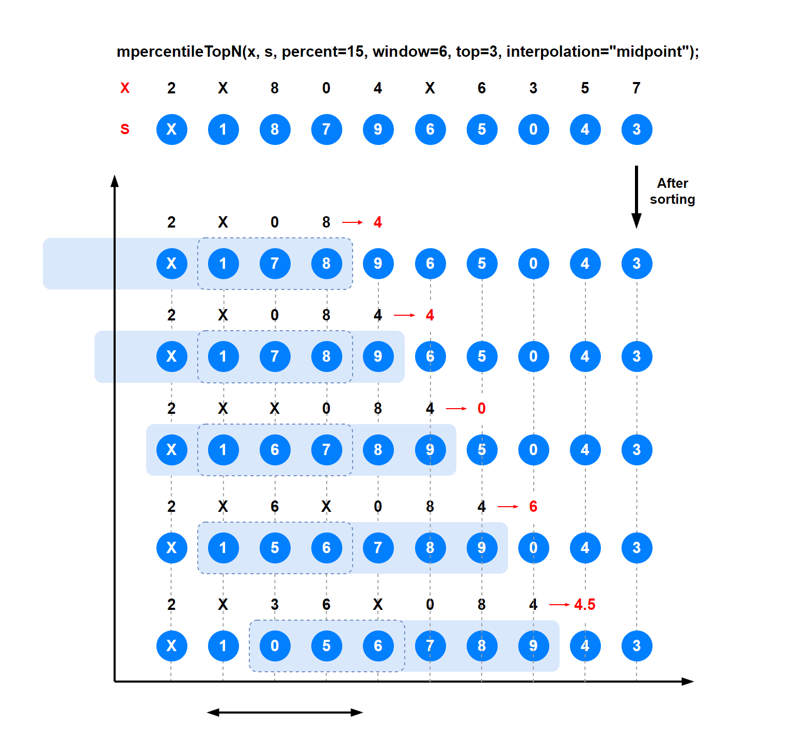

# mpercentileTopN

## 语法

`mpercentileTopN(X, S, percent, window, top, [interpolation], [ascending],
[tiesMethod='oldest'])`

参数说明和窗口计算规则请参考：[mTopN](../themes/TopN.html)

## 参数

**percent** 是 0 到 100之间的数，表示计算的百分位数。

**interpolation** 是一个字符串，表示当选中的分位点位于在 *X* 的第 i 和第 i+1
个元素之间时，采用的插值方法。它具有以下取值，默认值为 'linear'：

* ‘linear’：Xi + ( Xi+1 - Xi ) \* fraction，其中
  fraction 为
* 'lower'：Xi
* 'higher’：Xi+1
* 'nearest'： Xi+1 和 Xi 之中最接近分位点的数据
* 'midpoint'：（Xi+1 + Xi )/2

## 详情

* 若 *X* 是向量，在长度为 *window* 的滑动窗口内，根据 *ascending* 指定的排序方式将
  *X* 在窗口内的元素按照 *S* 进行稳定排序，取其前*top* 个元素计算对应的 *percent*百分位数。
* 若 *X* 是矩阵或表，在每列内进行上述计算，返回同样数据类型和数据维度的结果。

## 例子

```
x =  [2,,8,0,4,,6,3,5,7]
s = [,1,8,7,9,6,5,0,4,3]
mpercentileTopN(x, s, percent=25, window=6, top=3, interpolation="lower")
// output：[,,8,0,0,0,6,3,3,3]

mpercentileTopN(x, s, percent=75, window=6, top=3, interpolation="higher")
// output：[,,8,8,8,0,6,6,6,7]

mpercentileTopN(x, s, percent=5, window=6, top=3, interpolation="nearest")
// output：[,,8,0,0,0,6,3,3,3]

mpercentileTopN(x, s, percent=15, window=6, top=3, interpolation="midpoint")
// output：[,,8,4,4,0,6,4.5,4,4]

mpercentileTopN(x, s, percent=50, window=6, top=3, interpolation="linear")
// output：[,,8,4,4,0,6,4.5,5,5]

X = [2.0, , 8.0, 0.0, 4.0, , 6.0, 3.0, 5.0, 7.0]
S = [, 1, 8, 7, 9, 2, 1, 0, 1, 1]
mpercentileTopN(X, S, percent=25, window=6, top=3, ascending=true,
  interpolation="lower", tiesMethod="oldest");
// output: [, , 8.0, 0.0, 0.0, 0.0, 6.0, 3.0, 3.0, 3.0]
```

下图以 mpercentileTopN(x, s, percent=50, window=6, top=3, interpolation="midpoint");
为例，展示函数的计算过程。

其中用蓝框包围的部分为从当前滑动窗口中选取的 *S* 的元素，虚线框上方为 *top* 选出的数据，红色箭头表示计算出的结果值。



```
x = [8,,1,6,9,2,0,,5,3,2,,8,0,4,,6,3,5,7]$10:2
s = [,1,8,7,9,6,5,0,4,3]
mpercentileTopN(x, s, percent=15, window=6, top=3, interpolation="midpoint")
```

结果为：

|  |  |
| --- | --- |
| **#0** | **#1** |
|  |  |
|  |  |
| 1 | 8 |
| 3.5 | 4 |
| 3.5 | 4 |
| 4 | 0 |
| 1 | 6 |
| 1 | 4.5 |
| 2.5 | 4 |
| 4 | 4 |

