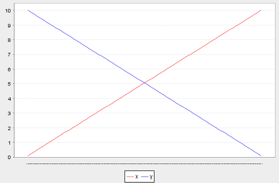
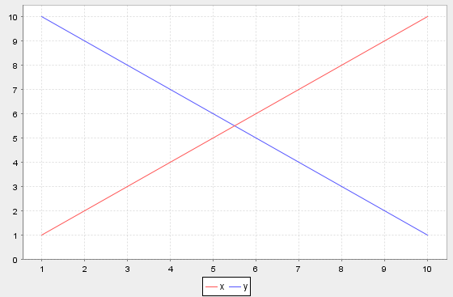
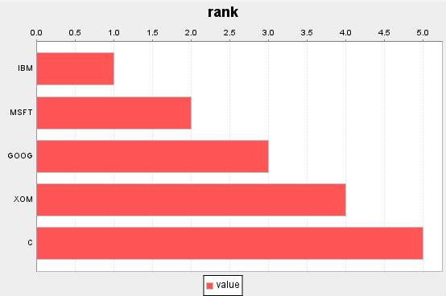
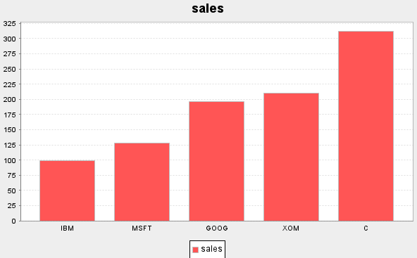
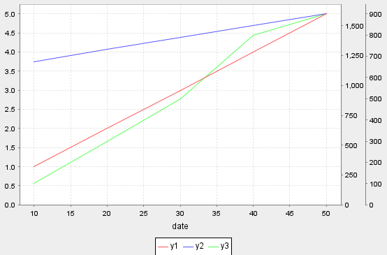

# plot

## 语法

`plot(data, [labels], [title], [chartType=LINE],
[stacking=false], [extras])`

## 详情

生成图表对象的系统函数。当我们在 IDE 中使用绘图功能时，GUI 将生成图表对象。

## 参数

**data** 可以是向量，元组，矩阵或表。

如果输入数据是一个向量，它会产生一个单一的系列图，而向量名称就是系列名称。

如果输入数据是元组，则元组的每个元素被视为一个系列。元组的元素必须都是相同长度的向量。向量的名称是系列名称。

如果输入数据是一个矩阵，则矩阵的每一列都是一个系列，矩阵的列标签是系列名称。如果矩阵具有行标签，则它们将被用作数据点标签。

如果输入数据是一个表，那么表的每一列都是一个系列，列名是系列名。

**labels**
是每个数据点的标签。所有系列的图表共享相同的数据标签。如果输入是矩阵，则可以将矩阵的行标签设置为数据点标签。否则，必须在此指定数据点标签。

**title** 可以是字符串标量或字符串向量。如果标题是标量，则是图表标题;
如果是矢量，矢量的第一个元素是图表标题，第二个是X轴标题，第三个是Y轴标题。

**chartType**
表示图表类型，默认值是线性图（LINE）。其他类型还有饼图（PIE），柱形图（COLUMN），条形图（BAR），面积图（AREA）和散点图（SCATTER）。

**stacking** 表示图表是否堆叠。当 *chartType* 设置为LINE、BAR 或 AREA
时，该参数才有效。

**extras** 为可选参数，用于扩展 `plot` 函数的属性。*extras*
必须是字典，其 key 必须是字符串类型。

注：

* 目前仅支持 multiYAxes 属性：{multiYAxes: true}。设置为 true
  表示支持多个 Y 轴，设置为 false 表示共享一个 Y 轴。若需要使用 extras
  添加新的属性名称和类型，请联系我们进行报备。
* *chartType*=LINE 时，必须设置该参数的 multiYAxes
  属性。

## 例子

Example 1：表

```
x=0.1*(1..100)
y=0.1*(100..1)
t=table(x,y)
plot(t,extras={multiYAxes: true})
```



上面的图也可以用 `plot(t[`x`y],extras={multiYAxes:true})`
生成。

Example 2：矩阵

```
plot([sin,cos](x),x,"cos and sin curve",extras={multiYAxes: false})
```


请注意，把函数名作为系列名称，并且指定了数据标志和图的标题。

Example 3：向量

```
plot(cumsum(x) as cumsumX, 2012.10.01+1..100, "cumulative sum of x")
```


cumsumX 被用作系列名称。

Example 4：元组

```
plot([1..10 as x, 10..1 as y], 1..10, extras={multiYAxes: false})
```



x 和 y 被用作系列名称。

Example 5：条形图

```
plot(1..5 as value, `IBM`MSFT`GOOG`XOM`C, `rank, BAR)
```



Example 6：柱形图

```
plot(99 128 196 210 312 as sales, `IBM`MSFT`GOOG`XOM`C, `sales, COLUMN)
```



Example 7：饼状图

```
plot(99 128 196 210 312 as sales, `IBM`MSFT`GOOG`XOM`C, `sales, PIE)
```


Example 8：散点图

```
x=rand(1.0, 1000);
y=x+norm(0.0, 0.2, 1000);
plot(x, y, ,SCATTER)
```


Example 9：设置 {multiYAxes : true}, y1, y2 和 y3 分别对应不同的Y轴

```
t = table(1 2 3 4 5 as y1, 1200 1300 1400 1500 1600 as y2, 100 300 500 800 900 as y3, 10 20 30 40 50 as date)
plot([t.y1, t.y2,t.y3], t.date, , LINE, ,  {multiYAxes : true})
```



