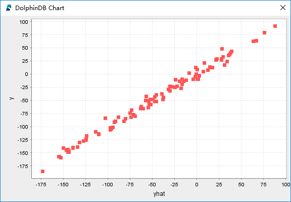

# predict

## 语法

`predict(model, X)`

## 参数

**model** 是用于预测的模型，一般是字典，由 [randomForestClassifier](../r/randomForestClassifier.md), [randomForestRegressor](../r/randomForestRegressor.md) 等机器学习函数生成。

**X** 是用于预测的表，表的结构必须和用于训练 *model* 的表相同。

## 详情

用特定的模型对数据进行预测。返回结果是向量，元素的个数和 *X* 的行数相同，每个元素对应一行的预测值。

## 例子

以下例子是将 `randomForestRegressor` 生成的模型用于预测。

```
x1 = rand(100.0, 100)
x2 = rand(100.0, 100)
b0 = 6
b1 = 1
b2 = -2
err = norm(0, 10, 100)
y = b0 + b1 * x1 + b2 * x2 + err
t = table(x1, x2, y)
model = randomForestRegressor(sqlDS(<select * from t>), `y, `x1`x2)
yhat = predict(model, t);
// output
[-93.733842,2.213932,5.39619,-47.817339,-38.655786,-75.772237,-45.817417,43.412841,-87.333214,-51.275368,32.41792,-45.797275,-152.075001,-83.423919,-21.154954,-65.734012,58.088571,-30.00795,-149.71085,-18.699006,-82.023643,-140.455355,-43.629218,65.832865,-79.411508,-65.625276,-17.466925,-43.469005,44.639384,31.686378...]

plot(y, yhat, ,SCATTER);
```



