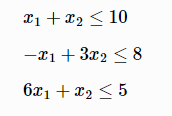
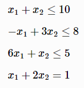

# quadprog

## 语法

`quadprog(H, f, [A], [b], [Aeq], [beq])`

## 参数

**H** 是二次规划中的二次项矩阵，且必须是对称正定矩阵。

**f** 是二次项规划中的一次项向量。

**A** 是线性不等约束的系数矩阵。

**b** 是线性不等约束的右端向量。

**Aeq** 是线性等式约束的系数矩阵。

**beq** 是线性等式约束的右端向量。

*H*, *A* 和 *Aeq* 必须是列数相同的矩阵。

*f*, *b* 和 *beq* 是向量。

## 详情

求二元目标函数在线性约束条件下的最优解。具体模型如下：


返回结果是具有两个元素的元组。第一个元素是目标函数的最小值，第二个元素是目标函数取最小值时，x的取值。

## 例子

求以下目标函数的最小值。


例1：没有约束条件

```
H=matrix([2 -2,-2 6])
f=[-5,4]
x=quadprog(H,f);

x[0];
// output
-6.375

x[1];
// output
[2.75,0.25]
```

例2：添加不等式约束条件：



```
H=matrix([2 -2,-2 6])
f=[-5,4]
A=matrix([1 -1 6, 1 3 1])
b=[10, 8, 5]
x=quadprog(H,f,A,b);

x[0];
// output
-4.092975

x[1];
// output
[0.904959, -0.429752]
```

例3：添加不等式约束条件和等式约束条件：



```
H=matrix([2 -2,-2 6])
f=[-5,4]
A=matrix([1 -1 6, 1 3 1])
b=[10, 8, 5]
Aeq=matrix([1],[2])
beq=[1]
x=quadprog(H,f,A,b,Aeq,beq);

x[0];
// output
-3.181818

x[1];
// output
[0.818182,0.090909]
```

目标函数在没有约束条件的情况下，最优解的值最小。约束条件越多，最优解的值越大。

相关函数：[linprog](../l/linprog.html), [scs](../s/scs.html)

