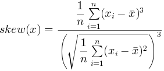

# skew

## 语法

`skew(X, [biased=true])`

## 参数

**X** 是一个向量、矩阵或表。

**biased** 是一个布尔值，表示是否为有偏估计。默认值为 true，表示为有偏估计。**biased**

值为 false ，表示无偏估计。

## 详情

计算 *X* 的倾斜度。`skew` 函数在计算时会忽略 NULL 值。

DolphinDB 使用以下公式计算倾斜度：

* 当 *biased*=true 时，

  
* 当 *biased*= false 时
  

若 *X* 为矩阵，计算每列的倾斜度，返回一个向量。

若 *X* 为表，计算每列的倾斜度，返回一个表。

`skew` 函数也支持校正偏差查询分区表和分布式表。

## 例子

下面的例子使用了 [norm](../n/norm.md)
函数生成数据，每次生成的数据都会有细微差别，因此每次计算的结果会有所偏差。

```
x=norm(0, 1, 1000000);
skew(x);
```

返回：-0.00124

```
x[0]=100;
skew(x);
```

返回：0.983656

```
m=matrix(1..10, 1 2 3 4 5 6 7 8 9 100);
m;
```

返回：

| #0 | #1 |
| --- | --- |
| 1 | 1 |
| 2 | 2 |
| 3 | 3 |
| 4 | 4 |
| 5 | 5 |
| 6 | 6 |
| 7 | 7 |
| 8 | 8 |
| 9 | 9 |
| 10 | 100 |

```
skew(m);
```

返回：[0,2.630083823883674]

