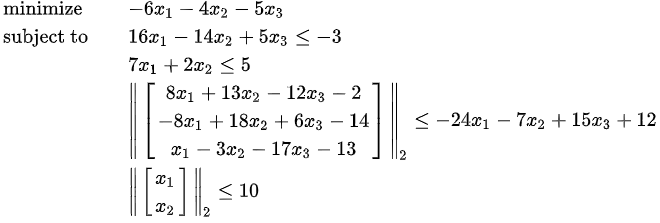

# socp

## 语法

`socp(f, [G], [h], [l], [q], [A], [b])`

## 详情

该函数用于求解二阶锥规划问题，计算目标函数在限定条件下的最小值。若其约束条件以标准形式给出，其形式如下：


则矩阵 G 为：


向量 h 为：


返回一个长度为 3 的元组：

* 第一个元素表示求解状态：
  + Problem solved to optimality：达到最优解
  + Found certificate of primal infeasibility：原始问题无解
  + Found certificate of dual infeasibility：对偶问题无解
  + Offset exitflag at inaccurate results：结果不精确
  + Maximum number of iterations reached ：达到最大迭代次数
  + Search direction unreliable ：搜索方向不可靠
  + Unknown problem in solver：求解问题未知
* 第二个元素是目标函数取最小值时 x 的取值。
* 第三个元素是目标函数的最小值。

## 参数

二阶锥规划（Second-Order Cone Programming，SOCP）问题的约束条件形式如下：


其中 K 为锥，s 为松弛变量，其值在优化过程中会被确定。

**f** 是数值型向量，表示目标函数的系数向量。

**G** 是数值型矩阵，表示锥约束的系数矩阵。

**h** 是数值型向量，表示锥约束的右端向量。

**l** 是整数标量，表示非负象限约束的维度。

**q** 是正数向量，表示各个二阶锥约束的维度大小，形式为 [r0,r1,…,rN-1]。

**A** 是数值型矩阵，表示等式约束的系数矩阵。

**b** 是数值型向量，表示等式约束的右端向量。

## 例子

求解以下二阶锥规划问题：



```
f = [-6, -4, -5]
G = matrix([[16, 7, 24, -8, 8, -1, 0, -1, 0],
[-14, 2, 7, -13, -18, 3, 0, 0, -1],
[5, 0, -15, 12, -6, 17, 0, 0, 0]])
h = [-3, 5, 12, -2, -14, -13, 10, 0, 0]

l = 2
q = [4,3]

re = socp(f,G,h,l,q, ,)
print(re)
```

返回：("Problem solved to
optimality",[-9.902804882871327,-1.39084684264198,26.211851780740154],-66.079042235904907)

