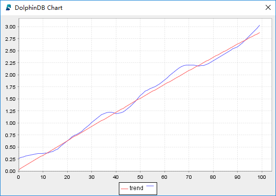
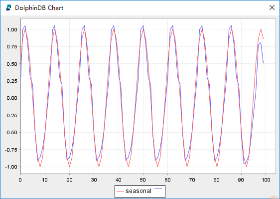

# stl

## 语法

`stl(data, period, sWindow, [sDegree], [sJump], [tWindow], [tDegree],
[tJump], [lWindow], [lDegree], [lJump], [robust], [inner], [outer])`

## 参数

**data** 是一个数值型向量，表示时间序列。

**period** 是一个大于1的整数，表示时间序列的周期。

**sWindow** 可以是一个字符串，它的取值只能是
"periodic"，表示在提取时间序列中的周期性时，不采取平滑算法，直接用平均值代替；*sWindow*
也可以是一个大于7的奇数，表示提取时间序列中的周期性时 Loess 窗口的长度。

**sDegree** 可以是0,1或2，表示提取时间序列中的周期性时，局部拟合的多项式次数。默认值为1。

**sJump** 是一个大于1的整数，表示提取时间序列的周期性时，每隔 *sJump* 个元素执行一次平滑计算。默认值为
ceil(*sWindow*/10)。

**tWindow** 是一个正奇数，表示提取时间序列中的趋势性时 Loess 窗口的长度。默认值为 1.5 \* *period* / (1 - (1.5
/ *sWindow*)) 的下一个奇数。

**tDegree** 可以是0,1或2，表示提取时间序列中的趋势性时，局部拟合的多项式次数。默认值为1。

**tJump** 是一个大于1的整数，表示提取时间序列的趋势性时，每隔 *tJump*
个元素执行一次平滑计算。默认值为ceil(tWindow/10)。

**lWindow** 是一个正奇数，表示提取时间序列的周期性时，每一个子序列的低通滤波器的 Loess 窗口长度。默认值为 *period*
的下一个奇数。

**lDegree** 可以是0,1或2，表示子序列的低通滤波器中，局部拟合的多项式次数。默认值为1。

**lJump** 是一个大于1的整数，表示子序列的低通滤波器中，每隔 *lJump* 个元素执行一次平滑计算。默认值为
ceil(*lWindow*/10)。

**robust** 是一个布尔值，表示在 Loess 过程中是否采用稳健拟合。默认值为 false。

**inner** 是一个大于等于1的整数，表示内部迭代次数，一般较小的取值即可满足需求。如果 *robust* 为 true，*inner*
的默认值为1，如果 *robust* 为 false，*inner* 的默认值为2。

**outer** 是一个大于等于1的整数，表示外部迭代次数，用于增加稳健性。如果 *robust* 为 true，*outer*
的默认值为15，如果 *robust* 为 false，*outer* 的默认值为0。

## 详情

使用 Loess 方法将一个时间序列分解为趋势性、季节性和随机性。返回的结果是一个包含以下 key 的字典：trend,
seasonal 和 residual，每个 key 对应一个与 data 长度相同的向量。

## 例子

```
n = 100
trend = 6 * sin(1..n \ 200)
seasonal = sin(pi / 6 * 1..n)
residual = rand(1.0, n) - 0.5
data = trend + seasonal + residual
res = stl(data, 12, "periodic");
```

我们可以在 DolphinDB GUI 中画图检验分解结果。

```
plot([trend, res.trend]);
```



```
plot([seasonal, res.seasonal]);
```



