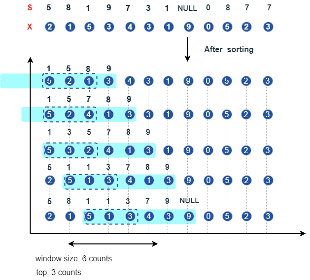

# mTopN 系列

数据依照某个指标进行排序，并取排序后前 top 个元素进行计算。

## mTopN系列函数介绍

TopN 系列函数对应的高阶函数 [aggrTopN](../ho_funcs/aggrTopN.md)：

```
aggrTopN(func, funcArgs, sortingCol, top, [ascending=true])
```

针对滑动窗口内的 TopN 计算场景，DolphinDB 引入了 moving TopN(mTopN) 系列函数。

mTopN 系列函数的通用参数模板如下：

```
mTopN(X, S, window, top, [ascending=true])
mTopN(X, Y, S, window, top, [ascending=true])
```

## 参数

* **X** (**Y**) 是数值型的向量或矩阵。
* **S** 是数值类型或时间类型的向量/矩阵，表示 *X* 的排序指标。
* **window** 是一个大于 1 的整数，表示滑动窗口的大小。
* **top** 是 (1, *window*] 范围内的一个整数，表示 *X* 基于
  *S* 排序后的前 *top* 个元素。
* **ascending** 是一个布尔值，表示 *S* 是否按升序排序。 默认值是
  true。
* **tiesMethod** 字符串。在滑动窗口内对 S 进行排序后，如果有多个具有相同值的元素无法全部进入前
  top，可以通过该参数来指定选择元素的方式。可选值为：

  + 'oldest'：从最早进入窗口的元素开始选取，直至达到 top 个。
  + 'latest'：从最晚进入窗口的元素开始向前选取，直至达到 top 个。
  + 'all'：选取所有元素。

注：

* 为了兼容之前版本，在以下函数中，tiesMethod 默认取值为 'oldest' ：

  mstdTopN, mstdpTopN, mvarTopN, mvarpTopN, msumTopN,
  mavgTopN, mwsumTopN, mbetaTopN, mcorrTopN, mcovarTopN
* 在其它 mTopN 系列函数中，tiesMethod 默认取值为 'latest' 。

mTopN 系列函数如下：

单目：

* [mstdTopN](../m/mstdTopN.md)
* [mstdpTopN](../m/mstdpTopN.md)
* [mvarTopN](../m/mvarTopN.md)
* [mvarpTopN](../m/mvarpTopN.md)
* [msumTopN](../m/msumTopN.md)
* [mavgTopN](../m/mavgTopN.md)
* [mskewTopN](../m/mskewTopN.md)
* [mkurtosisTopN](../m/mkurtosisTopN.md)
* [mpercentileTopN](../m/mpercentiletopn.md)

双目：

* [mbetaTopN](../m/mbetaTopN.md)
* [mcorrTopN](../m/mcorrTopN.md)
* [mcovarTopN](../m/mcovarTopN.md)
* [mwsumTopN](../m/mwsumTopN.md)

## 窗口确定规则

mTopN 系列函数的
*window* 长度以元素个数衡量。

在 *window* 确定的窗口内，将
*X* (*X*, *Y*) 根据 *S* 列进行稳定排序（排序方式由 *ascending* 指定，默认
true 为升序），取排序后结果的前 *top* 个元素进行计算。

注：

*S* 中的空值会被忽略（不参与排序）。

以下图为例，在长度为 6 滑动窗口内，将 *X* 的元素根据 *S* 的升序排序后，取前 3
个元素进行计算。

（前 *top* 个窗口内，默认取窗口中的所有元素进行计算，因此图例从
*top* + 1 个元素开始示意。）



上图的对应代码，这里以
[msumTopN](../m/msumTopN.md)
为例：

```
X = [2, 1, 5, 3, 4, 3, 1, 9, 0, 5, 2, 3]
S = [5, 8, 1, 9, 7, 3, 1, NULL, 0, 8, 7, 7]

print msumTopN(X, S, window=6, top=3)
// output
[2, 3, 8, 8, 11, 10, 9, 15, 10, 10, 10, 10]
```

下面举例介绍参数 tiesMethod
的用法：

```
X = [2, 1, 4, 3, 4, 3, 1]
S = [5, 8, 1, 1, 1, 3, 1]
//最后1个滑动窗口中，S 中有4个1排在前面，但只取前3个排名，此时根据 tiesMethod 的设置值来选取元素
//tiesMethod 未指定，则取默认值 'oldest'，即选取前3个1，对应 X 中的4, 3, 4元素
msumTopN(X, S, window=6, top=3)
// output
[2,3,7,9,11,11,11]
//tiesMethod = 'latest'，即选取后3个1，对应 X 中的3, 4, 1元素
msumTopN(X, S, window=6, top=3, tiesMethod=`latest)
// output
[2,3,7,9,11,11,8]
//tiesMethod = 'all'，即选取全部的1，对应 X 中的4, 3, 4, 1元素
msumTopN(X, S, window=6, top=3, tiesMethod=`all)
// output
[2,3,7,9,11,11,12]
```

