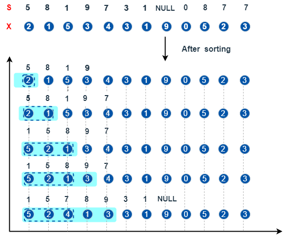

# cumTopN 系列

DolphinDB 提供了 cumTopN 系列函数，在累积窗口内，将数据根据某个指标排序后，只取排序靠前的 top 个元素进行计算。

cumTopN 系列函数的通用参数模板如下：

```
cumTopN(X, S, top, [ascending=true], [tiesMethod]='latest')
cumTopN( X, Y, S, top, [ascending=true], [tiesMethod='latest'])
```

## 参数

* **X** (**Y**) 是数值型的向量或矩阵。
* **S** 是数值类型或时间类型的向量/矩阵，表示 *X* 的排序指标。*S*
  中的空值会被忽略（不参与排序）。
* **top** 一个整数，表示 *X* 基于 *S* 排序后的前 *top*
  个元素。
* **ascending** 是一个布尔值，表示 *S* 是否按升序排序。 默认值是
  true。
* **tiesMethod** 字符串。在累计窗口内对 *S*
  进行排序后，如果有多个具有相同值的元素无法全部进入前 *top*，可以通过该参数来指定选择元素的方式。可选值为：
  + 'oldest'：从最早进入窗口的元素开始选取，直至达到 *top* 个。
  + 'latest'：从最晚进入窗口的元素开始向前选取，直至达到 *top* 个。
  + 'all'：选取所有元素。

cumTopN 系列函数如下：

单目：

* [cumsumTopN](../c/cumsumTopN.md)
* [cumavgTopN](../c/cumavgTopN.md)
* [cumstdTopN](../c/cumstdTopN.md)
* [cumstdpTopN](../c/cumstdpTopN.md)
* [cumvarTopN](../c/cumvarTopN.md)
* [cumvarpTopN](../c/cumvarpTopN.md)
* [cumskewTopN](../c/cumskewTopN.md)
* [cumkurtosisTopN](../c/cumkurtosisTopN.md)

双目：

* [cumbetaTopN](../c/cumbetaTopN.md)
* [cumcorrTopN](../c/cumcorrTopN.md)
* [cumcovarTopN](../c/cumcovarTopN.md)
* [cumwsumTopN](../c/cumwsumTopN.md)

## 窗口确定规则

在累计窗口内，将
*X* 或 (*X*, *Y*) 根据 *S* 列进行稳定排序（排序方式由 *ascending* 指定，默认
true 为升序），取排序后结果的前 *top* 个元素进行计算。

以下图为例，在累计窗口内，将
*X* 的元素根据 *S* 的升序排序后，取前 3 个元素进行计算。



上图的对应代码，这里以 [cumsumTopN](../c/cumsumTopN.md)
为例：

```
X = [2, 1, 5, 3, 4, 3, 1, 9, 0, 5, 2, 3]
S = [5, 8, 1, 9, 7, 3, 1, NULL, 0, 8, 7, 7]

cumsumTopN(X, S, top=3)
// output: [2,3,8,8,11,10,9,9,6,6,6,6]

X = [2, 1, 4, 3, 4, 3, 1]
S = [5, 8, 1, 1, 1, 3, 1]
//最后1个累计窗口中，S 中有4个1排在前面，但只取前3个排名，此时根据 tiesMethod 的设置值来选取元素
//tiesMethod 未指定，则取默认值 'latest'，即选取后3个1，对应 X 中的3, 4, 1元素
cumsumTopN(X, S, top=3)
// output: [2,3,7,9,11,11,8]

//tiesMethod = 'oldest'，即选前后3个1，对应 X 中的4, 3, 4元素
cumsumTopN(X, S, top=3, tiesMethod=`oldest)
// output: [2,3,7,9,11,11,11]

//tiesMethod = 'all'，即选取全部的1，对应 X 中的4, 3, 4, 1元素
cumsumTopN(X, S, top=3, tiesMethod=`all)
// output: [2,3,7,9,11,11,12]
```

