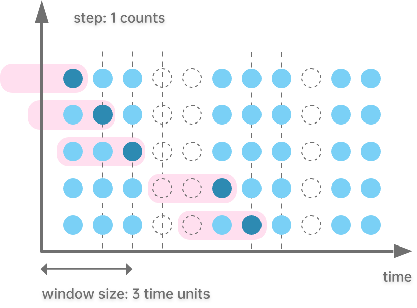

# 滑动窗口系列（m 系列）

对窗口内聚合计算，DolphinDB引入了 m 系列函数。m
系列函数对数据内的每个元素进行一次窗口计算，返回一个和原数据等长的结果。

## m 系列函数介绍

* m 系列函数对应的高阶函数 [moving](../ho_funcs/moving.md)：

  ```
  moving(func, funcArgs, window, [minPeriods])
  ```

  注： m 系列函数为各自的计算场景进行了优化，因此比 [moving](../ho_funcs/moving.md) 高阶函数有更好的性能。
* 内置的 m
  系列函数的通用参数模板如下：

  ```
  mfunc(X, window, [minPeriods])
  mfunc(X, Y, window, [minPeriods])
  ```

## 参数

**X** 是一个向量/矩阵/表/由等长向量组成的元组。其中，mmse, mslr 仅支持输入向量。

**Y** 是一个向量/矩阵/表/由等长向量组成的元组。其中，mmse, mslr 仅支持输入向量。

**window** 是大于等于 2 的正整型或 DURATION 标量。表示滑动窗口的长度。

注： 在流计算引擎中调用滑动窗口函数时，window 的上限为 102400。

**minPeriods** 是一个正整数。为滑动窗口中最少包含的观测值数据。

## 函数列表

根据 *window*
的取值，可以分为两类：

***window* 是正整数或 DURATION 类型**

* 单目：

  + [msum](../m/msum.md)
  + [msum2](../m/msum2.md)
  + [mavg](../m/mavg.md)
  + [mprod](../m/mprod.md)
  + [mmax](../m/mmax.md)
  + [mmin](../m/mmin.md)
  + [mmed](../m/mmed.md)
  + [mfirst](../m/mfirst.md)
  + [mlast](../m/mlast.md)
  + [mrank](../m/mrank.md)
  + [mcount](../m/mcount.md)
  + [mpercentile](../m/mpercentile.md)
  + [mstd](../m/mstd.md)
  + [mstdp](../m/mstdp.md)
  + [mvar](../m/mvar.md)
  + [mvarp](../m/mvarp.md)
  + [mkurtosis](../m/mkurtosis.md)
  + [mskew](../m/mskew.md)
  + [mimax](../m/mimax.md)
  + [mimin](../m/mimin.md)
  + [mfirstNot](../m/mfirstnot.md)
  + [mlastNot](../m/mlastnot.md)
  + [mifirstNot](../m/mifirstNot.md)
  + [milastNot](../m/milastNot.md)
  + [miminLast](../m/miminlast.md)
  + [mimaxLast](../m/mimaxlast.md)
  + [mLowRange](../m/mlowrange.md)
  + [mTopRange](../m/mtoprange.md)
* 双目：

  + [mwavg](../m/mwavg.md)
  + [mwsum](../m/mwsum.md)
  + [mcorr](../m/mcorr.md)
  + [mcovar](../m/mcovar.md)
  + [mbeta](../m/mbeta.md)

***window* 是正整数时**

* [mmad](../m/mmad.md)
* [mmaxPositiveStreak](../m/mmaxPositiveStreak.md)
* [mmse](../m/mmse.md)
* [mslr](../m/mslr.md)

## 窗口确定规则

m
系列函数，支持一个向前的窗口，即基于数据中的每个元素，向前选取 *window* 指定范围的窗口。

**X
是普通向量/矩阵/表时**

此时表示以窗口内元素个数衡量的滑动窗口的长度。

注： 对于表，只有布尔类型和数值型的列参与计算。


m 系列函数（mrank, mcount 除外）提供了 *minPeriods*
参数，用于约束窗口的观测值。对于计算结果：

注：

1. 如果没有指定 *minPeriods*，前(*window* - 1)个元素为 NULL；
2. 如果指定了 *minPeriods*，前(*minPeriods* - 1)个元素为 NULL。

上图的对应代码，这里以 [msum](../m/msum.md)
为例：

```
X = 2 1 3 7 6 5 4 9 8 10
msum(X, 3);

//output: [ , , 6, 11, 16, 18, 15, 18, 21, 27]
```

**X
是索引序列或索引矩阵时**

此时表示以时间衡量的滑动窗口的长度。若此时 *window*
是一个正整数，则默认将其视作和 X 中索引单位一致的量。

其滑动规则如下图：



上图的对应代码，这里以 [msum](../m/msum.md)
为例：

```
T = [2022.01.01, 2022.01.02, 2022.01.03, 2022.01.06, 2022.01.07, 2022.01.08, 2022.01.10, 2022.01.11]
X = 1..8
X1 = indexedSeries(T, X)
msum(X1, window=3d);
```

返回：

| label | col0 |
| --- | --- |
| 2022.01.01 | 1 |
| 2022.01.02 | 3 |
| 2022.01.03 | 6 |
| 2022.01.06 | 4 |
| 2022.01.07 | 9 |
| 2022.01.08 | 15 |
| 2022.01.10 | 13 |
| 2022.01.11 | 15 |

