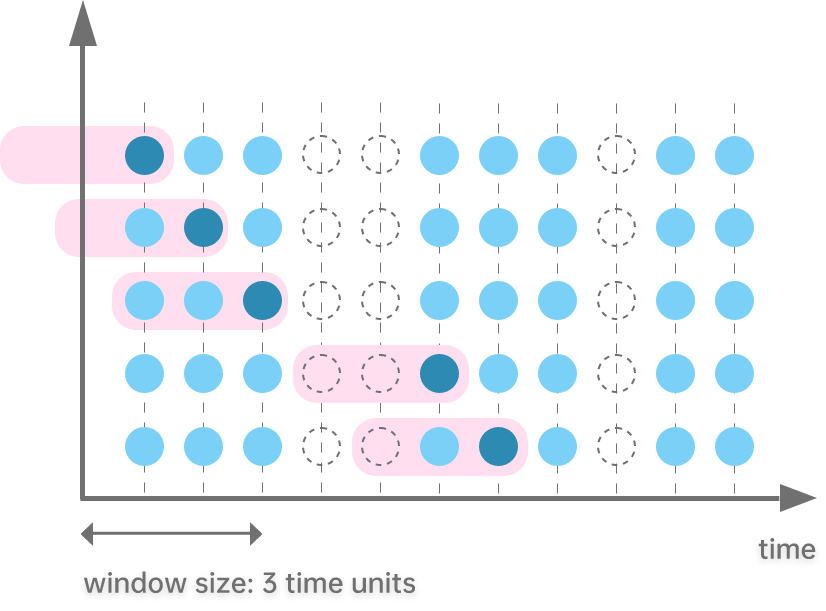

# 时序滑动窗口系列（tm 系列）

在涉及到时序数据的窗口计算场景，往往需要窗口根据时间列滑动进行指标的计算，为此 DolphinDB 引入了 tm 系列函数。tm 系列函数的窗口计算和 m 系列函数
*window* 取 DURATION 的情况类似，但 tm 系列函数不需要基于索引向量或索引矩阵的索引进行滑动，应用在 SQL
中可以直接对数据表的列进行滑动窗口计算。

## tm 系列函数介绍

tm 系列函数对应的高阶函数 [tmoving](../ho_funcs/tmoving.html)：

```
tmoving(func, T, funcArgs, window)
```

注： tm 系列函数为各自的计算场景进行了优化，因此比 [tmoving](../ho_funcs/tmoving.html) 高阶函数有更好的性能。

内置的 tm 系列函数的通用参数模板如下：

```
tmfunc(T, X, window)
tmfunc(T, X, Y, window)
```

## 参数

* **T** 是一个非严格递增的时间类型或整型的向量，且不能包含 NULL 值。
* **X** (**Y**) 是一个与 *T* 长度相同的向量。
* **window** 是正整型或 DURATION 标量。表示滑动窗口的长度。

注： 该系列函数不支持使用向量元组作为参数值。

tm 系列函数如下：

单目：

* [tmsum](../t/tmsum.html)
* [tmsum2](../t/tmsum2.html)
* [tmavg](../t/tmavg.html)
* [tmprod](../t/tmprod.html)
* [tmmax](../t/tmmax.html)
* [tmmin](../t/tmmin.html)
* [tmmed](../t/tmmed.html)
* [tmfirst](../t/tmfirst.html)
* [tmlast](../t/tmlast.html)
* [tmrank](../t/tmrank.html)
* [tmcount](../t/tmcount.html)
* [tmpercentile](../t/tmpercentile.html)
* [tmstd](../t/tmstd.html)
* [tmstdp](../t/tmstdp.html)
* [tmkurtosis](../t/tmkurtosis.html)
* [tmskew](../t/tmskew.html)
* [tmvar](../t/tmvar.html)
* [tmvarp](../t/tmvarp.html)
* [tmTopRange](../t/tmtoprange.html)
* [tmLowRange](../t/tmlowrange.html)

双目：

* [tmbeta](../t/tmbeta.html)
* [tmcorr](../t/tmcorr.html)
* [tmcovar](../t/tmcovar.html)

* [tmwavg](../t/tmwavg.html)
* [tmwsum](../t/tmwsum.html)

## 窗口确定规则

tm 系列函数的
*window* 长度以时间衡量。*window* 可以是正整数类型或者 DURATION 类型。

对于 *T* 中每个元素 *Ti*：

* 当 *T* 为整型时，确定的窗口区间为 (*Ti* - window, *Ti*
  ]
* 当 *T* 为时间类型时， 确定的窗口区间为 (temporalAdd(*Ti*,
  -window), *Ti*]

其计算规则如下图：



上图的对应代码，这里以
[tmsum](../t/tmsum.html)
为例：

```
T = [2022.01.01, 2022.01.02, 2022.01.03, 2022.01.06, 2022.01.07, 2022.01.08, 2022.01.10, 2022.01.11]
X = 1..8

print tmsum(T, X, window=3)
// output
[1, 3, 6, 4, 9, 15, 13, 15]
```

